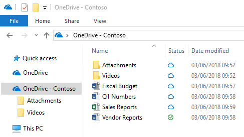
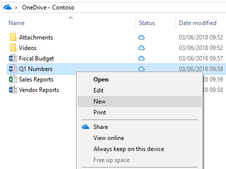
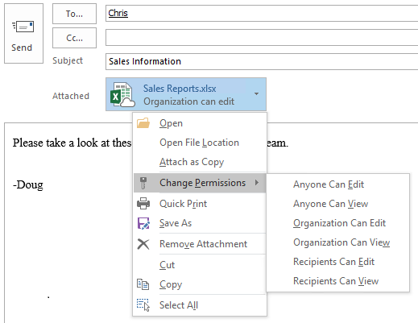
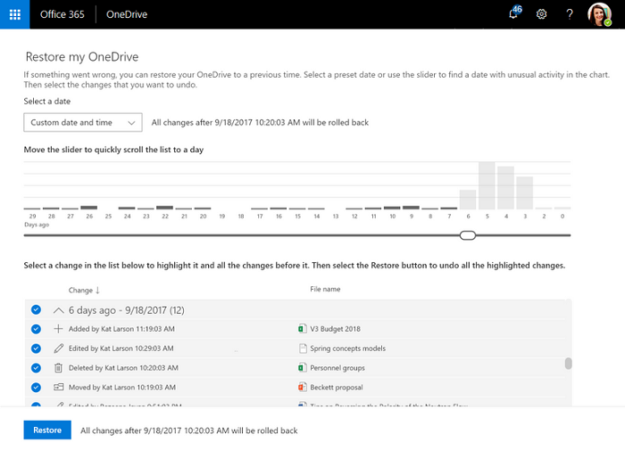

# OneDrive for small businesses

OneDrive for Business is a simple-to-use cloud storage platform for small businesses, enterprises, and everything in between. Unlike other cloud storage providers, most of the advanced OneDrive features for large companies are available for small businesses, too. This means that you can use OneDrive in whatever way benefits your business the most.

This guide focuses on what OneDrive is and how it can benefit your business. The companion guide, [OneDrive QuickStart guide for small businesses](One-Drive-Quickstart-Small-Business.md), provides all the steps you need to take to start using OneDrive in your business.

## Getting started with OneDrive

OneDrive is effective in even the largest companies, but it’s easy to use, so a small business can take advantage of it. Often, small businesses are at high risk for loosing important files when computers or phones fail, and the files have not been backed up. By using OneDrive, your small business can keep files safe, and your users can easily access them from all their devices.

To get started with OneDrive, complete the following steps:

1.  **Review basic OneDrive information.** Start by reviewing the introductory OneDrive information available at the [OneDrive help center](https://support.office.com/onedrive). You’ll get answers to many of your questions, including the OneDrive experience and how it works.

2.  **Set up a Microsoft Office 365 subscription.** If you haven’t subscribed to Office 365, you need to do that to use OneDrive. To get started, complete the steps in [Set up Office 365 for business](https://support.office.com/article/set-up-office-365-for-business-6a3a29a0-e616-4713-99d1-15eda62d04fa).

3.  **Add OneDrive licenses.** Review your plan options in [Compare OneDrive for Business plans](https://products.office.com/onedrive-for-business/compare-onedrive-for-business-plans), and then add the licenses you need.

When you’ve completed these tasks, you’re ready to plan for, deploy, and configure the OneDrive sync client and applications. To do that, complete these three simple steps:

1.  **Review basic OneDrive information.** Start by reviewing the introductory OneDrive information available at the [OneDrive help center](https://support.office.com/onedrive). You’ll get answers to many of your questions, including the OneDrive experience and how it works.

2.  **Plan for adoption.** For small businesses, planning for user adoption can be as simple as individually showing your users how to use OneDrive. Often, small business customers don’t consider this step for new applications, and that can negatively affect the application’s success. The section [Adopt OneDrive](#_Adopt_OneDrive) provides helpful resources for OneDrive adoption.

3.  **Install and configure.** Sync clients are available for the Windows and macOS operating systems that provide a seamless experience for users interacting with their files. Most small businesses start by installing the sync client on their users’ devices, and then consider the OneDrive mobile apps later. In fact, you may already have the OneDrive client on your devices. Devices running the Windows 10 operating system and devices running Windows or macOS with Microsoft Office 2016 or later will have the OneDrive client already. For information about how to install and configure the OneDrive sync client and apps, see the section [Install and configure OneDrive](#_Install_and_configure).

4.  **Manage OneDrive.** For many small businesses, managing OneDrive is optional. You could simply install and configure OneDrive and leave it at that. If you want to use advanced features of OneDrive or add device sharing or access restrictions, however, you can easily manage those and other settings in the OneDrive admin center. For more information about managing OneDrive, see the section [Manage OneDrive](#_Manage_OneDrive).

## Key OneDrive features for small businesses

Unlike most other cloud storage providers, OneDrive makes most of its advanced features available to small business, too. This section discusses the key features most helpful to small businesses. For a full list of features available across OneDrive plans, see [Microsoft OneDrive](https://onedrive.live.com/about).

### OneDrive Files On-Demand

OneDrive Files On-Demand enables users to view, search for, and interact with files stored in OneDrive from within File Explorer, without downloading them all to their device. The feature provides a seamless look and feel for both OneDrive and local files without taking up space on the local hard drive. As shown in the screenshot below, files that have not been downloaded have a cloud icon for their status. For those files that have been downloaded, the status shows a green checkmark.

By default, files are downloaded only when you need to access them. However, if you plan to access a file while disconnected from the internet, simply make the file available offline by right-clicking it, and then selecting **Always keep on this device**. Alternatively, if you want to free space on your device and remove the downloaded copy of a file, right-click the file, and then select **Free up space**. The screenshot below shows the right-click menu for OneDrive files on a device running Windows.

For more information about OneDrive Files On-Demand, see [Learn about OneDrive Files On-Demand](https://support.office.com/article/learn-about-onedrive-files-on-demand-0e6860d3-d9f3-4971-b321-7092438fb38e).

### Modern attachments

OneDrive integrates with Microsoft Outlook to enable easy sharing of OneDrive files that appear just like email attachments. This feature provides a familiar sharing experience but keeps your files stored in OneDrive. This allows your users to all collaborate on the same file without sending attachments back and forth. In addition, you can configure sharing permissions on the files directly from within the Outlook client.

To reduce the potential for confusion when users choose to add a copy versus a link to attached OneDrive files, you can set the default behavior of the Outlook client, as demonstrated in [How to control default attachment state when you attach a cloud file in Outlook 2016](https://support.microsoft.com/help/4011261/how-to-set-attachment-preference-for-attaching-a-cloud-file-in-outlook).

### Files Restore

The OneDrive Files Restore feature enables you to restore files to any point over the past 30 days. To select the desired recovery time, OneDrive presents you with a histogram that shows file activity so that you can determine which recovered time meets your needs. From there, simply select the file history entry to which you want to restore, and all changes after that point will be rolled back.

In addition, because the histogram shows individual activity on a file, you can employ this feature to quickly view your files’ modification history. For more information about this feature, see [Announcing New OneDrive for Business feature: Files Restore](https://techcommunity.microsoft.com/t5/OneDrive-Blog/Announcing-New-OneDrive-for-Business-feature-Files-Restore/ba-p/147436).

### Recycle bin

OneDrive has a recycle bin similar to the one available on the Windows desktop. Deleted files are moved to the recycle bin and kept for a designated time before being permanently deleted. For work or school accounts, deleted files are purged after 93 days unless configured otherwise. For a demonstration of how the recycle bin works, see [Restore deleted files or folders in OneDrive](https://support.office.com/article/restore-deleted-files-or-folders-in-onedrive-949ada80-0026-4db3-a953-c99083e6a84f).

## Known Folder Move

Known Folder Move enables users to select known folders, such as their desktop, Documents, or Pictures, to automatically synchronize to OneDrive. You can add this feature during the initial setup of OneDrive or after it has been configured. This capability provides a simple migration option for users looking to add known folders to their existing list of synchronized folders. For more information about Known Folder Move, see [Protect your files by saving them to OneDrive](https://support.office.com/article/protect-your-files-by-saving-them-to-onedrive-d61a7930-a6fb-4b95-b28a-6552e77c3057).

## Adopt OneDrive

User adoption is important to the overall success of any new application. Ideally, to feel that you have maximized your investment in Office 365 and OneDrive, you need to maximize user engagement with them. For small businesses, driving user adoption can be as simple as introducing users to OneDrive when you’re installing it or showing them any of the videos available at the [Office 365 Training Center](https://support.office.com/office-training-center?redirectSourcePath=%252fen-gb%252farticle%252foffice-training-center-b8f02f81-ec85-4493-a39b-4c48e6bc4bfb).

Personally showing your users how to save and share documents in OneDrive tends to be the most effective option for driving adoption, given that you’ll likely be performing manual installations. The primary value proposition for small businesses is file availability and redundancy. A document saved on local storage can be lost with a device; a document saved to OneDrive cannot. Simply having this discussion with your users beforehand, coupled with demonstrating the application’s ease of use, can drive positive outcomes for this effort.

For information about a more formal Microsoft 365 user adoption strategy, see the [Microsoft 365 End User Adoption Guide](https://fto365dev.blob.core.windows.net/media/Default/DocResources/en-us/Microsoft%20365%20User%20Adoption%20Guide.pdf). For more information about driving user engagement through a similar, more formal process, see [Success Factors for Office 365 End User Engagement](https://fto365dev.blob.core.windows.net/media/Default/DocResources/en-us/Resources/Office365_AdoptionBrochure_v2.0_Screen.pdf). You can also contribute to or comment on adoption-related ideas in the [Driving Adoption Tech Community](https://techcommunity.microsoft.com/t5/Driving-Adoption/ct-p/DrivingAdoption).

## Synchronizing files

You can upload, download, and interact with your OneDrive files from a web browser, but the ideal OneDrive experience comes from the Windows and Mac sync clients and the iOS and Android mobile apps. With these clients and apps, saving files to OneDrive and interacting with them is much easier than visiting a website each time you need something. Through this experience, you can seamlessly integrate OneDrive into your existing file interaction experiences.

Start by installing the OneDrive sync client on users’ Windows and macOS devices, and then consider the OneDrive mobile apps afterwards. You don’t need to install and configure OneDrive on all your devices before you start using it.

## Get started

To get started with OneDrive, see [OneDrive QuickStart guide for small businesses](One-Drive-Quickstart-Small-Business.md).

## See also

[Get started with OneDrive](https://support.office.com/article/Get-started-with-OneDrive-c7f31921-e2e5-4b00-959a-cc9ad6297de7)

[Why use OneDrive to store your docs](https://support.office.com/article/why-use-onedrive-to-store-your-docs-e55c4fa8-1e03-4d75-956b-924620bdfa2d)

[GDPR Compliancy with OneDrive and SharePoint](https://techcommunity.microsoft.com/t5/Microsoft-OneDrive-Blog/GDPR-Compliancy-with-OneDrive-and-SharePoint/ba-p/191126)

[Microsoft OneDrive Blog](https://techcommunity.microsoft.com/t5/OneDrive-Blog/bg-p/OneDriveBlog)

[OneDrive UserVoice](https://onedrive.uservoice.com/)

[OneDrive for Business Tech Community](https://techcommunity.microsoft.com/t5/OneDrive-for-Business/ct-p/OneDriveforBusiness)
