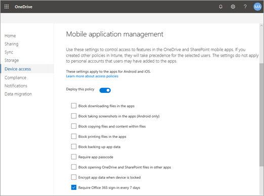

# Control access to features in the OneDrive and SharePoint mobile apps

If your organization has **Microsoft Intune** or **Enterprise Mobility + Security**, you can use the OneDrive admin center to create a global policy that manages the OneDrive and SharePoint mobile apps for Android and iOS. This policy only applies to users in your organization who are licensed for Microsoft Intune or Enterprise Mobility + Security.
  
 >[!NOTE]
 >Your admin account needs to have an Intune license assigned to it for you to change the mobile application management settings in the OneDrive admin center. 

 >[!NOTE]
 > In the case that you disable a policy, this won't remove it from Intune.
  
Go to the Device access page of the [OneDrive admin center](https://admin.onedrive.com) to:
  
- Block downloading files in the apps
    
- Block taking screenshots in the Android apps
    
- Block copying files and content within files
    
- Block printing files in the apps
    
- Block backing up app data
    
- Require an app passcode
    
- Block opening OneDrive and SharePoint files in other apps
    
- Encrypt app data when the device is locked
    
- Require Office 365 sign-in each time the app is opened
    
- Choose values for how often to verify user access and when to wipe app data when a device is offline.
    
 **To manage features in the OneDrive and SharePoint mobile apps**
  
1. In the **Mobile application management** section, turn on the **Deploy this policy** setting. 
    
    
  
2. Select the check boxes for the features you want to enable.
    
3. Choose values for how often to verify user access and when to wipe app data when a device is offline.
    
4. Click **Save**.
    
## See also

[Intune Documentation](https://go.microsoft.com/fwlink/?linkid=2003459)
  
[Configure and deploy mobile application management policies in the Microsoft Intune console](https://go.microsoft.com/fwlink/?linkid=2003554)
  
[Control access based on network location or app](control-access-based-on-network-location-or-app.md)
  

