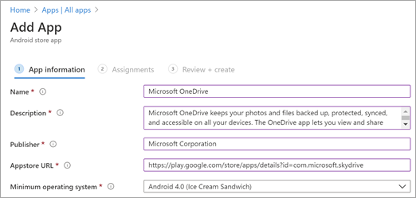

# Deploy OneDrive apps by using Intune

Use Intune to deploy the mobile apps for iOS and Android, and the new OneDrive sync app (OneDrive.exe) to Windows 10. Before you begin deploying, make sure you have reviewed the planning information and deployment options in the [OneDrive guide for enterprises](plan-onedrive-enterprise.md).

### Deploy OneDrive to iOS devices 

1. Go to the [All apps page of the Microsoft Endpoint Manager admin center](https://endpoint.microsoft.com/?ref=AdminCenter#blade/Microsoft_Intune_DeviceSettings/AppsMenu/allApps)
2. Select **Add**.
3. Under **App type**, select **iOS store app**, and then select **Select**.
4. Select **Search the App Store**, and then enter **OneDrive** in the search box.

    

5. Select **Microsoft OneDrive**, and then select **Select**.
6. Enter the settings you want on the App information tab, and then select **Next**.
7. On the **Assignments** tab, assign the app to groups. For info about this, see [Assign apps to groups with Microsoft Intune](/mem/intune/apps/apps-deploy). When you're done, select **Next**.
8. Review the app information, and then select **Create**.

For more info about using Intune to deploy apps to iOS devices, see [Add iOS store apps to Microsoft Intune](/mem/intune/apps/store-apps-ios). 

For info about deploying Microsoft 365 apps to MacOS devices using Intune, see [Assign Office 365 to MacOS devices with Microsoft Intune](/mem/intune/apps/apps-add-office365-macOS).

### Deploy OneDrive to Android devices 

1. Go to the [All apps page of the Microsoft Endpoint Manager admin center](https://endpoint.microsoft.com/?ref=AdminCenter#blade/Microsoft_Intune_DeviceSettings/AppsMenu/allApps)
2. Select **Add**.
3. Under **App type**, select **Android store app**, and then select **Select**.
4. Enter the required info, including **https://play.google.com/store/apps/details?id=com.microsoft.skydrive** for the Appstore URL and **Android 4.0 (Ice Cream Sandwich)** for the minimum operating system, and then select **Next**. 

    

5. On the **Assignments** tab, assign the app to groups. For info about this, see [Assign apps to groups with Microsoft Intune](/mem/intune/apps/apps-deploy). When you're done, select **Next**. 
6. Review the app information, and then select **Create**.

For more info about using Intune to deploy OneDrive to Android devices, see [How to add Android store apps to Microsoft Intune](/mem/intune/apps/store-apps-android).

### Deploy the OneDrive sync app to Windows 10 devices 

1. Go to the [All apps page of the Microsoft Endpoint Manager admin center](https://endpoint.microsoft.com/?ref=AdminCenter#blade/Microsoft_Intune_DeviceSettings/AppsMenu/allApps)
2. Select **Add**.
3. In the **App type** list, under **Microsoft 365 Apps**, select **Windows 10**, and then select **Select**. 
4. Review the app suite information, and then select **Next**.
5. On the **Configure App Suite** tab, under **Select Office apps**, select **OneDrive Desktop**. Make any other changes to the configuration settings, and then select **Next**.

    

    > [!NOTE]
    > The Update channel doesn't apply to the OneDrive sync app, so it doesn't matter what you select. [Learn about OneDrive sync app update rings](sync-client-update-process.md)

6. On the **Assignments** tab, assign the app to groups. For info about this, see [Assign apps to groups with Microsoft Intune](/mem/intune/apps/apps-deploy). When you're done, select **Next**. 
7. Review the app information, and then select **Create**.

For more info about deploying Microsoft 365 apps to Windows 10 devices using Intune, see [Add Office 365 apps to Windows 10 devices with Microsoft Intune](/mem/intune/apps/apps-add-office365). 

For info about configuring sync app settings using Intune, see [Use administrative templates in Intune](configure-sync-intune.md).
