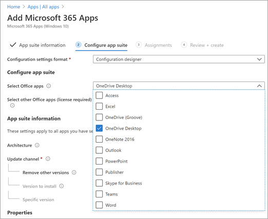

# Deploy OneDrive apps by using Intune

If you're a global admin or assigned [a role in Intune](/mem/intune/fundamentals/role-based-access-control) that gives you the necessary permissions, you can use Intune to deploy OneDrive apps. Before you begin deploying, make sure you review the planning information and deployment options in the [OneDrive guide for enterprises](plan-onedrive-enterprise.md).

## Deploy the OneDrive app for iOS or Android

To deploy apps in Intune, you use the [Microsoft Endpoint Manager admin center](https://endpoint.microsoft.com/?ref=AdminCenter#blade/Microsoft_Intune_DeviceSettings/AppsMenu/allApps). For the steps to deploy apps to iOS devices, see [Add iOS store apps to Microsoft Intune](/mem/intune/apps/store-apps-ios). For the steps to deploy apps to Android devices, see [Add Android store apps to Microsoft Intune](/mem/intune/apps/store-apps-android). Use **https://play.google.com/store/apps/details?id=com.microsoft.skydrive** as the Appstore URL. For info about assigning apps to groups, see [Assign apps to groups with Microsoft Intune](/mem/intune/apps/apps-deploy).

### Deploy the OneDrive sync app to Windows 10 devices 

Although the sync app comes with Windows 10, you might use Intune to switch to [per-machine installation](per-machine-installation.md).

1. Go to the [All apps page of the Microsoft Endpoint Manager admin center](https://endpoint.microsoft.com/?ref=AdminCenter#blade/Microsoft_Intune_DeviceSettings/AppsMenu/allApps)
2. Select **Add**.
3. In the **App type** list, under **Microsoft 365 Apps**, select **Windows 10**, and then select **Select**. 
4. Review the app suite information, and then select **Next**.
5. On the **Configure App Suite** tab, under **Select Office apps**, select **OneDrive Desktop**. Make any other changes to the configuration settings, and then select **Next**.

    

    > [!NOTE]
    > The Update channel doesn't apply to the OneDrive sync app, so it doesn't matter what you select. [Learn about OneDrive sync app update rings](sync-client-update-process.md)

6. On the **Assignments** tab, assign the app to groups. For info about this, see [Assign apps to groups with Microsoft Intune](/mem/intune/apps/apps-deploy). When you're done, select **Next**. 
7. Review the app information, and then select **Create**.

For more info about deploying Microsoft 365 apps to Windows 10 devices using Intune, see [Add Office 365 apps to Windows 10 devices with Microsoft Intune](/mem/intune/apps/apps-add-office365). 

For info about configuring sync app settings using Intune, see [Use administrative templates in Intune](configure-sync-intune.md).
