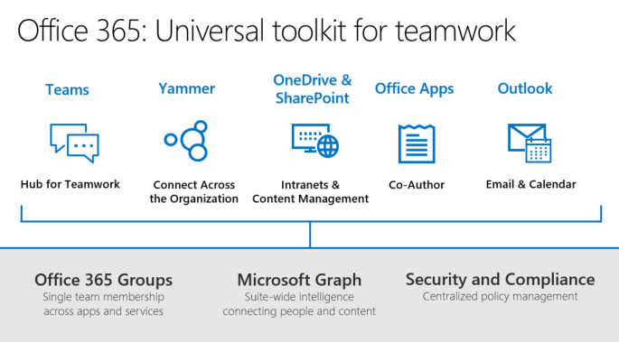
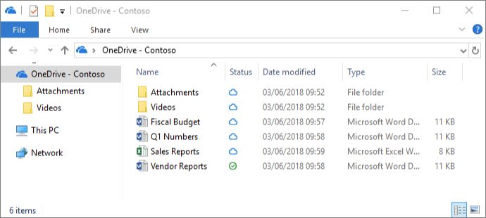
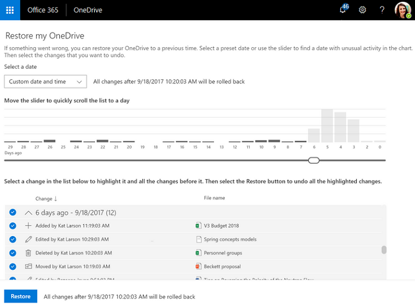
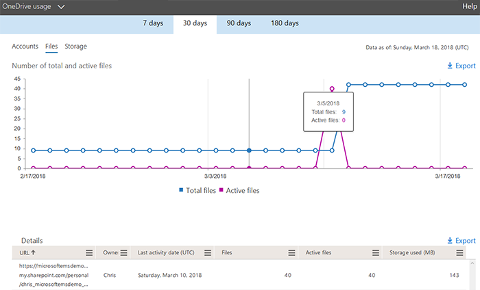

---
title: OneDrive feature overview
ms.author: kaarins
author: kaarins
manager: pamgreen
ms.audience: Admin
ms.topic: article
ms.service: one-drive
localization_priority: Normal
description: "Learn how OneDrive can help your enterprise."
...

# OneDrive feature overview

With OneDrive for Business, you can easily and securely store and access your files from all your devices. You can work with others regardless of whether they’re inside or outside your organization and terminate that sharing whenever you want. OneDrive helps protect your work through advanced encryption while the data is in transit and at rest in data centers. OneDrive also helps ensure that users adhere to your most rigorous compliance standards by enabling them to choose where their data lives and providing detailed reporting of how that data has changed and been accessed. OneDrive connects you to your personal and shared files in Microsoft Office 365, enhancing collaboration capabilities within Office 365 applications. With OneDrive on the web, desktop, or mobile, you can access all your personal files plus the files shared with you from other people or teams, including files from Microsoft Teams and SharePoint.

## Why deploy OneDrive?

OneDrive provides a robust but simple-to-use cloud storage platform for small businesses, enterprises, and everything in between. Unlike other cloud storage providers, most of the advanced enterprise-focused features in OneDrive are available for every subscription type, enabling companies to use OneDrive in whatever way benefits their business the most – whether that’s simply a cloud-based file share for a small business or a highly utilized storage system that provides the basis for all collaboration within an enterprise. At its core, however, OneDrive enables you to securely share and work together on all your files. With OneDrive, you can:

-   **Access files from all your devices.** Access all your personal files and those files others share with you on all your devices, including mobile, Mac, and PC as well as in a web browser.

-   **Share inside or outside your organization.** Securely share files with people inside or outside your organization by using their email address, even if they don’t have a Microsoft Services Account. This common sharing experience is available in the web, mobile, and desktop versions of OneDrive.

-   **Collaborate with deep Microsoft Office integration.** Document coauthoring is available in the Office web apps, Office mobile apps, and Office desktop apps, helping you maintain a single working version of any file. Only OneDrive provides coauthoring capabilities in Office apps across all your devices.

-   **Quickly find files that matter most.** Finding content in your OneDrive is simplified through the intelligence of the Microsoft Graph application programming interface. This technology simplifies finding what’s important by providing file recommendations based on your relationship to other people, how you received various files, and when you last accessed them.

-   **Protect your files with enterprise-grade security.** OneDrive has many security and compliance features, enabling you to meet some of the strictest compliance requirements out there.

The Microsoft 365 family of products, which includes Office, Microsoft Outlook, SharePoint, Teams, OneDrive, and Yammer, provides a complete, intelligent, and secure solution to empower employees. Together, the Microsoft 365 applications unlock creativity and encourage teamwork through product integration and a simple user experience, all while providing intelligent security to help keep your data safe. In addition, Microsoft Graph enables you to interact with and report on the data within many of the Microsoft 365 applications. The illustration below shows what this and other shared capabilities among these products look like.

## Key OneDrive features

Unlike most other cloud storage providers, OneDrive makes most of its advanced features available to all subscription types in addition to the standard features that are available from most other cloud service providers. The result is flexibility for smaller organizations to choose whether to take advantage of the included advanced features and robust features and capabilities enterprises expect out of the box from a cloud storage provider.

Key OneDrive features are those that provide value beyond the standard storage requirements from a cloud storage provider, address common customer concerns or specific compliance requirements, and provide unique functionality available only in OneDrive. Some of these key features include:

-   Known Folder Move
  
-   OneDrive Files On-Demand

-   Hybrid integration with SharePoint Server

-   Modern attachments

-   Real-time team collaboration—Coauthoring in full versions of Microsoft Word, Excel, and PowerPoint

-   Seamlessly connecting files to conversations
 
-   Intelligent discover with OneDrive Discover view

-   OneDrive Files Restore

-   Recycle bin

-   Data loss prevention (DLP)

-   eDiscovery

-   Auditing and reporting
 
-   Encryption of data in transit and at rest

-   Customer-controlled encryption keys

-   Office 365 Customer Lockbox
 
-   OneDrive Multi-Geo storage locations

-   Government cloud

For a full list of feature availability across OneDrive plans, see [Microsoft OneDrive](https://products.office.com/onedrive-for-business/online-cloud-storage). More in-depth descriptions for some of these features can be found below.

### Known Folder Move

Known Folder Move makes it easier to move files in your users' Desktop, Documents, and Pictures folders to OneDrive. This lets users continue working in the folders they're familiar with and access their files from any device. It also helps you make sure your users' files are backed up in the cloud if anything happens to their device. For more info, see [Redirect and move Windows known folders to OneDrive](redirect-known-folders.md).

### OneDrive Files On-Demand

OneDrive Files On-Demand enables users to view, search for, and interact with files stored in OneDrive from within File Explorer without downloading them all to their device. The feature provides a seamless look and feel for both OneDrive and local files without taking up space on the local hard drive. As shown in Figure 4, files that have not been downloaded have a cloud icon for their status. For those files that have been downloaded, the status shows a green checkmark.

Natively, files will be downloaded only when you need to access them. However, if you plan to access a file while disconnected from the internet, you can simply make the file available offline by right-clicking it, and then selecting **Always keep on this device**. Alternatively, if you want to free space on your device and remove the downloaded copy of a file, right-click the file, and then select **Free up space**. Figure 5 shows the right-click menu for OneDrive files on a computer running the Windows operating system.

For more information about OneDrive Files On-Demand, see [Learn about OneDrive Files On-Demand](https://support.office.com/article/learn-about-onedrive-files-on-demand-0e6860d3-d9f3-4971-b321-7092438fb38e).

### Modern attachments

OneDrive integrates with Outlook to allow seamless sharing of OneDrive files that appear just like email attachments. This feature provides a familiar sharing experience but centralizes storage of attachments in OneDrive, providing collaborative benefits such as version control typically lost when users email documents back and forth. In addition, you can configure sharing permissions on the files directly from within the Outlook client. Figure 6 provides an example of a document in OneDrive being attached as a link to an email as well as the experience of changing the sharing permissions on the link.

To reduce the potential for confusion when users choose to add a copy versus a link to attached OneDrive files, you can set the default behavior of the Outlook client, as demonstrated in [How to control default attachment state when you attach a cloud file in Outlook](https://support.microsoft.com/help/4011261/how-to-set-attachment-preference-for-attaching-a-cloud-file-in-outlook).

### Files Restore

The OneDrive Files Restore feature enables users to restore files to any point over the past 30 days. To select the desired recovery time, OneDrive presents users with a histogram that shows file activity so that they can determine which recovered time meets their needs. From there, users can simply select the file history entry to which they want to restore, and all changes after that point will be rolled back. Figure 7 shows the Files Restore experience for a user.

In addition, because the histogram shows individual activity on a file, users can employ this feature to quickly view their files’ modification history. For more information about this feature, see Announcing New OneDrive for Business feature: Files Restore.

### Recycle bin

OneDrive has a recycle bin similar to the one available on the Windows desktop. Deleted files are moved to the recycle bin and kept for a designated time before being permanently deleted. For work or school accounts, deleted files are purged after 93 days unless configured otherwise. For a demonstration of how the recycle bin works, see [Restore deleted files or folders in OneDrive](https://support.office.com/article/restore-deleted-files-or-folders-in-onedrive-949ada80-0026-4db3-a953-c99083e6a84f).

### Auditing and reporting

OneDrive has detailed reporting and auditing capabilities for files it stores as well as for those files stored through other services that use OneDrive for storage, such as Microsoft SharePoint Online. In addition, you can audit individual file actions, including downloads, renames, and views. Figure 2 shows the audit log experience.

The Office 365 admin center handles reporting for cloud services, including OneDrive. You can view historical information like storage usage by user and for the organization, total file and active file counts, and account activity. Figure 3 provides an example of a OneDrive report in the Office 365 admin center: file usage over the past 30 days.

> [!NOTE]
> You can also export this information to a .csv file by selecting **Export**.

You can also consume this information in Power BI by using the Power BI Adoption content pack for Office 365. Using this content pack, you can visualize and analyze Office 365 usage data by using prebuilt graphs and charts or by creating custom reports to gain insights into how specific regions or departments within your organization are using Office 365. For more information about the Office 365 Adoption content pack, see [Office 365 Adoption content pack](https://support.office.com/article/Office-365-Adoption-Content-Pack-77ff780d-ab19-4553-adea-09cb65ad0f1f).

### Encryption of data in transit and at rest

OneDrive uses advanced data-encryption methods between your client and the data center, between servers in the data center, and at rest. At rest, OneDrive uses disk encryption through BitLocker Drive Encryption and file encryption to secure your data. Each file is encrypted with its own encryption key; anything larger than 64 KB is split into individual chunks, each of which has its own encryption key locked in a key store.

Each file chunk is then randomly distributed among Microsoft Azure storage containers, and a construction map for the complete file is stored in a separate secure content database. For attackers to access the file, they would need all the file chunks, the keys, and the map—a highly improbable task. For more information about this process, see [Data Encryption in OneDrive for Business and SharePoint Online](https://support.office.com/article/data-encryption-in-onedrive-for-business-and-sharepoint-online-6501b5ef-6bf7-43df-b60d-f65781847d6c).

### Customer-controlled encryption keys 

By using an Office 365 feature called *service encryption with Customer Key,* you can upload your own encryption keys to Azure Key Vault for use encrypting your data at rest in Azure data centers. Even though this encryption is done natively through BitLocker, customers can require the use of their own key to meet their security compliance requirements. Should users lose their key, they can retrieve a deleted key from the Recycle Bin for up to 90 days (based on your configuration). Before you can use this feature, however, you must create an Azure subscription and complete a few prerequisite steps. For detailed information about service encryption with Customer Key and how to configure it in your environment*,* see [Controlling your data in Office 365 using Customer Key](https://support.office.com/article/controlling-your-data-in-office-365-using-customer-key-f2cd475a-e592-46cf-80a3-1bfb0fa17697).

### Office 365 Customer Lockbox

If a Microsoft support engineer needs to access your data to resolve an issue, that engineer is required to obtain approval from a Microsoft manager first. The Office 365 Customer Lockbox feature adds a requirement to that process: you must approve or reject that access before the support engineer can access your data. With Customer Lockbox, you can also set boundaries on how long the engineer can access your data, and all activity during that time is logged for auditing purposes. For more information about how to configure and use the Customer Lockbox feature, see [Office 365 Customer Lockbox Requests](https://support.office.com/article/office-365-customer-lockbox-requests-36f9cdd1-e64c-421b-a7e4-4a54d16440a2).

### Microsoft Trust Center

Microsoft Trust Center provides information about Microsoft’s trust policy, how Microsoft products help you protect your data and maintain your customers’ and users’ trust, and why you should trust Microsoft products with your data. The following two categories provide details about Office 365 and OneDrive data privacy, compliance, and security:

-   **Office 365 Trust Center.** Privacy, compliance, and cybersecurity are as important to Microsoft as they are to you. For information about how Office 365 can help you increase employee productivity while helping you safeguard your data, see [Microsoft Office 365](https://www.microsoft.com/en-us/trustcenter/cloudservices/office365) in the Microsoft Trust Center. For information about why you should trust Microsoft, Office 365, and OneDrive with your data, see [Office 365 Trust Center](https://products.office.com/en-us/business/office-365-trust-center-welcome).

-   **General Data Protection Regulation (GDPR).** This new European Union regulation changes how companies are required to handle data and the transparency with which they collect it. Windows 10 and Office 365 with OneDrive give you GDPR-compliant tools; you simply need to incorporate those tools into your overall data integrity story. For answers to some common questions about GDPR compliance with OneDrive and SharePoint, see [GDPR Compliancy with OneDrive and SharePoint](https://techcommunity.microsoft.com/t5/Microsoft-OneDrive-Blog/GDPR-Compliancy-with-OneDrive-and-SharePoint/ba-p/191126). For a complete list of helpful resources about GDPR, see [Resources for GDPR compliance](https://www.microsoft.com/en-us/trustcenter/privacy/gdpr/resources). For additional helpful information about OneDrive, see the [Microsoft OneDrive Blog](https://techcommunity.microsoft.com/t5/OneDrive-Blog/bg-p/OneDriveBlog).

### OneDrive Multi-Geo storage locations

Multi-Geo is an Office 365 feature that allows organizations so span their storage over multiple Office 365 geo locations and specify in which of those to store users’ data. You can designate storage geographies on a per-user basis.

For multinational customers with data residency requirements, you can use this feature to ensure that each user’s data is stored in the geo location necessary for compliance. For more information about this feature, see [Multi-Geo Capabilities in OneDrive and SharePoint Online in Office 365](https://technet.microsoft.com/library/mt826374(v=office.16).aspx).

### Government cloud

OneDrive is available in Office 365 U.S. Government plans. For information about these plans, see [Office 365 U.S. Government](https://products.office.com/government/office-365-web-services-for-government).

