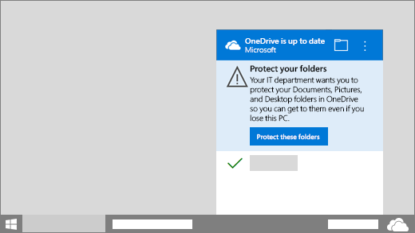

# Redirect and move Windows known folders to OneDrive

This article is for IT admins managing the OneDrive sync client in a Windows Server enterprise environment that uses Active Directory Domain Services. 
  
There are two primary advantages of moving or redirecting Windows known folders (Desktop, Documents, Pictures, Screenshots, and Camera Roll) to OneDrive for Business for the users in your domain:
  
- Your users can continue using the folders they're familiar with. They don't have to change their daily work habits to save files to OneDrive.
    
- Saving files to OneDrive backs up your users' data in the cloud and gives them access to their files from any device.
    
For these reasons, we recommend moving or redirecting known folders to OneDrive if you're an enterprise or large organization. Small or medium businesses may also find this useful, but keep in mind you'll need some experience with Group Policy. For info about the end-user experience, see [Protect your files by saving them to OneDrive](https://support.office.com/article/d61a7930-a6fb-4b95-b28a-6552e77c3057).
  
## About the Known Folder Move Group Policy objects

To use the following Group Policy objects, you need the OneDrive sync build 18.111.0603.0004 or later. You can see your build number in the About tab in OneDrive settings. 

   > [!NOTE]
   > Sync client features are rolled out gradually. To try the latest features, join the [Windows Insider program](https://insider.windows.com/) or the [Office Insider](https://products.office.com/office-insider) program.

> [!IMPORTANT]
   > The OneDrive Known Folder Move Group Policy objects won't work if you previously used Windows Folder Redirection Group Policy objects to redirect the Documents, Pictures, or Desktop folders. Remove the Windows Group Policy objects for these folders before you enable the OneDrive Group Policy objects. The OneDrive Group Policy objects won't affect the Music and Videos folders, so you can keep them redirected with the Windows Group Policy objects. For info about Windows Folder Redirection, see [Deploy Folder Redirection with Offline Files](/windows-server/storage/folder-redirection/deploy-folder-redirection) If your organization is large and your users have a lot of files in their known folders, make sure you roll out the Group Policy objects slowly to minimize the network impact of uploading files.     
  
- [Prompt users to move Windows known folders to OneDrive](use-group-policy.md#OptInWithWizard)
    
    Use this policy to give users a call to action to move their Windows known folders. 

    

    If users dismiss the prompt, a reminder notification will appear in the activity center until they move all known folders. 

    

    If a user has already redirected their known folders to a different OneDrive account, they'll be prompted to direct the folders to the account for your organization (leaving existing files behind).
    
   > [!NOTE]
   > Locally created OneNote files can't be moved to OneDrive using this policy. To learn how to move OneNote notebooks, see [Move a OneNote notebook to OneDrive](https://support.office.com/article/0af0a141-0bdf-49ab-9e50-45dbcca44082). 

  
- [Silently move Windows known folders to OneDrive](use-group-policy.md#OptInNoWizard)
    
    Use this policy to redirect known folders to OneDrive without any user interaction. Before sync client build 18.171.0823.0001, this policy redirected only empty known folders to OneDrive. Now, it redirects known folders that contain content and moves the content to OneDrive. 

    > [!NOTE]
    > You can choose to display a notification to users after their folders have been redirected. 
 
   
- [Prevent users from redirecting their Windows known folders to their PC](use-group-policy.md#OptInNoWizardToast)
    
    Use this policy to force users to keep their known folders directed to OneDrive.
    
    > [!NOTE]
    > Users can direct their known folders by opening OneDrive sync client settings, clicking the **AutoSave** tab, and then clicking **Update folders**. 
  
- [Prevent users from moving their Windows known folders to OneDrive](use-group-policy.md#BlockKFM)
    
For info about using the OneDrive Group Policy objects, see [Use Group Policy to control OneDrive sync client settings](use-group-policy.md).
  

