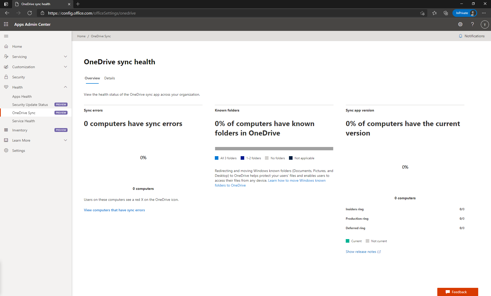
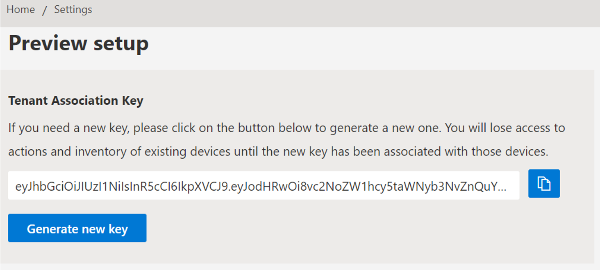
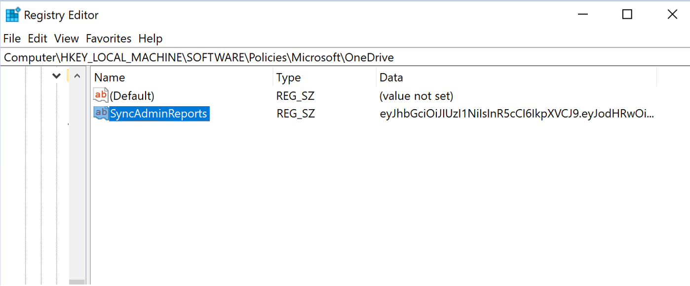

# OneDrive sync reports in the Apps Admin Center

The OneDrive sync health dashboard in the Microsoft 365 [Apps Admin Center](https://config.office.com/) provides IT admins with unified actionable insights to simplify the IT workflow. From small businesses to large enterprises, the dashboard will be the single place to get insights and take action on sync app adoption and health.

>[!IMPORTANT]
> This feature is in preview and isn't available to everyone. It will gradually roll out to customers on the Insiders and Production rings in May 2021.

From the Sync health dashboard, admins can check the sync status and sync app version of individual devices, monitor Known Folder Move roll out, and track sync errors. The insights range from a high-level executive summary to a drill-down of sync status per device, to be used in a variety of administrative scenarios.

**Requirements**:  

- OneDrive sync apps on the Insiders or Production ring. Devices on the Deferred ring aren't eligible for the preview.

- OneDrive Sync app version 21.078 or later for Windows. Support for Mac isn't available yet.

- [Global Administrator role](/microsoft-365/admin/add-users/about-admin-roles?WT.mc_id=365AdminCSH&view=o365-worldwide) or [Office apps admin role](/microsoft-365/admin/add-users/about-admin-roles?WT.mc_id=365AdminCSH&view=o365-worldwide) to set up the dashboard. After setup, only [Global reader role](/microsoft-365/admin/add-users/about-admin-roles?WT.mc_id=365AdminCSH&view=o365-worldwide) is required to view the dashboard.

- Devices can reach the endpoint [https://clients.config.office.net](https://clients.config.office.net)

## Set up the OneDrive sync health dashboard

1. Make sure you have the required role and app versions listed in the previous section. 
2. Go to https://config.office.com and sign in as a global admin or Office apps admin.
3. In the left pane, under **Health**, select **OneDrive Sync**. This tab has a "PREVIEW" tag on it.
4. Select **Enable preview features** to accept the license terms. 

    

    The OneDrive sync health dashboard appears.

   

5. In the left pane, select **Settings**.
6. Copy the **Tenant Association Key**. If the key field is empty, select **Generate new key**.

   

    > [!NOTE] 
    > When you generate a new key for the first time, it can take up to 30 seconds for it to appear.

 3. Enable the OneDrive SyncAdminReports setting using the Tenant Association Key.

      > [!IMPORTANT]
      > -  You must enable this setting on the devices from which you want to get reports. The setting has no impact on users.
      > - When a new Tenant Association Key is generated, update the registry setting as well.
      > - We recommend a gradual rollout starting with a few test devices per day, then up to 100 devices per day, then gradually up to no more than 10,000 devices per day until you finish.

       You can enable this setting in multiple ways:

        1.	Edit the registry
        
            Navigate to HKLM\SOFTWARE\Policies\Microsoft\OneDrive

            a.	Right click > New > String Value.

            b.	Name: SyncAdminReports
            
            c.	Type: REG_SZ

            d.	Data: Paste your Tenant Association Key here.

       

            :::image type="content" source="media/registry-editor.png" alt-text="Image of  the Registry Key setting":::

        2. **Enable via command line** (running in Administrator Mode):
        
            reg.exe add HKLM\Software\Policies\Microsoft\OneDrive /v SyncAdminReports /t REG_SZ /d **"Paste your Tenant Association Key here"** /f

        3. **The SyncAdminReports GPO is available in the OneDrive administrative template files (ADMX/ADML).** The instructions below apply to an individual machine, but the template can applied more broadly via Intune. For more information on deploying broadly,  see [Use OneDrive policies to control sync settings](use-group-policy.md).

            a. Open Group Policy Editor (gpedit.exe).

            b. Navigate to Computer Configuration\Policies\Administrative Templates\OneDrive

            c. Select “Sync Admin Reports”, either double-clicking or selecting “Edit policy setting”

            d. Select “Enable” and paste your Tenant Association Key in the respective text field in the Options menu. Press OK.

    >[!IMPORTANT]
    > It takes up to 3 days from when the GPO has been enabled on the devices to see the reports, and that is expected.

## Troubleshooting steps

This section will help you troubleshoot if the OneDrive sync admin reports do not appear after 3 days.

**The sync app must be (1) running build 21.078.0412.0001 or newer and (2) in the Insiders or Production Update Ring (not Deferred). Enabling the GPO on ineligible devices will not have any effect – these apps will not upload health reports.**

Use the script below to confirm that:
1.	The sync app is on the Insiders or Production ring. 

2.	The SyncAdminReports setting has been applied to the device

In Command Prompt (running in Administrator mode), run the following commands:

-	Check to confirm the sync app is on the Insiders or Production ring:

    reg.exe query HKLM\Software\Policies\Microsoft\OneDrive /v GPOSetUpdateRing

    If the output from the script **is not** dword:00000000, then your device is on Insiders or Production ring.

- Check to confirm the sync app has SyncAdminReports GPO enabled:

    reg.exe query HKLM\Software\Policies\Microsoft\OneDrive /v SyncAdminReports

    The output should look like this:

    :::image type="content" source="media/command-prompt.png" alt-text="Image of command prompt output":::

If the GPO was not applied, complete step C (Enable OneDrive SyncAdminReports GPO using the Tenant Association Key) [above](#set-up-the-onedrive-sync-admin-reports-dashboard) again.

If the sync app is not on the Insiders or Production ring, opt into those rings using the steps in [Use OneDrive policies to control sync settings](use-group-policy.md#set-the-sync-app-update-ring).

If the GPO was applied correctly and device is on the Insiders or Production ring, wait for 24 hours with the device on and signed-into OneDrive. Then, if the device is still not on the dashboard, open a support ticket with Microsoft. For more information, visit the section [**Report issues**](#report-issues) below.

## OneDrive Sync admin report dashboard 

> [!NOTE]
> Once you reach this step, the Global Reader admin role is sufficient to access and view the report.

The Overview page provides aggregated insights on devices that have sync errors, [Known Folder Move](redirect-known-folders.md) rollout status, and adoption of sync app versions and update ring.

:::image type="content" source="media/sync-dashboard.png" alt-text="Image of Sync admin reports dashboard":::

The Details page provides aggregated insights to help admins understand and trouble shoot Sync errors.

It reports on the following diagnostic data:

- User: The name of the user
- User email: The email address of the user
- Computer name: The name of the device
- Errors: Details including the counts, and error messages end users are seeing
- Known folders: Details including enabled status for each folder (Desktop, Documents, Pictures)
- OneDrive app version: The currently installed OneDrive sync app version 
- Operating system version: The current version of the OS running on the device
- Last synced timestamp (UTC): The last time sync app was fully up to date with the cloud
- Last status reported timestamp (UTC): The last time the sync app reported its diagnostic data to the dashboard. 

:::image type="content" source="media/sync-health-ui.png" alt-text="Image of Sync admin health reports details pane":::

### Data for the OneDrive sync health dashboard

The Sync admin reports uses the required service data and diagnostic data that your OneDrive sync apps send to Microsoft. You are in control of which data and which devices send this data. Control over the devices that send this data can be achieved using the GPO options listed above.

Diagnostic data is always under your control.  To learn more about diagnostic data and the controls available to you, see [Overview of privacy controls for Microsoft 365 Apps](/deployoffice/privacy/overview-privacy-controls). To learn more about required service data, see [Required diagnostic data for Office](/deployoffice/privacy/required-diagnostic-data).

## Report issues

If you are encountering an issue with viewing the report dashboard, first verify that you've completed the troubleshooting steps above.

 If issues persist after troubleshooting, please [open a support ticket with Microsoft](/microsoft-365/admin/contact-support-for-business-products?view=o365-worldwide&tabs=phone). Ensure that the device is not powered off during this period so that the sync client can still run and upload a health report.

For quick investigations, be sure to have the date and time range in which the GPO was applied and either the user’s email or the OneDriveDeviceId available in your issue report.

 To obtain OneDrive DeviceID, go to OneDrive app in systray > Help & Settings > Settings > About.  

## Provide Feedback

If you'd like to make a feature suggestion, please use the Feedback button on the bottom right of the dashboard page to submit suggestions.

:::image type="content" source="media/sync-feedback.png" alt-text="Image of sync admin dashboard feedback submission box.":::
