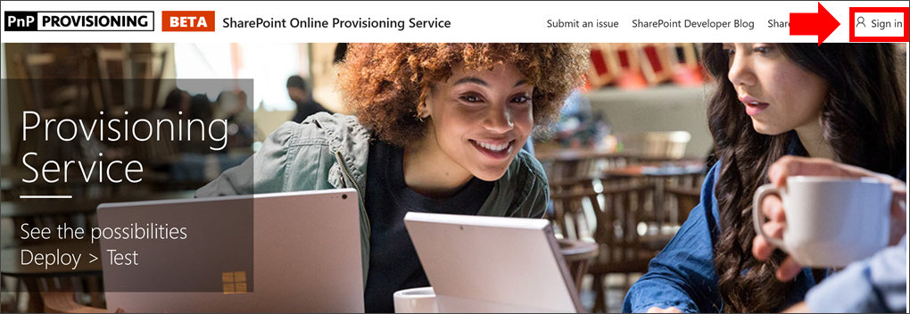
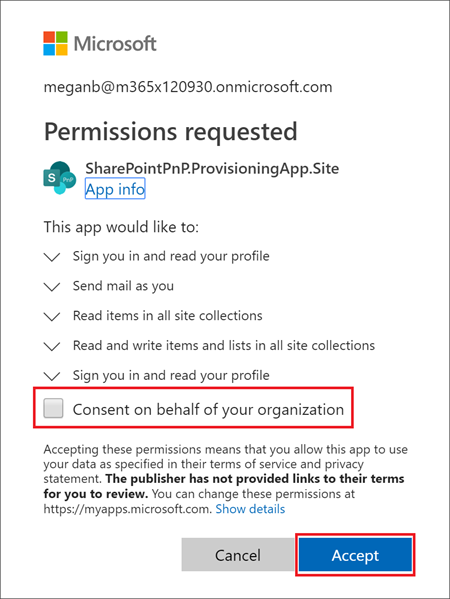

# Provision SharePoint Success Site

With the SharePoint Online Provisioning Service, an Office 365 Tenant Administrator can start the provisioning process with a few simple clicks. It's fast, easy, and takes only a few minutes to start the process. Before getting started with the Provisioning Service, however, make sure you've met the prerequisites for provisioning.

## Prerequisites

To successfully set up the SharePoint Success Site in your tenant you must install it using the SharePoint Online Provisioning Service.

The person doing the provisioning must meet the following pre-requisites:

- The person provisioning the SharePoint Success Site must be a Tenant Administrator of the tenant, otherwise known as the Office 365 Global Administrator role, where the Success Site will be provisioned. If you are not sure if you have been assigned the Global Administrator role, please see our troubleshooting steps.
- A tenant App Catalog must be available within the Apps option of the SharePoint Admin Center. If your organization does not have an SharePoint tenant App catalog, refer to the SharePoint Online documentation to create one.
 
>[!Important]
>If you need to create an app catalog, wait at least 30 minutes after creating the Tenant App Catalog before provisioning the SharePoint Success Site. This ensures that the App Catalog provisioning process is complete within SharePoint.

- The person provisioning the SharePoint Success Site must be a Site Collection Owner of the Tenant App Catalog. If the person provisioning Custom Learning is not a Site Collection Owner of the App Catalog complete these instructions and continue.
 

## To provision the SharePoint Success Site
1. Go to http://provisioning.sharepointpnp.com and sign in from the upper right hand corner of the home page. Sign in with the credentials for the targeted tenant where you plan to install the site template.

 
2. Clear the Consent on behalf of your organization and select Accept.

The provisioning service requires these permissions to create the tenant app catalog, install the application into the tenant app catalog and provision the site template. There is no overall impact on your tenant and these permissions are explicitly used for the purpose of the solution installation. You must accept these permissions to proceed with the installation.

3. Scroll down the page, select the Solutions tab, and then select the SharePoint Success Site.
<insert screen shot when available>

4. Select Add to your tenant
<insert screen shot when available>

5. Complete the fields on the provisioning information page as appropriate for your installation. At a minimum enter the email address where you wish to get notifications about the provisioning process and the destination URL for your site to be provisioned to.

>[!Note]
>Make the destination URL for your site something friendly to your employees such as "/sites/SharePointSuccess" or "/teams/SharePointSites".

<insert screen shot when available>

6.	Select Provision when ready to install the SharePoint Success Site into your tenant environment. The provisioning process will take up to 15 minutes. You will be notified via email (to the notification email address you entered on the Provisioning page) when the site is ready for access.

>[!Important]
>The Tenant Admin who provisions the learning pathways site must go to the site, and then open CustomLearningAdmin.aspx to initialize learning pathways Admin properties. At this time, the Tenant Admin should also assign Owners to the site.

### Validate Provisioning Success and Initialize the CustomConfig List

When provisioning is complete, the Tenant Admin who provisioned the site, receives an email from the SharePoint Provisioning Service. The email contains a link to the site. At this point, the Tenant Admin should go to the site using the link provided in the email and set up the site for first use:

- Go to <YOUR-SITE-COLLECTION-URL>sites/<YOUR-SITE-NAME>/SitePages/CustomLearningAdmin.aspx. Opening CustomLearningAdmin.aspx initializes the CustomConfig list item that sets up learning pathways for first use. You should see a page that looks like this:
- 
<Above to be updated + graphic below to be replaced>
 
### Add Owners to Site

As the Tenant Admin, it's unlikely you'll be the person customizing the site, so you'll need to assign a few owners to the site. Owners have administrative privileges on the site so they can modify site pages and rebrand the site. They also have the ability to hide and show content delivered through the learning pathways Web part. In addition, they'll have the ability to build custom playlist and assign them to custom subcategories.

1. From the SharePoint Settings menu, click Site Permissions.
2. Click Advanced Permission Settings.
3. Click SharePoint Success Site Owners.
4. Click New > Add Users to this group, and then add the people you want to be Owners.
5. Add a link to Explore the Site in the Share message, and then click Share.

## Next Steps

Explore the default content provided in the site and web part.

With the SharePoint Online Provisioning Service, an Office 365 Tenant Administrator can start the provisioning process with a few simple clicks. It's fast, easy, and takes only a few minutes to start the process. Before getting started with the Provisioning Service, however, make sure you've met the prerequisites for provisioning.

## Prerequisites
To successfully set up the SharePoint Success Site in your tenant you must install it using the SharePoint Online Provisioning Service.
The person doing the provisioning must meet the following prerequisites:

- The person provisioning the SharePoint Success Site must be a Tenant Administrator of the tenant, otherwise known as the Office 365 Global Administrator role, where the Success Site will be provisioned. If you are not sure if you have been assigned the Global Administrator role, please see our troubleshooting steps.
- A tenant App Catalog must be available within the Apps option of the SharePoint Admin Center. If your organization does not have an SharePoint tenant App catalog, refer to the SharePoint Online documentation to create one.
- 
Important
If you need to create an app catalog, wait at least 30 minutes after creating the Tenant App Catalog before provisioning the SharePoint Success Site. This ensures that the App Catalog provisioning process is complete within SharePoint.
•	The person provisioning the SharePoint Success Site must be a Site Collection Owner of the Tenant App Catalog. If the person provisioning Custom Learning is not a Site Collection Owner of the App Catalog complete these instructions and continue.

#### To provision the SharePoint Success Site

1. Go to http://provisioning.sharepointpnp.com and sign in from the upper right hand corner of the home page. Sign in with the credentials for the targeted tenant where you plan to install the site template.
 
2. Clear the Consent on behalf of your organization and select Accept.
 
The provisioning service requires these permissions to create the tenant app catalog, install the application into the tenant app catalog and provision the site template. There is no overall impact on your tenant and these permissions are explicitly used for the purpose of the solution installation. You must accept these permissions to proceed with the installation.
3. Scroll down the page, select the Solutions tab, and then select the SharePoint Success Site.

insert screen shot when available

4. Select Add to your tenant

insert screen shot when available

5. Complete the fields on the provisioning information page as appropriate for your installation. At a minimum enter the email address where you wish to get notifications about the provisioning process and the destination URL for your site to be provisioned to.

>[!Note]
>Make the destination URL for your site something friendly to your employees such as "/sites/SharePointSuccess" or "/teams/SharePointSites".

insert screen shot when available

6. Select Provision when ready to install the SharePoint Success Site into your tenant environment. The provisioning process will take up to 15 minutes. You will be notified via email (to the notification email address you entered on the Provisioning page) when the site is ready for access.

>[!Important]
>The Tenant Admin who provisions the learning pathways site must go to the site, and then open CustomLearningAdmin.aspx to initialize learning pathways Admin properties. At this time, the Tenant Admin should also assign Owners to the site.

Validate Provisioning Success and Initialize the CustomConfig List
When provisioning is complete, the Tenant Admin who provisioned the site, receives an email from the SharePoint Provisioning Service. The email contains a link to the site. At this point, the Tenant Admin should go to the site using the link provided in the email and set up the site for first use:
•	Go to <YOUR-SITE-COLLECTION-URL>sites/<YOUR-SITE-NAME>/SitePages/CustomLearningAdmin.aspx. Opening CustomLearningAdmin.aspx initializes the CustomConfig list item that sets up learning pathways for first use. You should see a page that looks like this:
<Above to be updated + graphic below to be replaced>
 
#### Add Owners to Site

As the Tenant Admin, it's unlikely you'll be the person customizing the site, so you'll need to assign a few owners to the site. Owners have administrative privileges on the site so they can modify site pages and rebrand the site. They also have the ability to hide and show content delivered through the learning pathways Web part. In addition, they'll have the ability to build custom playlist and assign them to custom subcategories.
1.	From the SharePoint Settings menu, click Site Permissions.
2.	Click Advanced Permission Settings.
3.	Click SharePoint Success Site Owners.
4.	Click New > Add Users to this group, and then add the people you want to be Owners.
5.	Add a link to Explore the Site in the Share message, and then click Share.

### Next Steps

•	Explore the default content provided in the site and web part.
