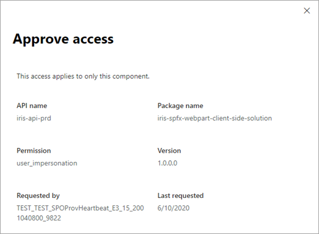

# Manage access to Azure AD-secured APIs

When developers build SharePoint Framework solutions, they might need to connect to an API that's secured through Azure Active Directory (Azure AD). Developers can specify which Azure AD applications and permissions their solution requires, and a global or SharePoint admin can manage the permission request from the [API access page of the new SharePoint admin center](https://admin.microsoft.com/sharepoint?page=webApiPermissionManagement&modern=true). 

[Learn more about building SharePoint Framework solutions that connect to Azure-AD secured APIs](/sharepoint/dev/spfx/use-aadhttpclient#manage-permission-requests)

   

The API access page shows pending and approved requests. It also shows which requests apply to any SharePoint Framework component or custom script in your organization (organization-wide) and which requests apply to only the specific component (isolated).

## Approve a pending request

1. Select the request, and then select **Approve** to see details about the request. 
2. In the **Approve access** panel, select **Approve**.

    

    After you approve a request, it moves to the Approved requests list.

    > [!NOTE]
    > If you try to approve a permission request for a resource that already has some permissions granted (for example, granting additional permissions to the Microsoft Graph), the requested scopes are added to the previously granted permissions.

## Reject a pending request

1. Select the request, and select **Reject**. 
2. Select **Reject** again to confirm. 
 
Rejecting access doesn't remove the app from the app catalog. If the app is used on any sites, it might not work as expected. After you reject the request, it is removed from the page and the developer will need to issue a new request with the same resource and scope.

## Remove access to a previously approved request

1. Select the request, and then select **Remove access**. 
2. Select **Remove** again to confirm. 
 
When you remove access, solutions and custom scripts that rely on the permission might not work as expected. After you remove access, the request is removed from the page and the developer will need to issue a new request with the same resource and scope.

## Manage access by using Microsoft PowerShell
You can also use PowerShell to manage permission requests. 

- To view pending requests, use the cmdlet [Get-SPOTenantServicePrincipalPermissionRequests](/powershell/module/sharepoint-online/get-spotenantserviceprincipalpermissionrequests?view=sharepoint-ps). 
- To approve a request, use the cmdlet [Approve-SPOTenantServicePrincipalPermissionRequest](/powershell/module/sharepoint-online/approve-spotenantserviceprincipalpermissiongrant?view=sharepoint-ps). 
- To reject a request, use the cmdlet [Deny-SPOTenantServicePrincipalPermissionRequest](/powershell/module/sharepoint-online/deny-spotenantserviceprincipalpermissionrequest?view=sharepoint-ps).
- To remove access to a previously approved request, use the cmdlet [Revoke-SPOTenantServicePrincipalPermission](/powershell/module/sharepoint-online/revoke-spotenantserviceprincipalpermission?view=sharepoint-ps). 
