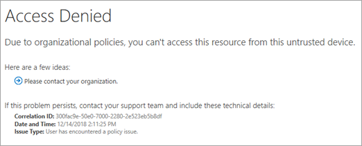
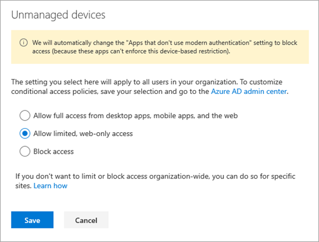

# Control access from unmanaged devices

As a SharePoint or global admin in Microsoft 365, you can block or limit access to SharePoint and OneDrive content from unmanaged devices (those not [hybrid AD joined](/azure/active-directory/devices/overview#hybrid-azure-ad-joined-devices) or compliant in Intune). You can block or limit access for:
  
- All users in the organization or only some users or security groups.
    
- All sites in the organization or only some sites.
    
Blocking access helps provide security but comes at the cost of usability and productivity. When access is blocked, users will see the following error.



Limiting access allows users to remain productive while addressing the risk of accidental data loss on unmanaged devices. When you limit access, users on managed devices will have full access (unless they use one of the browser and operating system combinations listed below). Users on unmanaged devices will have browser-only access with no ability to download, print, or sync files. They also won't be able to access content through apps, including the Microsoft Office desktop apps. When you limit access, you can choose to allow or block editing files in the browser. When web access is limited, users will see the following message at the top of sites.


  
> [!NOTE]
> Blocking or limiting access on unmanaged devices relies on Azure AD conditional access policies. [Learn about Azure AD licensing](https://azure.microsoft.com/pricing/details/active-directory/) For an overview of conditional access in Azure AD, see [Conditional access in Azure Active Directory](/azure/active-directory/conditional-access/overview). For info about recommended SharePoint access policies, see [Policy recommendations for securing SharePoint sites and files](/microsoft-365/enterprise/sharepoint-file-access-policies). If you limit access on unmanaged devices, users on managed devices must use one of the [supported OS and browser combinations](/azure/active-directory/conditional-access/technical-reference#client-apps-condition), or they will also have limited access.  
  
## Block access

1. Go to the [Access control page of the SharePoint admin center](https://admin.microsoft.com/sharepoint?page=accessControl&modern=true), and sign in with an account that has [admin permissions](/sharepoint/sharepoint-admin-role) for your organization.

    >[!NOTE]
    >If you have Office 365 Germany, [sign in to the Microsoft 365 admin center](https://go.microsoft.com/fwlink/p/?linkid=848041), then browse to the SharePoint admin center and open the Access control page. 
    > 
    > If you have Office 365 operated by 21Vianet (China), [sign in to the Microsoft 365 admin center](https://go.microsoft.com/fwlink/p/?linkid=850627), then browse to the SharePoint admin center and open the Access control page.

2. Select **Unmanaged devices**. 

     

3. Select **Block access**, and then select **Save**. (Selecting this option disables any previous conditional access policies you created from this page, and creates a new conditional access policy that applies to all users. Any customizations you made to previous policies will not be carried over.)

    > [!NOTE] 
    > It can take 5-10 minutes for the policy to take effect. It won't take effect for users who are already signed in from unmanaged devices. 

> [!IMPORTANT] 
> If you block or limit access from unmanaged devices, we recommend also blocking access from apps that don't use modern authentication. Some third-party apps and versions of Office prior to Office 2013 don't use modern authentication and can't enforce device-based restrictions. This means they allow users to bypass conditional access policies that you configure in Azure. In the new SharePoint admin center, on the Access control page, select **Apps that don't use modern authentication**, select **Block access**, and then select **Save**.  

## Limit access

1. Go to the [Access control page of the new SharePoint admin center](https://admin.microsoft.com/sharepoint?page=accessControl&modern=true), and sign in with an account that has [admin permissions](/sharepoint/sharepoint-admin-role) for your organization.

    >[!NOTE]
    >If you have Office 365 Germany, [sign in to the Microsoft 365 admin center](https://go.microsoft.com/fwlink/p/?linkid=848041), then browse to the SharePoint admin center and open the Access control page.
    > 
    > If you have Office 365 operated by 21Vianet (China), [sign in to the Microsoft 365 admin center](https://go.microsoft.com/fwlink/p/?linkid=850627), then browse to the SharePoint admin center and open the Access control page.

2. Select **Unmanaged devices**.

3. Select **Allow limited, web-only access**, and then select **Save**. (Note that selecting this option will disable any previous conditional access policies you created from this page and create a new conditional access policy that applies to all users. Any customizations you made to previous policies will not be carried over.)

     

> [!IMPORTANT] 
> If you block or limit access from unmanaged devices, we recommend also blocking access from apps that don't use modern authentication. Some third-party apps and versions of Office prior to Office 2013 don't use modern authentication and can't enforce device-based restrictions. This means they allow users to bypass conditional access policies that you configure in Azure. In the new SharePoint admin center, on the Access control page, select **Apps that don't use modern authentication**, select **Block access**, and then select **Save**.  
  
## Limit access using PowerShell

1. [Download the latest SharePoint Management Shell](https://go.microsoft.com/fwlink/p/?LinkId=255251).
    
2. Connect to SharePoint as a [global admin or SharePoint admin](/sharepoint/sharepoint-admin-role) in Microsoft 365. To learn how, see [Getting started with SharePoint Management Shell](/powershell/sharepoint/sharepoint-online/connect-sharepoint-online).
    
3. Run the following command:

    ```PowerShell
    Set-SPOTenant -ConditionalAccessPolicy AllowLimitedAccess`
    ```
    
> [!NOTE]
> By default, this policy allows users to view and edit files in their web browser. To change this, see [Advanced configurations](control-access-from-unmanaged-devices.md#advanced). 
  
## Block or limit access to a specific SharePoint site or OneDrive 

To block or limit access to specific sites, you must set the organization-wide policy to "Allow full access from desktop apps, mobile apps, and the web." Then follow these steps to manually create a policy in the Azure AD admin center and run PowerShell cmdlets.
  
1. In the Azure AD admin center, select **Conditional access**, and then select **New policy**.
    
2. Under **Users and groups**, select whether you want the policy to apply to all users or only specific security groups.
    
3. Under **Cloud apps**, select **Microsoft 365 SharePoint**.
    
4. Under **Conditions**, select **Client apps**, then select both **Mobile apps and desktop clients** and **Browser**.
    
5. Under **Session**, select **Use app enforced restrictions**. This tells Azure to use the settings you'll specify in SharePoint.
    
6. Enable the policy and save it.
    
    
  
7. [Download the latest SharePoint Management Shell](https://go.microsoft.com/fwlink/p/?LinkId=255251).

    > [!NOTE]
    > If you installed a previous version of the SharePoint Management Shell, go to Add or remove programs and uninstall "SharePoint Management Shell." 
    > 
    > On the Download Center page, select your language and then click the Download button. You'll be asked to choose between downloading a x64 and x86 .msi file. Download the x64 file if you're running the 64-bit version of Windows or the x86 file if you're running the 32-bit version. If you don't know, see https://support.microsoft.com/help/13443/windows-which-operating-system. After the file downloads, run it and follow the steps in the Setup Wizard. 
    
8. Connect to SharePoint as a [global admin or SharePoint admin](/sharepoint/sharepoint-admin-role) in Microsoft 365. To learn how, see [Getting started with SharePoint Management Shell](/powershell/sharepoint/sharepoint-online/connect-sharepoint-online).
    
9. To block access to a single site, run the following command:

    ```PowerShell
    Set-SPOSite -Identity https://<SharePoint online URL>/sites/<name of site or OneDrive account> -ConditionalAccessPolicy BlockAccess
    ```
    
    To limit access to a single site, run the following command:

    ```PowerShell
    Set-SPOSite -Identity https://<SharePoint online URL>/sites/<name of site or OneDrive account> -ConditionalAccessPolicy AllowLimitedAccess
    ```

    To update multiple sites at once, use the following command as an example:

    ```PowerShell
    ,(Get-SPOSite -IncludePersonalSite $true -Limit all -Filter "Url -like '-my.sharepoint.com/personal/'") | Set-SPOTenant -ConditionalAccessPolicy AllowLimitedAccess
    ```

    This example gets the OneDrive for every user and passes it as an array to Set-SPOTenant to limit access. The initial comma and the parentheses are required for running this cmdlet as a batch request, which is fastest.

    
    > [!NOTE]
    > The site-level setting must be at least as restrictive as the organization-level setting. 
    > 
    > By default, this policy allows users to view and edit files in their web browser. To change this, see [Advanced configurations](control-access-from-unmanaged-devices.md#advanced). 
 
## Advanced configurations
<a name="advanced"> </a>

The following parameters can be used with  `-ConditionalAccessPolicy AllowLimitedAccess` for both the organization-wide setting and the site-level setting: 
  
 `-AllowEditing $false` Prevents users from editing Office files in the browser and copying and pasting Office file contents out of the browser window. 
  
 `-LimitedAccessFileType OfficeOnlineFilesOnly` Allows users to preview only Office files in the browser. This option increases security but may be a barrier to user productivity. 
  
 `-LimitedAccessFileType WebPreviewableFiles` (default) Allows users to preview Office files in the browser. This option optimizes for user productivity but offers less security for files that aren't Office files. **Warning:** This option is known to cause problems with PDF and image file types because they can be required to be downloaded to the end user's machine to render in the browser. Plan the use of this control carefully. Otherwise, your users could be faced with unexpected "Access Denied" errors. 
  
 `-LimitedAccessFileType OtherFiles` Allows users to download files that can't be previewed, such as .zip and .exe. This option offers less security. 
  
The AllowDownlownloadingNonWebViewableFiles parameter has been discontinued. Please use LimitedAccessFileType instead.
  
External users will be affected when you use conditional access policies to block or limit access from unmanaged devices. If users have shared items with specific people (who must enter a verification code sent to their email address), you can exempt them from this policy by running the following cmdlet.
  
 `Set-SPOTenant -ApplyAppEnforcedRestrictionsToAdHocRecipients $false`
  
> [!NOTE]
> "Anyone" links (shareable links that don't require sign-in) are not affected by these policies. People who have an "Anyone" link to a file or folder will be able to download the item. For all sites where you enable conditional access policies, you should disable "Anyone" links. 
  
## App impact

Blocking access and blocking download may impact the user experience in some apps, including some Office apps. We recommend that you turn on the policy for some users and test the experience with the apps used in your organization. In Office, make sure to check the behavior in Power Apps and Power Automate when your policy is on.
  
> [!NOTE]
> Apps that run in "app-only" mode in the service, like antivirus apps and search crawlers, are exempted from the policy.
> 
> If you're using classic SharePoint site templates, site images may not render correctly. This is because the policy prevents the original image files from being downloaded to the browser. 
  
## Need more help?

[!INCLUDE[discussionforums.md](includes/discussionforums.md)]

## See also

[Policy recommendations for securing SharePoint sites and files](https://docs.microsoft.com/microsoft-365/enterprise/sharepoint-file-access-policies)

[Control access to SharePoint and OneDrive data based on defined network locations](control-access-based-on-network-location.md)
