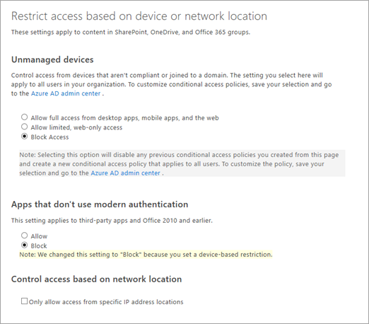
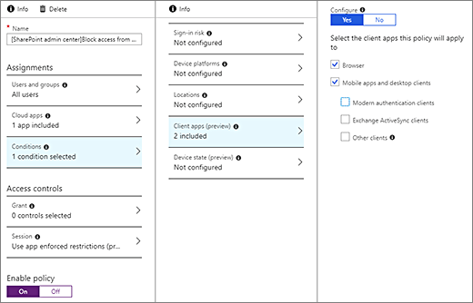

# Control access from unmanaged devices

> [!NOTE]
> Some functionality is introduced gradually to organizations that have set up the [Targeted release option in Office 365](https://support.office.com/article/3b3adfa4-1777-4ff0-b606-fb8732101f47). This means that you may not yet see this feature or it may look different than what is described in this article. 
  
As a SharePoint or global admin in Office 365, you can block or limit access to SharePoint and OneDrive content from unmanaged devices (those not joined to a domain or compliant in Intune). You can block or limit access for:
  
- All users in the organization or only some users or security groups.
    
- All sites in the organization or only some site collections.
    
Blocking access helps provide security but comes at the cost of usability and productivity. Limiting access allows users to remain productive while addressing the risk of accidental data loss on unmanaged devices. When you limit access, users on managed devices will have full access (unless they use one of the browser and operating system combinations listed below). Users on unmanaged devices will have browser-only access with no ability to download, print, or sync files. They also won't be able to access content through apps, including the Microsoft Office desktop apps. When you limit access, you can choose to allow or block editing files in the browser.
  
> [!NOTE]
> Blocking or limiting access on unmanaged devices relies on Azure AD conditional access policies. [Learn about Azure AD licensing](https://azure.microsoft.com/pricing/details/active-directory/) For an overview of conditional access in Azure AD, see [Conditional access in Azure Active Directory](https://go.microsoft.com/fwlink/?linkid=857717). For info about recommended SharePoint access policies, see [Policy recommendations for securing SharePoint sites and files](https://go.microsoft.com/fwlink/?linkid=871728). If you limit access on unmanaged devices, users on managed devices who have the following browser and operating system combinations will also have limited access:  Chrome, Firefox, or any other browser besides Microsoft Edge and Microsoft Internet Explorer on Windows 10 or Windows Server 2016  Firefox in Windows 8.1, Windows 7, Windows Server 2012 R2, Windows Server 2012, or Windows Server 2008 R2 
  
## Block access to SharePoint and OneDrive content using the SharePoint admin center

1. Sign in to Office 365 as a global admin or SharePoint admin.
    
2. Select the app launcher icon  in the upper-left and choose **Admin** to open the Office 365 admin center. (If you don't see the Admin tile, you don't have Office 365 administrator permissions in your organization.) 
    
3. In the left pane, choose **Admin centers** \> **SharePoint**.
    
4. In the SharePoint admin center, click **access control**.
    
5. Select **Block Access**.
    
6. Click **OK**.
    
    
  
7. Go to the Azure AD admin center, click **Azure Active Directory** in the left pane, and then click **Conditional access**. 
    
8. Under **Conditions**, select both **Mobile apps and desktop clients** and **Browser**.
    
9. Under **Session**, select **Use app enforced restrictions**. This tells Azure to use the settings you'll specify in SharePoint. Under **Grant**, clear both check boxes.
    
> [!NOTE]
> It can take 5-10 minutes for the policy to take effect. It won't take effect for users who are already signed in from unmanaged devices. 
  

  
## Limit access to SharePoint and OneDrive content using the SharePoint admin center

1. Sign in to Office 365 as a global admin or SharePoint admin.
    
2. Select the app launcher icon  in the upper-left and choose **Admin** to open the Office 365 admin center. (If you don't see the Admin tile, you don't have Office 365 administrator permissions in your organization.) 
    
3. In the left pane, choose **Admin centers** \> **SharePoint**.
    
4. In the SharePoint admin center, click **access control**.
    
5. Select **Allow limited, web-only access**.
    
6. Click **OK**.
    
    
  
    > [!NOTE]
    > It can take 5-10 minutes for the policies to take effect. They won't take effect for users who are already signed in from unmanaged devices.  By default, this policy allows users to view and edit files in their web browser. To change this, see [Advanced configurations](control-access-from-unmanaged-devices.md#advanced). 
  
If you go to the Azure AD admin center and click **Conditional access**, you can see that two policies were created by the SharePoint admin center. By default, the policy applies to all users. To apply it to only specific security groups, make changes under **Users and groups**. Be careful not to create multiple conditional access polices in the Azure AD admin center that conflict with each other. You can disable the policies created by the SharePoint admin center and then manually create the conditional access policies you need.
  

  
## Limit access to SharePoint and OneDrive content using PowerShell

1. [Download the latest SharePoint Online Management Shell](https://go.microsoft.com/fwlink/p/?LinkId=255251).
    
2. Connect to SharePoint Online as a global admin or SharePoint admin in Office 365. To learn how, see [Getting started with SharePoint Online Management Shell](https://go.microsoft.com/fwlink/?linkid=869066).
    
3. Run  `Set-SPOTenant -ConditionalAccessPolicy AllowLimitedAccess`.
    
> [!NOTE]
> By default, this policy allows users to view and edit files in their web browser. To change this, see [Advanced configurations](control-access-from-unmanaged-devices.md#advanced). 
  
## Block or limit access to specific SharePoint site collections or OneDrive accounts

To block or limit access to specific sites, you must set the organization-wide policy to "Allow full access from desktop apps, mobile apps, and the web." Then follow these steps to manually create a policy in the Azure AD admin center and run PowerShell cmdlets.
  
1. In the Azure AD admin center, select **Conditional access**, and then click **Add**.
    
2. Under **Users and groups**, select whether you want the policy to apply to all users or only specific security groups.
    
3. Under **Cloud apps**, select **Office 365 SharePoint Online**.
    
4. Under **Conditions**, select both **Mobile apps and desktop clients** and **Browser**.
    
5. Under **Session**, select **Use app enforced restrictions**. This tells Azure to use the settings you'll specify in SharePoint.
    
6. Enable the policy and save it.
    
    
  
7. [Download the latest SharePoint Online Management Shell](https://go.microsoft.com/fwlink/p/?LinkId=255251).
    
8. Connect to SharePoint Online as a global admin or SharePoint admin in Office 365. To learn how, see [Getting started with SharePoint Online Management Shell](https://go.microsoft.com/fwlink/?linkid=869066).
    
9. To block access, run  `Set-SPOSite -Identity https://<SharePoint online URL>/sites/<name of site collection or OneDrive account> -ConditionalAccessPolicy BlockAccess`.
    
    To limit access, run  `Set-SPOSite -Identity https://<SharePoint online URL>/sites/<name of site collection or OneDrive account> -ConditionalAccessPolicy AllowLimitedAccess`.
    
> [!NOTE]
> The site collection-level setting must be at least as restrictive as the organization-wide setting.  By default, this policy allows users to view and edit files in their web browser. To change this, see [Advanced configurations](control-access-from-unmanaged-devices.md#advanced). 
  
## Advanced configurations

The following parameters can be used with  `-ConditionalAccessPolicy AllowLimitedAccess` for both the organization-wide setting and the site-level setting: 
  
 `-AllowEditing $false` Prevents users from editing Office files in the browser and copying and pasting Office file contents out of the browser window. 
  
 `-LimitedAccessFileType -OfficeOnlineFilesOnly` Allows users to preview only Office files in the browser. This option increases security but may be a barrier to user productivity. 
  
 `-LimitedAccessFileType -WebPreviewableFiles` (default) Allows users to preview Office files and other file types (such as PDF files and images) in the browser. Note that the contents of file types other than Office files are handled in the browser. This option optimizes for user productivity but offers less security for files that aren't Office files. 
  
 `-LimitedAccessFileType -OtherFiles` Allows users to download files that can't be previewed, such as .zip and .exe. This option offers less security. 
  
The AllowDownlownloadingNonWebViewableFiles parameter has been discontinued. Please use LimitedAccessFileType instead.
  
External users will be affected when you use conditional access policies to block or limit access from unmanaged devices. If users have shared items with specific people (who must enter a verification code sent to their email address), you can exempt them from this policy by running the following cmdlet.
  
 `Set-SPOTenant -ApplyAppEnforcedRestrictionsToAdHocRecipients $false`
  
> [!NOTE]
> Anonymous access links (shareable links that don't require sign-in) are not affected by these policies. Anyone who has an anonymous access link to an item will be able to download the item. For all site collections where you enable conditional access policies, you should disable anonymous access links. 
  
## App impact

Blocking access and blocking download may impact the user experience in some apps, including some Office apps. We recommend that you turn on the policy for some users and test the experience with the apps used in your organization. In Office, make sure to check the behavior in Flow and PowerApps when your policy is on.
  
> [!NOTE]
> Apps that run in "app-only" mode in the service, like antivirus apps and search crawlers, are exempted from the policy. If you're using classic SharePoint site templates, site images may not render correctly. This is because the policy prevents the original image files from being downloaded to the browser. 
  
## See also

[Control access to SharePoint Online and OneDrive data based on defined network locations](control-access-based-on-network-location.md)

