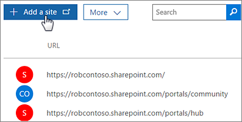
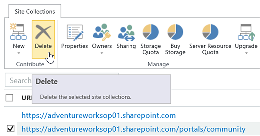

# Create or delete a site collection

This article shows how Office 365 global admins and SharePoint admins can create and delete site collections in SharePoint Online.
  
> [!NOTE]
>  This article covers classic sites. For info about creating and deleting team sites that have an Office 365 group and communication sites, see: > [Create a team site in SharePoint Online](https://support.office.com/article/ef10c1e7-15f3-42a3-98aa-b5972711777d)> [Create a communication site in SharePoint Online](https://support.office.com/article/7fb44b20-a72f-4d2c-9173-fc8f59ba50eb)> [Delete a SharePoint site or subsite](https://support.office.com/article/bc37b743-0cef-475e-9a8c-8fc4d40179fb)> [Manage site creation in SharePoint Online](manage-site-creation-in-sharepoint-online.md)
  
## Create a site collection

You can create different types of site collections in SharePoint Online. For example, you might create sites for project collaboration, sites for record storage, and sites for intranet portal pages. Some previous Office 365 plans can have only one site collection. For info, see [SharePoint Online limits](https://support.office.com/article/8f34ff47-b749-408b-abc0-b605e1f6d498#__sharepoint_online_for_1).
  
1. Sign in to Office 365 as a global admin or SharePoint admin.
    
2. Select the app launcher icon  in the upper-left and choose **Admin** to open the Office 365 admin center. (If you don't see the Admin tile, you don't have Office 365 administrator permissions in your organization.) 
    
3. In the left pane, select **Resources**, and then select **Sites**.
    
  
4. Select **Add a site**.
    
  
    > [!NOTE]
    > If you don't see the options above, select **Admin centers** > **SharePoint** and then select **New** > **Private Site Collection**.
  
5. Fill out the new site collection properties:
    
  
  - In the **Title** box, enter a name for the site collection. 
    
  - In the **Web Site Address** drop-down lists **,** select a domain name and a URL path—either **/sites/** or **/teams/** —and then type a URL name for the site collection. 
    
  - In the **Template Selection** section, in the **Select a language** drop-down list, select a language for the site collection. You can enable the SharePoint multiple language interface on your sites, but the primary language for the site collection will remain the one you select here. 
    
    > [!NOTE]
    > It's important to select the appropriate language for the site collection, because once it's set, it cannot be changed. After creating a site collection, verify the locale and regional settings are accurate. (For example, a site created for Chinese will have its locale set to China.) 
  
  - In the **Template Selection** section, under **Select a template**, choose the template that most closely describes the purpose of your site collection. For example, if your site collection will be used for a team collaboration, choose **Team Site**.
    
    > [!TIP]
    > For more information on templates, see [Using templates to create different kinds of SharePoint sites](https://support.office.com/article/449eccec-ff99-4cf3-b62e-dcfee37e8da4). 
  
  - In the **Time Zone** box, select the time zone that's appropriate for the location of the site collection. 
    
  - In the **Administrator** box, type the user name of your site collection administrator. You can also use the **Check Names** or **Browse** button to find a user to make site collection administrator. 
    
  - In the **Storage Quota** box, type the number of megabytes (MB) you want to allocate to this site collection. Do not exceed the available amount that is displayed next to the box. 
    
  - In the **Server Resource Quota** box, accept the resource quota default. This setting no longer affects the resource amounts available for the site collection. 
    
6. Click **OK**.
    
    The new site collection will appear in the URL list. The URL is the site collection location at which the administrator can start to create and manage sites.
    
## Delete a site collection

Deleted site collections move to the site collection Recycle Bin and are retained for 93 days. When you delete a site collection, you delete everything within it, including:
  
- Document libraries and files.
    
- Lists and list data.
    
- Site settings and history.
    
- Any subsites and their contents.
    
You should notify the site collection owners and subsite owners before you delete a site collection so they can move their data to another location, and also tell users when the sites will be deleted. To delete a classic site:
  
1. Sign in to Office 365 as a global admin or SharePoint admin.
    
2. Select the app launcher icon  in the upper-left and choose **Admin** to open the Office 365 admin center. (If you don't see the Admin tile, you don't have Office 365 administrator permissions in your organization.) 
    
3. In the left pane, choose **Admin centers** > **SharePoint**.
    
4. Select the check box next to the site collection or multiple site collections that you want to delete.
    
5. On the **Site Collections** tab, select **Delete**.
    
  
6. Confirm the information in the **Delete Site Collections** dialog box, and then select **Delete**.
    
  
For sites that have an Office 365 group, delete the group to delete the site:
  
1. Sign in to Office 365 as a global admin or SharePoint admin.
    
2. In the left pane, choose **Groups** > **Groups**.
    
3. Select the check box next to the group you want to delete.
    
4. Select **Delete**.
    
## See also

#### Other Resources

[Enable or disable site collection features](https://support.office.com/article/A2F2A5C2-093D-4897-8B7F-37F86D83DF04)
  
[Introduction to multilingual features](https://support.office.com/article/53411469-53e3-4570-95e2-3651f166174f)
  
[Restore deleted items from the site collection recycle bin ](https://support.office.com/article/5fa924ee-16d7-487b-9a0a-021b9062d14b)

