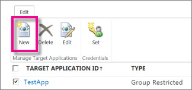
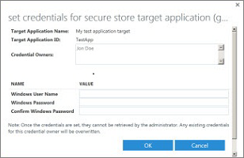

# Create or edit a Secure Store Target Application

When you want to use external data (such as data from your other business applications or partner resources) in SharePoint, you can use Business Connectivity Services (BCS) together with Secure Store. And, you can manage BCS and Secure Store right in the SharePoint admin center. The external data source that you can connect to is called a Secure Store Target Application, or just a Target Application. 
  
BCS makes it possible for you to set up a connection to the Target Application, and the Secure Store enables you to manage the credentials that are required by the external data source. 

>[!NOTE]
>To access the Secure Store, you must have the SharePoint Admin role or Global Admin role.
  
## How the Secure Store Service Works

This SharePoint service makes access to external business application data easier. In order to understand why the Secure Store Service offers this benefit, it's important to understand that the username and password used to access external data stores may not be the same as the username and password used to access SharePoint. When a user accesses a SharePoint page that displays information from an external data system, SharePoint must make a separate request to retrieve information from the external data system. This must be made with credentials that are known to the external data system in order for the request for content to be successful. Only then can SharePoint display the information from the external data system on the page. The Secure Store Service stores the external data system credentials for this reason.
  
The Secure Store Service is designed to create a background mapping between a group of users in SharePoint, and a single user known to the external data system. When the Secure Store Service is properly configured, the following occurs: 
  
- A user authenticates through Internet Information Services (the web server technology underlying SharePoint technologies) to SharePoint via valid credentials.
    
- Inside SharePoint, the Secure Store Service uses mapped credentials known to the external business application to render any necessary external data on the site for the authenticated user.
    
Another benefit of the Secure Store Service is that it eliminates authentication prompts for users. When users navigate to SharePoint pages that access external data systems, the Secure Store Service is active in the background, checking user rights and providing mapped credentials to the external data when appropriate. This allows users to access the required data without prompting them to enter usernames and passwords specific to the external application.
  
## Create a Target Application

1. Go to the [More features page of the new SharePoint admin center](https://admin.microsoft.com/sharepoint?page=classicfeatures&modern=true) and sign in with an account that has [admin permissions](/sharepoint/sharepoint-admin-role) for your organization.

>[!NOTE]
>If you have Microsoft 365 Germany, [sign in to the Microsoft 365 admin center](https://go.microsoft.com/fwlink/p/?linkid=848041), then browse to the SharePoint admin center and open the More features page.  If you have Microsoft 365 operated by 21Vianet (China), [sign in to the Microsoft 365 admin center](https://go.microsoft.com/fwlink/p/?linkid=850627), then browse to the SharePoint admin center and open the More features page.
    
2. Under **Secure store**, select **Open**.
    
3. In the **Manage Target Applications** group on the ribbon, select **New**.
    
    
  
4. In the **Target Application Settings** section, enter values for the following fields: 
    
5. **Target Application ID**. You might find it useful to assign a meaningful name. For example, if you are connecting to source that contains employee data, you might enter EmployeeTargetApp. 
    
6. Display Name. This field should be a user-friendly name for the Target Application. For example, you might use Employee Data.
    
7. **Contact E-mail** Enter a valid email address for people to use when they have questions. 
    
8. **Target Application Type**. By default, SharePoint uses type **Group Restricted**. 
    
9. In the **Credential Fields** section, enter the **Field Names** and **Field Types** for the credentials that are required to access data in the Target Application. These fields determine how you will map identity in the Secure Store Service. By default, the Credential Fields list the Windows User Name and Windows Password with matching Field Types (User Name and Password), and specifies that the password is masked. 
    
10. In the **Target Application Administrators** section, enter a list of users, or use the Browse button to search for the name of a group. This section usually contains the account of the SharePoint administrator, or a global administrator. 
    
11. In the **Members** section, enter a list of users or SharePoint groups of users who need to access the target application. Or, you can use the Browse button to search for the name of a group that you want to map to the Target Application. 
    
12. Select **OK** to accept this configuration and return to the Secure Storage Service page. The new Target Application appears on the page. 
    
## Edit settings for a Target Application

1. Go to the [More features page of the new SharePoint admin center](https://admin.microsoft.com/sharepoint?page=classicfeatures&modern=true) and sign in with an account that has [admin permissions](/sharepoint/sharepoint-admin-role) for your organization.

>[!NOTE]
>If you have Microsoft 365 Germany, [sign in to the Microsoft 365 admin center](https://go.microsoft.com/fwlink/p/?linkid=848041), then browse to the SharePoint admin center and open the More features page.  If you have Microsoft 365 operated by 21Vianet (China), [sign in to the Microsoft 365 admin center](https://go.microsoft.com/fwlink/p/?linkid=850627), then browse to the SharePoint admin center and open the More features page.
    
2. Under **Secure store**, select **Open**.

3. Select an existing Target Application from the list of Target Applications.
    
4. On the ribbon, select **Edit**.
    
    > [!NOTE]
    >  Some fields on the Edit page are not available. These elements cannot be edited. After you create a Target Application, you can't change the **Target Application ID**, **Target Application Type**, or **Credentials Fields**. 
  
5. Select any of the following to edit the contents:
    
  - Display Name
    
  - Contact E-mail
    
  - Target Application Administrators
    
  - Members
    
6. Select **OK**.
    
## Set credentials for a Target Application

1. Go to the [More features page of the new SharePoint admin center](https://admin.microsoft.com/sharepoint?page=classicfeatures&modern=true) and sign in with an account that has [admin permissions](/sharepoint/sharepoint-admin-role) for your organization.

>[!NOTE]
>If you have Microsoft 365 Germany, [sign in to the Microsoft 365 admin center](https://go.microsoft.com/fwlink/p/?linkid=848041), then browse to the SharePoint admin center and open the More features page.  If you have Microsoft 365 operated by 21Vianet (China), [sign in to the Microsoft 365 admin center](https://go.microsoft.com/fwlink/p/?linkid=850627), then browse to the SharePoint admin center and open the More features page.
    
2. Under **Secure store**, select **Open**.
  
3. Select a single Target Application from the list if you have created more than one.
    
4. In the **Credentials** group on the ribbon, select **Set**. This opens the **Set Credentials for Secure Store Target Application (Group)** dialog box. When you set credentials, you map a Target Application Group to a single set of credentials for an external data system. 
    
    
  
5. In the **Set Credentials for Secure Store Target Application (Group)** dialog box, enter the credential values that you want. The credential fields that you enter apply to the external data system. 
    
    > [!NOTE]
    >  The following fields cannot be edited. These fields specify the Secure Store mapping for the Target Application: **Target Application Name**, **Target Application ID**, and **Credential Owners**. 
  
    > [!IMPORTANT]
    >  Be careful when you enter the password. If you enter a password that is incorrect, you won't see a message about the error. Instead, you'll be able to continue with configuration. However, errors can occur later, when you attempt to access data through BCS. Also, if the password for the external data source is updated, you have to return to this page to manually update the password credentials. 
  
6. When you finish entering values for credential fields, select **OK**.
