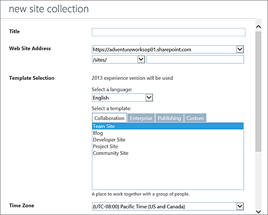

# Create a site collection

This article describes how global admins and SharePoint admins in Office 365 can create sites.
  
For info about creating site collections in SharePoint Server, see [Create a site collection in SharePoint Server](/SharePoint/sites/create-a-site-collection).

## Create a site in the new SharePoint admin center

By using the new SharePoint admin center, you can create sites that use one of the new team site or communication site templates. 
  
1. Sign in to https://admin.microsoft.com as a global or SharePoint admin. (If you see a message that you don't have permission to access the page, you don't have Office 365 administrator permissions in your organization.)
    
    > [!NOTE]
    > If you have Office 365 Germany, sign in at https://portal.office.de. If you have Office 365 operated by 21Vianet (China), sign in at https://login.partner.microsoftonline.cn/. Then select the Admin tile to open the admin center.  
    
2. In the left pane, under **Admin centers**, select **SharePoint**. (You might need to select **Show all** to see the list of admin centers.) 

3. If the classic SharePoint admin center appears, select **Try it now** to open the new SharePoint admin center. 

4. In the left pane of the new SharePoint admin center, select **Active sites**.

5. Select **Create**.

6. Select **Team site** (to create an Office 365 group-connected team site), **Communication site**, or **Other options** (to create a new team site without an Office 365 group, or to create a classic site)

7. Follow the steps to specify a site name, owner, language, and other settings. When you're done, select **Finish**.
    
 
## Create a classic site collection

If you want to create a site that uses a classic template, you can do so directly from the Microsoft 365 admin center. 
  
1. Sign in to https://admin.microsoft.com as a global or SharePoint admin. (If you see a message that you don't have permission to access the page, you don't have Office 365 administrator permissions in your organization.)
    
    > [!NOTE]
    > If you have Office 365 Germany, sign in at https://portal.office.de. If you have Office 365 operated by 21Vianet (China), sign in at https://login.partner.microsoftonline.cn/. Then select the Admin tile to open the admin center.  
    
2. In the left pane, select **Resources** \> **Sites**. (You might need to select **Show all** to see the Resources option.)
    
    
  
3. Select **Add a site**.
    
    
  
    > [!NOTE]
    > If you don't see the options above, under **Admin centers**, select **SharePoint** and then select **New** \> **Private Site Collection**. > 
  
4. Fill out the new site collection properties:
    
    
  
  - In the **Title** box, enter a name for the site collection. 
    
  - In the **Web Site Address** drop-down lists **,** select a domain name and a URL path—either **/sites/** or **/teams/** —and then type a URL name for the site collection. 
    
  - In the **Template Selection** section, in the **Select a language** drop-down list, select a language for the site collection. You can enable the SharePoint multiple language interface on your sites, but the primary language for the site collection will remain the one you select here. 
    
    > [!NOTE]
    > It's important to select the appropriate language for the site collection, because once it's set, it cannot be changed. After creating a site collection, verify the locale and regional settings are accurate. (For example, a site created for Chinese will have its locale set to China.) 
  
  - In the **Template Selection** section, under **Select a template**, choose the template that most closely describes the purpose of your site collection. For example, if your site collection will be used for a team collaboration, choose **Team Site**.
    
    > [!TIP]
    > For more information on templates, see [Using templates to create different kinds of SharePoint sites](https://support.office.com/article/449eccec-ff99-4cf3-b62e-dcfee37e8da4). 
  
  - In the **Time Zone** box, select the time zone that's appropriate for the location of the site collection. 
    
  - In the **Administrator** box, type the user name of your site collection administrator. You can also use the **Check Names** or **Browse** button to find a user to make site collection administrator. 
    
  - In the **Storage Quota** box, type the number of megabytes (MB) you want to allocate to this site collection. Do not exceed the available amount that is displayed next to the box. 
    
  - In the **Server Resource Quota** box, accept the resource quota default. This setting no longer affects the resource amounts available for the site collection. 
    
5. Select **OK**.
    
    The new site collection will appear in the URL list. The URL is the site collection location at which the administrator can start to create and manage sites.
    
## See also

[Enable or disable site collection features](https://support.office.com/article/A2F2A5C2-093D-4897-8B7F-37F86D83DF04)
  
[Introduction to multilingual features](https://support.office.com/article/53411469-53e3-4570-95e2-3651f166174f)

