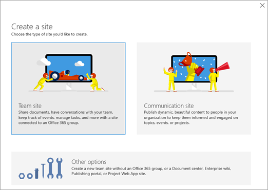

# Create a site

This article describes how global admins and SharePoint admins in Office 365 can create sites (previously called "site collections").
  
For info about creating site collections in SharePoint Server, see [Create a site collection in SharePoint Server](/SharePoint/sites/create-a-site-collection).

## Create a site in the new SharePoint admin center

By using the new SharePoint admin center, you can create sites that use one of the new team site or communication site templates. 
  
1. Go to the [Active sites page of the new SharePoint admin center](https://admin.microsoft.com/sharepoint?page=siteManagement&modern=true) and sign in with an account that has admin permissions for your organization.

>[!NOTE]
>If you have Office 365 Germany, [sign in to the Microsoft 365 admin center](https://go.microsoft.com/fwlink/p/?linkid=848041), then browse to the SharePoint admin center and open the Active sites page.  If you have Office 365 operated by 21Vianet (China), [sign in to the Microsoft 365 admin center](https://go.microsoft.com/fwlink/p/?linkid=850627), then browse to the SharePoint admin center and open the Active sites page.

2. Select **Create**.

    

3. Select **Team site** (to create an Office 365 group-connected team site), **Communication site**, or **Other options** (to create a new team site without an Office 365 group, or to create a classic site).

    

4. Follow the steps to specify a site name, owner, language, and other settings. When you're done, select **Finish**.
 
> [!NOTE]
> If you enter a site name and another site already exists at the default address for that name, the site address will automatically be changed to an available address. For example, if you enter "Marketing" as the site name, and you already have a site at /sites/marketing, the new site will be created at /sites/marketing2. If you want to re-use the URL "marketing" for the new site, you need to [permanently delete the existing site](delete-site-collection.md#permanently-delete-a-site) or [delete the redirect at that address](manage-site-redirects.md). 
    
 
## Create a classic site

We recommend using the new site templates for all your new sites. However, if you need to create a site that uses a classic template, you can do so directly from the Microsoft 365 admin center. 
  
1. Sign in to https://admin.microsoft.com as a global or SharePoint admin. (If you see a message that you don't have permission to access the page, you don't have Office 365 administrator permissions in your organization.)
    
    > [!NOTE]
    > If you have Office 365 Germany, sign in at https://portal.office.de. If you have Office 365 operated by 21Vianet (China), sign in at https://login.partner.microsoftonline.cn/. Then select the Admin tile to open the admin center.  
    
2. In the left pane, select **Resources** \> **Sites**. (You might need to select **Show all** to see the Resources option.)
    
    
  
3. Select **Add a site**.
    
    
  
4. Fill out the properties for the site:
    
    
  
  - In the **Title** box, enter a name for the site. 
    
  - In the **Web Site Address** drop-down lists, select a domain name and a URL path — either **/sites/** or **/teams/** — and then type a URL name for the site. 
    
  - In the **Template Selection** section, in the **Select a language** drop-down list, select a language for the site. You can enable the SharePoint multiple language interface on your sites, but the primary language for the site will remain the one you select here. 
    
    > [!NOTE]
    > It's important to select the appropriate language for the site, because once it's set, it cannot be changed. After creating a site, verify the locale and regional settings are accurate. (For example, a site created for Chinese will have its locale set to China.) 
  
  - In the **Template Selection** section, under **Select a template**, choose the template that most closely describes the purpose of your site. 
    
    > [!TIP]
    > For more information about the classic templates, see [Using templates to create different kinds of SharePoint sites](https://support.office.com/article/449eccec-ff99-4cf3-b62e-dcfee37e8da4). 
  
  - In the **Time Zone** box, select the time zone that's appropriate for the location of the site. 
    
  - In the **Administrator** box, type the user name of the person you want to be the site administrator. You can also use the **Check Names** or **Browse** button to find a user to make site administrator. 
    
  - In the **Storage Quota** box, type the number of megabytes (MB) you want to allocate to this site. Do not exceed the available amount that is displayed next to the box. 
    
  - In the **Server Resource Quota** box, accept the resource quota default. This setting no longer affects the resource amounts available for the site. 
    
5. Select **OK**.
    

    

