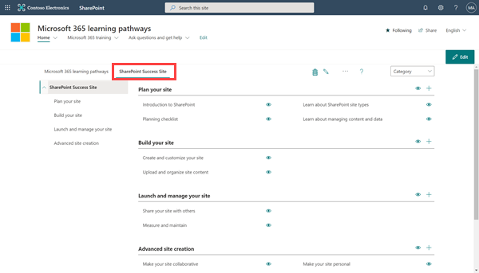
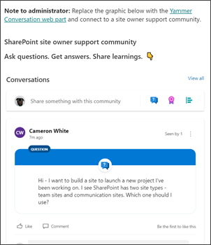
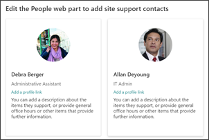

# Customize the SharePoint Success Site 

The SharePoint Success Site is a ready to deploy, up-to-date, and customizable SharePoint communication site that helps your organization maximize the adoption of SharePoint. The SharePoint Success Site helps end users improve the quality and impact of the sites they build for internal audiences, while helping ensure they follow your organization’s site usage guidelines. The SharePoint Success Site is pre-populated with web parts and content to guide your viewers through the most up-to-date site creation training. However, there are opportunities to customize the experience to better suit your organization’s goals and usage policy.

The SharePoint Success Site consists of three parts:

1.	**SharePoint communication site** - The site comes pre-populated with content and web parts that can be further customized to fit the needs of your organization.
2.	**Microsoft 365 learning pathways** - [M365 learning pathways](https://docs.microsoft.com/office365/customlearning/#:~:text=Microsoft%20365%20learning%20pathways%20is%20a%20customizable%2C%20on-demand,adoption%20of%20Microsoft%20365%20services%20in%20your%20organization..) is a solution that enables you to leverage existing content produced by Microsoft, as well as the ability to create and upload your own training playlists.
3.	**Up-to-date SharePoint training content feed** - Content in the SharePoint Success Site is updated by Microsoft as SharePoint evolves and can be customized to align with your organization's site creation policy.

## Before you publish
 
 There are several customization opportunities to align the site content, look, and feel with your organization. Before you publish your site and share it with users, review and customize the following elements:

- Training content in M365 learning pathways 
- The SharePoint Success Site template 
- The Yammer conversation, People, and Forms web parts
- Content in the site usage guidelines page
- Content in the success story page
- Branding details like the site logo and theme
- Navigational elements

#### Summary of site requirements and permissions
Before getting started customizing, ensure that the SharePoint Success Site has been set up by your SharePoint tenant administrator. You need to be a site owner for **both** M365 learning pathways and the SharePoint Success Site in order to have permission to make changes.

If you’re not sure your tenant has the site, contact your SharePoint tenant administrator to verify that the SharePoint Success Site been provisioned and ask for the M365 learning pathways and SharePoint Success Site URLs. If you are the tenant administrator and M365 learning pathways has not been provisioned, see the provisioning guidance.

**Who can provision the SharePoint Success Site?**
 
- Tenant administrator, also known as Office 365 global administrator
- SharePoint Site Collection Administrator with Owner permissions on the site
 

**Who has permissions to customize site template?**
- Site collection administrator
- SharePoint owner or member permissions
 

**Who can create custom playlists and hide/show content in M365 learning pathways?**
- Site collection administrator for M365 learning pathways
- SharePoint owner or member permissions for M365 learning pathways
 

**Who has permissions to use the SharePoint Success Site as a user?**
- Office 365 user permissions/SharePoint Site Visitor permissions or higher

## Get started customizing
Once you confirm the necessary access and permission to customize the site, you are ready to get started with the customization process.
The SharePoint Success Site is hosted in your Microsoft 365 tenant, so you'll need to sign into Microsoft 365 and then navigate to the site. 

##### Sign in
1.	Open your Web browser and navigate to [office.com](https://www.office.com/) or your organization’s sign-in location.
2.	Sign in with your username and password.
3.	Navigate to the location of the site using the URL supplied by your tenant administrator or select SharePoint from the Microsoft 365 Home page, and then select the **SharePoint Success Site**.

### Explore and review the pre-populated training content

Review the Plan, Build, Launch and manage, and Advanced playlist sections to see the full suite of Microsoft curated content available in the SharePoint Success Site.

**Select a topic, and navigate through content using controls at the top of the article**:

Select content categories and subcategories, and then navigate through the playlist to get a sense for how the SharePoint Success Site content is organized and displayed.

### Customize playlist content 

**Show or hide sections to the playlist content**

Select which content to display in your SharePoint Success Site by [hiding and showing](https://docs.microsoft.com/office365/customlearning/custom_hideshowsub) subcategories of content. For example, if you don’t want users to have access to advanced site creation, you can hide that subcategory it won't be visible to users. Decide which content is appropriate for the purpose of your SharePoint Success Site. 

**Add your own custom playlists**

With Microsoft 365 learning pathways, you can [create custom playlists](https://docs.microsoft.com/office365/customlearning/custom_createnewplaylist) that are tailored to the unique needs of your organization. For example, create a playlist for team site integration with Microsoft Teams.

### Customize the look and feel of your site
The following sections of the SharePoint Success Site can be customized to meet your requirements, prior to sharing with end users.There are several different ways you can make the SharePoint Success Site template your own. Customize the following elements of your site to fit the need of your organization:

- Update the SharePoint Success Site [branding](https://support.microsoft.com/office/customize-your-sharepoint-site-320b43e5-b047-4fda-8381-f61e8ac7f59b) to align with your organization
- Customize the [Hero web part](https://support.microsoft.com/office/use-the-hero-web-part-d57f449b-19a0-4b0d-8ce3-be5866430645) 
- [Add web parts](https://support.microsoft.com/office/using-web-parts-on-sharepoint-pages-336e8e92-3e2d-4298-ae01-d404bbe751e0) to your site
- Customize the [site navigation](https://support.microsoft.com/office/customize-the-navigation-on-your-sharepoint-site-3cd61ae7-a9ed-4e1e-bf6d-4655f0bf25ca)
- Customize the [page layout](https://support.microsoft.com/office/add-sections-and-columns-on-a-sharepoint-modern-page-fc491eb4-f733-4825-8fe2-e1ed80bd0899)
- Add [new pages or edit pages](https://support.microsoft.com/office/create-and-use-modern-pages-on-a-sharepoint-site-b3d46deb-27a6-4b1e-87b8-df851e503dec)

### Customize specific web parts

**1. Yammer conversations web part** - Use a Yammer web part to connect new SharePoint site owners with extra support from SharePoint site owners and admins. Connect your Yammer account to the [Yammer conversations web part](https://support.microsoft.com/office/use-a-yammer-web-part-in-sharepoint-online-a53cfa0c-3d09-42c8-a286-1038a81c59da#conversations).

**2. People web part** - Edit the [People web part](https://support.microsoft.com/office/show-people-profiles-on-your-page-with-the-people-web-part-7e52c5f6-2d72-48fa-a9d3-d2750765fa05) to display contact information so new site owner can reach out for help.

**3. Forms web part** - Edit the [Forms web part](https://support.microsoft.com/office/use-the-microsoft-forms-web-part-d4b4d3ce-7860-41e4-8a98-76380efe7256?ui=en-US&rs=en-US&ad=US) to embed a custom form that allows SharePoint site owners to easily share their success stories.

#### Customize the Success stories page
The success stories section is a gallery for organizations to showcase internal SharePoint Online success stories that inspire others in the organization. 

If available, add SharePoint success stories to your portal. If there are no ready-to-publish success stories, consider working with internal partners to create SharePoint successes by building high priority sites that align with business outcomes. Highlighting these “early wins” will help inspire others in the organization on the possibilities for using SharePoint themselves to achieve important business outcomes. 

**Here are some sample questions to consider using in your form:**

- Name of solution 
- Project team members 
- Who is the sponsor of the project? 
- What Microsoft 365 technologies (e.g., SharePoint, Yammer, Stream, Flow) were used as part of the solution? 
- What were the reasons for building the SharePoint site/solution? 
- Provide a description of the solution 
- What impact or results has the SharePoint site/solution generated? 
- What best practices for planning and implementing your solution would you recommend to other who are building their own SharePoint site/solution? 

Learn more about how to [create a form](https://support.microsoft.com/office/create-a-form-with-microsoft-forms-4ffb64cc-7d5d-402f-b82e-b1d49418fd9d) using Microsoft Forms.

### Customize the Site creation guidelines page
To ensure the proper use of SharePoint in your organization it is important to communicate your site usage guidelines to new and existing site owners. This should include guidelines for how people should create sites in your tenant, design standards, and how people should share information using SharePoint and Office 365. 

The example site creation and usage guidelines are not intended to be a final policy document. Once you have created your own unique usage guidelines, remove the content from the Site usage guidelines page and replace it with your organization’s usage guidelines. See how to [create and use modern pages](https://support.microsoft.com/office/create-and-use-modern-pages-on-a-sharepoint-site-b3d46deb-27a6-4b1e-87b8-df851e503dec?ui=en-us&rs=en-us&ad=us) on a SharePoint site. 

Create site usage guidelines that are appropriate for your organization by reviewing our [site usage guidelines checklist](https://docs.microsoft.com/sharepoint/sites-usage-guidelines) that will help you create guidelines that:

- Inspire discussion and consideration amongst your stakeholders on important site usage policies
- Provide links to resources that can help you better understand the options related to key policy decisions
- Provide sample text to get you started in creating your own policies

**Here are some topics to consider as you create your own site creation and usage guidelines:**

- How to get a new SharePoint site
- Guidelines for using site templates
- Site design, branding, and customization
- Rules for sharing and permissions
- Capacity guidelines
- Site lifecycle policy

#### Provide contact information for SharePoint support
If your organization has an intranet team that will be supporting site owners, consider profiling the intranet team members on the SharePoint Success Site homepage using the People web part. 
The home page of the SharePoint Success Site has a [People web part](https://support.microsoft.com/office/show-people-profiles-on-your-page-with-the-people-web-part-7e52c5f6-2d72-48fa-a9d3-d2750765fa05?ui=en-us&rs=en-us&ad=us) you can use to add your own Intranet team. If you will not have a dedicated team supporting site owners, remove the current People web part.

## Share the SharePoint Success Site with end-users
Partner with others in your organization to ensure the SharePoint Success Site is widely known and adopted. 

Key success factors to managing the SharePoint Success Site:

- Celebrate the launch of your SharePoint Success Site
- Create and post news announcing the new resource
- Ensure users have an outlet for questions and feedback
- Plan to review the SharePoint Success site as needed to ensure content and site usage policies are still relevant 
- Build culture and community by integrating a [Yammer web part](https://support.microsoft.com/office/use-a-yammer-web-part-in-sharepoint-online-a53cfa0c-3d09-42c8-a286-1038a81c59da#conversations).
- Integrate and customize your organization’s high-value training content

#### Adoption and awareness strategy

To help build, grow, and sustain your SharePoint adoption efforts, its recommended to [create a SharePoint user group community in Yammer](https://support.microsoft.com/office/create-a-group-in-yammer-b407af4f-9a58-4b12-b43e-afbb1b07c889).  Your SharePoint champions and power users can answer SharePoint related questions posted in the Yammer group and encourage site owners to share their successes and best practices. See the [champions guidance](https://docs.microsoft.com/office365/customlearning/champ_findthem) for more information on how to identify and build a successful champions program. To increase visibility and engagement within your portal champions community, integrate the Yammer group hosting your community into the SharePoint Success Site using the [Yammer conversations web part](https://support.microsoft.com/office/use-a-yammer-web-part-in-sharepoint-online-a53cfa0c-3d09-42c8-a286-1038a81c59da).

	

