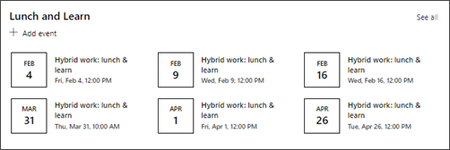
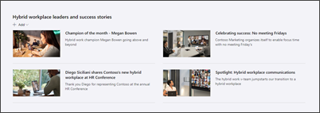
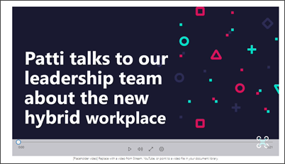

# Guided walkthrough - creating a leadership site for your organization

In this article, we show you elements of an example leadership site to inspire you, and help you learn how to create similar sites for your own organization. In this example, the leadership site provides your organization insight into the goals and priorities of the leadership team. Watch this video to see how it is built, or read the article below.

<!-- daisy put the video here-->

## Let's get started

First, if you haven't already created a Communication site, check out the <!-- daisy bookmark [Create your site] --> section in this article.  If you need to learn how to add sections and web parts, check out the section <!-- daisy bookmark [Add sections and web parts] --> in this article.

Once you have your created your site and know how to edit pages, you can use the steps below to add the elements shown.

## Example leadership site
<!-- daisy image 1-->

**1. Showcase your company branding** Make it yours with a logo and theme. <!-- daisy bkmk -->Learn how

**2. Make your site easy to get around** Customize navigation to make it easy for people to discover important content on your site. <!-- daisy bkmk> Learn how

**3. Focus on priorities** Feature curated content that's a priority for the organization. <!-- daisy -->Learn how

**4. Share timely news** Share the most recent news, like vision statements and blog postings.<!--daisy--> Learn how

**5. Connect to important resources** Link to pages and sites that cover key topics.  <!--daisy-->Learn how

**6. Engage with video**  Add video to keep people updated on the latest talks, updates, and more.<!--daisy--> Learn how

**7. Keep communication fresh** Share recent conversations and comments from your organization.<!--daisy--> Learn how

**8. Engage users with beautiful images** Add more images with text and links to make your page look great and engage users.<!--daisy--> Learn how

**9. Keep everyone up-to-date** Show a calendar of the latest events.<!--daisy--> Learn how

**10. Sign them up** Create a call to action for sign-ups, surveys, or other important actions.<!--daisy--> Learn how

**11. Inspire** Add impact with inspirational or vision-oriented quotes.<!--daisy--> Learn how

## Create your site

To make a site like the one shown here, you'll create a [Communication site](https://support.microsoft.com/office/use-the-sharepoint-topic-showcase-and-blank-communication-site-templates-94a33429-e580-45c3-a090-5512a8070732). To do this, select **Create site** from the SharePoint start page (or, if you're going to associate this site with a Hub site, navigate to the hub site and click Create site there so that the communication site is automatically be associated with that hub site).

<!-- daisy image 2-->

Next, choose **Communication site**, and then the **Blank** layout. Fill out your site name, description, and other information, and select **Finish**.

<!-- daisy image 3-->
For more details, see [Create a communication site in SharePoint Online](https://support.microsoft.com/office/create-a-communication-site-in-sharepoint-7fb44b20-a72f-4d2c-9173-fc8f59ba50eb).
<!-- daisy bookmark -->Back to top

## Showcase your company branding

You can quickly and easily customize the look of your SharePoint site to reflect your professional style and brand.

<!--daisy image 4-->

**Change the look** settings are located under **Settings** <!--daisy settings icon--> in the top right corner of your SharePoint site.

<!--daisy image 5-->

You can select the site theme you want, and even customize it.

<!-- daisy image 6-->

You can change your header layout and logo when you click **Header** under **Change the look**.

<!-- daisy image 7-->

Under Change the look, you can also find options for navigation (cascade or mega menu) and footer options. For more details on changing the look of your site, see [Change the look of your SharePoint site](https://support.microsoft.com/office/change-the-look-of-your-sharepoint-site-06bbadc3-6b04-4a60-9d14-894f6a170818).

<!--daisy bookmark--> Back to top

## Make your site easy to get around

Easily edit the left and top menus to link the page to other SharePoint pages or on the Internet.

<!-- daisy image 8-->

Select **Edit** on the bottom of the left navigation to manage links there, or on the top menu to manage links there. Hover over the location in the menu where you want to add a link, and select +. Then add the type of link you want to add, your website address, and name to display in the navigation bar in the **Add a link** dialog box. Want to reorder your navigation links? Just drag them into the position you want.

For more detailed information on navigation, see [Customize the navigation on your SharePoint site](https://support.microsoft.com/office/customize-the-navigation-on-your-sharepoint-site-3cd61ae7-a9ed-4e1e-bf6d-4655f0bf25ca).

<!-- daisy bookmark -->Back to top

## Add sections and web parts

Sections make up your page, and are you place one or more web parts. While editing the page, each section will show controls to edit the layout, move, or delete the sections.

Start editing by clicking **Edit** on the top right of the page.

<!-- daisy image 9-->

The + symbol before or after a section will add a section using one of several layouts.

<!-- daisy image 10-->

For information on working with sections, see [Add or remove sections and columns on a page](https://support.microsoft.com/en-us/office/add-sections-and-columns-on-a-sharepoint-modern-page-fc491eb4-f733-4825-8fe2-e1ed80bd0899).

To add web parts to sections, select the plus symbol <!--daisy plus symbol--> in a section, which may appear before or after a web part in a section. Then select a web part to use. For more information on all web parts, see [Using web parts on SharePoint pages](https://support.microsoft.com/office/using-web-parts-on-sharepoint-pages-336e8e92-3e2d-4298-ae01-d404bbe751e0).

<!-- daisy image 11-->

Web parts may be edited, moved or deleted within sections. The **Edit web part** icon opens detailed controls unique to each web part type.

<!-- daisy image 12-->

<!-- daisy bookmark -->Back to top

## Focus on priorities with the Hero web part

Let your team know what’s most important with high-impact hero images, company branding, and important news. The initial impact of the Leadership site home page is created by large and eye-catching images of the Hero web part. The layout used in this example is **Three tiles**.

### Hero layout

Editing the web part presents layout options. The **Tiles** option, such as the one shown below, presents layouts for between one and five tiles. The **Layers** option sets each image as a layer with the image next to the title. Up to five layers are possible, so that you can use the web part to fill the entire page.

In this example, the Hero web part is in a full-width section.

Use the **Move item** <!--daisy move item icon--> button on the left to rearrange the tiles within the Hero web part.

<!-- daisy image 13-->

### Customize each tile

When you click a tile, you'll see a toolbar at the bottom of the tile where you can click **Edit details** where you can change the link and image used. With the larger tile, you can also set call to action text and link. On the same toolbar, you can set focal point for the hover animation, plus zoom in and zoom out of the image.

<!-- daisy image 14-->

For more details on using the Hero web part, see [Use the Hero web part](https://support.microsoft.com/en-us/office/use-the-hero-web-part-d57f449b-19a0-4b0d-8ce3-be5866430645).

<!-- daisy bookmark -->Back to top

<!-- daisy you stopped here-->

<!-->

- **New process –** Communicate and manage changes to data security policies, new contract management workflows, or project intake processes.

- **Merger and acquisition –** Onboard new employees and help current employees understand what to expect and how to work together.

- **New systems –** Roll out a new employee benefits program, or help employees adopt new tools and apps.

### Site design is based on a proven change management model

**Phases of change management:**

   

   
 
- **Home page –** Help employees easily understand "what's in it for me?" right away by providing a landing place for employees to learn more right away about why the change is happening and how it will impact their day-to-day work. 
 

- **Hybrid work –** Explain in more detail what is changing and what success will look like when change is adopted and sustained.
 

- **Get started –** Give employees a jumping-off place to dive into messages form leadership, view the change management checklist, and RSVP to an upcoming event.
 

- **Community –** Help recognize and celebrate success within the organization and give employees and opportunity to connect in a change management Yammer community.
 

- **Training –** Embed curated training playlist that can be easily viewed and bookmarked on any device.
 

- **Quick tips –** Create micro-learning opportunities to help employees adopt and sustain new skills.
 

- **A message from our CEO –** Unite the organization around a central change by sharing a recording or written message form leadership endorsing the change project.
 

- **Champions program –** Recruit subject matter experts into your champions program.
 

- **Managers only –** Provide special resources and support that managers may need around the change project that can be audience targeted to a specific security group.
  

- **Get help –** Make sure employees know where to go for support and have more than one option for getting 1:1 help or learning from others. 

## Step 1: Provision the Workplace transformation site template

> [!NOTE]
> -	Tenant administrators’ credentials (or higher) are required to provision a template from the look book
> -	The workplace transformation site will take about 15 minutes to provision 

### Share the site with site owners and members to customize
Once the site has been provisioned and you are ready to customize. If other people from your organization will be making site customizations, make sure you [share the site](https://support.microsoft.com/office/share-a-site-958771a8-d041-4eb8-b51c-afea2eae3658?ui=en-us&rs=en-us&ad=us#:~:text=Share%20a%20Site%20in%20SharePoint%201%20Communication%20sites.,external%20users%22%20to%20share%20the%20...%20See%20More.) add them as site owners and site members to ensure they have access and the right permissions to make edits to site content, theme, navigation, [settings](https://support.microsoft.com/office/change-a-site-s-title-description-logo-and-site-information-settings-8376034d-d0c7-446e-9178-6ab51c58df42), and permissions. 

## Step 2: Customize the Workplace transformation site
Customize the workplace transformation site to fit the needs of your organization’s change management project. Customize the theme, logo, navigation, web parts, and pre-populated content.

> [!NOTE]
> You need site member (or higher) permissions to the Workplace transformation site template in order to make customizations. 

### Sign in 

### Review pre-populated content
The workplace transformation site is full of pre-populated content, web parts, news templates, and a Microsoft list. Carefully review and customize pre-populated content before sharing broadly with end users. 

   

The workplace transformation site features pre-populated content that helps organizations transition to a hybrid workplace. However, the workplace transformation site can be customized for any change management project. [Learn more about the workplace transformation site features and contents](#pre-populated-content-focuses-on-the-hybrid-workplace). 

### Customize web parts and content
Learn how to customize web parts and content that will appear on certain pages or throughout the site.

   

**Text, labels, and buttons -** Edit the labels and links in the [Text web parts](https://support.microsoft.com/office/add-text-and-tables-to-your-page-with-the-text-web-part-729c0aa1-bc0d-41e3-9cde-c60533f2c801#:~:text=%20To%20use%20the%20Text%20web%20part:%20,5%20Use%20s%EF%BB%BF%EF%BB%BFtrikethrough%206%20I%EF%BB%BFndent%20text%20More) and [Call to Action web parts](https://support.microsoft.com/office/use-the-call-to-action-web-part-e9917310-7543-4fc4-8f3f-d78e46074c00) throughout the site.
  

   

**Events-** Add, edit, and delete events in the [Events web parts](https://support.microsoft.com/en-us/office/use-the-events-web-part-5fe4da93-5fa9-4695-b1ee-b0ae4c981909#:~:text=Add%20the%20Events%20web%20part%201%20If%20you're,options%20for%20the%20web%20part.%20More%20items...) on the **Home** and **Get help pages**.
  

   

**News and news post templates -** Use pre-populated news templates to create news posts in the [News web part](https://support.microsoft.com/office/use-the-news-web-part-on-a-sharepoint-page-c2dcee50-f5d7-434b-8cb9-a7feefd9f165#:~:text=%20Use%20the%20News%20web%20part%20on%20a,but%20there%20may%20be%20one%20or...%20More) on the **Community page**. Find the templates by navigating to **Setting > Site Content > Site pages > Templates**.
  

   

**Yammer -** Replace the graphic and connect the [Yammer conversations web part](https://support.microsoft.com/office/use-a-yammer-web-part-in-sharepoint-online-a53cfa0c-3d09-42c8-a286-1038a81c59da#conversations) on the **Community** page with an existing Yammer community.
 

   

**People -** Edit [People web parts](https://support.microsoft.com/office/show-people-profiles-on-your-page-with-the-people-web-part-7e52c5f6-2d72-48fa-a9d3-d2750765fa05) in news post templates and on the **Get help** page.
 

   

**Video -** Edit the [Embed web part](https://support.microsoft.com/office/add-content-to-your-page-using-the-embed-web-part-721f3b2f-437f-45ef-ac4e-df29dba74de8) on the **Message from our CEO** page to point to a YouTube video or an intranet video link. Use the [Stream web part](https://support.microsoft.com/office/use-the-stream-web-part-b97fa87c-1337-4271-a059-17f0d2b26e8b#:~:text=The%20Stream%20web%20part%20will%20display%20a%20Stream,and%20DoD%20or%20Office%20365%20operated%20by%2021Vianet.) to display an existing Stream video.
 

#### Use Microsoft Forms to facilitate news post requests 

   

Edit the [Button web part](https://support.microsoft.com/office/use-the-button-web-part-d2e37c48-11e8-45b9-8d9e-abdaa97c2a7a#:~:text=%20Add%20the%20Button%20web%20part%20%201,pane%20on%20the%20right,%20enter%20your...%20More) on bottom of the **Community** page to give users an opportunity to engage and acknowledge others. Connect the Button web part to a [Microsoft Form](https://support.microsoft.com/office/create-a-form-with-microsoft-forms-4ffb64cc-7d5d-402f-b82e-b1d49418fd9d.) where users can submit nominations. Then, use the pre-populated news post templates in **Settings > Site contents** to publish news. 
 

#### Edit the change management checklist
The Workplace transformation site contains a [Microsoft List](https://support.microsoft.com/office/get-started-with-microsoft-lists-10b12560-fb20-471e-9258-773aec6a4a2f?ui=en-US&rs=en-US&ad=US) in **Site contents** that is displayed in a [List web part](https://support.microsoft.com/office/use-the-list-web-part-ef0a1b80-f8b3-443d-b04a-1e76c70b5537) on the **Get started page**. This list is intended to give end users a high-level view of what to expect through the change management journey. Edit the list to meet the need of your change management project. 

   

[Learn more about M365 lists](https://support.microsoft.com/office/get-started-with-microsoft-lists-10b12560-fb20-471e-9258-773aec6a4a2f?ui=en-US&rs=en-US&ad=US).

#### Use Microsoft 365 learning pathways to embed training content on a page
If your tenant admin has set up [M365 Learning pathways](/office365/customlearning/custom_plancontent), you can [add pages to the site](https://support.microsoft.com/office/create-and-use-modern-pages-on-a-sharepoint-site-b3d46deb-27a6-4b1e-87b8-df851e503dec) and use the [Learning pathways web part](/office365/customlearning/custom_addwebpart) to display custom training playlists. Then, use [Learning pathways reporting capabilities](/office365/customlearning/custom_measureimpact) to measure content impact.
 

#### Use tools to help target content to specific audiences or protect content from specific audiences
Consider using [audience targeting](https://support.microsoft.com/office/target-content-to-a-specific-audience-on-a-sharepoint-site-68113d1b-be99-4d4c-a61c-73b087f48a81) to surface important content to specific groups or use [information barriers](https://support.microsoft.com/office/associate-information-segments-with-sharepoint-sites-2b03db07-6d3f-4297-a388-b943317a26a7#:~:text=%20Associate%20segments%20with%20a%20SharePoint%20site%20,10%20segments,%20and%20then%20select%20Save.%20More) to protect sensitive information that may appear in the **Managers** section under **Resources**. 

#### Update the site theme and branding
Edit the look of your site to align with your organization's brand. Customize the site display name, logo, theme, header layout, navigation style, and more in the [Change the look panel](https://support.microsoft.com/office/customize-your-sharepoint-site-320b43e5-b047-4fda-8381-f61e8ac7f59b?ui=en-US&rs=en-US&ad=US).

#### Customize site navigation
Site navigation is important because it helps users immediately understand what can be accomplished on a given site. The most effective SharePoint sites help viewers find what they need quickly so that they can use the information to make decisions, learn about what is going on, access the tools they need, or engage with colleagues to help solve a problem. [Learn how to edit site navigation](https://support.microsoft.com/office/customize-the-navigation-on-your-sharepoint-site-3cd61ae7-a9ed-4e1e-bf6d-4655f0bf25ca?ui=en-US&rs=en-US&ad=US).
