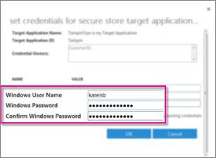
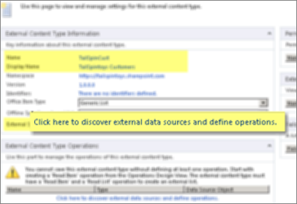
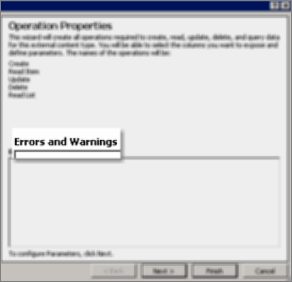
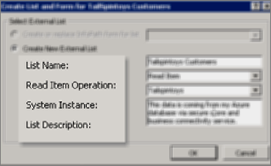

# Make an External List from a SQL Azure table with Business Connectivity Services and Secure Store

As a SharePoint Online Administrator, you can use services in SharePoint Online to access data from a Microsoft SQL Azure database. Because SQL Azure is a cloud-based relational database technology, this means the connection works completely in the cloud. This article describes how to use SharePoint technologies to access data from a SQL Azure database without having to write code.
  
To use data from a SQL Azure database, you have to create an External List by using Business Connectivity Services (BCS) and Secure Store. BCS connects SharePoint solutions to external data, and Secure Store enables user authentication for the data. By using an External List, you can display the contents of a table from SQL Azure in SharePoint Online. Users can read, edit, and update the data, all in SharePoint Online. 
  
For more information about how to use BCS to use external data, see [Introduction to external data](https://support.office.com/article/676e60e7-d99f-463f-a173-65e9d63538c0).
  
SQL Azure databases are cloud-based relational databases that are created by using SQL Server technology. To learn how to get started with these databases, see [Getting Started with Microsoft Azure SQL Database Using the Microsoft Azure Platform Management Portal](https://social.technet.microsoft.com/wiki/contents/articles/1884.getting-started-with-windows-azure-sql-database-using-the-windows-azure-platform-management-portal.aspx)
  
## Overview of steps in the process

To create an External List that enables you to access data from SQL Azure, you have to complete a sequence of separate steps. 
  
The following table lists the steps and the required software for that step.
  
|**What to do:**|**Where to do it:**|
|:-----|:-----|
|Step 1: Set permissions on the BCS Metadata Store    |SharePoint admin center (in SharePoint Online)    |
|Step 2: Create a Secure Store Mapping    |SharePoint admin center (in SharePoint Online)    |
|Step 3: Create an External Content Type (ECT)    |SharePoint Designer 2010 OR Visual Studio    |
|Step 4: Create an External List    |SharePoint admin center (SharePoint Online)    |
|Step 5: Grant permissions to manage your ECT    |SharePoint admin center (SharePoint Online)    |
   
## How BCS and Secure Store work together

Business Connectivity Services (BCS) connects to data in an external data store. You can display the data in an External List, and maintain the data elsewhere. BCS enables you to connect SharePoint solutions to two kinds of resources:
  
- A SQL Azure database
    
- A WCF web service that acts as an end-point for some other kind of data store 
    
In SharePoint Online, BCS enables you to access an external data source by using the Secure Store. Secure Store keeps encrypted copies of credentials. It enables a SharePoint Online admin to associate a SharePoint group that uses a single SQL Azure account that can access the target database. When a SharePoint user browses the data in the External List, Secure Store uses the associated SQL Azure account to request the data from SQL.
  
To make this possible, a SharePoint Online admin defines an External Content Type (ECT) in SharePoint Designer or in Visual Studio. Then, someone with appropriate permissions creates an External List on a SharePoint Online site by referencing the ECT. Users who have appropriate permission can view or update the list. 
  
> [!NOTE]
> SharePoint Online doesn't support offline use of external lists **.**
  
This illustration shows how the connections between the different elements occur:
  
The following list describes the steps in the connectivity process. Each step in this list corresponds to a number in the previous diagram.
  
1. The user logs on to SharePoint Online and opens an External List. The Business Data Connectivity (BDC) service in SharePoint Online queries External Content Type for that list in the BDC metadata store that contains the list. The query asks for the following information: how to access the external system, which operations are supported, and what credentials to use. 
    
2. The BDC service runtime sends the request (SOAP over HTTP) to the endpoint of the SQL Azure Windows Communication Foundation (WCF) service.
    
3. The SQL Azure service returns the data in a SOAP envelope.
    
4. The SharePoint Online site displays the external list in the user's browser. The user can then perform all the configured operations on the data source for which the user has permissions.
    
## Step 1: Set permissions on the BCS Metadata store

To do this step, follow the procedure in [Set permissions on the BCS Metadata Store for a Business Connectivity Services on-premises solution in SharePoint 2013](https://technet.microsoft.com/en-us/library/jj683106.aspx).
  
When you finish the steps in that procedure, return to this page and start Step 2: Create a Secure Store credentials mapping.
  
## Step 2: Create a Secure Store credentials mapping

Typically, when you create a credentials mapping in Secure Store, you map multiple SharePoint users to a single SQL Azure account. You might use a SharePoint group, or just list all the user names. The SQL Azure account has appropriate permissions to access the target database table. The database that you target in SQL Azure is known as the Secure Store Target Application, or just the Target Application. 
  
> [!TIP]
>  Make sure that you have SQL Azure credentials ready. You'll use these credentials when you create the mapping between SharePoint users and a SQL Azure account. 
  
### Create the Secure Store Target Application

To create a Secure Store Target Application, follow these steps.
  
1. Browse to the URL of the SharePoint admin center in SharePoint Online.
    
2. Click **secure store**.
    
3. In the ribbon, click **New** to open the page where you can specify settings for a Target Application. 
    
4. In the **Target Application Settings** section, do the following: 
    
  - Under **Target Application ID**, specify a value for a unique ID. This ID maps the External Content type to credentials that are required to authenticate the user. You cannot change the Target Application ID once you create the Target Application.
    
  - Under **Display Name**, specify a user-friendly name for referring to the Target Application.
    
  - Under **Contact E-mail**, specify the e-mail address that you want people to use when they have a question about the Target Application (external data system).
    
  - Under **Target Application Type**, verify that the value is set to **Group Restricted**. Group Restricted means that the Secure Store contains a mapping that connects a group of SharePoint users to a single, external data account that can act on their behalf. In addition, a Group Restricted application type is restricted to the specified external data system.
    
5. In **Credential Fields** section, enter the field names that you want to use for the user name and password of the external data system. By default, the Secure Store uses the **Windows User Name** and **Windows Password**. We recommend that you accept these values. You cannot edit these Field Types after you finish creating the application.
    
    
  
6. In the **Target Application Administrators** section, in the **Target Application Administrators** field, enter the name of a group or a list of users who can edit this Target Application. You can also search for the name of a group in Microsoft Online Directory Server. Typically, this section usually contains the name of the SharePoint Online admin, or a global administrator. 
    
7. In the **Members** section, in the **Members** field enter the name of the group that will use the Target Application. Generally, this is a group from the Microsoft Online Directory Service (MSODS). 
  
     If you are a global administrator, you can create groups in MSODS in the Office 365 admin center. 
    
8. Click **OK** to create the Target Application and return to the Secure Store Service page. 
    
### Store credentials for the Target Application

After you create the Target Application, you are ready to enter the credentials that Secure Store uses to access the external data. To set the credentials, follow these steps
  
1. In the SharePoint admin center, click **secure store**
    
2. Click the arrow next to the new Target Application and then select **Set Credentials**. 
    
3. In the **Set Credentials for Secure Store Target Applications (Group)** dialog box, enter the user name and password of the account. The account must have access to the target database. In the following illustration, the user name is **Windows User Name** and the password is **Windows Password**.
    
    > [!IMPORTANT]
    >  Keep a secure record of this information. After you set these credentials, an administrator cannot retrieve them. 
  
    
  
## Step 3: Create the External Content Type

You can create an External Content Type (ECT) by using Microsoft Visual Studio, or by using Microsoft SharePoint Designer 2010. This procedure describes how to create an ECT in SharePoint Designer 2010. Microsoft SharePoint Designer 2010 is available as a [free download](https://www.microsoft.com/download/en/details.aspx?id=16573) from the Microsoft Download Center. 
  
You should be a SharePoint Online admin or a Global admin to perform this task.
  
To create an ECT, follow these steps.
  
1. Start Microsoft SharePoint Designer.
    
2. Click the **Open Site** button to open the SharePoint Online team site at the root collection. The URL for the root collection will resemble this example URL: https://tailspintoys.sharepoint.com. SharePoint Online might display a prompt for valid credentials. 
    
    > [!NOTE]
    >  If SharePoint displays a prompt for you to add a new user, ensure the user account you use has sufficient permissions. The user account must be able to make and test BCS changes to the SharePoint Online site. Typically, the SharePoint Online admin or Global admin should perform these steps. > If you want to change to a different user, click **Add a new user**, click **Personal** or **Organization**, and then log on to the site as the SharePoint Online admin or Global admin, and **Sign In**. 
  
3. After the site opens, in the **Site Objects** tree on the left of the application window, click **External Content Types**.
    
4. Select the **External Content Types** tab and then, in the ribbon, click **External Content Type**, to begin the creation process.
    
5. In the **External Content Type Information** section of the page, change the **Name** and **Display Name**. Make certain that the **Name** is descriptive. The **Display Name** is a friendly name for the ECT. 
    
6. Select the hyperlink **Click here to discover external data sources and define operations** to open the Operation Designer page. 
  
7. Click **Add Connection** to open the **External Data Source Type Selection** dialog box. 
    
8. Select **SQL Server** to access the SQL Azure database. 
    
    
  
    > [!NOTE]
    >  .You cannot use on-premise data sources, such as .NET Type, with SharePoint Online. In addition, you cannot use a SQL Server data source that is on-premise with SharePoint Online. 
  
9. When you select SQL Server, specify the following:
    
  - **Database Server name**
    
  - **Database Name**
    
  - **Name**
    
    > [!IMPORTANT]
    >  The URL you use to access the database contains the Fully Qualified Server Name. For example, if you access the database via https://aaapbj1mtc.database.windows.net your Fully Qualified Server Name is **aaapbj1mtc.database.windows.net**. > If you log on at a higher level, such as the Management Portal for Microsoft Azure, you can discover the Fully Qualified Server Name. On the portal page, under **Subscriptions**, click the name of your subscription. Then, under **Fully Qualified Server Name**, expand your subscription and the server name. Names of databases appear under each server name. 
  
    
  
    In the **SQL Server Connection** dialog box, select **Connect with Impersonated Custom Identity**. Then, in the **Secure Store Application ID** text box, type the Secure Store Application ID that stores credentials for the target database and then click **OK**.
    
10. If you see a prompt for credentials to access the external data source, enter the correct **User name** and **Password** credentials to access the external data system. Then, click **OK** to connect. 
    
    The **Data Source Explorer** tab, you can view a list of tables that are available from the SQL Azure database. To see a list of possible operations for this table, open the shortcut menu for the table. 
    
    You can select specific options such as New Read Item Operation and New Update Operation for the table. Or, you can just select **Create All Operations**.
    
    
  
11. Click **Create All Operations** to open a wizard, and then click **Next**.
    
    On the **Operation Properties** page of the wizard, in the **Errors and Warnings** pane, read about any issues. It is important to resolve reported issues that you see. For example, you may have to choose a field to show in an external item picker control. For a customer table, you could choose the customer name. 
    
    
  
    > [!IMPORTANT]
    >  The wizard may display a warning message if unique, required fields, such as 'CustomerID', exist in the target table. This is valid if the specified field is required and unique in the table, such as a primary key. 
  
    
  
    > [!NOTE]
    >  For more information about how to define filters in external content types, see [How to: Define filters for External Item Picker controls](https://msdn.microsoft.com/en-us/library/ff798274%28v=office.14%29.aspx) . 
  
12. Select **Finish** to accept the operations properties that you configured. SharePoint Designer displays the operations as a list of ECT Operations. 
    
When this step is complete, you are ready to create an External List to use the data from the external source.
  
## Step 4: Create an External List

You can create an External List by using SharePoint Designer, or by adding an External List as an app on the SharePoint Online team site. This procedure describes how to create an External List from the team site in SharePoint Online.
  
### Create an External List by using SharePoint Online

1. Go to the home page of the SharePoint Online team site.
    
2. Click **Settings** > **Add an app**.
    
3. On the **Your Apps** page, type **External List** in the search dialog box, and search. 
    
4. Double-click the External List tile to open the **Adding External List** dialog box. 
    
5. In the **Name** box, enter a name for the list. 
    
6. In the **External Content Type** box, enter the name that you want to use. For example, you might use the name of the ECT that you created in SharePoint Designer. Alternatively, you can click the database icon to browse for the name of an ECT. 
    
7. Click **Create**,
    
### Create an External List by Using SharePoint Designer 2010

1. In SharePoint Designer 2010, on the ribbon, click **Create Lists and Forms**.
    
     SharePoint Designer might display a message that states, "Creating lists and forms requires the external content type to be saved". Click **Yes** to save the ECT. 
    
    In the **Create List and Forms for databasename Customers** dialog, type a meaningful name for the External List in the **List Name** text box. For example, if you created an ECT for the "Customers" database table, you might use "Tailspintoys Customers" in the list name. 
    
2. Select a **Read Item Operation** from the list of Operations. 
    
3. Enter the name of the SQL Azure database in the **System Instance** text box. 
    
    
  
4. Click **OK** and then **Save** to create the External List in the SharePoint Online site. 
    
## Step 5: Grant permissions to manage the ECT

To finish setting up the External List, you have to grant permissions to the people who will use the list. To grant permissions, follow these steps.
  
1. Go to the SharePoint admin center, and then click **bcs**.
    
2. Select **Manage BDC Models and External Content Types**. 
    
3. Select the check box next to the name of the ECT that you just created, and then click the **Set Object Permissions**. 
    
    > [!IMPORTANT]
    >  You must manually assign permissions to manage the ECT to a SharePoint Online admin or Global admin with the ** Set Object Permissions ** command. If you do not assign these permissions explicitly, the admins won't have permission to manage the ECT. 
  
    
  
4. In the **set object permissions** dialog, select the check boxes for all the permissions (( **Edit, Execute, Selectable in Clients, and Set Permissions**) that the SharePoint Online admin needs. 
    
    > [!NOTE]
    >  Make sure that at least one user or group has **Set Permissions** rights. If you don't assign someone this right, you might create an unmanageable BCS connection. 
  
    
  
5. Select **Propagate permissions to all methods of this external content type**. Doing this overwrites any existing permissions. 
    
    > [!NOTE]
    >  If you want to add a group that can use the External Lists, you must also give the group **Execute** rights. That enables users in the group to run a query to the external source, and view the results in SharePoint. 
  

