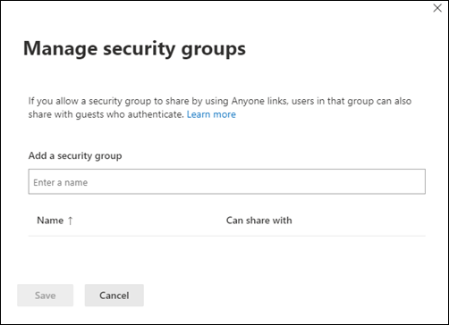

# Manage security groups

As a SharePoint or global admin in Microsoft 365, you restrict external sharing of SharePoint and OneDrive content so that only users in specific security groups can share externally.
  
1. Go to the [Sharing page of the new SharePoint admin center](https://admin.microsoft.com/sharepoint?page=sharing&modern=true), and sign in with an account that has [admin permissions](./sharepoint-admin-role.md) for your organization.

2. Under **External sharing**, expand **More external sharing settings**.

3. Select **Allow only users in specific security groups to share externally**, and then select **Manage security groups**.

    

4. In the **Add a security group** box, enter a name for a security group (Note that Microsoft 365 Groups are not supported). The security group box appears.

5. Next to the security group name, from the **Can share with** dropdown, select either:

    - **Authenticated guests only** (default)
    - **Anyone**

6. Select **Save**.

By selecting **Anyone**, users in that security group can share links to files and folders externally that don’t require users to authenticate (for example, the **Anyone link** in the **Share** dialog box). Forwarded **Anyone links** will work internally or externally, but you can't track who has access to shared items or who has accessed shared items. Users in this group can also share to authenticated guest users. This option is best for a security group preferring friction-free sharing, provided files and folders in SharePoint and OneDrive aren’t classified as sensitive.

By selecting **Authenticated guests only**, sharing externally is strictly limited to those guests who authenticate. This option is best for sharing sensitive or proprietary information because it requires guests to verify their identity before they can access the file or folder. Authenticated guests can share with another authenticated guest, but can't forward these links.
