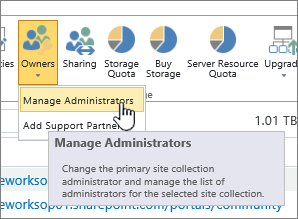

# Manage site admins

This article describes how global admins and SharePoint admins in Office 365 can add and remove site admins (previously called "site collection admins"). If you're an owner of a communication site, or a site that belongs to an Office 365 group, see [Manage your SharePoint site settings](https://support.office.com/article/8376034d-d0c7-446e-9178-6ab51c58df42#__BKMKMngSitePermissions) for info about giving people access to your site. If you're a an admin for a classic site, see [Manage your SharePoint site settings](https://support.office.com/article/8376034d-d0c7-446e-9178-6ab51c58df42#id0eaabaaa=server). 
  
> [!NOTE]
> If you're a global admin and want info about assigning other users the SharePoint admin role in Office 365, see [Assigning admin permissions](/office365/admin/add-users/assign-admin-roles). 
  
## Add or remove site admins in the new SharePoint admin center

By using the new SharePoint admin center, you can change the owners for sites that use the new team site and communication site templates. You can also add and remove group members in the Microsoft 365 admin center. For info, see [Add or remove members from Office 365 groups](/office365/admin/create-groups/add-or-remove-members-from-groups). 
  
1. Sign in to https://admin.microsoft.com as a global or SharePoint admin. (If you see a message that you don't have permission to access the page, you don't have Office 365 administrator permissions in your organization.)
    
    > [!NOTE]
    > If you have Office 365 Germany, sign in at https://portal.office.de. If you have Office 365 operated by 21Vianet (China), sign in at https://login.partner.microsoftonline.cn/. Then select the Admin tile to open the admin center.  
    
2. In the left pane, under **Admin centers**, select **SharePoint**. (You might need to select **Show all** to see the list of admin centers.)
    
3. If the classic SharePoint admin center appears, select **Try it now** to open the new SharePoint admin center. 

4. In the left pane of the new SharePoint admin center, select **Active sites**.

5. In the left column, click to select a site.
  
6. Select **Owners**. For a group-connected team site, you can add and remove group owners. For other sites, you can change the primary admin and add and remove other admins. Note that if you remove a person as a primary admin, they will still be listed as an additional admin.

  

## Add or remove site collection admins in the classic SharePoint admin center

To add or remove site collection admins on classic sites, you can use the classic SharePoint admin center:
  
1. Sign in to https://admin.microsoft.com as a global or SharePoint admin. (If you see a message that you don't have permission to access the page, you don't have Office 365 administrator permissions in your organization.)
    
    > [!NOTE]
    > If you have Office 365 Germany, sign in at https://portal.office.de. If you have Office 365 operated by 21Vianet (China), sign in at https://login.partner.microsoftonline.cn/. Then select the Admin tile to open the admin center.  
    
2. In the left pane, under **Admin centers**, select **SharePoint**. (You might need to select **Show all** to see the list of admin centers.) If this opens the new SharePoint admin center, select **Classic SharePoint admin center** in the left pane.
    
3. Point to the site collection for which you want to change the administrators, and then select the check box in front of it. 
    
    
  
4. Select **Owners**, and then select **Manage Administrators**.
    
    
  
5. Change the name in the **Primary Site Collection Administrator** box, or add or remove names in the **Site Collection Administrators** box. 
    
    
  
6. Select **Check Names** to verify that the user names are valid. 
    
7. Select **OK**.
    

