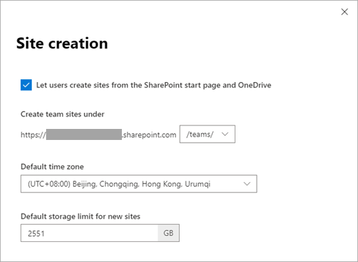

# Manage site creation in SharePoint

As a global or SharePoint admin in Office 365, you can let your users create and administer their own SharePoint sites, determine what kind of sites they can create, and specify the location of the sites. By default, users can create communication sites and [Office 365 group-connected team sites](https://support.office.com/article/b565caa1-5c40-40ef-9915-60fdb2d97fa2).
  
>[!NOTE]
>Disabling site creation for users does not remove their ability to create Office 365 groups or resources, such as Microsoft Teams, which rely on a group. When an Office 365 group is created, a SharePoint site is also created. To restrict creation of Office 365 groups and the resources that rely on groups see [Manage who can create Office 365 Groups](/office365/admin/create-groups/manage-creation-of-groups).  Some functionality is introduced gradually to organizations that have opted in to the [Targeted release option in Office 365](/office365/admin/manage/release-options-in-office-365). This means that you might not yet see some features described in this article, or they might look different.
  
## Manage site creation in the new SharePoint admin center

1. Go to the [Settings page of the new SharePoint admin center](https://admin.microsoft.com/sharepoint?page=settings&modern=true) and sign in with an account that has [admin permissions](/sharepoint/sharepoint-admin-role)
 for your organization.

>[!NOTE]
>If you have Office 365 Germany, [sign in to the Microsoft 365 admin center](https://go.microsoft.com/fwlink/p/?linkid=848041), then browse to the SharePoint admin center and open the Settings page.  If you have Office 365 operated by 21Vianet (China), [sign in to the Microsoft 365 admin center](https://go.microsoft.com/fwlink/p/?linkid=850627), then browse to the SharePoint admin center and open the Settings page.
    
2. Select **Site creation**.

    

3. Select **Let users create sites from the SharePoint start page and OneDrive** if you want users to be able to create sites from these services.

    > [!NOTE]
    > Even if you clear this check box, users may be able to create Office 365 groups from other places in Office 365. Each group always comes with a team site. [Learn how to manage who can create Office 365 groups](/office365/admin/create-groups/manage-creation-of-groups)

4. Select to create Office 365 group-connected team sites under /sites or /teams, select the default time zone and storage limit for new sites.

5. Select **Save**.
 
## Manage detailed site and subsite creation settings in the classic SharePoint admin center

1.  In the left pane of the new SharePoint admin center, select **Settings**. At the bottom of the page, select **classic settings page**.  
    
2. Under **Site Creation**, select to show or hide the Create site command.
    
3. If you select **Show the Create site command**, specify the type of site that users can create.
    
    
  
    - **A new team site or communication site**: Select to create the group-connected team sites under (/sites or /teams) and whether a secondary contact is required. To let users create sites from a custom form you've created, enter its URL in the **Use the form at this URL** box. When users select which type of site they want to create, they'll be able to access the form by clicking "See other options." 
    
    - **A classic team subsite**: Use this option to allow users to create only default classic sites or sites from your custom form. Specify where sites are created, and whether a site classification or secondary contact is required. To specify a custom form, enter the URL for the custom form in the **Use the form at this URL** box. 
    
    > [!NOTE]
    > For info about classifying Office 365 groups, see [Manage Office 365 Groups with PowerShell](/office365/enterprise/manage-office-365-groups-with-powershell).
  
4. Under **Subsite creation**, specify whether users can select **New** > **Subsite** on the Site contents page to create a new subsite. 

5. Select **OK**.
