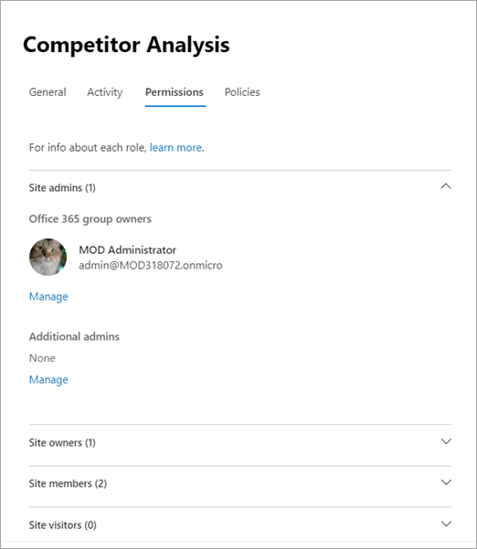
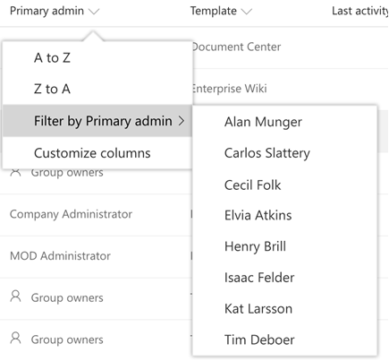

# Manage sites in the new SharePoint admin center

The [Active sites page](https://admin.microsoft.com/sharepoint?page=siteManagement&modern=true) of the new SharePoint admin center lets you view the SharePoint sites in your organization (including the new communication sites and sites that belong to Microsoft 365 groups). It also lets you sort and filter sites, search for a site, and create new sites.
  

  
> [!NOTE]
> The Active sites page lists the root website for each site collection. Subsites, redirect sites (REDIRECTSITE#0) created by changing a site address or replacing the root site, and Microsoft Teams private channel sites (TEAMCHANNEL#0) aren't included in the list.  Some functionality is introduced gradually to organizations that have opted in to the [Targeted release option in Microsoft 365](/office365/admin/manage/release-options-in-office-365). This means that you might not yet see some features described in this article, or they might look different. 
 
For more info about managing sites and storage, see:

- [Create a site](create-site-collection.md)  
- [Delete a site](delete-site-collection.md)
- [Manage site storage limits](manage-site-collection-storage-limits.md)
  
## Add or remove site admins and group owners

  
1. In the left column, select a site. 
    
2. Select **Permissions**. For a group-connected team site, you can add and remove group owners and additional site admins. For other sites, you can add and remove site admins and change the primary admin. Note that if you remove a person as a primary admin, they will still be listed as an additional admin. For info about each role, see [About site permissions](site-permissions.md). 
    
## Change a site's hub association

  
1. In the left column, select a site. 
    
2. Select **Hub**. The options that appear depend on whether the site you selected is registered as a hub site, or associated with a hub. The Hub menu lets you register a site as a hub site, associate it with a hub, change its hub association, and unregister it as a hub site. [More info about hubs](planning-hub-sites.md) 

## Change the external sharing setting for a site

  
1. In the left column, select a site.
    
2. Select **Sharing**.
    
3. Select an option, and then select **Save**. For info about the options, see [Turn external sharing on or off for for a site](change-external-sharing-site.md).
    
    > [!NOTE]
    > The options that are available depend on the organization-wide setting you've selected. The setting for a site can be more restrictive, but not more permissive. 

## View site details

For more info about a site, select the site name to open the details panel.
  

  
To view site activity including the number of files stored and storage usage, select the **Activity** tab. Activity information is not available for Office 365 Germany customers and US Government GCC High and DoD customers.
  
To view site admins, owners, members, and visitors, select the **Permissions** tab.

  
For info about the roles in this panel, see [About site permissions](site-permissions.md).
    
## Sort and filter the site list

Sorting and filtering the site list is just like sorting and filtering other lists in SharePoint.
  
1. Select the arrow next to the column header.
    
2. Select how you want to arrange the items. The options vary depending on the column. For example, you might have options to sort alphabetically, in numeric order, or chronologically.
    
    If the column allows filtering, a "Filter by" option appears. Select the value or values that you want to show. Your selections appear with a check mark beside them. To remove a selection, select that value again. To clear all filters on the column, select **Clear filters**.
    
    

## Customize columns

1. Select the arrow next to any column header, and then select **Customize columns**.
    
2. To show and hide columns, select and clear check boxes.
    
3. To rearrange the columns, point to a column, and select the up or down arrow to move the column up or down.
    
    
    
    > [!NOTE]
    > Data in the following columns is not available for Office 365 Germany customers and US Government GCC High and DoD customers:
    > - Last activity
    > - File views or edited
    > - Page views
    > - Page visits
    > - Files
    > - Storage used
  
## Switch views and create custom views

The new SharePoint admin center comes with a few built-in views: Microsoft 365 group sites, Sites without a group, Largest sites, Least active sites, and Most popular shared sites. You can also create and save custom views.
  
1. Customize columns, sort, and filter your view the way you want. (Views that are filtered through search can't be saved.)
    
2. On the far right of the command bar, next to the Search box, select the **View** menu (the name changes depending on your current view).

    
    
3. Select **Save view as**.
    
4. In the **Save as** dialog box, enter a name for the view. 
    
    > [!NOTE]
    > To set the view as default, in the **View** box, select **Set current view as default**. 
  
  
## Search for a site

You can search for a site by name, URL, primary admin, or template. To do this, enter keywords in the Search box, and press Enter.

> [!NOTE] 
> Search doesn't look in hub site display names for the keywords you enter.  All characters you enter are treated as part of the query. Search doesn't recognize operators or wildcards (*). 
  
## Export to CSV

To export the site list you're viewing as a .csv file that you can work with in Excel, select **Export**.
  
> [!NOTE]
> The .csv file lists the hub as a GUID and the template as an ID (for example, STS#0).
  

