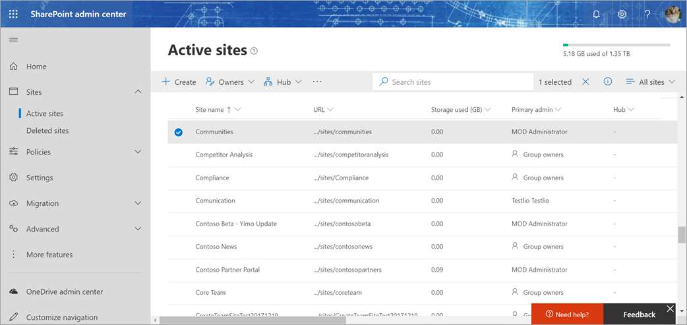
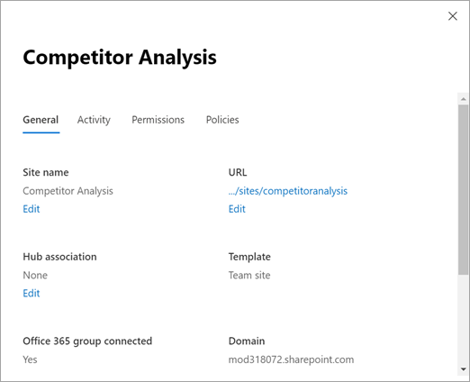
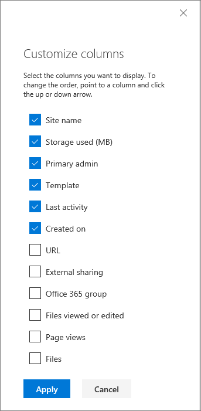

# Manage sites in the new SharePoint admin center

The Active sites page of the new SharePoint admin center (preview) lets you view the SharePoint sites in your organization (including the new communication sites and sites that belong to Office 365 groups). It also lets you sort and filter sites, search for a site, and create new sites.
  

  
> [!NOTE]
> The Active sites page lists the root website for each site collection. Subsites aren't included in the list.  Some functionality is introduced gradually to organizations that have opted in to the [Targeted release option in Office 365](/office365/admin/manage/release-options-in-office-365). This means that you may not yet see this feature or it may look different than what is described in this article. 
  
To manage sites in the new SharePoint admin center, go to the current SharePoint admin center, click "Try it now" in the upper right, and then select **Active sites**. For info about the new SharePoint admin center, see [Get started with the new SharePoint admin center](get-started-new-admin-center.md).
  
## Create a site

  
1. Click **Create**.
    
2. Select to create a team site (which will create an Office 365 group) or a communication site. To create a site site that uses a classic template, or to create a new team site that doesn't include an Office 365 group, click **Other options**. For info about the new site templates, see [Create a team site in SharePoint Online](https://support.office.com/article/ef10c1e7-15f3-42a3-98aa-b5972711777d) and [Create a communication site in SharePoint Online](https://support.office.com/article/7fb44b20-a72f-4d2c-9173-fc8f59ba50eb).
    
    
  
## Delete a site

Global admins and SharePoint admins can now delete sites that belong to an Office 365 group. Deleting these sites will delete the group and all its resources, including the Outlook mailbox and calendar, and any Teams channels. 
  
1. In the left column, click to select a site.
    
2. Click **Delete**, and then click **Delete** to confirm. 
    
You can recover deleted sites for 93 days. For more info, see [View and restore deleted sites](view-and-restore-deleted-sites-in-new-admin-center.md). Note that deleted groups must be restored within 30 days.
  
## Add or remove owners

  
1. In the left column, click to select a site. 
    
2. Click **Owners**. For a group-connected team site, you can add and remove group owners. For other sites, you can change the primary admin and add and remove other admins. Note that if you remove a person as a primary admin, they will still be listed as an additional admin. 
    
## Change a site's hub site association

  
1. In the left column, click to select a site. 
    
2. Click **Hub site**. The options that appear depend on whether the site you selected is registered as a hub site, or associated with a hub site. The hub site menu lets you register a site as a hub site, associate it with a hub site, change its hub site association, and unregister it as a hub site. [More info about hub sites](planning-hub-sites.md) 

## Change the external sharing setting for a site

  
1. In the left column, click to select a site.
    
2. Click **Sharing**.
    
3. Select an option, and then click **Save**.
    
    > [!NOTE]
    > The options that are available depend on the organization-wide setting you've selected. The setting for a site can be more restrictive, but not more permissive. 

## Email admins

You can email the primary admins for the sites you select, except for sites that belong to an Office 365 group. Users who are the primary admin for more than one site will receive an email for each site.
  
1. In the left column, click to select one or more sites.
    
    > [!TIP]
    >  To filter out group-connected team sites from your view, select the built-in view **Sites without a group**.  
  
2. Click **Email**.
    
3. Enter a subject and add a message, and then click **Send**.
    
    
  

  
## View site details

To see more info about a site, click the site name to open the details pane.
  

  
Site insights in the details pane:
  
- The number of page views in the last 30 days
    
- The number of files viewed or edited in the last 30 days
    
- The date of the last activity on the site
    
- The number of files
    
- The amount of storage used
    
> [!NOTE]
> All these insights are available as columns in the site list. For info about adding a column that doesn't appear, see [Customize columns](manage-sites-in-new-admin-center.md#customizecolumns). 
  

  
Site properties in the details pane:
  
- The domain
    
- A link to the site
    
- The site template (also available as a column in the site list)

- Hub site association
    
- Whether the site belongs to an Office 365 group (also available as a column in the site list)
    
- The site description if specified
    
- The primary admin (also available as a column in the site list) and additional admins, with links to change the admins. If a site belongs to an Office 365 group, you can change the admins by changing the group owners. 
    
- The external sharing status (also available as a column in the site list)
    
## Sort and filter the site list

Sorting and filtering the site list is just like sorting and filtering other lists in SharePoint.
  
1. Click the arrow next to the column header.
    
2. Select how you want to arrange the items. The options vary depending on the column. For example, you might have options to sort alphabetically, in numeric order, or chronologically.
    
    If the column allows filtering, you'll see a "Filter by" option. Select the value or values that you want to show. Your selections will appear with a check mark beside them. To remove a selection, click that value again. To clear all filters on the column, select **Clear filters**.
    
    
  
## Search for a site

You can search for a site by name, URL, primary admin, or template. To do this, enter keywords in the Search box and press Enter.
  
## Export to CSV

To export your list of all sites as a .csv file that you can work with in Excel, click **Export**.
  
> [!NOTE]
> The Export command exports all sites and includes all columns, even if your current view is filtered. 
  
## Customize columns

1. Click the arrow next to any column header, and then select **Customize columns**.
    
2. Select and clear check boxes to show and hide columns.
    
3. Rearrange the columns by pointing to a column and clicking the up or down arrow to move the column up or down.
    
    
  
## Switch views and create custom views

The new SharePoint admin center (preview) comes with a few built-in views: Office 365 group sites, Sites without a group, Largest sites, Least active sites, and Most popular shared sites. You can also create and save custom views.
  
1. Customize columns, sort, and filter your view the way you want. (Views that are filtered through search can't be saved.)
    
2. On the far right of the command bar, next to the Search box, click the View drop-down (the name changes depending on your current view).
    
3. Click **Save view as**.
    
4. In the **Save as** dialog box, enter a name for the view. 
    
    > [!NOTE]
    > To set the view as default, in the View drop-down, click **Set current view as default**. 
  

