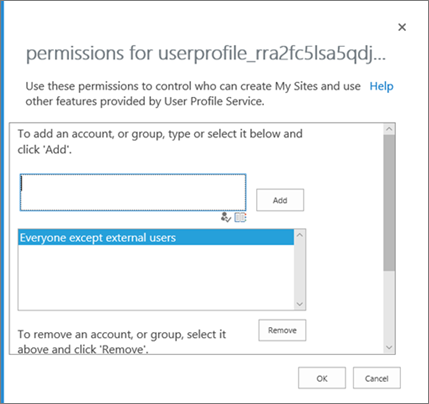

# Manage user profiles in the SharePoint admin center

This article is for global admins and SharePoint admins in Office 365. If you're running SharePoint Server, see [Administer the User Profile service in SharePoint Server](https://go.microsoft.com/fwlink/?linkid=862821). 
  
If you're not an admin, see [View and update your profile in Office Delve](https://support.office.com/article/4e84343b-eedf-45a1-aeb9-8627ccca14ba) for info about changing your profile. 
  
Most organizations don't need to change any user profile settings in the SharePoint admin center. For the organizations that do need to work with user profile settings, this article describes the most common tasks.
  
## Create and edit custom user properties

In Office 365, identity is managed by Azure Active Directory. For info about this, see [Understanding Office 365 identity and Azure Active Directory](https://support.office.com/article/06a189e7-5ec6-4af2-94bf-a22ea225a7a9). SharePoint Online receives this profile information. If you need to store additional info about your users, you can create custom properties in the SharePoint admin center. For info about doing this, see [Add and edit user profile properties in SharePoint Online](add-and-edit-user-profile-properties.md).
  
> [!NOTE]
> Instead of creating user sub-types in the SharePoint Online admin center, we recommend using the Office 365 admin center to [Compare groups](https://support.office.com/article/758759ad-63ee-4ea9-90a3-39f941897b7d) or using the Azure AD admin center to [create groups with dynamic membership](https://go.microsoft.com/fwlink/?linkid=865398). 
  
## Add and remove admins on a OneDrive account

In some cases, you might want to transfer ownership of a OneDrive account to a different user, or give a user full control over another user's OneDrive.
  
1. Sign in to Office 365 as a global admin or SharePoint admin.
    
2. Select the app launcher icon  in the upper-left and choose **Admin** to open the Office 365 admin center. (If you don't see the Admin tile, you don't have Office 365 administrator permissions in your organization.) 
    
3. In the left pane, choose **Admin centers** \> **SharePoint**.
    
4. Click **user profiles** in the left pane. 
    
5. Under **People**, click **Manage User Profiles**.
    
    
  
6. Enter the user's name and select **Find**.
    
7. Right-click the user, and then click **Manage site collection owners**.
    
8. Add and remove admins for the OneDrive account, and then click **OK**.
    
    
  
For info about automatically transferring ownership of OneDrive to a user's manager when the user account is marked for deletion, see [Set up access delegation](http://go.microsoft.com/fwlink/p/?LinkId=798417&amp;clcid=0x409).
  
## Manage audiences

Audiences let you customize content on pages so that it appears only to particular people based on their:
  
- Membership in a distribution list or security group
    
- Location in the reporting structure or public info in the user profile
    
For example, you can display a navigational link to only people in a particular geographic location. Note that only sites that use classic templates can be customized based on audience. Also, audiences are not a security feature. They help you deliver relevant content to specific groups of people, but don't prevent content from being available to anyone with the appropriate permissions. For info about using audiences, see [Target content to specific audiences](https://support.office.com/article/33d84cb6-14ed-4e53-a426-74c38ea32293)
  
To add, edit, or delete and audience or an audience rule, go to the Manage Audiences page:
  
1. Sign in to Office 365 as a global admin or SharePoint admin.
    
2. Select the app launcher icon  in the upper-left and choose **Admin** to open the Office 365 admin center. (If you don't see the Admin tile, you don't have Office 365 administrator permissions in your organization.) 
    
3. In the left pane, choose **Admin centers** \> **SharePoint**.
    
4. Click **user profiles** in the left pane. 
    
5. Under **People**, click **Manage Audiences**.
    
    
  
    Creating a new audience:
    
    
  
    Creating a new rule for the audience:
    
    
  
Audiences compile approximately weekly, and you can only view audience members after the audience compiles. The user profiles page shows the number of audiences, the number of uncompiled audiences, and the compilation status and time.
  
## Disable OneDrive creation for some users

If some users are licensed to use OneDrive, but you don't want them to create a OneDrive (perhaps for regulatory reasons), you can prevent them from doing so. Note that if a user already created a OneDrive, changing the following setting won't delete it. 
  
1. Sign in to Office 365 as a global admin or SharePoint admin.
    
2. Select the app launcher icon  in the upper-left and choose **Admin** to open the Office 365 admin center. (If you don't see the Admin tile, you don't have Office 365 administrator permissions in your organization.) 
    
3. In the left pane, choose **Admin centers** \> **SharePoint**.
    
4. Click **user profiles** in the left pane. 
    
5. Under **People**, click **Manage User Permissions**.
    
    
  
6. By default, "Everyone except external users" has permission to "Create Personal Site" (which includes creating a OneDrive and saving user data such as followed and frequent sites). Remove that group and add specific groups to allow only a subset of licensed users to create a OneDrive.
    
    

> [!NOTE]
> To block access to OneDrive for your entire organization, select the **Disable OneDrive** check box. We recommend keeping the Create Personal Site box selected so you don't affect the SharePoint home page experience for your users.  
  
7. Click **OK**.
    

