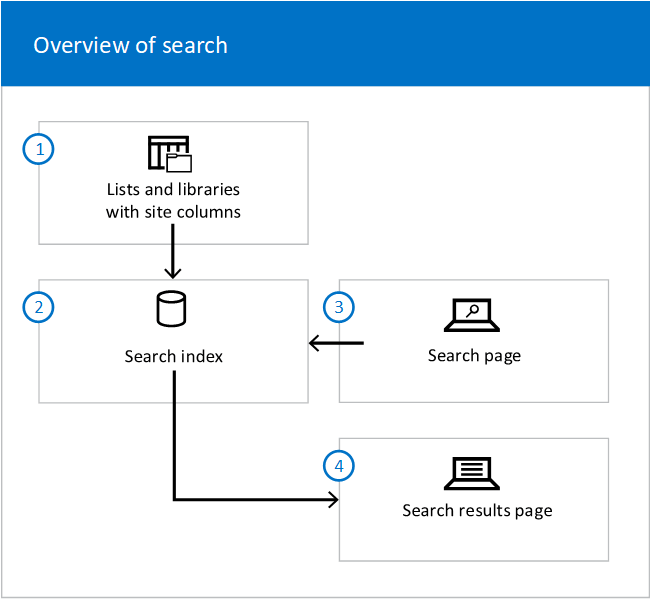

# Overview of search in SharePoint Online

Learn how you can customize the search experience in SharePoint Online to help users find the information they're looking for.
  
## 

Below are the **four main areas** where you can customize the search experience and make sure that search is performing the way you want. 
  
Many of the search features are available on the [search administration page](manage-search-the-admin-center) in the SharePoint admin center. The high-level overview of [How search works](overview-of-search.md#howsearchworks) can also help you understand where and how you can impact the search experience in SharePoint Online. 
  

  

  
 **Make sure the content can be found.**
  
The content must be crawled and added to the search index for your users to find what they're looking for when they search in SharePoint Online.
  
See how you can make content searchable, and how you can crawl content to get it into the search index. Also, see how you can help users search for content across Office 365 and on-premises SharePoint Server at the same time. [Learn more](make-sure-content-can-be-found).
  

  

  
 **Make the search results look great.**
  
Presenting the search results the right way makes content easier to find.
  
See how you can manage the Search Center in SharePoint Online, and how you can use the different search Web Parts to help each user find what they're looking for. [Learn more](make-search-results-look-great).
  

  

  
 **Show relevant search results.**
  
All search results are not relevant to everyone all the time.
  
See how you can show each user exactly the results they're looking for. [Learn more](show-relevant-search-results).
  

  

  
 **Check logs, limits and reports.**
  
See how you can check if the crawler has added content to the search index, and if your users are finding what they're looking for. Look up the limits for search, for example how many entries you can have in a custom search dictionary. [Learn more](check-logs-limits-and-reports).
  
## How search works

This high-level overview of how search works can help you understand where and how you can customize the search in SharePoint Online. 
  
In lists and libraries, site columns store detailed information about each document.
  
1. Search **crawls** the lists and libraries and adds the site columns and values to the search index. 
    
2. In the **search index**, site columns are mapped to managed properties. 
    
3. When a user enters a **query** in a Search Box Web Part, the query is sent to the search index. 
    
4. The search engine finds **matching results** and sends them to a search results page where the results are displayed in Web Parts. 
    

  

