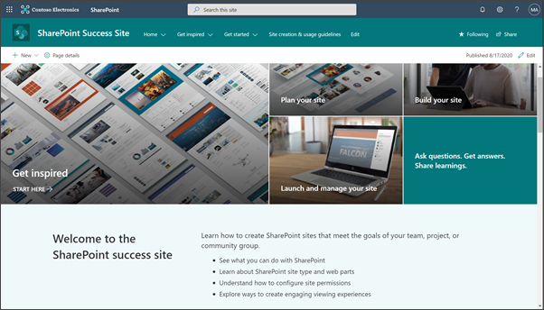
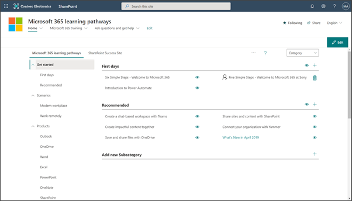
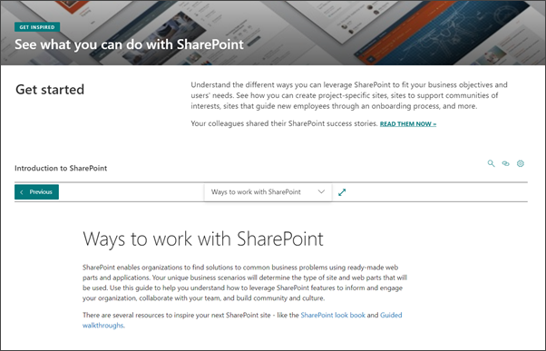
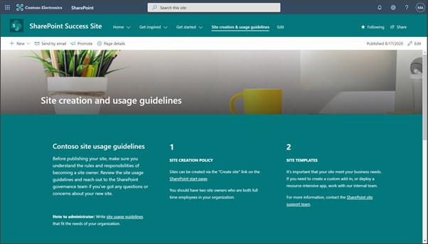

# Introduction to the SharePoint Success Site 

The SharePoint Success Site is a ready to deploy and customizable SharePoint communication site that helps your organization maximize the adoption of SharePoint. The SharePoint Success Site is designed to support new SharePoint site owners in creating high-impact sites to meet the goals of your organization.

The SharePoint Success Site builds on the power of [Microsoft 365 learning pathways](https://docs.microsoft.com/office365/customlearning/) which allows you to use Microsoft-maintained playlists or to create custom playlists to meet the unique needs of your organization. If you are already using M365 learning pathways and don't want to provision the site, you can upload the [SharePoint Success Site playlist into learning pathways](https://docs.microsoft.com/SharePoint/add-sss-cdn).

Install the SharePoint Success Site in your tenant environment, customize the pre-populated training content, and make it available to end users.

### Why invest in a SharePoint Success Site?
The SharePoint Success Site helps site owners improve the quality and impact of the sites they build in SharePoint for internal audiences, while helping ensure they follow your organization’s site usage guidelines. 

Use the SharePoint Success Site to:

- **Get more out of SharePoint** - Teach new site owners how to utilize the power behind SharePoint's communication and collaboration features. 
- **Enable site owners to create high-impact sites** - Ensure site owners have the right information and support to create purposeful sites that are widely adopted by the intended audience. 
- **Ensure site owners follow site creation policies** - Customize the site creation policy page on your SharePoint Success site to communicate organizational policy expectations early.
- **Provide the most up-to-date content** - Equip site owners with SharePoint self-help content that is maintained by Microsoft and published as SharePoint evolves.

#### Summary of how to launch a SharePoint Success Site:

**Step 1:** Meet the pre-requisites to provisioning the SharePoint Success Site
  

**Step 2:** Provision the SharePoint Success Site 
  

**Step 3:** Customize the site design, playlists, content, and site creation guidelines
  

**Step 4:** Launch and share the site

### SharePoint Success Site features
The SharePoint Success Site is designed to reduce the amount of work needed to plan, build, and manage new SharePoint sites for site owners and content authors in order to expedite your organization’s progress.

SharePoint Success Site features:

- **Fast provisioning:** Provision the SharePoint Success Site from the [Look book](https://lookbook.microsoft.com/) with just a few easy steps.
- **Easily customizable:** Edit the site layout, branding, and Microsoft-provided playlist content to align with how you have set up SharePoint in your tenant.
- **Comprehensive site owner training content:** Training on what makes an effective site and how to build and maintain the site.
- **Site creation guidelines:** Create SharePoint usage guidelines that fit compliancy requirements for your organization.
- **Create your own training playlists:** Add your own custom training content and playlists specific to your organization's desired business outcomes beyond SharePoint.

### What comes with a SharePoint Success Site 
The SharePoint Success Site comes pre-populated with web parts and content to guide your users through the most up-to-date site creation training. There are several opportunities to customize the experience to better suit your organization’s goals, tenant configuration, and usage policy. 

#### SharePoint communication site 
The SharePoint Success Site is a SharePoint communication site that includes pre-populated pages, web parts, and site navigation. The site can be customized to incorporate your organization's existing branding, support, and community content.

#### Microsoft 365 learning pathways
When you provision the SharePoint Success Site, you will first be required to install [Microsoft 365 learning pathways](https://docs.microsoft.com/office365/customlearning/). M365 learning pathways connects to a Microsoft-maintained content repository that includes publicly available SharePoint help content. As the content repository is updated, M365 learning pathways will automatically display updated SharePoint content. With M365 learning pathways, you can also create targeted training playlists that meet the needs of your organization beyond SharePoint training by uploading custom playlists. 

#### Microsoft-maintained content feed
The SharePoint Success Site’s up-to-date content feed includes a range of content that helps new users and existing site owners plan, build, and manage SharePoint sites:

- **Plan your site:** Guidance on how to plan a site, including what type of SharePoint site to use, access rights, and permission strategy.
- **Create your site:** Content that helps new site owners create their site, including how to brand and customize their site and how to add content.
- **Share and manage your site:** Guidance to help launch, share, and manage the new site.
- **Advanced site creation:** Content for site owners that want to learn beyond site creation basics.

#### Site inspiration
The introductory section helps new site owners understand the different ways you can leverage SharePoint to meet a business objective. Users will have access to stories that illustrate how to build an onboarding site, a project management site, a site that supports a community of interest, and a team collaboration site. These scenarios provide guidance on how to think about the planning, building, and launching phases.

#### Success stories
The success stories section is a gallery to showcase internal SharePoint site success stories that inspire others in the organization. Learn how to create a [Microsoft Form](https://support.microsoft.com/office/create-a-form-with-microsoft-forms-4ffb64cc-7d5d-402f-b82e-b1d49418fd9d#:~:text=%20Create%20a%20form%20with%20Microsoft%20Forms%20,names%20can%20contain%20up%20to%2090...%20More%20) to solicit success stories from site owners and authors, and publish on your SharePoint Success Site to inspire.

#### Site creation guidelines 
The site creation guidelines page provides a starting point to educate new site authors about [SharePoint creation policies](https://docs.microsoft.com/sharepoint/sites-usage-guidelines) for your organization. The guidelines include suggested usage policy topics and questions to prompt consideration of usage policies within your organization. Customize the content in your SharePoint Success Site site creation guidelines page to serve your organization’s governance needs.

	
### Frequently asked questions

**Question: Who can provision the SharePoint Success Site?**
 
Answer:
- Tenant administrator, also known as Office 365 global administrator
- SharePoint Site Collection Administrator with Owner permissions on the site
 

**Question: Who has permissions to customize site template?**
 
Answer:
- Site collection administrator
- SharePoint owner or member permissions
 

**Question: Who can create custom playlists and hide/show content in M365 learning pathways?**
 
Answer:
- Site collection administrator for M365 learning pathways
- SharePoint owner or member permissions for M365 learning pathways
 

**Question: Who has permissions to use the SharePoint Success Site as a user?**
 
Answer:
- Office 365 user permissions/SharePoint Site visitor permissions or higher

