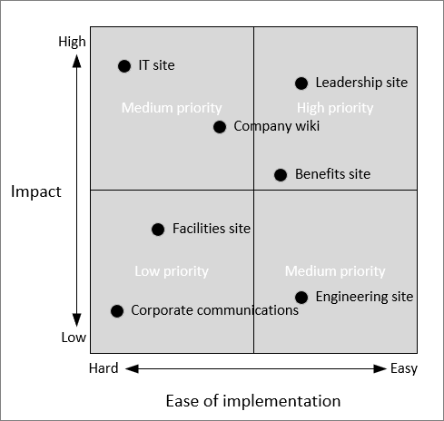

# Plan an intelligent SharePoint intranet

Inspire participants about what's possible with Intelligent Intranets

- Review your current intranet and your existing SharePoint environment
- Identify and prioritize your business scenarios for intranet sites
- Identify one key scenario to prototype and pilot

Your current intranet may be composed of sites from different business groups, such as HR, IT, Facilities, Engineering, and others. As a first step to planning your new SharePoint intranet, we recommend taking an inventory of your existing sites and surveying the owners of each to determine their business requirements for new sites.

Business priorities for each business group, then prioritize from that

- Communications and employee experiences
- Knowledge sharing and discovery
- Shared content and business solutions

SharePoint offers a variety of building blocks that you can use to create an intranet:

- **[Communication sites](https://support.office.com/article/94A33429-E580-45C3-A090-5512A8070732)** - Use communication sites to share news, reports, statuses, and other information through a variety of templates and web parts.
- **Home sites** - Create an engaging home for your organization, division, or function.
- **[Hub sites](planning-hub-sites.md)** - Use hub sites to organize related sites and teams and centralize news, search, and content management.
- **[SharePoint news](https://support.office.com/article/C2DCEE50-F5D7-434B-8CB9-A7FEEFD9F165)** - Use the news web part to post important or interesting stories, announcements, people news, status updates, and more that can include graphics and rich formatting.
- **[Yammer](https://docs.microsoft.com/yammer/yammer-landing-page)** - Use Yammer to connect with people across your organization beyond the boundaries of projects, functions, and departments.
- **[Forms](https://docs.microsoft.com/forms-pro)** - Use forms to create custom quizzes, surveys, questionnaires, registrations and more.
- **[Stream](https://docs.microsoft.com/stream)** - Use Stream to deliver live and on-demand meetings, events, and training.

Create your own Scenarios
As someone in *team*
Sales Management

I want to *do this task*
train my sales reps, who are geographically dispersed, on new products we bring to market

Using *this application of the technology*
SharePoint Communication Sites, News and Microsoft Stream to create a Sales Training Portal that alerts sales reps of new product training videos on the portal they can consume while on the road

I'll know this is successful when *something happens*
my sales team completes the training and indicates in a survey they have improved their ability to sell the new product

Tips for identifying scenarios
Decision Criteria:
- Does it solve a real problem?
- Can it be built in a reasonable time frame?
- How many people will use it?
- What's the return on investment?

Examples - improve engagement, awareness, communication

Analyze impact versus ease of implementation

From the high priority scenarios, identify which ones meet these three key criteria:

Can you build a prototype quickly (a few days)?
Is there a committed sponsor?
Is there a specific audience for a pilot?

Choose solution components:

comm site
news
stream
forms
yammer

Design brief
User journey
Objectives
Metrics / KPIs
Sponsors
Stretch goals

Adoption Success Factors

Stakeholders
Recruit executive sponsors
Empower champions

Scenarios
Prioritize SharePoint scenarios
Measure success

Awareness
Implement SharePoint comms campaign
Execute launch events

Training
Train end users
Ready help desk

aka.ms/sharepointlookbook
provisioning.sharepointpnp.com

## Related topics

