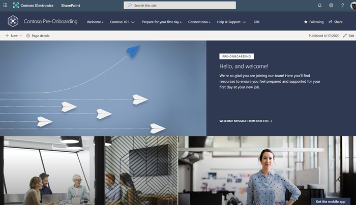
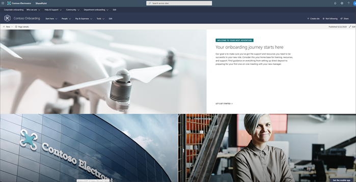
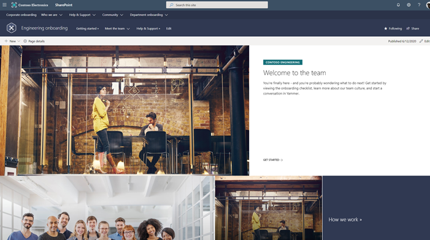

# Overview of the Microsoft New Employee Onboarding hub 
Microsoft has created an open source New Employee Onboarding (NEO) hub to help organizations improve their onboarding process and experience the benefits of a well-planned new employee onboarding process. The NEO hub helps organizations: 

- Provide new employee experiences and information
- Connect new employees to people & culture
- Help stakeholders easily contribute to new employee onboarding
- Measure effectiveness of new employee onboarding

## Why invest in a new employee onboarding site?
New employee onboarding (NEO) should be a strategic process that integrates new employees into an organization and its culture while providing the knowledge and tools needed to become fully contributing team members. 
NEO processes often fall short for both the new hires and the organization. Only 12% of employees strongly agree their organization does a great job of onboarding new employees.   An engaging and well organized NEO process can make all the difference in helping a new hire navigate through an exciting – but stressful -  career journey, and it can have major organizational benefits. 

**Strategically planned NEO experience can:**

**Improve new hire performance and time to productivity**
Organizations with a standard onboarding process report 50% greater new-hire productivity.   

**Improve new employee retention**
69% of employees are more likely to stay with a company for three years if they had a great onboarding experience. Employees who have a negative onboarding experience are twice as likely to look for new opportunities in the near future.    

### The NEO experience process:

| Provide new employee experiences and information      | Connect new employees to people and culture     | Help stakeholders easily contribute to new employee onboarding  | Measure effectiveness of new employee onboarding
| :------------------- | :------------------- |:----------------|
| Sense of place       | Pre-onboarding       | Departmental and team onboarding |  Value realization
| Onboarding journey   | Social connections and live events  | Easy to create and maintain compeling content experiences     | New employee surveying

## NEO hub contents:

- **A fully configured and customizable set of new hire related sites built on SharePoint Online communication sites:** The NEO hub includes the sites, information architecture, design, user interface and features to help provide new hires with a great onboarding experience. The NEO hub can be customized to add your organization’s new hire content and to align with its look and feel. The NEO hub sites are responsive and work as they should on mobile. 
- **Onboarding journey:** Onboarding can be an overwhelming experience for new hires with everything the new hire is typically expected to do and learn in a short period of time. Avoid overwhelming your new employees by providing them a curated onboarding journey that paces the new hire through a configurable activity list of administrative, technology, culture, training, and connection related to-do’s. The onboarding journey comes with a pre-configured list of new employee onboarding activities for you to customize for your processes. 
- **Sample new hire site pages:** To inspire and provide design templates for arranging your content, the NEO hub includes sample inner site pages. Use these site pages as templates for your content. 
- **Easy provisioning:** Provision the NEO hub from the SharePoint look book with just a few steps.

### New hire sites 
New employee onboarding involves multiple levels within an organization, including corporate onboarding, and departmental onboarding. Sometimes teams within a department also need a unique onboarding experience. Each onboarding level provides its own unique value, contributing to a comprehensive onboarding experience each new employee should experience. 
Research has shown pre-onboarding new hires, after they sign their acceptance letter but before they officially join the company, can lead to higher performance and better retention rates. 
To deliver a consistent and integrated new hire onboarding experience the Microsoft open source New Employee Onboarding hub consists of three types of SharePoint site templates, designed to work as one cohesive and familiar experience for new hires. 

1.	**Pre-Onboarding site:** A site for new hires, who have yet to officially join the company, to learn more about the company they have joined and to get ready for their official start date. External guest access can be used for providing pre-start hires, with no corporate credentials, access to the pre-onboarding site only. 
2.	**Corporate onboarding site:** A place for new hires to visit to get the information they need and make the connections they want to successfully onboard to the organization. 
3.	**Departmental onboarding sites:** A place for new hires to visit to learn more about the department they are joining, its people, culture, and priorities. The new employee onboarding hub includes two departmental template sites, one for an engineering department and one for a sale department

## Step 1: Provision NEO hub
The New Employee Onboarding (NEO) hub can be provisioned from the [SharePoint look book](https://lookbook.microsoft.com/). With the SharePoint look book, an Office 365 Tenant Administrator can start the provisioning process with a few simple clicks. It is fast, easy, and takes only a few minutes to start the process. Before starting the provisioning process, make sure you have met the prerequisites for provisioning.
Prerequisites
To successfully set up the NEO hub via the SharePoint look book, the person doing the provisioning must meet the following pre-requisites:
•	The person provisioning the NEO hub must be a Tenant Administrator of the tenant where the NEO hub will be provisioned.

### Provision the NEO hub
1.	Go to the [NEO hub solution page](https://provisioning.sharepointpnp.com/details/3df8bd55-b872-4c9d-88e3-6b2f05344239).
2.	Select **Add to your tenant**. If you are not signed into to your tenant, the SharePoint look book will ask for your Tenant Admin credentials.
3.	From the permissions requested dialog box, select **Consent on behalf of your organization** and then select **Accept**.
The provisioning service requires these permissions to create the tenant app catalog, install the application into the tenant app catalog and provision the site template. There is no overall impact on your tenant and these permissions are explicitly used for the purpose of the solution installation. You must accept these permissions to proceed with the installation.
4.	Complete the fields on the provisioning information page as appropriate for your installation. At a minimum enter the email address where you wish to get notifications about the provisioning process and the destination URL for your site to be provisioned to.

> [!NOTE]
> Make the destination URL for your site something intuitive for your team members such as "/sites/MyTraining" or "/teams/LearnMicrosoft365".

6.	Select **Provision** when ready to install the NEO hub into your tenant environment. The provisioning process will take up to 15 minutes. You will be notified via email (to the notification email address you entered on the Provisioning page) when the site is ready for access.

### Add owners to the site
As the Tenant Admin, it's unlikely you'll be the person customizing the sites, so you'll need to assign a few site owners to the sites. Owners have administrative privileges on the site so they can modify site pages, content, and branding. 
1.	From the SharePoint Settings menu, select Site Permissions.
2.	Select **Advanced Permission Settings**.
3.	Select **Microsoft 365 learning pathways Owners**.
4.	Select **New > Add Users to this group**, and then add the people you want to be site owners.
5.	Include the site URL in the Share message, and then select **Share**.

## Steps 2: Customize the onboarding experience 
The New Employee Onboarding (NEO) hub consists of three SharePoint site templates that can be customized to fit the needs of your users and organization. Many of the core pages are already built and pre-populated with content. Review content on sites and pages, then plan on customizing content, images, branding, web parts, and pages.

It’s important to make sure the right content is available to users at the right time. It’s also important to make new employees feel welcome before their first day. Organizations with a standardized onboarding process report 50% greater new-hire productivity.    Alternatively, employees who have a negative onboarding experience are twice as likely to look for new opportunities shortly after starting a new job.    

Before you customize content in the NEO experience, ensure you understand the needs of your users and the business objectives of your organization. New hires will need different kinds of support and resources depending on the onboarding phase and culture of your organization. Begin by signing into your account and reviewing pre-populated content. Then, customize content and prepare to share the site with new hires. 

### NEO hub contents:

 
1.	**Pre-Onboarding site:** A site for new hires, who have yet to officially join the company, to learn more about the company they have joined and to get ready for their official start date. External guest access can be used for providing pre-start hires, with no corporate credentials, access to the pre-onboarding site only. 

2.	**Corporate onboarding site:** A place for new hires to visit to get the information they need and make the connections they want to successfully onboard to the organization. 

> [!NOTE]
> The corporate new hire site is a hub and the departmental site templates are associated sites. This creates a coherent and consistent experience for the new hire across the corporate and departmental new hire sites.

3.	**Departmental onboarding sites:** A place for new hires to visit to learn more about the department they are joining, its people, culture, and priorities. The new employee onboarding hub includes two departmental template sites, one for an engineering department and one for a sale department. Consider associating departmental onboarding sites with existing department portals if you have them.

### Get started - Sign into your Microsoft 365 account 
Note: You need to be a site owner to customize and share the NEO sites. Work with your SharePoint administrator if you don’t already have access.
1.	Open your web browser and navigate to [office.com](office.com) or your organization’s sign-in location
2.	Sign in with your username and password
3.	Navigate to the location of the site using the URL supplied by your tenant administrator, or select SharePoint from the Microsoft 365 home page, and then select the site

### Explore and review pre-populated content
#### Pre-Onboarding site:
This is where new hire starts their onboarding journey. This site is for new hires who have accepted their job offer but have not officially joined the company yet. In this stage, new hires will be interested in learning more about the company, how to get ready for their official start date, and who to go to for questions. 

 
#### Pre-populated site content:
- **Home page** – This is the first site your user will see after they agree to accept the job. Use this landing page as an opportunity to highlight big concepts and get new employees excited about starting their new job. Provide content for topics like organization leaders, values, communities of interest, benefits, and career planning resources. 

> [!IMPORTANT]
> Connect social media accounts to links in the [Hero web part](https://support.microsoft.com/office/use-the-hero-web-part-d57f449b-19a0-4b0d-8ce3-be5866430645) and [Twitter web part](https://support.microsoft.comoffice/use-the-twitter-web-part-15db6b3b-d167-41dd-9875-2af64b44d820)

- **Welcome** – Give new hires a warm welcome and place to start understanding onboarding tasks and how to prepare for their first day. This is a good opportunity to include a video message from leadership. Use the [YouTube web part](https://support.microsoft.com/office/use-the-youtube-web-part-c14fa2c1-71dc-4e52-94b6-b4876742382f), or [Embed web part](https://support.microsoft.com/office/add-content-to-your-page-using-the-embed-web-part-721f3b2f-437f-45ef-ac4e-df29dba74de8) to display the video.
- **Contoso 101** – Provide high level information about the organization that engages and excites. Share more about leadership and values in Our leadership team and Our values pages.
- **Prepare for your first day** – Ensure new hires feel prepared and supported on their first day by providing details on what to bring and where to go. 
- **Help & Support** – Highlight where to go for support and customize questions and answers for the FAQ page.

#### Corporate new hire hub:
This is the hub for the new employee onboarding experience and is designed to provide a high-level view of organizational goals, leadership, team structure, and resources. In this phase, users are looking for guidance, support, and clarity. Use this site to outline onboarding details and expectations during the first months of onboarding. Ensure users have access to support channels like [Yammer](https://support.microsoft.com/en-us/office/use-a-yammer-web-part-in-sharepoint-online-a53cfa0c-3d09-42c8-a286-1038a81c59da), write FAQs relevant to your organization, and customize the [onboarding checklist](https://support.microsoft.com/office/introduction-to-lists-0a1c3ace-def0-44af-b225-cfa8d92c52d7) to include the activities you want all new hires to do in their first 30, 60, 90 days.

##### NEO hub navigation:

 
#### Pre-populated hub contents:
- **Corporate onboarding (home page)** – Highlight key resources in hub navigation. Customize the [hub and site navigation](https://support.microsoft.com/office/customize-the-navigation-on-your-sharepoint-site-3cd61ae7-a9ed-4e1e-bf6d-4655f0bf25ca) to display major content categories to new hires.
- **Who we are** – Introduce users to more detail about the organization in the Our story, Our leadership, Our teams pages. Customize these pages and the Office locations page for your organization.
- **Help & Support** - Highlight where to go for support and customize questions and answers for the FAQ page.
- **Community** – Help new hires start building community right away and make sure new hires are aware of Employee resource groups and other connection channels.
- **Departmental onboarding** – Provide an entry point to departmental-level information from the hub navigation where users can access departmental onboarding sites. Templates for an Engineering and Sales onboarding site have been included. Use these site templates as both a source of inspiration of what your organization’s departmental onboarding sites could look like and to accelerate the creation of these sites for your organization.  	

##### Pre-populated site (Contoso onboarding) contents:
- **Home page** – Provide a high-level view of big concepts that will be relevant to new users.
- **Start here** – Specify what new hires can expect in their first 30, 60, and 90 days of onboarding by creating an onboarding process in on the Start your journey here page.

#### Departmental onboarding:
From the corporate onboarding hub, users can access specific resources for departmental onboarding. Here, users need to learn about departmental leadership, culture, goals, and resources. Use departmental sites to provide access to communication channels, training guides, and events relevant to new hires.The new employee onboarding hub includes two departmental template sites, one for an engineering department and one for a sale department. Consider associating departmental onboarding sites with existing department portals if you have them.

##### Departmental site location in NEO hub navigation:

 

##### Pre-populated site contents:
- **Home page** - Provide a high-level view of big concepts that will be relevant to new hires.
- **Getting started** – Help users quickly understand onboarding tasks, departmental procedures, and anything else that will help new hires be successful. 
- **Meet the team** – Introduce new hires to people, the organization structure and goals on the Leadership, The organization, and Our priorities pages.
- **Help and support** - Highlight where to go for support and consider creating a FAQ section.

**Next steps:** Customize place-holder content, edit the site navigation, add pages as needed, and hook up social media accounts in web parts.

## Customize the content and look of your NEO sites 
Now that you’ve reviewed the pre-built pages and pre-populated content, you are ready to customize the NEO experience for your organization. 

### Navigation

Site navigation is important because it helps users immediately understand what they can accomplish on a given site. The most effective SharePoint sites help viewers find what they need quickly so that they can use the information they to make decisions, learn about what is going on, access the tools they need, or engage with colleagues to help solve a problem. Edit the hub and site navigation for all three NEO site designs to meet the needs of your audience and organization. [Learn how to edit site navigation](https://support.microsoft.com/office/customize-the-navigation-on-your-sharepoint-site-3cd61ae7-a9ed-4e1e-bf6d-4655f0bf25ca). 

 
### Web parts
Customize web parts with images, labels, links, and content that align with your organization’s mission. Keep images and descriptions simple and easy to understand for your new-hire audience.

- **Hero web part** - Bring focus and visual interest to your page with the [Hero web part](https://support.microsoft.com/office/use-the-hero-web-part-d57f449b-19a0-4b0d-8ce3-be5866430645). You can display up to five items in the Hero web part and use compelling images, text, and links to draw attention to each.
- **Text web part** - Use the [Text web part](https://support.microsoft.com/office/add-text-and-tables-to-your-page-with-the-text-web-part-729c0aa1-bc0d-41e3-9cde-c60533f2c801) to add paragraphs to your page. Formatting options like styles, bullets, indentations, highlighting, and links are available.
- **Image web part** – Use the [Image web part](https://support.microsoft.com/office/use-the-image-web-part-a63b335b-ad0a-4954-a65d-33c6af68beb2) to add an image to a page.
- **Quick links web part** – Organize and display links to other resources with the [Quick links web part](https://support.microsoft.com/office/use-the-quick-links-web-part-e1df7561-209d-4362-96d4-469f85ab2a82).
- **People web part** – Use the [People web part](https://support.microsoft.com/office/show-people-profiles-on-your-page-with-the-people-web-part-7e52c5f6-2d72-48fa-a9d3-d2750765fa05) to display profile photos, contact information, and organizational information for people at work.

### Site theme and branding
Edit the look of your SharePoint site to align with your organization's brand. Customize the site display name, logo, theme, header layout, navigation style, and more in the [Change the look panel](https://support.microsoft.com/office/customize-your-sharepoint-site-320b43e5-b047-4fda-8381-f61e8ac7f59b).

### Hub site settings

SharePoint hub sites help connect and organize sites based on project, department, division, region, etc. making it easier to:

- Discover related content such as news and other site activities
- Apply common navigation, branding, and site structure across associated sites
- Search across all associated sites. 

Consider associating the your existing departmental onboarding sites to your new NEO hub. Learn how [hub site associations](https://support.microsoft.com/office/associate-a-sharepoint-site-with-a-hub-site-ae0009fd-af04-4d3d-917d-88edb43efc05) work and how to manage hub settings for your organization. Learn more about [SharePoint hub sites](https://support.microsoft.com/office/what-is-a-sharepoint-hub-site-fe26ae84-14b7-45b6-a6d1-948b3966427f).

#### More customization resources: 
- Add a [page to a SharePoint site](https://support.microsoft.com/office/add-a-page-to-a-communication-site-ce16986a-25ec-4907-b820-44d01ae8afb5)
- How to use [web parts on SharePoint pages](https://support.microsoft.com/office/using-web-parts-on-sharepoint-pages-336e8e92-3e2d-4298-ae01-d404bbe751e0)
- Use the [Events web part](https://support.microsoft.com/office/use-the-events-web-part-5fe4da93-5fa9-4695-b1ee-b0ae4c981909)
- Use the [News web part](https://support.microsoft.com/office/use-the-news-web-part-on-a-sharepoint-page-c2dcee50-f5d7-434b-8cb9-a7feefd9f165)
