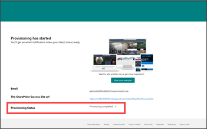
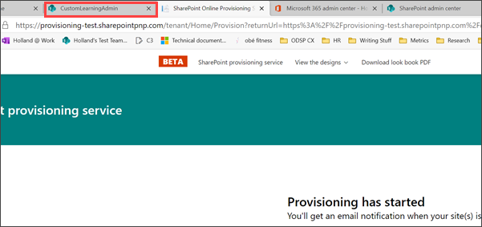

# Provision the SharePoint Success Site from the look book

Once you’ve confirm the person provisioning and the tenant being provsioned meet the following prerequisites, you are ready to provision:

- You are using *at minimum* SharePoint tenant administrator credentials
- Your tenant has the App Catalog installed
- You are an administrator of the App Catalog
- Your tenant has version 4.0 of the M365 learning pathways provisioned

## Start provisioning from the look book
If you already have Learning Pathways 4.0 or greater provisioned on your tenant, you can provision Learning Pathways from the SharePoint Look book site. 

1. Go to the [look book](https://provisioning-test.sharepointpnp.com/details/0b860749-56a0-4c4c-992c-536d56d9accf) and select **Add to your tenant**

2. Fill out the email and URL address sections and select **Provision**

3.	Select **Confirm**
4.	When provisioning is complete, you’ll see the following message:

5.	Next, navigate to your tenant's Learning Pathways site
6.	Select **Home > Learning Pathways Administration**

7.	Select the … (ellipse), then select **Add to Content Pack**
8.	Select **SharePoint Success Site**

9.	You will see the SharePoint look book site appear in a new tab. You can close this tab and select the **CustomLearning Administration tab**

10.	Select **Complete** as shown in the following image:

> [!IMPORTANT]
> Make sure to select **Complete** to complete the provisioning process.

11.	To confirm the SharePoint Success Site has been successfully provisioned, navigate to the site and select **Get Started > Plan your site**. You should see the web part on the page as shown in the following image:

12. Next, follow the steps below to add site owners to the M365 learning pathways administration page and the SharePoint Success Site to grant access to others for site and content customizations. 

## Add site owners to both sites

In order for others to edit M365 learning pathways playlist content and content in the SharePoint Success Site, they will need site owners permissions for *both sites*. Add site owners to both sites to enable customization permissions. 

#### Add owners to the M365 learning pathways site
Assign a few site owners to grant administrative privileges to customize the site and training content. This includes the ability to hide and show content and to build custom playlists through the learning pathways web part. 

1. From the M365 learning pathways site menu select **Settings**, then select **Site permissions**
2. Select **Advanced Permission Settings**.
3. Select **SharePoint Success Site Owners**.
4. Select **New > Add Users to this group**, and then add the people you want to be site owners.
5. Include a link to **Explore the site** in the sharing message, and then select **Share**.

#### Add owners to the SharePoint Success Site
Assign a few site owners to grant administrative privileges to customize the site content, branding, navigation, web parts, and theme.

1. From the SharePoint Success Site's menu select **Settings**, then select **Site permissions**
2. Select **Advanced Permission Settings**.
3. Select **SharePoint Success Site Owners**.
4. Select **New > Add Users to this group**, and then add the people you want to be site owners.
5. Include a link to **Explore the site** in the sharing message, and then select **Share**.

### Site provisioning help

- Reference [troubleshooting](https://docs.microsoft.com/office365/customlearning/feedback) for provisioning help
- See M365 learning pathways [FAQs](https://docs.microsoft.com/office365/customlearning/faq)
- Share your [feedback](https://github.com/pnp/custom-learning-office-365/issues) with us

### Next steps - customize the SharePoint Success Site

Customize playlist content and the look and feel of your SharePoint Success Site to meet the needs of your organization.

### Frequently asked questions

**Question: Who can provision the SharePoint Success Site?**
 
Answer:
- Tenant administrator, also known as Office 365 global administrator
- SharePoint Site Collection Administrator with Owner permissions on the site
 

**Question: Who has permissions to customize site template?**
 
Answer:
- Site collection administrator
- SharePoint owner or member permissions
 

**Question: Who can create custom playlists and hide/show content in M365 learning pathways?**
 
Answer:
- Site collection administrator for M365 learning pathways
- SharePoint owner or member permissions for M365 learning pathways
 

**Question: Who has permissions to use the SharePoint Success Site as a user?**
 
Answer:
- Office 365 user permissions/SharePoint Site visitor permissions or higher

