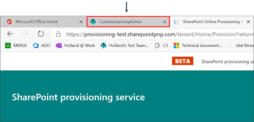
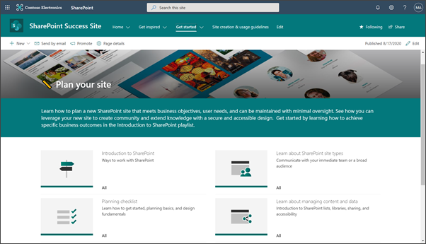

# Provision the SharePoint Success Site 

Start the SharePoint Success Site provisioning process by understanding the prerequisites. We recommend provisioning the SharePoint Success Site from the Microsoft 365 learning pathways administration page per the instructions below. 
Global administrator (formerly called the Tenant admin) credentials are required to start the provisioning process for the SharePoint Success Site. 

Before getting started, [watch the provisioning instructional video](https://www.youtube.com/watch?v=HZjxBAKVnJs&feature=youtu.be), follow all steps in the process, and make sure you've met the requirements for provisioning. 

## Meet the requirements

Before provisioning the SharePoint Success Site, meet the requirements for both the **person** provisioning and the **tenant.** Your tenant's configuration will determine what path you need to take to install the SharePoint Success Site. Start by reviewing the SharePoint Success Site requirements below to prepare your tenant. 

| Tenant admin role requirements | +  | Tenant requirements |  = | Ready to provision         |
| :----------------: | :----------------: |:-------------:|:----------------: | :----------------: |

#### Tenant admin requirements

The **person** doing the provisioning must be a Global admin (formerly called the Tenant admin) where the SharePoint Success Site will be provisioned *and must also be* an Administrator of the tenant’s App Catalog.

 

| Global admin role | +  | Admin of the App Catalog | = | Tenant admin requirements met         |
| :----------------: | :----------------: |:-------------:|:----------------: | :----------------: |

**Are you a Global administrator?**
- **Yes** -  Next, confirm your tenant has already enabled the App Catalog.
- **No** -  Partner with your M365 Global admin to get the site provisioned. [Learn more about administrative roles in SharePoint](/microsoft-365/admin/add-users/about-admin-roles).
 
 
If you are unsure, you can confirm your role by logging into office.com, you’ll see an Admin center app icon next to your M365 apps if you have SharePoint administrator credentials.

**Are you an Administrator of the App Catalog?**
- **Yes** - Next, confirm your tenant has M365 learning Pathways provisioned.
- **No** - Next, ask your Global admin to add you as an [App Catalog Administrator](/office365/customlearning/addappadmin).

	
#### Tenant requirements

The **tenant** where the site will be provisioned must have the [App Catalog](./use-app-catalog.md) installed *and* have the latest version of [M365 learning pathways](/office365/customlearning/#:~:text=Microsoft%20365%20learning%20pathways%20is%20a%20customizable%2C%20on-demand,adoption%20of%20Microsoft%20365%20services%20in%20your%20organization.) installed. Your tenant must have **version 4.0 or higher** of M365 learning pathways.

 

| App Catalog installed | +  |M365 learning pathways 4.0 or higher installed | = | Tenant requirements met         |
| :----------------: | :----------------: |:-------------:|:----------------: | :----------------: |

 

Use this decision tree to determine your tenant’s path to meeting the **tenant** requirements.

> [!div class="mx-imgBorder"]
> 

Ready to get started provisioning? Review the [provisioning instructions](#provision-the-sharepoint-success-site-1). 

 

**Does your tenant have the App Catalog installed?**
- **Yes** - Next, confirm you are an administrator of the App Catalog.
- **No** - Next, [enable the App Catalog](https://www.bing.com/videos/search?q=where+to+find+the+app+catogue+in+sharepoint&docid=608008189208497248&mid=99CF7FB554B328AC189899CF7FB554B328AC1898&view=detail&FORM=VIRE) (this will take about 30 minutes).
 
 

If you are unsure, navigate to the SharePoint admin center, then select **Sites > Active sites** and you will see the **App Catalog**

  

> [!IMPORTANT]
> If you need to create a App Catalog, wait at least 30 minutes after creating before provisioning M365 learning pathways and the SharePoint Success Site. 
 
**Does your tenant have M365 learning pathways provisioned?**
- **Yes** - Next, confirm you are using version 4.0 or higher.
- **No** - [Provision M365 learning pathways](/office365/customlearning/) for the first time.
 

If you are unsure, navigate to the SharePoint admin center, then select **Sites > Active sites** and you will see **Microsoft 365 learning pathways**.
 
**Is your tenant's version of learning pathways version 4.0 or higher?**
- **Yes** - You are ready to [provision the SharePoint Success Site](#provision-the-sharepoint-success-site-1).
- **No** - Update to version 4.0 or higher and then provision the SharePoint Success Site from the M365 learning pathways administration page.

If you are unsure, navigate to your tenant's **M365 Learning Pathways administration page** and select the ellipses **(…)**

> [!div class="mx-imgBorder"]
> 

Then, select **About web part** to confirm the current version.

> [!div class="mx-imgBorder"]
> 

 

#### If you need to, update M365 learning pathways from version 3.0 to version 4.0 or higher

> [!IMPORTANT]
> The person updating M365 learning pathways must be an Administrator of the tenant’s App Catalog. If the person provisioning M365 learning pathways isn't an Administrator of the App Catalog, [add an Administrator to the App Catalog](/office365/customlearning/addappadmin) and continue.

In this step, you upload the M365 learning pathways 4.0 web part to the SharePoint App Catalog, and then navigate to the M365 learning pathways Administration page to start the update process.

**Upload the web part package:**

1. Go to the [GitHub custom learning repository](https://github.com/pnp/custom-learning-office-365/tree/master/webpart), select customlearning.sppkg and then download it to a local drive on your PC.
2. If you’re not already signed in, sign into your tenant with a Global admin credentials.
3. Select **Admin > Show All > SharePoint > More Features**.
4. Under **Apps**, select **Open**.
5. Select **App Catalog > Distribute Apps for SharePoint**.
6. Select **Upload > Choose Files**.
7. Select the customlearning.sppkg file you downloaded, then select **OK > Deploy**.
8. From the Learning Pathways site, select Learning pathways administration from the Home menu.
9. You’ll see a prompt asking if you want to update, then select **Start**.
10. When the update is complete, select **Close**.

 

## Provision the SharePoint Success Site

Once you’ve confirmed the following, you are ready to provision:

- You are using Global admin (formerly called the Tenant admin) credentials.
- Your tenant has the App Catalog enabled.
- You are an Administrator of the App Catalog.
- Your tenant has version 4.0 or higher of M365 learning pathways provisioned.

It's recommended that you install the SharePoint Success Site using the instructions below. As an alternative you [can install the SharePoint Success Site from the look book](./provision-sss-lookbook.md), just make sure you follow all instructions. Before getting started, [watch the provisioning instructions video](https://www.youtube.com/watch?v=HZjxBAKVnJs&feature=youtu.be)

### Provision the SharePoint Success Site to your tenant from the Learning pathways administrative page

1.  Navigate to [office.com](https://www.office.com/) or your organization’s sign-in location.
2.  Sign in with your username and password.
3.  Navigate to the location of the site using the URL supplied by your SharePoint administrator or select SharePoint from the Microsoft 365 home page, and then select the **M365 learning pathways** site.
4.  From the learning pathways Home menu, select **Learning Pathways Administration**.

    

5.  Select the ellipses **(…)** and then select **Add Content Pack**.

    

6.  Select SharePoint Success Site to open the SharePoint Success Site provisioning page.
7.  Select **Add to your tenant**.
8.  Fill out the email address and URL details and then select **Provision**.
9.  Select **Complete**.

10. When you see **Provisioning completed** on the provisioning page, you'll see a new tab appear in your browser called  **CustomLearningAdmin**. Select the **CustomLearningAdmin** tab as shown in the following image:

    > [!div class="mx-imgBorder"]
    > 

11. Then, select **Complete** as shown in the following image to complete the provisioning process:

    > [!div class="mx-imgBorder"]
    > 

    > [!IMPORTANT]
    > Make sure to select **Complete** to complete the provisioning process.

12. To confirm the SharePoint Success Site has been successfully provisioned, go to the SharePoint site you provisioned, select **Get Started > Plan your site.** You should see the web part on the page as shown in the following image: 

    > [!div class="mx-imgBorder"]
    > 

## Add Site owners 
Assign a few Site owners to grant administrative privileges to customize the site and training content. In order to hide, show, or enable playlists, users will need Site owner or Site member permissions to the M365 learning pathways site. In order to edit the look, navigation, and site content, users will need Site owner or Site member permissions to the SharePoint Success Site. 

**Add Site owners or members to both sites**

1. From the site select **Settings**, then select **Site permissions**.
2. Select **Advanced Permission Settings**.
3. Select **Site owners** or **Site members**
4. Select **New > Add users to this group**, and then add the people you want to be Site owners or Site members.
5. Include a link to **Explore the site** in the sharing message, and then select **Share**.

 

#### Next steps - customize the SharePoint Success Site

Share the URLs for the M365 learning pathways administration site and the SharePoint Success site with the Site owners and members who will be responsible for customizing the site. Then, [customize](./customize-sss.md) M365 learning pathways playlist content and the look and feel of your SharePoint Success Site to meet the needs of your organization.

 

### Site provisioning help

- Reference [troubleshooting](/office365/customlearning/feedback) for provisioning help
- See M365 learning pathways [FAQs](/office365/customlearning/faq)
- Share your [feedback](https://github.com/pnp/custom-learning-office-365/issues) with us

#### Frequently asked questions

**Question: What are the requirements for installing the SharePoint Success Site into my tenant environment?**
 
Answer:
- Ensure SharePoint Online is enabled in your environment.
- The individual that will provision the SharePoint Success Site must be the global admin (formerly called the Tenant admin) of the target tenant for install.
- The tenant where the site will be provisioned must have:
    - The App Catalog installed
    - Version 4.0 or higher of [M365 learning pathways](/office365/customlearning/#:%7E:text=Microsoft%20365%20learning%20pathways%20is%20a%20customizable%2C%20on-demand,adoption%20of%20Microsoft%20365%20services%20in%20your%20organization.) installed
 

**Question: Can I provision the site from the look book?**
 
Answer: Yes, follow the guidance on how to provision from the [look book](./provision-sss-lookbook.md).
 

**Question: Who has permission to provision the SharePoint Success Site?**
 
Answer: The Global admin (formerly called the Tenant admin) are required.
 

**Question: I have installed the SharePoint Success Site successfully, but I'm not able to get the Success Site content from the M365 learning pathways web part loaded on my site. What should I do?**
 
Answer: 

It is likely that the content pack has not been fully installed. You must return to the **CustomLearningAdmin** page that will appear when site provisioning is done to complete the installation. Confirm you have followed steps 10 through 12 above. Review the [provisioning video](https://www.youtube.com/watch?v=HZjxBAKVnJs&feature=youtu.be) for more detail.
 

**Question: Who has permission to customize the site template?**
 
Answer: The Global admin (formerly called the Tenant admin) or Site owner permissions.
 

**Question: Who can create custom playlists and hide or show content in M365 learning pathways?**
 
Answer: The Site collection administrator and Site owner permissions of M365 learning pathways.
 

**Question: Who has permissions to use the SharePoint Success Site as a user?**
 
Answer: Microsoft 365 user permissions or SharePoint Site visitor permissions or higher.