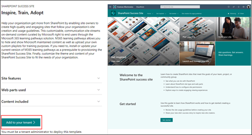
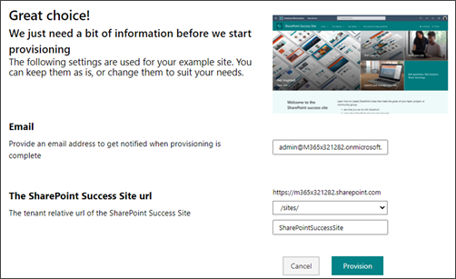
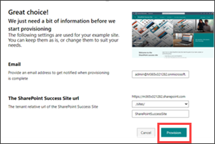
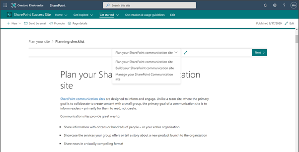
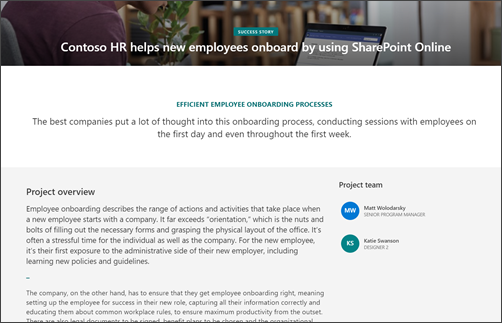

# Overview of the SharePoint Success Site 

The SharePoint Success Site is a ready to deploy and customizable SharePoint communication site that helps your organization maximize the adoption of SharePoint. The SharePoint Success Site is designed to support new SharePoint site owners in creating high-impact sites to meet the goals of your organization. Install the SharePoint Success Site in your tenant environment, customize the pre-populated training content, and make it available to end users.

If you are already using M365 learning pathways and don't want to provision the site, you can upload the [SharePoint Success Site playlist into learning pathways](https://docs.microsoft.com/SharePoint/add-sss-cdn).

### Why invest in a SharePoint Success Site?
The SharePoint Success Site helps site owners improve the quality and impact of the sites they build in SharePoint for internal audiences, while helping ensure they follow your organization’s site usage guidelines. 

Use the SharePoint Success Site to:

- **Get more out of SharePoint** - Teach new site owners how to utilize the power behind SharePoint's communication and collaboration features. 
- **Enable site owners to create high-impact sites** - Ensure site owners have the right information and support to create purposeful sites that are widely adopted by the intended audience. 
- **Ensure site owners follow site creation policies** - Customize the site creation policy page on your SharePoint Success site to communicate organizational policy expectations early.
- **Provide the most up-to-date content** - Equip site owners with SharePoint self-help content that is maintained by Microsoft and published as SharePoint evolves.

#### Summary of how to launch a SharePoint Success Site:

**Step 1:** Meet the pre-requisites to provisioning the SharePoint Success Site
  

**Step 2:** Provision the SharePoint Success Site 
  

**Step 3:** Customize the site design, playlists, content, and site creation guidelines
  

**Step 4:** Launch and share the site

### SharePoint Success Site features
The SharePoint Success Site is designed to reduce the amount of work needed to plan, build, and manage new SharePoint sites for site owners and content authors in order to expedite your organization’s progress.

SharePoint Success Site features:

- **Fast provisioning:** Provision the SharePoint Success Site from the [Look book](https://lookbook.microsoft.com/) with just a few easy steps.
- **Easily customizable:** Edit the site layout, branding, and Microsoft-provided playlist content to align with how you have set up SharePoint in your tenant.
- **Comprehensive site owner training content:** Training on what makes an effective site and how to build and maintain the site.
- **Site creation guidelines:** Create SharePoint usage guidelines that fit compliancy requirements for your organization.
- **Create your own training playlists:** Add your own custom training content and playlists specific to your organization's desired business outcomes beyond SharePoint.

### What comes with a SharePoint Success Site 
The SharePoint Success Site comes pre-populated with web parts and content to guide your users through the most up-to-date site creation training. There are several opportunities to customize the experience to better suit your organization’s goals, tenant configuration, and usage policy. 

#### SharePoint communication site 
The SharePoint Success Site is a SharePoint communication site that includes pre-populated pages, web parts, and site navigation. The site can be customized to incorporate your organization's existing branding, support, and community content.

#### Microsoft 365 learning pathways
When you provision the SharePoint Success Site, you will first be required to install [Microsoft 365 learning pathways](https://docs.microsoft.com/office365/customlearning/). M365 learning pathways connects to a Microsoft-maintained content repository that includes publicly available SharePoint help content. As the content repository is updated, M365 learning pathways will automatically display updated SharePoint content. With M365 learning pathways, you can also create targeted training playlists that meet the needs of your organization beyond SharePoint training by uploading custom playlists. 

#### Microsoft-maintained content feed
The SharePoint Success Site’s up-to-date content feed includes a range of content that helps new users and existing site owners plan, build, and manage SharePoint sites:

- **Plan your site:** Guidance on how to plan a site, including what type of SharePoint site to use, access rights, and permission strategy.
- **Create your site:** Content that helps new site owners create their site, including how to brand and customize their site and how to add content.
- **Share and manage your site:** Guidance to help launch, share, and manage the new site.
- **Advanced site creation:** Content for site owners that want to learn beyond site creation basics.

#### Site inspiration
The introductory section helps new site owners understand the different ways you can leverage SharePoint to meet a business objective. Users will have access to stories that illustrate how to build an onboarding site, a project management site, a site that supports a community of interest, and a team collaboration site. These scenarios provide guidance on how to think about the planning, building, and launching phases.

#### Success stories
The success stories section is a gallery to showcase internal SharePoint site success stories that inspire others in the organization. Learn how to create a [Microsoft Form](https://support.microsoft.com/office/create-a-form-with-microsoft-forms-4ffb64cc-7d5d-402f-b82e-b1d49418fd9d#:~:text=%20Create%20a%20form%20with%20Microsoft%20Forms%20,names%20can%20contain%20up%20to%2090...%20More%20) to solicit success stories from site owners and authors, and publish on your SharePoint Success Site to inspire.

#### Site creation guidelines 
The site creation guidelines page provides a starting point to educate new site authors about [SharePoint creation policies](https://docs.microsoft.com/sharepoint/sites-usage-guidelines) for your organization. The guidelines include suggested usage policy topics and questions to prompt consideration of usage policies within your organization. Customize the content in your SharePoint Success Site site creation guidelines page to serve your organization’s governance needs.

## Step 1: Provision the SharePoint Success Site
An Office 365 tenant administrator can start the provisioning process for the SharePoint Success Site. Before getting started, make sure you've met the prerequisites for provisioning.

### Prerequisites
To successfully set up the SharePoint Success Site in your tenant you must install it using the Admin success center. Meet the prerequisites for both the person provisioning and the tenant before you begin:

 

| Tenant admin role | +  | Collection owner of the App Catalog | +  |V4 or higher of M365 learning pathways | = | Ready to provision         |
| :----------------: | :----------------: |:-------------:|:----------------: | :----------------: |:-------------:| :-------------:|

The **person** doing the provisioning must meet the following pre-requisites:
- Must be a tenant administrator of the tenant - also known as the Office 365 global administrator role - where the SharePoint Success Site will be provisioned. If you are not sure if you have been assigned the global administrator role, please see our troubleshooting steps.
- The person provisioning the SharePoint Success Site must be a site collection owner of the App Catalog. If the person provisioning the SharePoint Success Site is not a site collection owner of the App Catalog, [complete these instructions to continue](https://docs.microsoft.com/office365/customlearning/addappadmin).
	
The **tenant** must meet the following provisioning pre-requisites:
- A SharePoint App Catalog must be available within your tenant environment. If your organization does not have a SharePoint App Catalog, refer to the [SharePoint Online documentation](https://docs.microsoft.com/sharepoint/use-app-catalog) to create one.
- Your tenant must have **version 4.0 or higher** of M365 learning pathways. If you need to [upgrade your version](https://docs.microsoft.com/office365/customlearning/custom_update) or determine what version of M365 learning pathways you have review the documentation. If you need to install M365 learning pathways go to the [M365LP solution page](https://docs.microsoft.com/office365/customlearning/custom_provision) and review documentation for set up and configuration. 

> [!IMPORTANT]
> If you need to create a SharePoint App Catalog, wait at least 30 minutes after creating before provisioning M365 learning pathways and the SharePoint Success Site. 

### Where to get started provisioning 

Your tenant's configuration will determine what path you need to take to install the SharePoint Success Site. First, you need to have [Microsoft 365 learning pathways](https://lookbook.microsoft.com/details/3df8bd55-b872-4c9d-88e3-6b2f05344239) version 4.0 or higher installed in your tenant. If your tenant already has M365 learning pathways installed, ensure you are using **version 4.0 or higher**. Then, you can provision the SharePoint Success Site from the Admin success center. 

#### If you already have M365 learning pathways 4.0 - provision the SharePoint Success Site from the look book
If you already have Learning Pathways 4.0 or greater provisioned on your tenant, you can provision Learning Pathways from the SharePoint Look book site. Make sure you have met the requirements as covered earlier in this documentation. 

1. Go to the [look book]( https://provisioning-test.sharepointpnp.com/details/0b860749-56a0-4c4c-992c-536d56d9accf) and select **Add to your tenant**

2. Fill out the email and URL address sections and  and select **Provision**

3. Select **Confirm**
4. When provisioning is complete, you’ll see the following message:

5. Next, navigate to your tenant's Learning Pathways site
6. Select **Home > Learning Pathways Administration**

7. Select the **…** (ellipse), then select **Add to Content Pack**
8. Select **SharePoint Success Site**

9. You will see the SharePoint look book site appear in a new tab. You can close this tab and select the **CustomLearning Administration tab**

10. Select **Complete** as shown in the following image:

> [!IMPORTANT]
> Make sure to select **Complete** to complete the provisioning process.

11. To confirm M365 learning pathways has been successfully provisioned, go to the SharePoint site you provisioned, select **Get Started > Plan your site.** You should see the web part on the page as shown in the following image: 

  

#### Or, provision M365 learning pathways for the first time

If you **don’t already have** M365 learning pathways installed in your tenant, follow these instructions:

1. Go to the [M365 learning pathways solution page](https://provisioning-test.sharepointpnp.com/details/29f8646c-f754-4a8b-9b33-e09d55e29f67)
2. Select **Add to your tenant**. If you aren't signed into to your tenant, the Provisioning Service will ask for your tenant admin credentials.
3. From the Permissions requested dialog box, select **Consent on behalf of your organization** and then select **Accept.**

> [!NOTE]
> By selecting **Consent on behalf of your organization** when adding the App Catalog, there is no overall impact on your tenant and these permissions are explicitly used for the purpose of the solution installation. You must accept these permissions to proceed with the installation.

4. Wait about 30 minutes for the App Catalog to finish provisioning before adding the SharePoint Success Site. 
5. Complete the fields on the provisioning information page as appropriate for your installation. At a minimum, enter the email address where you wish to get notifications about the provisioning process and the destination URL for your site to be provisioned to.
6. Select **Provision** when ready to install M 365 learning pathways into your tenant environment. The provisioning process can take up to 15 minutes. You will be notified via email when the site is ready.
7. Next, follow instructions for initializing the CustomConfig List

> [!NOTE]
> Make the destination URL for your site something friendly to your employees such as "/sites/MyTraining" or "/teams/LearnMicrosoft365".

#### Or, update your current version of M365 learning pathways to version 4.0 or higher

If using **version 3.0 or earlier** of M365 learning pathway, update your current version of to version 4.0 or higher using these instructions:

> [!NOTE]
> Version 4.0 of the M365 learning pathways solution is required to provision the SharePoint Success Site.

1. Verify your version of M365 learning pathways.

    **Where to confirm your tenant's M365 learning pathways version:**

    Navigate to your tenant's M365 Learning Pathways administration page

   

   Then select the three dots in the tool bar, then select **About web part**

     

2. Once your M365 learning pathways is updated to version 4.0 or higher, proceed to provisioning the SharePoint Success Site.

#### Update M365 learning pathways from version 3.0 to version 4.0

> [!NOTE]
> The person updating learning pathways must be a site collection owner of the tenant App Catalog. If the person provisioning learning pathways isn't a site collection owner of the App Catalog, [complete these instructions and continue](https://docs.microsoft.com/office365/customlearning/addappadmin) 

In this step, you upload the learning pathways 4.0 web part to the SharePoint App Catalog, and then navigate to the learning pathways Administration page to start the update process.

**Upload the web part package**

1. Go to the [GitHub custom learning repository](https://docs.microsoft.com/office365/customlearning/manualcustomlearninginstall), select customlearning.sppkg and then download it to a local drive on your PC
2. If you’re not already signed in, sign into your tenant with a Tenant Admin or Site Collection Admin account
3. Select **Admin > Show All > SharePoint > More Features**
4. Under Apps, select **Open**
5. Select **App Catalog > Distribute Apps for SharePoint**
6. Select **Upload > Choose Files**
7. Select the customlearning.sppkg file you downloaded, then select **OK > Deploy**
8. From the Learning Pathways site, select **Learning pathways administration** from the Home menu.
9. You’ll see a prompt asking if you want to update, select **start**
10. When the update is complete, select **Close**

### Provision the SharePoint Success Site to your tenant from the Learning pathways administrative page

After you have successfully provisioned for the first time or updated M365 learning pathways, you are ready to provision the SharePoint Success Site.

1. Navigate to [office.com](https://www.office.com/) or your organization’s sign-in location.
2. Sign in with your user name and password.
3. Navigate to the location of the site using the URL supplied by your tenant administrator or select SharePoint from the Office 365 Home page, and then select the M365 learning pathways site.
4. From the learning pathways Home menu, select **Learning Pathways Administration.**
5. Select the … (ellipses) and then select **Add Content Pack.** 
6. Select SharePoint Success Site to open the SharePoint Success Site provisioning page. 
7. Select **Add to your tenant.** 
8. Fill out the details and then select **Provision.**

9. Select **Confirm.**  
10. When you see Provisioning completed, select the **CustomLearningAdministration** tab as shown in the following image.

> [!IMPORTANT]
> Make sure to select **Confirm** to complete the provisioning process.

11. Select **Complete** as shown in the following image:

12. To confirm M365 learning pathways has been successfully provisioned, go to the SharePoint site you provisioned, select **Get Started > Plan your site.** You should see the web part on the page as shown in the following image: 

> [!NOTE]
> Make the destination URL for your site user friendly for your colleagues, such as “/sites/SharePointSuccess” or “/teams/SharePointSites”.

#### Add owners to the M365 learning pathways site
Assign a few site owners to grant administrative privileges to customize the site and training content. This includes the ability to hide and show content and to build custom playlists through the learning pathways web part. 

1. From the M365 learning pathways site menu select **Settings**, then select **Site permissions**
2. Select **Advanced Permission Settings**.
3. Select **SharePoint Success Site Owners**.
4. Select **New > Add Users to this group**, and then add the people you want to be site owners.
5. Include a link to **Explore the site** in the sharing message, and then select **Share**.

#### Add owners to the SharePoint Success Site
Assign a few site owners to grant administrative privileges to customize the site content, branding, navigation, web parts, and theme.

1. From the SharePoint Success Site's menu select **Settings**, then select **Site permissions**
2. Select **Advanced Permission Settings**.
3. Select **SharePoint Success Site Owners**.
4. Select **New > Add Users to this group**, and then add the people you want to be site owners.
5. Include a link to **Explore the site** in the sharing message, and then select **Share**.

#### Site provisioning help

- Reference [troubleshooting](https://docs.microsoft.com/office365/customlearning/feedback) for provisioning help
- See M365 learning pathways [FAQs](https://docs.microsoft.com/office365/customlearning/faq)
- Share your [feedback](https://github.com/pnp/custom-learning-office-365/issues) with us

## Step 2: Customize the SharePoint Success Site 
The SharePoint Success Site is a ready to deploy, up-to-date, and customizable SharePoint communication site that helps your organization maximize the adoption of SharePoint. The SharePoint Success Site helps end users improve the quality and impact of the sites they build for internal audiences, while helping ensure they follow your organization’s site usage guidelines.
The SharePoint Success Site is pre-populated with web parts and content to guide your viewers through the most up-to-date site creation training. However, there are opportunities to customize the experience to better suit your organization’s goals and usage policy. 
 

**Before you publish your SharePoint Success Site, customize the following elements:**

- Training content in M365 learning pathways 
- The SharePoint Success Site template and web parts
- Content in the site usage guidelines and success story sections
- Branding details like the site logo and theme
- Adoption and awareness materials

#### How does the SharePoint Success Site work? 

The SharePoint Success Site consists of three parts:
1. **SharePoint communication site** - The site comes pre-populated with content and web parts that can be customized.
2. **Microsoft 365 learning pathways** - M365 learning pathways is a solution that enables you to leverage existing content produced by Microsoft, as well as the ability to create and upload your own training playlists.
3. **Up-to-date SharePoint training content feed** - Content in the SharePoint Success Site is updated as SharePoint evolves and is managed by Microsoft.

#### Summary of site requirements and permissions
Before getting started, ensure that the SharePoint Success Site has been set up by your SharePoint tenant administrator. You need to be a site owner for *both* M365 learning pathways and the SharePoint Success Site in order to have permission to make changes.

If you’re not sure, contact your SharePoint tenant administrator to verify that the SharePoint Success Site been provisioned and ask for the M365 learning pathways and SharePoint Success Site URLs. If you are the tenant administrator and M365 learning pathways has not been provisioned, see the provisioning guidance in step one.

*Who can provision the SharePoint Success Site?*
 
- Tenant administrator, also known as Office 365 global administrator
- SharePoint Site Collection Administrator with Owner permissions on the site
 

*Who has permissions to customize site template?*
- Site collection administrator
- SharePoint owner or member permissions
 

*Who can create custom playlists and hide/show content in M365 learning pathways?*
- Site collection administrator for M365 learning pathways
- SharePoint owner or member permissions for M365 learning pathways
 

*Who has permissions to use the SharePoint Success Site as a user?*
- Office 365 user permissions/SharePoint Site Visitor permissions or higher

### Get started with customization
Once you've ensured you have the necessary permissions to customize the site it's time to get started with the customization process.
The SharePoint Success Site is hosted in your Microsoft 365 tenant, so you'll need to sign into Microsoft 365 to navigate to the site. 

##### Sign in
1.	Open your Web browser and navigate to [office.com](https://www.office.com/) or your organization’s sign-in location.
2.	Sign in with your username and password.
3.	Navigate to the location of the site using the URL supplied by your tenant administrator or select SharePoint from the Microsoft 365 Home page, and then select the **SharePoint Success Site**.

### Explore and review the pre-populated training content

Review the Plan, Build, Launch and manage, and Advanced playlist sections to see the full suite of Microsoft curated content available in the SharePoint Success Site.

**Select a topic, and navigate through content using controls at the top of the article**:

Select content categories and subcategories, and then navigate through the playlist to get a sense for how the SharePoint Success Site content is organized and displayed.

### Customize playlist content 

**Show or hide sections to the playlist content**

Select which content to display in your SharePoint Success Site by [hiding and showing](https://docs.microsoft.com/office365/customlearning/custom_hideshowsub) subcategories of content. For example, if you don’t want users to have access to advanced site creation, you can hide that subcategory it won't be visible to users. Decide which content is appropriate for the purpose of your SharePoint Success Site. 

**Add your own custom playlists**

With Microsoft 365 learning pathways, you can [create custom playlists](https://docs.microsoft.com/office365/customlearning/custom_createnewplaylist) that are tailored to the unique needs of your organization. For example, create a playlist for team site integration with Microsoft Teams.

### Customize the look and content on your site
The following sections of the SharePoint Success Site can be customized to meet your requirements, prior to sharing with end users.There are several different ways you can make the SharePoint Success Site template your own. Customize the following elements of your site to fit the need of your organization:

- Update the SharePoint Success Site [branding](https://support.microsoft.com/office/customize-your-sharepoint-site-320b43e5-b047-4fda-8381-f61e8ac7f59b) to align with your organization
- Customize the [Hero web part](https://support.microsoft.com/office/use-the-hero-web-part-d57f449b-19a0-4b0d-8ce3-be5866430645) 
- [Add web parts](https://support.microsoft.com/office/using-web-parts-on-sharepoint-pages-336e8e92-3e2d-4298-ae01-d404bbe751e0) to your site
- Customize the [site navigation](https://support.microsoft.com/office/customize-the-navigation-on-your-sharepoint-site-3cd61ae7-a9ed-4e1e-bf6d-4655f0bf25ca)
- Customize the [page layout](https://support.microsoft.com/office/add-sections-and-columns-on-a-sharepoint-modern-page-fc491eb4-f733-4825-8fe2-e1ed80bd0899)
- Add [new pages or edit pages](https://support.microsoft.com/office/create-and-use-modern-pages-on-a-sharepoint-site-b3d46deb-27a6-4b1e-87b8-df851e503dec)

#### Customize specific web parts

**1. Yammer conversations web part** - Use a Yammer web part to connect new SharePoint site owners with extra support from SharePoint site owners and admins. Connect your Yammer account to the [Yammer conversations web part](https://support.microsoft.com/office/use-a-yammer-web-part-in-sharepoint-online-a53cfa0c-3d09-42c8-a286-1038a81c59da#conversations).

**2. People web part** - Edit the [People web part](https://support.microsoft.com/office/show-people-profiles-on-your-page-with-the-people-web-part-7e52c5f6-2d72-48fa-a9d3-d2750765fa05) to display contact information so new site owner can reach out for help.

**3. Forms web part** - Edit the [Forms web part](https://support.microsoft.com/office/use-the-microsoft-forms-web-part-d4b4d3ce-7860-41e4-8a98-76380efe7256?ui=en-US&rs=en-US&ad=US) to embed a custom form that allows SharePoint site owners to easily share their success stories.

#### Customize the Success stories page
The success stories section is a gallery for organizations to showcase internal SharePoint Online success stories that inspire others in the organization. 

If available, add SharePoint success stories to your portal. If there are no ready-to-publish success stories, consider working with internal partners to create SharePoint successes by building high priority sites that align with business outcomes. Highlighting these “early wins” will help inspire others in the organization on the possibilities for using SharePoint themselves to achieve important business outcomes. 

Here are some sample questions to consider using in your form:

- Name of solution 
- Project team members 
- Who is the sponsor of the project? 
- What Microsoft 365 technologies (e.g., SharePoint, Yammer, Stream, Flow) were used as part of the solution? 
- What were the reasons for building the SharePoint site/solution? 
- Provide a description of the solution 
- What impact or results has the SharePoint site/solution generated? 
- What best practices for planning and implementing your solution would you recommend to other who are building their own SharePoint site/solution? 

Learn more about how to [create a form](https://support.microsoft.com/office/create-a-form-with-microsoft-forms-4ffb64cc-7d5d-402f-b82e-b1d49418fd9d) using Microsoft Forms.

#### Customize the Site creation guidelines page
To ensure the proper use of SharePoint in your organization it is important to communicate your site usage guidelines to new and existing site owners. This should include guidelines for how people should create sites in your tenant, design standards, and how people should share information using SharePoint and Office 365. 

The example site creation and usage guidelines are not intended to be a final policy document. Once you have created your own unique usage guidelines, remove the content from the Site usage guidelines page and replace it with your organization’s usage guidelines. See how to [create and use modern pages](https://support.microsoft.com/office/create-and-use-modern-pages-on-a-sharepoint-site-b3d46deb-27a6-4b1e-87b8-df851e503dec?ui=en-us&rs=en-us&ad=us) on a SharePoint site. 

Create site usage guidelines that are appropriate for your organization by reviewing our [site usage guidelines checklist](https://docs.microsoft.com/sharepoint/sites-usage-guidelines) that will help you create guidelines that:

- Inspire discussion and consideration amongst your stakeholders on important site usage policies
- Provide links to resources that can help you better understand the options related to key policy decisions
- Provide sample text to get you started in creating your own policies

Here are some topics to consider as you create your own site creation and usage guidelines:

- How to get a new SharePoint site
- Guidelines for using site templates
- Site design, branding, and customization
- Rules for sharing and permissions
- Capacity guidelines
- Site lifecycle policy

#### Provide contact information for SharePoint support
If your organization has an intranet team that will be supporting site owners, consider profiling the intranet team members on the SharePoint Success Site homepage using the People web part. 
The home page of the SharePoint Success Site has a [People web part](https://support.microsoft.com/office/show-people-profiles-on-your-page-with-the-people-web-part-7e52c5f6-2d72-48fa-a9d3-d2750765fa05?ui=en-us&rs=en-us&ad=us) you can use to add your own Intranet team. If you will not have a dedicated team supporting site owners, remove the current People web part.

## Step 3: Share the SharePoint Success Site with end-users
Partner with others in your organization to ensure the SharePoint Success Site is widely known and adopted. 

Key success factors to managing the SharePoint Success Site:

- Celebrate the launch of your SharePoint Success Site
- Create and post news announcing the new resource
- Ensure users have an outlet for questions and feedback
- Plan to review the SharePoint Success site as needed to ensure content and site usage policies are still relevant 
- Build culture and community by integrating a [Yammer web part](https://support.microsoft.com/office/use-a-yammer-web-part-in-sharepoint-online-a53cfa0c-3d09-42c8-a286-1038a81c59da#conversations).
- Integrate and customize your organization’s high-value training content

#### Adoption and awareness strategy

To help build, grow, and sustain your SharePoint adoption efforts, its recommended to [create a SharePoint user group community in Yammer](https://support.microsoft.com/office/create-a-group-in-yammer-b407af4f-9a58-4b12-b43e-afbb1b07c889).  Your SharePoint champions and power users can answer SharePoint related questions posted in the Yammer group and encourage site owners to share their successes and best practices. See the [champions guidance](https://docs.microsoft.com/office365/customlearning/champ_findthem) for more information on how to identify and build a successful champions program. To increase visibility and engagement within your portal champions community, integrate the Yammer group hosting your community into the SharePoint Success Site using the [Yammer conversations web part](https://support.microsoft.com/office/use-a-yammer-web-part-in-sharepoint-online-a53cfa0c-3d09-42c8-a286-1038a81c59da).

	
### Frequently asked questions

**Question: Who can provision the SharePoint Success Site?**
 
Answer:
- Tenant administrator, also known as Office 365 global administrator
- SharePoint Site Collection Administrator with Owner permissions on the site
 

**Question: Who has permissions to customize site template?**
 
Answer:
- Site collection administrator
- SharePoint owner or member permissions
 

**Question: Who can create custom playlists and hide/show content in M365 learning pathways?**
 
Answer:
- Site collection administrator for M365 learning pathways
- SharePoint owner or member permissions for M365 learning pathways
 

**Question: Who has permissions to use the SharePoint Success Site as a user?**
 
Answer:
- Office 365 user permissions/SharePoint Site visitor permissions or higher

### Share your feedback or get support

- Reference [troubleshooting](https://docs.microsoft.com/office365/customlearning/feedback) for provisioning help
- See M365 learning pathways [FAQs](https://docs.microsoft.com/office365/customlearning/faq)
- Share your [feedback](https://github.com/pnp/custom-learning-office-365/issues) with us

