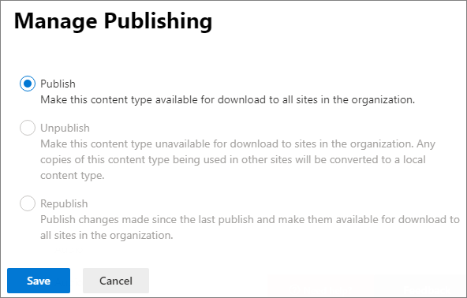

# Publish a content type from a content publishing hub

> [!NOTE]
> References to "hub" within this document are referring to content type syndication hubs, not SharePoint hubs. For more info about these items, see [What is a SharePoint hub?](https://support.microsoft.com/office/what-is-a-sharepoint-hub-site-fe26ae84-14b7-45b6-a6d1-948b3966427f).

If you are working on a content type hub that publishes content types to other site collections, you can publish, unpublish, or republish content types centrally.

> [!IMPORTANT]
> To manage content type publishing on a content type hub, you must be a Site Collection admin.

1. Go to the SharePoint admin center.

2. Under **Content services**, select **Content type gallery**.

3. On the **Content type gallery** page, under the **Site content type** column, select the name of the site content type for which you want to manage updates. That site content type page appears.

4. In the menu bar, select **Publish**. The **Manage Publishing** panel appears.

    

> [!NOTE]
> In the list, if you don’t see **Publish**, then this site is not a content type hub. To manage updates for the content type, go to the content type hub. For more info about creating a content type hub, see [Activate a content type syndication hub](https://support.microsoft.com/office/activate-a-content-type-syndication-hub-in-sharepoint-server-versions-1d12ee7f-77e0-4b50-bf93-7628b8478bf6).

5. On the **Manage Publishing** page, do one of the following:

    - To make this content type available for download to all sites in the organization, select **Publish**.

    - To make this content type unavailable for download to sites in the organization, select **Unpublish**. Any copies of this content type being used in other sites will be converted to a local content type.

6. To publish changes made since the last publish and make them available for download to all sites in the organization, select **Republish**.

7. Select **Save**.

## Find the URL for a content type hub

To manage a content type, you must go to the content type hub where that content type is published. To find the URL for the content type hub that your site subscribes to, follow these steps:

1. Go to the SharePoint admin center.

2. Select **Sites**, and then select **Active sites**.

3. From the **Active sites** page, in the **Site name** column, select the name of the site you want to manage. The site name panel appears.

    

4. In the **Hub association** section, the names of any Managed Metadata Service apps appear that publish content types to this site collection listed in bold text. In the **URL** section, the URLs for the content type hubs are listed after the service app names. A list of the subscribed content types also appears.

Subscribed content types are read-only on subscriber sites. If you want to change a content type that was published to your site, select the URL for the content type hub.

## Get updates for published content types from a subscriber site

If you're working on a site that subscribes to content types from a content type hub, you'll automatically receive updates when they are published from the content type hub. You can refresh the content types at any time to receive any recent updates.

1. Select **Settings** , and then select **Site Settings**.

2. Under **Site Collection Administration**, select **Content type publishing**.

3. In the **Refresh All Published Content Types** section, select **Refresh all published content types on next update**.

> [!NOTE]
> To create or manage a site content type on a site, you must have at least **Design** permissions to that site.

## See also

[Activate a content type syndication hub](https://support.microsoft.com/office/activate-a-content-type-syndication-hub-in-sharepoint-server-versions-1d12ee7f-77e0-4b50-bf93-7628b8478bf6)

[Introduction to content types and content type publishing](https://support.microsoft.com/office/introduction-to-content-types-and-content-type-publishing-e1277a2e-a1e8-4473-9126-91a0647766e5?redirectSourcePath=%252fen-us%252foffice%252fintroduction-to-content-types-and-content-type-publishing-a5026d23-8df8-42f6-b0d6-1920880c0d03&ui=en-US&rs=en-US&ad=US)

[Manage content type publishing](https://support.microsoft.com/office/manage-content-type-publishing-06f39ac0-5576-4b68-abbc-82b68334889b?ui=en-US&rs=en-US&ad=US)