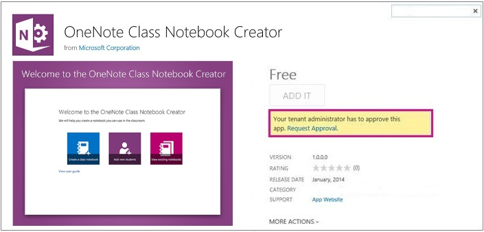
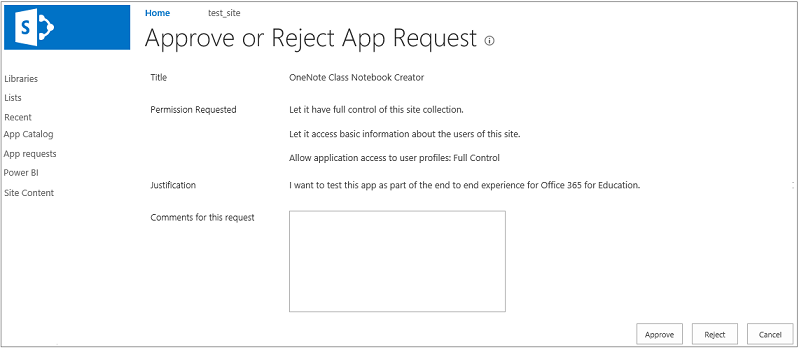
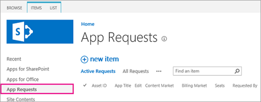

# Request app installation permissions

Apps are small, easy-to-use web applications that add functionality to SharePoint sites. They offer unlimited possibilities for customizing your sites in ways that are specific to your organization. For example, you can add apps that perform general tasks such as time and expense tracking, or apps that make it easy for customers to contact you, or productivity apps that enable you to establish data connections and develop reports for your stakeholders. 
  
Some apps are included with SharePoint, others might be developed by your organization, and still others are created by third-party developers and available for purchase from the SharePoint Store. 
  
 Only those users who have the appropriate permission level can add apps to a site. Typically, Full Control permission (or membership in the Site Owners group) is the minimum requirement. But some apps require access to data sources or web services to read data required for the app. This kind of app has permissions associated with it. When the app requires organization-level permissions, the requestor will need approval from an Office 365 admin to continue with the installation. The approval process includes a workflow, called the permission request flow, which ensures installation requests are directed to the right person. 
  
This article is intended for global admins and SharePoint admins at the organization level who receive requests for app installation.
  
## How the permission request flow works

When users encounter an app that requires admin permission to install, they'll see a **Request Approval** link on the app details page. 
  

  
 Clicking the link displays an **App Request** dialog box where they provide justification for the request. 
  

  
When they click **Request**, an automated email is sent to everyone who is a site collection admin for the app catalog.
  
> [!NOTE]
> Sometimes, depending on the Office Store settings, the **App Request** dialog box will include a place for users to indicate the number of licenses required along with the justification. See [Configure settings for the SharePoint Store](configure-settings-for-the-sharepoint-store) for more information. 
  
 **Approve or deny requests**
  
1. In the auto-generated email that you receive for the request, click **You can now approve or reject the request here**. 
    
2.  On the **Approve or Reject App Request** screen, in the **Comments** box, provide relevant information about your decision. 
    
3. Either select: 
    
  - **Approve** to approve the request and send an auto-generated email to the requester. 
    
  - **Reject** to deny the request and send an auto-generated email to the requester. 
    
     
  
The app catalog is where you store and manage all apps for the organization. There you can see a list of all pending app installation requests. 
  
 **View all requests**
  
1. Browse to your app catalog. (In the SharePoint admin center, select **apps** in the left pane and then click the **App Catalog** link.) 
    
2. Click **Settings**> **Site settings** > **Site Collection Administration** > **Manage App Requests**.
    
3. In the left nav, select **App Requests**.
    
     
  
4. Click the title of each pending request to review it. Once the request is approved or denied, it is removed from the view. If you change your mind about allowing an app or apps to be added to you sites, you can revoke approval on the request. To revoke approval for a request, choose the request and click **Remove Approvals**.
    
## Delegate approval authority

As a global admin or SharePoint admin in your organization, you can delegate app approval authority as a way of spreading the approval work around, or alleviating approval bottlenecks. Remember that apps are stored and managed in the app catalog, and the app catalog is a site collection. Therefore, to grant app approval permission to select users, you add them to the site collection administrator group on the app catalog. 
  
> [!CAUTION]
> When you promote users to site collection administrators on the app catalog site collection, you are giving them the ability to approve the installation of apps that have organization-wide impact. Consider this decision carefully. 
  
 **Add site collection admins to the app catalog**
  
1. Browse to your app catalog. (In the SharePoint admin center, select **apps** in the left pane and then click the **App Catalog** link.) 
    
2. Select **Settings** > **Site settings** > **Users and Permissions** > **Site collection administrators**.
    
3. Type the name of the group or individuals who you want to add as site collection administrators.
    
4. Select **OK**.
    

