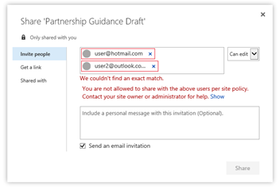

# Restrict sharing of SharePoint and OneDrive content by domain

If you want to restrict sharing with other organizations (either at the organization level or site level), you can limit sharing by domain.

> [!NOTE]
> If you have enrolled in the [SharePoint and OneDrive integration with Azure AD B2B Preview](sharepoint-azureb2b-integration-preview.md), invitations in SharePoint are also subject to any [domain restrictions configured in Azure Active Directory](https://docs.microsoft.com/azure/active-directory/b2b/allow-deny-list).

## Limiting domains

You can limit domains by allowing only the domains you specify or by allowing all domains except those you block.
  
 **To limit domains at the organization level**
  
1. Go to the [Sharing page of the SharePoint admin center](https://admin.microsoft.com/sharepoint?page=sharing&modern=true) and sign in with an account that has [admin permissions](/sharepoint/sharepoint-admin-role) for your organization.

    >[!NOTE]
    >If you have Microsoft 365 Germany, [sign in to the Microsoft 365 admin center](https://go.microsoft.com/fwlink/p/?linkid=848041), then browse to the SharePoint admin center and open the Sharing page.  If you have Microsoft 365 operated by 21Vianet (China), [sign in to the Microsoft 365 admin center](https://go.microsoft.com/fwlink/p/?linkid=850627), then browse to the SharePoint admin center and open the Sharing page.
    
2. Under **Advanced settings for external sharing**, select the **Limit external sharing by domain** check box, and then select **Add domains**.
    
3. Select **Allow only specific domains** to create an allow list (most restrictive) or **Block specific domains** to block only the domains you specify.
    
4. List the domains (maximum of 3000) in the box provided, using the format  *domain.com.* If listing more than one domain, enter each domain on a new line.
    
    > [!NOTE]
    > Wildcards are not supported for domain entries.

5. Click **Save**.

You can also configure the organization-wide setting by using the [Set-SPOTenant](https://docs.microsoft.com/powershell/module/sharepoint-online/Set-SPOTenant) PowerShell cmdlet.
  
You can also limit domains at the site collection level. Note the following considerations:
  
- In the case of conflicts, the organization-wide configuration takes precedence over the site collection configuration.
    
- If an organization-wide allow list is configured, then you can only configure an allow list at the site collection level. The site collection allow list must be a subset of the organization's allow list.
    
- If an organization-wide deny list is configured, then you can configure either an allow list or a deny list at the site collection level.
    
- For individual OneDrive site collections, you can only configure this setting by using the [Set-SPOSite](https://docs.microsoft.com/powershell/module/sharepoint-online/Set-SPOSite) Windows PowerShell cmdlet.
    
 **To limit domains for a site**

1. Go to the [Active sites page in the new SharePoint admin center](https://admin.microsoft.com/sharepoint?page=sitemanagement&modern=true) and sign in with an account that has [admin permissions](/sharepoint/sharepoint-admin-role) for your organization.

    >[!NOTE]
    >If you have Microsoft 365 Germany, [sign in to the Microsoft 365 admin center](https://go.microsoft.com/fwlink/p/?linkid=848041), then browse to the SharePoint admin center and open the More features page.  If you have Microsoft 365 operated by 21Vianet (China), [sign in to the Microsoft 365 admin center](https://go.microsoft.com/fwlink/p/?linkid=850627), then browse to the SharePoint admin center and open the More features page.
    
2. Click the site that you want to restrict domains on.
 
3. On the **Policies** tab, click **Edit** under **External sharing**.
    
2. Under **Advanced settings for external sharing**, select the **Limit external sharing by domain** check box, and then select **Add domains**.
    
3. Select **Allow only specific domains** to create an allow list (most restrictive) or **Block specific domains** to block only the domains you specify.
    
4. List the domains (maximum of 100) in the box provided, using the format  *domain.com.* If listing more than one domain, enter each domain on a new line.
    
    > [!NOTE]
    > Wildcards are not supported for domain entries.

5. Click **Save**, and then click **Save** again.  

    > [!NOTE]
    > To configure the site collection setting for site collections that do not appear in this list (such as Group-connected sites or individual OneDrive site collections), you must use the [Set-SPOSite](https://go.microsoft.com/fwlink/?linkid=2003901) PowerShell cmdlet.
  
## Sharing experience

After you limit sharing by domain, here's what you'll see when you share a document:
  
- **Sharing content with email domains that are not allowed.** If you attempt to share content with a guest whose email address domain isn't allowed, an error message will display and sharing will not be allowed.

    (If the user is already in your directory, you won't see the error, but they will be blocked if they attempt to access the site.)
    
    

- **Sharing OneDrive files with guests on domains that aren't allowed.** If a users tries to share a OneDrive file with a guest whose email domain isn't allowed, an error message will display and sharing will not be allowed.

    
  
- **Sharing content with email domains that are allowed.** Users will be able to successfully share the content with the guest. A tooltip will appear to let them know that the guest is outside of their organization.
    
    
  
## User auditing and lifecycle management

As with any extranet sharing scenario it's important to consider the lifecycle of your guest users, how to audit their activity, and eventually how to archive the site. See [Planning SharePoint business-to-business (B2B) extranet sites](plan-b2b-extranet-sites.md) for more information.
  
## See also

[External sharing overview](external-sharing-overview.md)
  
[Extranet for Partners with Microsoft 365](create-b2b-extranet.md)
  
[Set-SPOTenant](https://go.microsoft.com/fwlink/?linkid=2003900)
