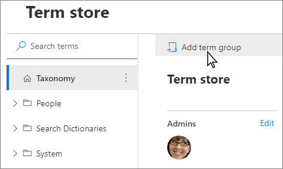

# Set up a new group for term sets

In the Term Store Management Tool, a group is a set of term sets that all share common security requirements. Only users who are designated as Contributors to a specific group can manage term sets that belong to the group or create new term sets within it. Organizations should create unique groups for term sets that will have unique access or security needs. For info about how to create a term set, see [Set up a new term set](set-up-new-term-set.md). 
  
> [!IMPORTANT]
>  To create a new term set group, you must be a Term Store admin. 
  

  
To set up a new group for term sets, follow these steps.
   
1. [Open the Term Store management tool](open-term-store-management-tool.md).
    
2. In the tree view pane, select the taxonomy. Then point to it, select the arrow that appears, and then select **Add term group**.
    
3. Type a name for your new group, and then press ENTER.
    
4. To edit the Term group **name** and **description**, select **Edit**. The **Edit name and description** panel appears. Enter a description to help users understand the purpose of this term group. Select **Save**. 
    
5. To edit **Group Managers**, select **Edit**. The **Edit admins** panel appears. Enter a name or email address to create new term groups, and set and assign users to the group manager role. Select **Save**.
    
6.  To edit **Contributors**, select **Edit**. The **Edit admins** panel appears. Enter a name or email address to create new term groups, and set and assign users to the group manager role. Select **Save**.
    
7. To copy the unique identifier for this term group, select **Copy**.
    
> [!NOTE]
>  To add term set, rename term group, delete term group, or import a term set, to the right of the group name, select the **More options** (vertical ellipsis icon), and make your selection. You can only delete empty groups. 
  