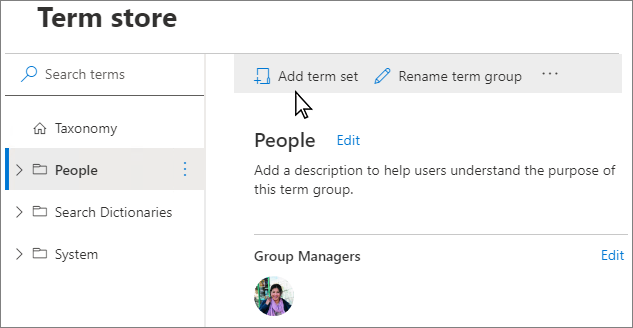

# Set up a new term set

To set up a new term set, you must access the Term Store Management Tool, and then use the tool to specify the term set properties.
  
.
  
> [!IMPORTANT]
>  To add a term set in the Term Store Management Tool, you must be a Contributor, Group Manager or a Term Store admin. 
  
To set up a new term set, follow these steps.
  
1. [Open the Term Store Management Tool](open-term-store-management-tool.md).
    
2. In the tree-view navigation pane, expand the groups to find the group to which you want to add a term set.
    
3. Point to the term set where you want to add a term, select the **More options** (vertical ellipsis icon), and then select **Add term set**.
    
4. Enter the name that you want to use as the default label for your term in the newly created term in the tree view.
    
5. Under the **General** tab, for **Owner**, select **Edit**. The **Edit Properties** panel appears. Specify the following information about who owns and maintains this term set: 
    
  1. **Term Set owner**: If you want the owner of the term set to be someone other than you, enter the person, group, or email address for who will maintain this term set. This field should already be populated with the name of the column, but you can update it or change it.
    
  2. **Stakeholders**: Add the names of users, groups, or email addresses that should be notified before major changes are made to the term set.
    
  3. **Contact**: If you want site users to be able to provide feedback on the term set, enter an email address.
    
  4. Select **Save**.

6. Under the **Usage settings** tab, for **Submission policy**, select **Edit**. The **Edit submission policy** panel appears.
    
    1. Specify whether you want the term set to be **Closed** or **Open**. If you select **Closed**, only people with contribute permissions can add terms to this term set. If you select **Open**, users can add terms from a tagging application.

    2. Select **Save**.
    
7. Under the **Usage settings** tab, for **Available for tagging**, select **Edit**. The **Available for tagging** panel appears.

    1. Select the **Enable** check box to make the terms in the term set available for tagging. If you clear the **Enable** check box, this term set won't be visible to most users. If the term set is still in development, or is not otherwise ready for use, you might want to clear the **Enable** check box.

    2. Select **Save**.

8. Under the **Usage Navigation** tab, for **Use term set for site navigation**, select **Edit**. The **Edit Properties** panel appears.

    1. Select the **Enable** check boxes to use this term set for site or faceted navigation. Disabling site navigation means you cannot use the term set for features like friendly URLs, target page settings, catalog item page settings, and so on. Enabling site navigation means you can use the terms in this term set for site navigation links with friendly URLs and dynamic content. Disabling faceted navigation means users cannot use refiners based on managed metadata from the search index to quickly browse to specific content; the opposite for enabling faceted navigation.

    2. Select **Save.**

    3. Enabling either using the term set for site or faceted navigation opens two more options:
    
      1. For **Custom target page**, select **Edit**. The **Edit term set target page** panel appears. Move the toggle switch to enable **Use a custom target page**. Select **Select**, and then select **Save**. The target page appears when users navigate to a friendly URL in this term set. You can choose a custom target page if you want to display a specific page. Custom target pages that you set for individual terms will override this setting.

      2. For **Custom catalog item page**, select **Edit**. The **Edit term set catalog item page** panel appears. Move the toggle switch to enable **Use a custom catalog item page**. Select **Select** and then select **Save**. If terms in this term set are used as catalog categories, you can select the page used to render catalog data for items under those categories.

9.  Under the **Advanced** tab, for **Translation**, select **Manage**. The **Translation** panel appears.

      1. To use machine translation to translate this term set into the working languages for the term store, select **Start**. You must repeat the translation each time you update the term set. The **Machine translation** panel appears. For the terms you want to translate, select either **All terms**, or **Only the terms updated since the last translation**. From both the **Translate from** and **Translate to** dropdowns, select a language. Select **Translate.**
      
      2. Use manual translation for applying a custom translation file as per your requirement to configure the term set. To export this term set to XLIFF, select **Export**. To import an XLIFF document to translate this term set, select **Import**.

      3. Select **Close.**

    For **Custom properties**, select **Edit**. The **Edit Custom properties** panel appears. Use custom properties to store additional data about a term set.

      1. Enter a **Property name** and **Value**, and then select **Add**. Select **Save.**
    
    
To learn how to add a term to the new term set, see [Create and manage terms in a term set](create-and-manage-terms.md).
  