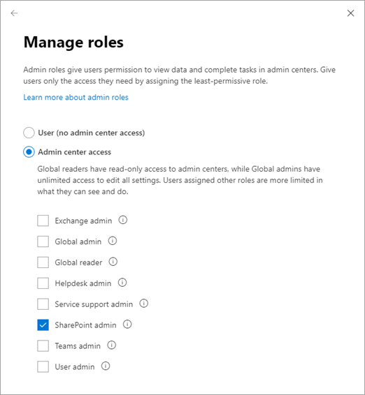

# About the SharePoint admin role in Microsoft 365

Global admins in Microsoft 365 can assign users the SharePoint admin role for help with administering Microsoft SharePoint. The global admin role already has all the permissions of the SharePoint admin role. For info about assigning a user the SharePoint admin role, see [Assign admin roles in Microsoft 365 for business](/office365/admin/add-users/assign-admin-roles).

   
  
Users assigned the SharePoint admin role have access to the SharePoint admin center and can create and manage sites (previously called "site collections"), designate site admins, manage sharing settings, and more. 

> [!IMPORTANT]
> SharePoint admins can now manage Microsoft 365 groups, including creating, deleting, and restoring groups, and changing group owners.

Global admins and SharePoint admins don't have automatic access to all sites and each user's OneDrive, but they can give themselves access to any site or OneDrive. They can also use Microsoft PowerShell to manage SharePoint and OneDrive. See more about this role's [Key tasks of the SharePoint admin](sharepoint-admin-role.md#BK_KeyTasks) below. 
  
Site admins are users that have permission to manage sites, including any subsites. They don't need to have an admin role in Microsoft 365, and aren't given access to the SharePoint admin center. 
  
> [!NOTE]
> Global admins, SharePoint admins, and site admins all need to be assigned a SharePoint license.  There is a separate role within SharePoint called the **Term Store Administrator**. Users assigned this role can add or change terms in the term store (a directory of common terms you want to use across your organization). To learn more, see [Assign roles and permissions to manage term sets](assign-roles-and-permissions-to-manage-term-sets.md). 
  
## Key tasks of the SharePoint admin

Here are some of the key tasks users can do when they are assigned to the SharePoint admin role: 
  
- [Create sites](create-site-collection.md)
    
- [Delete sites](delete-site-collection.md)
    
- [Manage sharing settings at the organization level](turn-external-sharing-on-or-off.md)
    
- [Add and remove site admins](manage-site-collection-administrators.md)
    
- [Manage site storage limits](manage-site-collection-storage-limits.md)

    
  
## Related topics

[About Microsoft 365 admin roles](/office365/admin/add-users/about-admin-roles)
  
[Getting started with SharePoint Online Management Shell](/powershell/sharepoint/sharepoint-online/connect-sharepoint-online)

