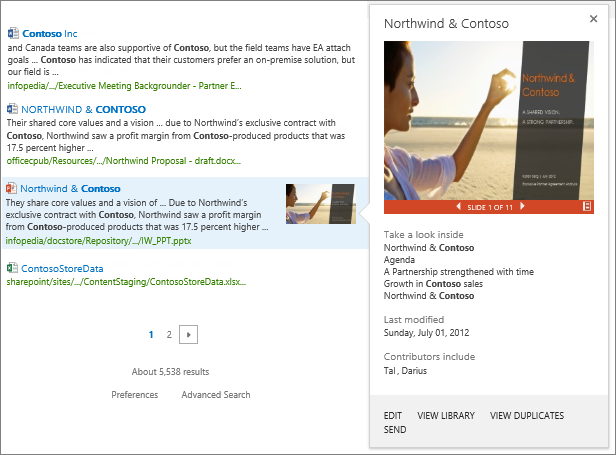
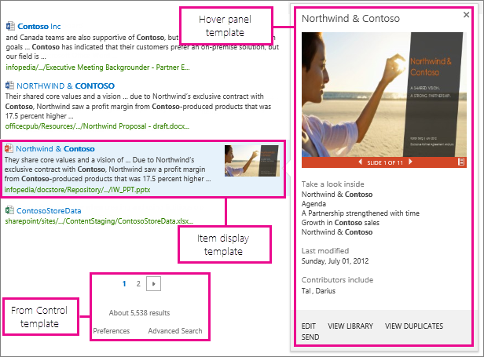
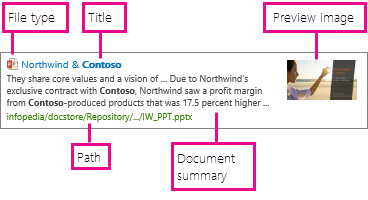

# Change how search results look by using result types and display templates

To help users quickly distinguish between different types of results when they search for something in SharePoint, we use  *result types*  and  *display templates*  . Important information is shown directly in the search results, so that users don't have to click on each result to see if they've found what they're looking for. 
  
By default, the Search Results Web Part in your Search Center is set up to use different display templates according to the result type of the search result. [Result types](manage-result-types.md) define when to use which display template, and the  *display template*  defines what information to show in the search results. 
  
For example, there's a display template for PowerPoint files and another display template for Word documents. A result type says that if the search term is found in a PowerPoint file, then use the PowerPoint display template when showing that result. The users can see right away that this result is a PowerPoint file, and they can also see other information that helps them see whether this result is what they're looking for. When users hover over the result, they'll see a preview of the PowerPoint in the hover panel, together with more details about it. The hover panel also lets users perform  *actions,*  such as **Edit** or **Send**. The same way, the result type for Word documents uses a Word display template to show information.
  
**Results look different based on result type and display template. This picture shows item display templates for Word, PowerPoint and Excel on the left side, and a hover panel display template for PowerPoint on the right side.**

  
## Types of display templates used in the Search Results Web Part

The default [Search Center](manage-search-center.md) on your site consists of different Web Parts: a Search Box Web Part, a Search Results Web Part, a Search Navigation Web Part, and a Refinement Web Part. The actual search results are shown in the **Search Results Web Part**, All these Web Parts can also be added to any of your site's pages. 
  
For the Search Results Web Part, there are three main types of display templates you should know about, Control display templates, Item result templates, and Hover panel templates.
  
The  *Control display template*  decides the overall structure of how the results are presented. It contains the things "around" the individual results, such as a heading, numbering, next and previous page buttons, and a "no results found" message. 
  
An  *Item display template*  defines how each result is displayed. It defines the managed properties you want to show and how they're displayed. You can have different item display templates for different result types. 
  

  
The  *Hover panel display template*  typically shows a preview of the item or document when the users hover over the search result. The hover panel display template also contains actions such as **Edit** or **Send**, and other information about the search result. 
  
## How display templates show information about search results

The search results contain information that'll help users identify whether the result is what they're looking for. The display templates show this information by surfacing  *managed properties*  . Managed properties are content and metadata stored in the search index, for example the author and the title of a document. The display templates show a selection of the managed properties in the search results, such as file type, title, document summary, path, and image. 
  

  
You can create your own display templates that show information that's important to your users, for specific types of results.
  
- For more information about managed properties, see [Manage the search schema in SharePoint Online](manage-search-schema.md).
    
- - For information about the Search Center and how to set it up, see [Manage the Search Center in SharePoint Online](manage-search-center.md).
    
- For a full list of available display templates, see **Display templates for the Search Results Web Part** in [Display template reference in SharePoint Server 2013](https://technet.microsoft.com/en-us/library/jj944947.aspx).
    

