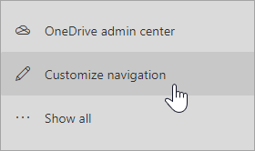
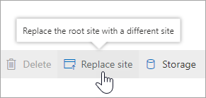
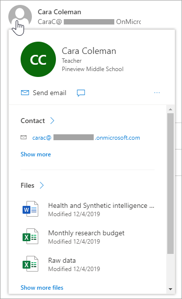
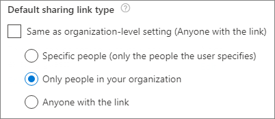
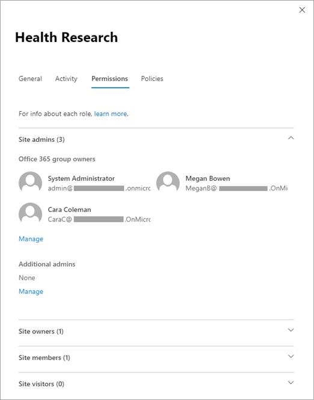
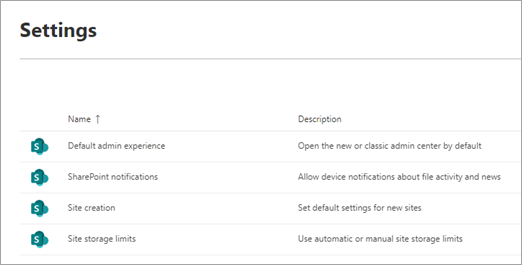

# What's new in the SharePoint admin center

We're continuously adding new features to the new SharePoint admin center and fixing issues we learn about. Here's a summary of what's included. You can help us improve the admin center by sending us your suggestions and reporting bugs you encounter. In the lower-right corner of the admin center, click the **Feedback** button.
  
> [!NOTE]
> The new SharePoint admin center is supported in Microsoft Edge, Internet Explorer, Chrome, Firefox, and Safari.   Some functionality is introduced gradually to organizations that have opted in to the [Targeted release option in Microsoft 365](/office365/admin/manage/release-options-in-office-365). This means that you might not yet see some features described in this article.  To see what's recently rolled out in the Microsoft 365 admin center, see [What's new in the MIcrosoft 365 admin center](/office-365/admin/whats-new-in-preview).
  
## December 2019

- **Customizable navigation pane**. You can [customize the navigation pane to show or hide items](/sharepoint/get-started-new-admin-center#customize-the-navigation-pane).
    
    

- **Root site replacement**. On the [Active sites page](https://admin.microsoft.com/sharepoint?page=siteManagement&modern=true), you can [select and replace the root site](modern-root-site.md). 

    

- **People cards**. On the [Active sites page](https://admin.microsoft.com/sharepoint?page=siteManagement&modern=true), you can point to a name in the Primary admin column or on the Permissions tab of the details panel and see info about the person. 

    

- **Redesigned details panel**. On the [Active sites page](https://admin.microsoft.com/sharepoint?page=siteManagement&modern=true), the details panel that appears when you select a site has been redesigned to divide the information among multiple tabs. [Learn more about managing sites](manage-sites-in-new-admin-center.md)

    

- **Additional site-level sharing settings**. On the [Active sites page](https://admin.microsoft.com/sharepoint?page=siteManagement&modern=true), when you select a site and then select **Sharing**, you can [change the default sharing link type and default link permissions for the site](change-external-sharing-site.md). 

    

- **Site permission details**. On the [Active sites page](https://admin.microsoft.com/sharepoint?page=siteManagement&modern=true), a new experience lets you manage all site admins in one panel, view site members and visitors, and add site admins to sites that belong to Microsoft 365 groups. [Learn more about managing site permissions](site-permissions.md) 

    

- **Redesigned Settings page**. The [Settings page](https://admin.microsoft.com/sharepoint?page=settings&modern=true) has been redesigned to let you see the value for each setting without selecting each one for more info.

    

- **Updated More features page**. Classic features can now be found on the [More features page](https://admin.microsoft.com/sharepoint?page=classicfeatures&modern=true). [Learn where to find features in the new SharePoint admin center](/sharepoint/get-started-new-admin-center#where-to-find-things-in-the-new-sharepoint-admin-center)

    

## November 2019

- If you're using the [new sensitivity labels](/office-365/compliance/sensitivity-labels-teams-groups-sites), you can view and edit them from the Active sites page.

## October 2019

- From the Active sites page, you can [change site addresses](change-site-address.md).

## June 2019

- The new SharePoint admin center is set as the default experience unless you select to open the classic SharePoint admin center by default (on the Settings page). [Learn how to select the default admin experience](/sharepoint/get-started-new-admin-center#open-the-new-sharepoint-admin-center-by-default)
- On the Active sites page, you can select multiple sites and bulk edit sharing and hub association settings.
- Classic SharePoint admin features such as Term Store, User Profiles, Search, Apps, and more are available from the More features page so you can access them directly from the new SharePoint admin center.

## In case you missed it

### Home page and left pane
  
- Two charts, along with messages and service health filtered to SharePoint
    
- Links to the Microsoft 365 admin center for detailed reports, message center posts, and service health info
    
- Links to the OneDrive admin center and SharePoint Migration Tool
    
- A geo location selector for organizations that have set up Multi-Geo in OneDrive and SharePoint
    
### Active sites page
  
- A list that includes the new types of sites that users create: team sites that belong to Microsoft 365 groups and communication sites
    
- The ability to create sites (including sites that belong to Microsoft 365 groups and communication sites) using the same experience available to users
    
- Extensive site info and insights such as site name, template, file and sharing info, and date created and modified
    
- The ability to sort, filter, and customize columns, as well as search by all text fields

- The ability to view and filter by hub association, and change a site's hub association
    
- Built-in views and the ability to create custom views
    
- The ability to edit site-level sharing status
    
- Export to CSV
    
- Support for locked sites and sites on hold
    
### Deleted sites page
  
- A list of deleted sites with time deleted
    
- The ability to restore sites individually

- The ability to permanently delete sites, except sites connected to a Microsoft 365 group
    
### Sharing page
  
- Organization-level external sharing settings, and file and folder link settings

### Access control page
  
- The ability to create policies that restrict access from unmanaged devices, sign out users from inactive browser sessions, allow access from only specific IP addresses, and block access from apps that don't use modern authentication.

### Settings page
  
- Settings for sync (if your organization used the previous sync app), notifications, site storage limits, default admin experience, and site creation

### API management page
  
- The ability to view pending and approved web API permissions and approve or reject access requests
