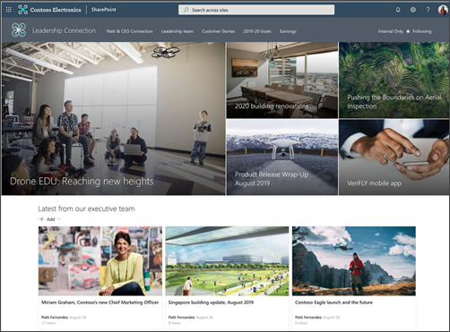
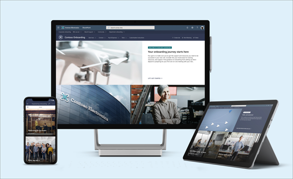

# Engage audiences with workplace communication

Learn how to keep everyone informed and engaged using SharePoint, Microsoft Teams, Yammer, and Stream for live events and other workplace communication methods across your M365 environment. Learn more about the powerful strategies and communication tools available to you that help drive engagement in your organization.
In this article:

-	Introduction to live events across Microsoft 365 applications
-	Learn how to connect leaders and team members using live events
-	Learn how to create a culture of inclusion using personalization and multilingual features
-	Discover the best communication channels and methods for your workplace

## Introduction to live events across Microsoft 365

You can create a live event wherever your audience, team, or community is currently communicating using Microsoft Stream, Microsoft Teams, Yammer, and SharePoint. Your organization’s goals and M365 configuration will determine how you leverage and combine M365 apps to host live events. 

Live events allow attendees to receive notifications and to participate in real time, with high-definition videos and interactive discussion on Teams or Yammer web, mobile, and desktop apps. After an event, it’s easy to make the recording available on an event page in SharePoint. The recording is automatically transcribed by Stream and detects changes in speakers and topics, making it easy to search for content later. 

These features become especially valuable when considering employees who are in different time zones or unable to attend live. Keep the conversation going so everyone still feels connected with leaders and peers after the event, which is a great method to overcome geographical and organizational boundaries.

[Learn more about live events across M365 apps](https://resources.techcommunity.microsoft.com/live-events/).

## Benefits of using live event features across SharePoint, Teams, Yammer, and Stream:

Employee engagement is a major contributor to workplace satisfaction, loyalty, and productivity at any organization. Interactive live events allow program coordinators to effectively communicate business updates, training opportunities, and announcements in a way that makes an impact on the daily lives of employees and fosters ongoing collaboration and knowledge-sharing.

-	**Reach large audiences with video and interactive discussion.** Viewers can join the event regardless of their office location or work-from-home status.
-	**Share your screen or share the stage.** Easily deliver live events sharing content from your desktop or webcam. For high-profile events, connect to professional cameras, multiple content sources, and more.
-	**Empower everyone to participate.** Moderated attendee Q&A or open dialog including all participants provide multiple options for interactions during broadcasts.
-	**Watch recorded events anytime with on-demand events.** Ensure viewers never miss an event with on-demand video. Now anyone can catch up quickly and see transcripts, captions, and speaker timelines to help find the moments that matter to them.

### Summary of live event apps:

Your organization’s goals and M365 configuration will determine how you leverage and combine M365 apps to host live events.

**Teams** - If you want your audience to view the event in Microsoft Teams, create the event so your viewers can join and watch from [Microsoft Teams](https://docs.microsoft.com/MicrosoftTeams/teams-live-events/what-are-teams-live-events). 
**Yammer** - If your audience is already using Yammer, you can create live events and have them show up directly in [Yammer](https://docs.microsoft.com/yammer/manage-yammer-groups/yammer-live-events) where the viewers can participate in live discussions before the event, while watching the event, and after the event. 
**Stream** – If you don’t want viewers to watch the event in either application, you can use [Stream](https://docs.microsoft.com/stream/live-event-overview).

## How to decide which app is best for your live event

There are other considerations besides tenant configuration that will determine which apps you select depending on the level of engagement desired and governance policy of your organization. Depending on which service you create the live event from, and the type of event, there will be a different set of features available as the producer, presenter, and viewer of the live event. 

While planning your event, ask and find answers to these questions:

-	What application are users currently using to attend live events and watch videos?
-	What device are users likely to use when attending a live event or watching a video?
-	How do you want viewers to engage with event presenters?
-	What production set up is preferred?
-	What are the ideal post-event next steps?

Learn more about the [differences between live events in Teams, Yammer, and Stream](https://docs.microsoft.com/stream/live-event-m365) to get answers to these questions. Use [site and hub analytics](https://support.microsoft.com/office/view-usage-data-for-your-sharepoint-site-2fa8ddc2-c4b3-4268-8d26-a772dc55779e) to get more insights about how users are currently engaging with SharePoint content to help you make decisions. 

## Leadership connection

Bring the organization together by combining communication channels with M365 live event features across Stream, Yammer and Teams. Then, see how you can leverage SharePoint using the [leadership connection guided walkthrough](https://support.microsoft.com/office/guided-walkthrough-creating-a-leadership-site-for-your-organization-e4a984db-d277-45ab-b18e-fa117b25bb4d) example to create sites that help connect viewers with leadership by creating new communication channels and a video archive library of recorded events for later viewing.

### Company-wide events

Large events that include all employees like “town halls” or “all hands meetings” are one of the ideal scenarios for leveraging a live event. When planning for a live event, start by ensuring your M365 environment is set up and configured following guidance for each app in the *admin* section. The admin role is responsible for all the work behind the scenes work that makes the event possible and ensures the live event follows your organization’s security and compliance policies. Then, learn about live event planning and production in the section for the *producers* and *presenters*. 

|Teams|Yammer|Stream |
|:----------|:---------|:-----------|
| Admin   | Admin  |  Admin |
| 1. [Admin quick start](https://docs.microsoft.com/MicrosoftTeams/quick-start-meetings-live-events) - get ready for Microsoft Teams live events   2. [Set up](https://docs.microsoft.com/MicrosoftTeams/teams-live-events/set-up-for-teams-live-events) and [configure settings](https://docs.microsoft.com/MicrosoftTeams/teams-live-events/configure-teams-live-events) in Teams live events for your tenant   3. Start [planning a live event in Teams](https://docs.microsoft.com/MicrosoftTeams/teams-live-events/plan-for-teams-live-events) | 1. Review the [Yammer live events overview](https://docs.microsoft.com/yammer/manage-yammer-groups/yammer-live-events)    2. Understand there are some changes between the [new Yammer and classic Yammer](https://docs.microsoft.com/yammer/get-started-with-yammer/newyammer-faq) | 1.	Get started with [live events in Microsoft Stream](https://docs.microsoft.com/stream/portal-get-started)   2. [Create a live event](https://docs.microsoft.com/stream/live-create-event)   3. [Use Microsoft Stream in Teams](https://docs.microsoft.com/stream/embed-video-microsoft-teams) |
| Presenters and producers | Presenters and producers | Presenters and producers |
| 1. [Get started with Teams live events](https://support.microsoft.com/office/get-started-with-microsoft-teams-live-events-d077fec2-a058-483e-9ab5-1494afda578a)   2. Learn how to [produce an event](https://support.microsoft.com/en-us/office/produce-a-live-event-using-teams-591bd694-121d-405c-b26d-730315e45a22)    3. [Plan and schedule a live event](https://support.microsoft.com/office/plan-and-schedule-a-live-event-f92363a0-6d98-46d2-bdd9-f2248075e502)   4. Use the [Teams live event organizer checklist](https://support.microsoft.com/office/teams-live-event-organizer-checklist-44a80886-0fd9-42e5-8e7c-836c798096f8)   5. [Manage recordings and reports](https://support.microsoft.com/office/manage-a-live-event-recording-and-reports-in-teams-6d1f5da9-74b7-4771-977d-b89eba194578)| 1. [Organize and event in Yammer](https://support.microsoft.com/office/organize-a-live-event-in-new-yammer-7338782a-4f0b-4fd0-a6c3-33625906ead1)   2. [Review Step-by-step playbook](https://resources.techcommunity.microsoft.com/wp-content/uploads/2019/05/How-to-host-a-Live-Event-in-Yammer-Playbook.pdf) of hosting an event in Yammer  	3. [Learn how to drive engagement for your Yammer event](https://support.microsoft.com/office/drive-engagement-in-a-new-yammer-live-event-af1c289a-a511-4622-8864-6fa5bcc948f5) | Use the [Stream web part](https://support.microsoft.com/office/use-the-stream-web-part-b97fa87c-1337-4271-a059-17f0d2b26e8b) to add a video to a SharePoint page |

### Create a leadership site in SharePoint 

 
Use SharePoint to create a place for your organization to share news from leadership and recordings from company-wide events. Get inspiration from a [step-by-step example of how to create a leadership site for your organization](https://support.microsoft.com/office/guided-walkthrough-creating-a-leadership-site-for-your-organization-e4a984db-d277-45ab-b18e-fa117b25bb4d). 

 
In this example you’ll see a great way to leverage recordings of live events on a SharePoint page. Showcase recordings on a page using the [Stream web part](https://support.microsoft.com/office/use-the-stream-web-part-b97fa87c-1337-4271-a059-17f0d2b26e8b). Then, create a list of links to previous recordings using the [Quick links web part](https://support.microsoft.com/office/use-the-quick-links-web-part-e1df7561-209d-4362-96d4-469f85ab2a82). Consider adding the [Events web part](https://support.microsoft.com/office/use-the-events-web-part-5fe4da93-5fa9-4695-b1ee-b0ae4c981909) to your leadership site to share upcoming company-wide events with all employees.

## Create a culture of inclusion

Technology allows for a much broader reach across the globe and can be used to keep organizations connected. Leverage live event to foster a culture of inclusion that ensures all employees can participate in opportunities to network with each other, engage in collaborative discussions, and connect to leadership. See how you can leverage M365 live event features and other communication channels into SharePoint pages to boost reach and viewership for important content.

-	**Welcome new team members** – Provision the [New employee onboarding template](https://lookbook.microsoft.com/details/75e60a32-9849-4ed4-b83e-b2b08983ad19) to create a welcoming and inclusive environment for new team members.
-	**Keep the conversation going with Yammer** – The [Yammer conversations or highlights web parts](https://support.microsoft.com/office/use-a-yammer-web-part-in-sharepoint-online-a53cfa0c-3d09-42c8-a286-1038a81c59da?ui=en-us&rs=en-us&ad=us#:~:text=Use%20a%20Yammer%20web%20part%20in%20SharePoint%20Online,Known%20Issues%20with%20the%20Conversations%20web%20part.%20) enable dynamic communication channels where you need them most. When users post questions and get answers, other users can view responses and benefit from past conversations stored in Yammer.
-	**Personalize the viewing experience** – Make sure viewers get what they need when they need it by using [audience targeting to personalize the experience](https://support.microsoft.com/office/target-navigation-news-and-files-to-specific-audiences-33d84cb6-14ed-4e53-a426-74c38ea32293) for viewers across navigational links, pages, and news posts.
-	**Provide multiple language options** - Use [multilingual communication sites and news](https://support.microsoft.com/office/create-multilingual-communication-sites-pages-and-news-2bb7d610-5453-41c6-a0e8-6f40b3ed750c) if your organization spans a diverse population to make content in your intranet sites available in multiple languages. User interface elements like site navigation, site title, and site description can be shown in the user's preferred language. Additionally, you can provide pages and news posts on communication sites that you translate and that are shown in the user's preferred language.

## Streamline workplace communication

Across M365 there are multiple ways to communicate – between email, Teams persistent chat, Yammer conversations – there are plenty of options. Knowing which method to use depends on the communication culture of your organization. It's important to meet viewers where they are. Use established communication channels to connect users across apps to promote collaboration and engagement. 

### Organizational news

Create and share news fast using SharePoint out-of-the-box news post features quick layout options and web parts that dynamically roll-up news across sites. Learn more about how to [create and share news in SharePoint](https://support.microsoft.com/office/create-and-share-news-on-your-sharepoint-sites-495f8f1a-3bef-4045-b33a-55e5abe7aed7). Use the [News web part](https://support.microsoft.com/office/use-the-news-web-part-on-a-sharepoint-page-c2dcee50-f5d7-434b-8cb9-a7feefd9f165) on SharePoint sites and hub pages to share news sources across your organization’s intranet. Finally, [create and send a news digest](https://support.microsoft.com/office/create-and-send-a-news-digest-42efc3c6-605f-4a9a-85d5-1f9ff46019bf) for newsletter style messaging that can be shared in an email or Teams channel message.

### Maintain high-quality content in SharePoint 

Understand how users are consuming content, what devices are typically used, and what content is popular using by [viewing usage data for your SharePoint site](https://support.microsoft.com/office/view-usage-data-for-your-sharepoint-site-2fa8ddc2-c4b3-4268-8d26-a772dc55779e). Use content insights to make adjustments to your organization’s communication strategy. For example, if you learn that most users are reading news on a mobile device in the evening, you can make a point to post news in the evenings.

Make it easy for users to follow your organization’s site usage and creation guidelines by streamlining site and page designs in SharePoint. Templates ensure a consistent design and navigational experience across your intranet and help users create sites faster. Learn more about [creating page templates in SharePoint](https://support.microsoft.com/office/page-templates-in-sharepoint-faa92408-0c84-4e3d-8460-3c28065e7873).

### Add resources to Teams

Meet users where they are. If you are already using Teams, there are many options to share content across apps in Teams by adding resources as tabs in Teams or sharing a message in a channel. [Add a SharePoint page or list as a tab in Teams](https://support.microsoft.com/office/add-a-sharepoint-page-or-list-to-a-channel-in-teams-131edef1-455f-4c67-a8ce-efa2ebf25f0b) or add a [Yammer page as a tab in Teams](https://support.microsoft.com/office/new-yammer-add-a-yammer-page-to-a-teams-channel-ca06ec83-f22d-4b76-83a5-c83aa2a33528) to keep content and communication for specific departments, teams, or projects in one place. Make sure important messages get to the right audiences by [sending an email to a Teams channel](https://support.microsoft.com/office/send-an-email-to-a-channel-in-teams-d91db004-d9d7-4a47-82e6-fb1b16dfd51e) or by [sending an announcement to a Teams channel](https://support.microsoft.com/office/send-an-announcement-to-a-channel-8f244ea6-235a-4dcc-9143-9c5b801b4992). Finally, bring your organization's intranet closer to resources in Teams by [creating an intranet portal app from a SharePoint site or page](https://docs.microsoft.com/microsoftteams/teams-standalone-static-tabs-using-spo-sites).

### More workplace communication resources

[IT roundtable: Migrating from Skype meeting broadcasts to live events across M365 apps](https://www.microsoft.com/itshowcase/it-expert-roundtable-migrating-to-live-events-in-microsoft-365-from-skype-meeting-broadcast)

[How leaders can bring employees together during COVID-19](https://www.microsoft.com/microsoft-365/blog/2020/05/01/how-leaders-bring-employees-together-covid-19/)

[Transform your communications, company meetings, and trainings](https://resources.techcommunity.microsoft.com/live-events/)

[Learn more about live events across M365 apps](https://resources.techcommunity.microsoft.com/live-events/)

[SharePoint modernization scanner](https://docs.microsoft.com/sharepoint/dev/transform/modernize-scanner)

