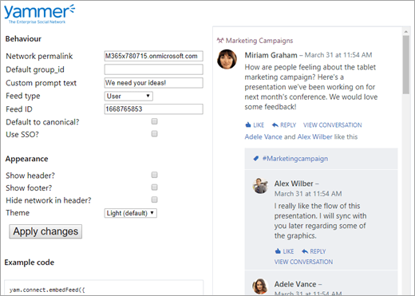

# Add a Yammer feed to a SharePoint page

 **Summary:** Use the Yammer Embed widget to include Yammer feeds on SharePoint pages. 
  
You can choose the type of Yammer feed to include in a SharePoint page:
* Group: the feed for one group
* Topic: all conversations tagged with one topic
* User: all conversations that include messages from the specified user
* My feed: The user's home feed
* Open graph: links

You can also select options including the size of the box displaying the feed, and whether the background is dark or light.

There are three steps to the process:
* Step 1: Collect the identifying information for the group, topic, or user from Yammer.
* Step 2: Generate the code for the widget using the Yammer Embed configuration tool.
* Step 3: Embed the code in a Script Editor Web Part on the SharePoint page. You'll need a 400 pixel or wider web part.

When the Yammer widget is embedded in a SharePoint page, the specified feed is displayed if the user is signed in. If the user is not signed in, they will be prompted to sign in.

## Step 1. Collect the feed information from Yammer
How you collect the feed info depends on the feed type you select.

### Collect group feed information from Yammer

There are two options:
***Get the entire widget from the group page in Yammer**
 Because a group feed is the most commonly used type of feed, you can get the widget from each Yammer group page. The code in the widget uses default settings for the embedded Yammer feed. 

 ** Go to the group in Yammer, and under **Access Options** at the bottom of the left panel, select **Embed this feed in your site**. Copy the code. 

***Get the group feed id to use with the Yammer Embed Configuration Tool**
1. Using Yammer in a web browser, go to the group.
2. Copy the feed ID from the URL. For example, in this URL, https://www.yammer.com/contoso.com/#/threads/inGroup?type=in_group&feedId=1170863, copy 1170863.

### Collect topic feed information from Yammer
1. Using Yammer in a web browser, search for the topic by entering #topic_name in the Search box. For example, if looking for all conversations tagged with the EmployeeVolunteering tag, search for #EmployeeVolunteering.
2. Select the topic, look at the URL, and copy the topic id. For example, in this URL,  https://www.yammer.com/contoso.com/topics/2084748#/Threads/AboutTopic?type=about_topic&feedId=2084748, copy 2084748.

### Collect user feed information from Yammer 
1. Using Yammer in a web browser, click the icon or name of the person from anywhere in Yammer. 
3. Copy the user ID from the URL. For example, for the following URL, https://www.yammer.com/contoso.com/#/users/1906364, copy  1906364.

##Step 2. Generate the widget code using the Yammer Embed configuration tool

1. Go to the Yammer Embed configuration tool, at [https://www.yammer.com/widget/configure] (https://go.microsoft.com/fwlink/p/?LinkId=507500). 
2. Select the options:
 ****Network permalink**: Your domain name for Yammer, such as Contoso.com, or Contoso.onmicrosoft.com.
 ****Default group_id**: 
 ****Custom prompt text**: The prompt that users will see when a group or My Feed type is selected. If left blank, the default "What are you working on?" will be displayed.
 ****Feed type**: Select one of the following:* Group: the feed for one group
  *****My Feed**: The user's home feed
  *****Topic**: all convversations tagged with one topic
  *****User**: all conversations that include messages from thee specified user
  *****Open Graph**: links. For more information, see  [Embed](https://go.microsoft.com/fwlink/p/?LinkId=507501) in the [Yammer Developer Center](https://go.microsoft.com/fwlink/p/?LinkId=507502). 
 ****Feed ID**: The ID you identified in Step 2 above for the specific Yammer group, topic, or user. This should be left blank if you select **My Feed** as the feed type.
 ****Default to canonical** If you have external networks, and a user switches to one from Yammer embedded on a SharePoint page, if this is checked, when the user returns to the SharePoint page, they will start by seeing their home network. If this is unchecked, the user will go directly to the external network.
 ****Use SSO**: Configure redirection to your identity provider. The domain listed in the **Network permalink** field must be configured for federation in Office 365.
 ****Appearance**
  *****Show header?** and **Show footer** and **Hide network in header"**: These options only apply to some types of feeds. The preview will show you whether they apply to the feed type you have selected.
  *****Theme**: In some browsers, you have an option for a light or dark background for the embedded Yammer conversations.
3. Click **Apply**. You'll see a preview of what will be embedded.
4. Copy the code shown under **Example code**.

  
For more information about how to use the Yammer Embed widget, including how to use **Use SSO** and the **Open Graph** feed type, see [Embed](https://go.microsoft.com/fwlink/p/?LinkId=507501) in the [Yammer Developer Center](https://go.microsoft.com/fwlink/p/?LinkId=507502).
  
## Step 3. Place the Yammer Embed widget in a SharePoint page

1. On the SharePoint page where you want the code, select **Edit Page**.
2. Select the spot on the page where you want this information to appear.
3. On the **Insert** tab, select **Embed Code**.

## See also

#### Concepts

[Integrate Yammer with on-premises SharePoint Server environments](integrate-yammer-with-on-premises-sharepoint-2013-environments.md)

