# Estimate performance and capacity requirements for enterprise intranet collaboration environments (SharePoint Server 2013)

 **Summary:** Use test results and recommendations in this article to estimate performance and capacity requirements for an enterprise intranet collaboration solution for SharePoint Server 2013. 
  
This article contains guidance on performance and capacity planning for an enterprise intranet collaboration solution that is based on SharePoint Server 2013. It includes the following: 
  
- **Lab environment specifications**, such as hardware, farm topology and configuration
    
- The **test farm workload and dataset** that was used to generate test load 
    
- **Test results and analysis** that demonstrate and explain trends in throughput, latency and hardware demand under load at specific scale points. 
    
Use the information in this article to understand the characteristics of the scenario under both normal and peak loads, and how performance trends change when farm servers are scaled out. This article can also help you estimate an appropriate starting point for your planned architecture, and the factors that are important to consider when you plan for the resources your farm will need to maintain acceptable levels of performance under peak load.
  
In this article:
  
- [Introduction to this environment](enterprise-intranet-collaboration-performance-and-capacity.md#Intro)
    
- [Glossary](enterprise-intranet-collaboration-performance-and-capacity.md#Glossary)
    
- [Overview](enterprise-intranet-collaboration-performance-and-capacity.md#Overview)
    
- [Specifications](enterprise-intranet-collaboration-performance-and-capacity.md#Specs)
    
- [Results and analysis](enterprise-intranet-collaboration-performance-and-capacity.md#Results)
    
## Introduction to this environment

This article provides guidance about how to scale out servers in a SharePoint Server 2013 enterprise intranet collaboration solution. Capacity planning informs decisions about hardware to purchase and system configurations that optimize your solution.
  
Individual SharePoint Server 2013 farms are unique, and each farm has different requirements that depend on hardware, user behavior, the configuration of installed features, and many other factors. Therefore, supplement this guidance with additional testing on your own hardware in your own environment. If your planned design and workload resembles the environment described in this article, you can use this article to draw conclusions about how to scale your environment.
  
Test results that appear in this article were produced in a test lab, using a workload, dataset, and architecture emulate a production environment under highly controlled conditions. While great care was exercised in designing these tests, the performance characteristics of a test lab are never the same as the behavior of a production environment. These test results do not represent the performance and capacity characteristics of a production farm. Instead, the test results demonstrate observed trends in throughput, latency, and hardware demand, and provide analysis of the observed data that can help you make decisions about how to plan capacity and manage your own farm.
  
This article includes the following:
  
- **Specifications**, which include hardware, topology, and configuration
    
- The **workload**, which includes an analysis of the demand on the farm, the number of users, and usage characteristics
    
- The **dataset**, such as database sizes and content types
    
- Test results and analysis for **scaling out web servers**
    
- **Comparison between SharePoint Server 2010 and SharePoint Server 2013** throughput, latency, and web server performance on both physical servers and virtual machines 
    
Before you read this article, read the following articles to make sure that you understand the key concepts behind capacity management in SharePoint Server 2013. 
  
- [Capacity management and sizing for SharePoint Server 2013](capacity-management-and-sizing-for-sharepoint-server-2013.md)
    
- [Software boundaries and limits for SharePoint Server 2016](../install/software-boundaries-and-limits-0.md)
    
These articles provide the following information:
  
- The recommended approach to capacity management
    
- How to make effective use of the information in this article
    
- Definitions of terms that are used throughout this article
    
## Glossary

Here are some specialized terms that you will encounter in this article. 
  
- **RPS:** Requests per second, or the number of requests a that a farm or server receives in one second. This is a common measurement of server and farm load. 
    
    Note that requests differ from page loads. A page contains several components, each of which creates one or more requests when a browser loads the page. Therefore, one page load creates several requests. Typically, authentication checks and events that use insignificant resources are not counted in RPS measurements.
    
- **Green Zone:** Green Zone represents a defined set of load characteristics under normal operation conditions, up to expected daily peak loads. A farm that operates in this range should be able to sustain response times and latency that are within acceptable parameters. 
    
    This is the state at which the server can maintain the following set of criteria:
    
  - The server-side latency for at least 75% of the requests is less than 1 second. 
    
  - All farm servers maintain an average CPU utilization of less than 60%.
    
    > [!NOTE]
    > Because this lab environment did not have an active search crawl running, the database server was kept at approximately 50% CPU utilization or lower to reserve 10% for the search crawl load. This assumes SQL Server Resource Governor is used in production to limit Search crawl load to 10% CPU. 
  
  - Failure rate is less than 0.01%.
    
- **Red Zone (Max):** Red Zone represents a defined set of load characteristics under peak operation conditions. At Red Zone, the farm experiences very high transient resource demands that it can sustain only for limited periods before failures and other performance and reliability issues occur. 
    
    This is the state at which the server can maintain the following set of criteria for a limited duration:
    
  - HTTP request throttling feature is enabled, but no 503 errors (Server Busy) are returned. 
    
  - Failure rate is less than 0. 1%.
    
  - The server-side latency is less than 3 seconds for at least 75% of the requests. 
    
  - All farm servers (excluding database servers) maintain an average CPU utilization of less than approximately 90%.
    
  - Database server average CPU utilization is less than approximately 50%, which allows for ample overhead to be reserved for the Search crawl load.
    
- **AxBxC (Graph notation):** This is the number of web servers, application servers, and database servers respectively in a farm. For example, 10x1x1 means that this environment has 10 web servers, 1 application server, and 1 database server. 
    
- **MDF and LDF:** SQL Server physical files. For more information, see [Files and Filegroups Architecture](https://go.microsoft.com/fwlink/p/?LinkID=164499). 
    
## Overview

This section provides an overview of our scaling approach and test methodology.
  
### Scaling approach

This section describes the approach that we took to scale this lab environment. This approach will enable you to find the best configuration for your workload: 
  
1. We scaled out the web servers until four web servers were in use. Each server runs the Distributed Cache Service. 
    
2. We added a dedicated server that runs the Distributed Cache Service.
    
3. We disabled the Distributed Cache Service on the web servers.
    
4. We scaled out additional web servers to the maximum for the scope of testing.
    
5. We conducted additional testing to compare the performance characteristics of SharePoint Server 2013 and SharePoint Server 2010.
    
### Methodology and test notes

Because this article provides results from a test lab environment, we could control certain factors to show specific aspects of performance for this workload. In addition, certain elements of the production environment, which are in the following list, were left out of the lab environment to simplify the overhead of testing.
  
> [!NOTE]
> We recommend that you include these elements in production environments. 
  
- Between test runs, we modified only one variable at a time to make it easy to compare results between test runs. 
    
- The database servers were not part of a cluster because redundancy was not necessary for the purposes of these tests. 
    
- Search crawl was not running during the tests. Of course, it might be running in a production environment. To take this into account, we lowered the SQL Server CPU utilization in our definitions of 'Green Zone' and 'Red Zone' to accommodate the resources that a running search crawl would normally consume during testing. 
    
## Specifications

This section provides details about the hardware, software, topology, and configuration of the lab environment.
  
### Hardware

The following sections describe the hardware that was used in this lab environment.
  
> [!IMPORTANT]
> Note that all web servers and application servers in the test lab were virtualized by using Hyper-V hosts. Database servers were not virtualized. The physical host hardware and virtual machine virtual hardware are detailed separately below. 
  
#### Hyper-V Hosts

A total of six identically configured Hyper-V hosts were used for testing. Each host runs one to two virtual machines.
  
|****Host Hardware****|**Value**|
|:-----|:-----|
|**Processor(s)**   |2 quad-core 2.49 GHz processors    |
|**RAM**   |32 GB    |
|**Operating System**   |Windows Server 2008 R2 SP1    |
|**Number of network adapters**   |2    |
|**Network adapter speed**   |1 Gigabit    |
   
#### Virtual web servers and application servers

The farm has from one to 10 virtual web servers. An additional dedicated virtual server runs the Distributed Cache Service.
  
> [!NOTE]
> In a production environment, dedicated servers that run the Distributed Cache Service would typically be deployed in a highly available configuration. For test purposes, we used a single dedicated server for Distributed Cache because high availability was not a critical factor. 
  
|**VM Hardware**|**WFE1-10 and DC1**|
|:-----|:-----|
|**Processors**   |4 virtual processors    |
|**RAM**   |12 GB    |
|**Operating system**   |Windows Server 2008 R2 SP1    |
|**Size of the SharePoint drive**   |100 GB    |
|**Number of network adapters**   |2    |
|**Network adapter speed**   |10 Gigabit (inter-host traffic limited to host NIC speed)    |
|**Authentication**   |Windows NTLM    |
|**Load balancer type**   |F5 Big IP    |
|**Services running locally**   |WFE 1-10: Basic Federated Services. This includes the following: SharePoint Timer Service, Trace Service, Word Automation Services, Excel Services and Microsoft SharePoint Foundation Sandboxed Code Service.    DC1: Distributed Cache Service.    |
   
#### Database Servers

One physical database server runs the default SQL Server instance that has the SharePoint databases. The logging database is not tracked in this article.
  
> [!NOTE]
> If you enable usage reporting, we recommend that you store the logging database on a separate Logical Unit Number (LUN). Large deployments and some medium deployments might require a dedicated logging database server to accommodate the processor demand of a high log volume. > In this lab environment, logging was constrained, and the logging database was stored in a separate instance of SQL Server. 
  
|**Database Server - Default Instance**|**SPSQL**|
|:-----|:-----|
|**Processors**   |4 quad-core 2.4 GHz processors    |
|**RAM**   |32 GB    |
|**Operating system**   |Windows Server 2008 R2 SP1    |
|**Storage and geometry**   |Direct Attached Storage (DAS)    1 x System volume (RAID0, 1 spindle, 300GB)    2 x Content Data volumes (RAID0, 4 spindles, 450GB each)    2 x Content Log volumes (RAID0, 2 spindles, 450GB each)    1 x Temp Data volume (RAID0, 2 spindles, 300GB each)    1 x Temp Log volume (RAID0, 2 spindles, 300GB each)    |
|**Number of network adapters**   |1    |
|**Network adapter speed**   |1 Gigabit    |
|**Authentication**   |Windows NTLM    |
|**Software version**   |SQL Server 2008 R2    |
   
### Topology

The following diagram shows the topology in this lab environment.
  

  
### Configuration

To allow for optimal test performance and clear relationships between test parameters and results, the following significant configuration changes were made in this lab environment.
  
|**Setting**|**Value**|**Notes**|
|:-----|:-----|:-----|
|**Site collection**   |179    |The site collections in the test environment use default settings and Windows claims authentication.    |
|**Blob caching**   |On    |The default is Off. If you enable Blob caching, you improve server efficiency by reducing calls to the database server for static page resources that may be frequently requested.    |
|**Max degree of parallelism (MAXDOP)**   |1    |This parameter is set on the SQL Server instance or instances that contain SharePoint Server 2013 content databases. The default value is 0, which enables SQL Server to determine the maximum degree of parallelism. SharePoint Server 2013 requires MAXDOP to be set to 1 for SQL Server instances that contain SharePoint Server 2013 databases.    For more information about how to configure the MAXDOP setting for SQL Server 2008 R2, see [max degree of parallelism Option](https://go.microsoft.com/fwlink/p/?LinkId=189030).    For more information about how to configure the MAXDOP setting for SQL Server 2012, see [Configure the max degree of parallelism Server Configuration Option](https://go.microsoft.com/fwlink/p/?LinkId=403867).    |
   
### Workload

This section explains the lab tests that are run against SharePoint Server 2013. The details of the tests are typical of an enterprise collaboration environment.
  

  
### Dataset

The dataset for the lab environment in this article, which represents a typical enterprise collaboration environment, contains various site collections, sites, lists, libraries, file types and sizes.
  
|**Dataset Characteristics**|**Value**|
|:-----|:-----|
|**Database size (combined)**   |174 GB    |
|**MDF size**   |154 GB    |
|**LDF size**   |20 GB    |
|**BLOB size**   |152 GB    |
|**Number of content databases**   |2    |
|**Number of site collections**   |179    |
|**Number of web applications**   |1    |
|**Number of sites**   |1,471    |
   
## Results and analysis

The following results are ordered based on the scaling approach that is described in the [Overview](enterprise-intranet-collaboration-performance-and-capacity.md#Overview) section of this article. 
  
### Web server scale out

This section describes the test results that were obtained when we scaled out the number of web servers in this lab environment.
  
#### Test methodology

- Add web servers that use the same hardware specifications, and run the test again without changes to the farm or test parameters.
    
- Measure RPS, latency, and resource utilization on each server in the test farm. 
    
#### Analysis

In our testing, we found the following:
  
- The environment scaled to ten web servers per database server. The increase in throughput was fairly linear.
    
- Even up to the maximum tested scale of ten web servers, the addition of more database servers did not increase throughput. The bottleneck was generally confined to web server resources.
    
- The average latency at green zone was almost constant throughout the whole test. The number of web servers and throughput did not affect green zone latency. Red Zone latency data shows an expected trend line. Latency is very high at a single web server. A curve between 2 and 10 web servers remains comfortably within Red Zone criteria.
    
    > [!NOTE]
    > Latency may be mildly affected when you move the Distributed Cache service from a farm's web servers to a server that is dedicated to the Distributed Cache. This may occur because Distributed Cache traffic, which was previously internal to each web server, begins traversing the network. Test scale-out performance in your own environment to determine whether this tradeoff is significant. Note that latency in our test environment increased mildly when the Distributed Cache service was migrated to a dedicated server. Latency decreased with each added web server as the nominal added latency was offset by the decreased processing and memory load on the web servers. > For more information about Distributed Cache capacity planning, see [Plan for feeds and the Distributed Cache service in SharePoint Server](plan-for-feeds-and-the-distributed-cache-service.md). 
  
- When performance testing was conducted for SharePoint Server 2010, the database server became a bottleneck at maximum throughput using four web servers. Because of improvements in caching and database usage characteristics in SharePoint Server 2013, the average load on the database server layer is significantly lower than it was in SharePoint Server 2010, and it was not necessary to scale out the database servers during testing.
    
    For more information about SharePoint Server 2010 test results for this scenario, see [Enterprise intranet collaboration environment lab study (SharePoint Server 2010)](http://technet.microsoft.com/en-us/library/ff758657%28v=office.14%29.aspx)
    
- Performance gains when you add virtual web servers depend partly on host hardware resources and on the resource usage of other virtual computers that are running on the same host. Capacity planning for virtual servers requires additional planning and management strategies specific to virtualization.
    
    For more information on Hyper-V performance and capacity planning, see [Hyper-V virtualization requirements for SharePoint 2013](http://technet.microsoft.com/library/42c6357e-d7eb-40cb-b01a-31ee85416581%28Office.14%29.aspx) and [Use best practice configurations for the SharePoint 2013 virtual machines and Hyper-V environment](http://technet.microsoft.com/library/e7fc992d-3c51-4b65-bbf4-0c12100aa36e%28Office.14%29.aspx).
    
> [!NOTE]
> The conclusions described in this section are specific to the hardware that comprises the environment. The environment might have achieved the same throughput by using more but less powerful Hyper-V host servers, or fewer but more powerful Hyper-V host servers. An increase of hardware resources on the database server would not materially affect the results. 
  
#### Results, graphs and charts

In the following graphs, the x axis shows the change in the number of web servers in the farm. The scale starts with one virtual web server and one physical database server (1x1). The maximum is ten virtual web servers, one dedicated virtual Distributed Cache server (added at four web servers) and one physical database server (10x1x1).
  
> [!NOTE]
> The graphs in this section represent the average values for each data point over the duration of the test. All graphs include the RPS baseline for both Green and Red zones to show the relationship between RPS and factors such as latency, server resource utilization, and SQL Server disk usage. 
  
 **1. RPS**
  
The following graph shows how scaling out affects the RPS baseline.
  
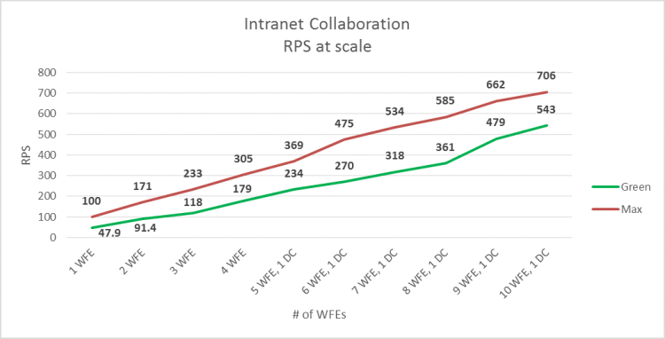
  
 **2. Latency**
  
The following graph shows how scaling out affects latency. Note that Green Zone latency remains mostly flat, while Red Zone latency shows moderate variations that are well within acceptable limits.
  
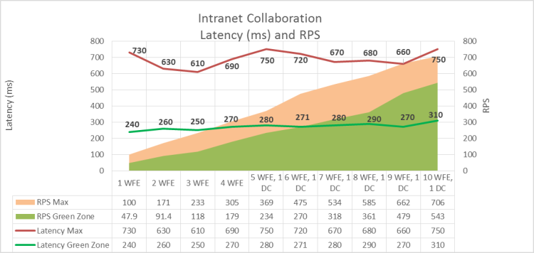
  
 **3. Web server processor and memory utilization**
  
The following graph shows how scaling out affects average processor and memory utilization on the web servers. Note that Green Zone processor utilization remains fairly constant as RPS increases, while average memory utilization increases slightly.
  
The Red Zone processor utilization trend is downward, which reflects the fact that the average demand of the web server's processor at maximum load is gradually reduced as the number of servers is increased.
  
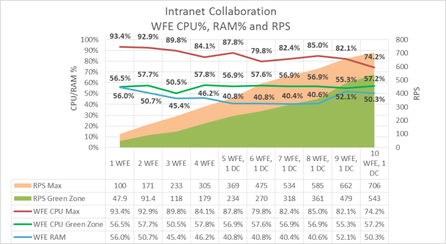
  
 **4. SQL Server I/O operations per second (IOPs) and processor utilization**
  
The following graphs show how average disk IOPs (both total and reads/writes) and processor utilization values change as the number of web servers is scaled out. The following performance counters were used to measure IOPs values:
  
- PhysicalDisk: Disk Reads / sec
    
- PhysicalDisk: Disk Writes / sec
    
The values of each counter over the duration of the test are averaged, and then added together to produce total IOPs.
  
> [!NOTE]
> Data for SQL Server memory utilization was not available and is not in this graph. 
  
> [!IMPORTANT]
> These IOPs test results are not representative of a production environment because our dataset was much smaller than that of a production farm. It was therefore possible for a larger percentage of the data to be cached at the web servers than would be possible in a production environment. The IOPs results in this section are therefore calculated averages that are based on available test data and are expected to be generally lower than IOPs in a production environment. Thorough testing of your own farm in a pilot environment may produce different results. 
  
Note that in the graphs in this section, both IOPs and database server processor utilization show a drop at both 9 and 10 front-end web servers, while RPS continues to increase. This variation is also reflected in web server processor utilization as shown in the previous graph.
  
This shows that the scale of the farm has reached a point at which maximum pressure on the farm server resources has been achieved using the baseline load and dataset. A lower average utilization of server resources is required to support the load on the farm.
  
It is possible to extrapolate the following from this trend:
  
- Had the test load been increased at the ninth web server scale point, greater RPS could have been achieved while maintaining a flat curve in server resource utilization.
    
- Had the number of web servers been scaled out further while maintaining the same test load, RPS would have continued to increase while pressure on server resources would have continued a downward trend.
    
1. **SQL Server Total IOPs**
    
    The following graph shows how scaling out affects total IOPs.
    
     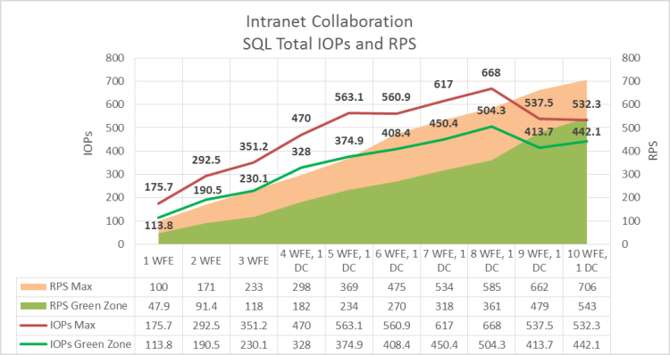
  
2. **SQL Server IOPs broken down into read and write operations**
    
    The following graph shows how scaling out affects IOPs, broken down into reads per second and writes per second.
    
     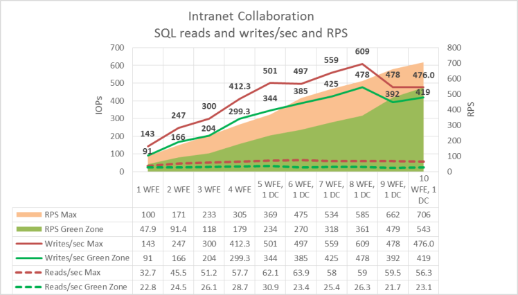
  
3. **SQL Server processor utilization**
    
    The following graph shows how scaling out affects SQL Server processor utilization.
    
     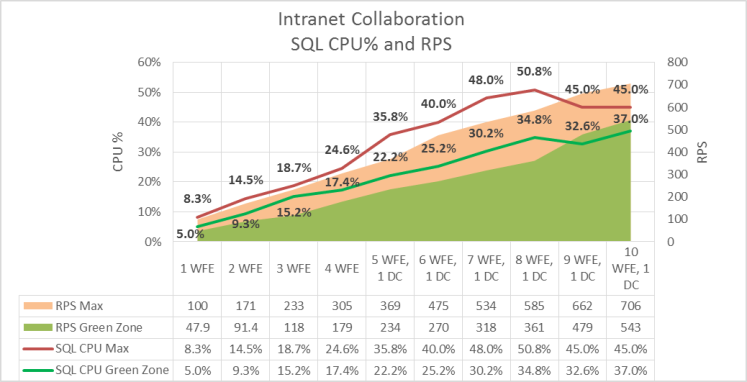
  
### Comparing SharePoint Server 2013 and SharePoint Server 2010

This section provides information about how performance for this workload varied between SharePoint Server 2013 and SharePoint Server 2010.
  
#### Workload

To compare SharePoint Server 2013 with SharePoint Server 2010, we used a different test mix from the one outlined in the [Specifications](#Specs) section. This was necessary because some SharePoint Server 2013 features (such as the Distributed Cache Service) and operations were not available in SharePoint Server 2010. 
  
#### Test methodology

To test performance in the two environments, we used the following methodology: 
  
1. We created a SharePoint Server 2010 environment.
    
2. We tested the SharePoint Server 2010 environment by using the workload outlined earlier in this section.
    
3. We upgraded the content databases to SharePoint Server 2013 without changing the clients consuming the environment.
    
This upgraded environment was then tested again on the upgraded servers that host SharePoint Server 2013 by using the same test mix, which includes only SharePoint Server 2010 operations.
  
- We tested two environments for comparison. One environment used physical server hardware, and the other environment used virtual machines to run the web servers on a Hyper-V host. In both cases, the database server ran on a physical server.
    
- We did not modify the dataset after the content database upgrade for the SharePoint Server 2013 tests. 
    
- The test mix for SharePoint Server 2010 excluded new SharePoint Server 2013-specific operations, and resembled the enterprise intranet collaboration solution that was tested and described earlier in this article.
    
The goal of the testing was to apply similar loads against both SharePoint Server 2013 and SharePoint Server 2010 farms by using the same workload and dataset, and then show the differences in throughput, latency and server resource consumption. Test methodologies and goals differed between physical and virtual web server tests:
  
- The goal of physical server testing was to compare how SharePoint Server 2013 and SharePoint Server 2010 farms performed when scaled out under load. The web servers in this test were scaled out from two to five web servers.
    
- The goal of virtual server testing was to compare how SharePoint Server 2013 and SharePoint Server 2010 farms with four web servers performed at both Green and Red Zone user loads. No web server scale-out tests were conducted.
    
#### Analysis

- In general, SharePoint Server 2013 performed better than SharePoint Server 2010 when scaled out to five web servers, but SharePoint Server 2010 results were better at two web servers. Testing against the upgraded SharePoint Server 2013 server farm did not involve post-upgrade optimizations or take advantage of SharePoint Server 2013 performance improvements such as the Distributed Cache Service or Request Manager. SharePoint Server 2013 test results, therefore, are significantly different from results in a real-world environment. 
    
- The relationship between data trends in the graphs in this section show how the SharePoint Server 2013 resource management model prioritizes the use of processor resources over disk IOPs. 
    
- At Green Zone, SharePoint Server 2013 outperforms SharePoint Server 2010 at five web servers, with more than 10% improvement in RPS and slightly lower latency. However, at two web servers, SharePoint Server 2013 produces lower RPS and a slight improvement in latency over SharePoint Server 2010.
    
- At Red Zone, SharePoint Server 2013 achieves approximately 12% greater throughput compared to SharePoint Server 2010 at five web servers. At two web servers, the throughput of SharePoint Server 2010 was approximately 30% greater. SharePoint Server 2013 showed a moderate improvement in latency over SharePoint Server 2010 at five web servers.
    
- In virtual web server testing, both SharePoint Server 2013 and SharePoint Server 2010 results are similar at Green Zone. SharePoint Server 2013 shows significant improvement over SharePoint Server 2010 in both throughput and latency at Red Zone.
    
#### Results, graphs and charts

The tests that produced the results in the graphs in this section were run against both physical and virtual web servers as indicated. In all tests, a single physical database server running SQL Server 2008 R2 with SP1 was used.
  
1. **RPS and latency**
    
    The following graph shows the difference in throughput and latency between SharePoint Server 2013 and SharePoint Server 2010 with both two and five physical web servers at Green Zone. SharePoint Server 2010 has higher RPS at two web servers and higher latency. At five web servers, SharePoint Server 2013 shows both increased RPS and lower latency.
    
     
  
    The following graph shows the difference in web server processor utilization with both two and five physical web servers at Red Zone. SharePoint Server 2013 outperforms SharePoint Server 2010 in both RPS and latency at 5 web servers, but not at two web servers.
    
     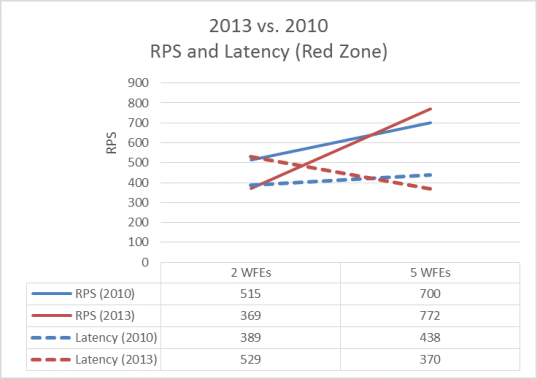
  
2. **RPS and server resource utilization**
    
    The following graph shows the difference in web and database server processor utilization with two and five physical web servers at Green Zone load. Note that SharePoint Server 2013 achieves greater throughput at five web servers by more effectively taking advantage of available server resources.
    
     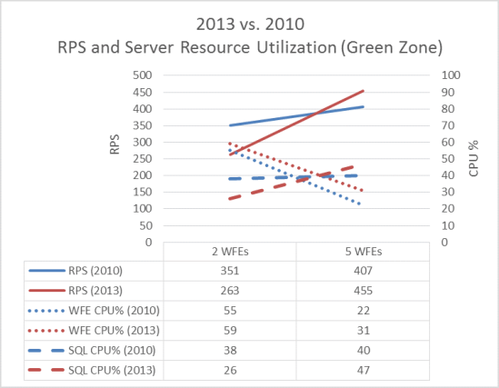
  
    The following graph shows the difference in web and database server processor utilization with two and five physical web servers at Red Zone load. Again, SharePoint Server 2013 achieves greater throughput at five web servers, but not at two web servers.
    
     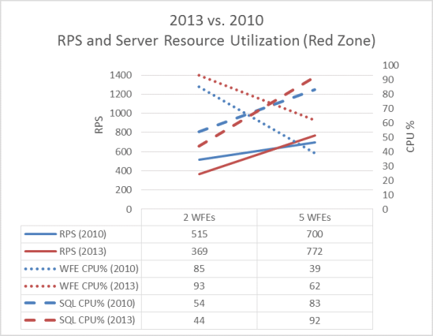
  
3. **RPS and IOPs**
    
    The following graph shows the difference in IOPs with two and five physical web servers at Green Zone. Note that at Green Zone, SharePoint Server 2013SharePoint Server 2016 IOPs increases between two and five web servers, while SharePoint Server 2010 IOPs decreases. At the same time, the rate of increase in SharePoint Server 2013 RPS is significantly greater than in SharePoint Server 2010. This difference in trends shows how SharePoint Server 2013 manages server resources differently in a larger farm to achieve greater throughput.
    
     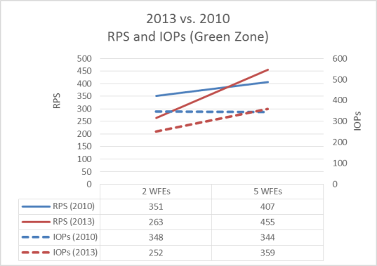
  
    The following graph shows the difference in IOPs with two and five physical web servers at Red Zone load. When these results are contrasted with the Red Zone graph in the earlier RPS and server resource utilization section, you can observe that the SharePoint Server 2013 resource management model prioritizes the use of processor resources over SQL Server disk IOPs.
    
     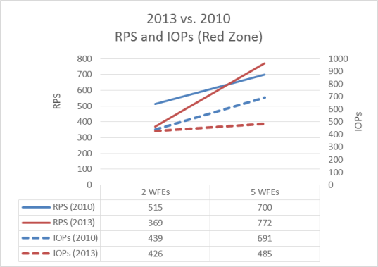
  
4. **Virtual web server RPS, latency and IOPs**
    
    Virtual server comparison testing was conducted against 4 virtual web servers and one physical database server. 
    
    The following graph shows the difference in throughput and latency with four virtual web servers. At Green Zone load, both SharePoint Server 2013 and SharePoint Server 2010 results are similar, while SharePoint Server 2013 shows significant improvement over SharePoint Server 2010 in both throughput and latency at Red Zone.
    
     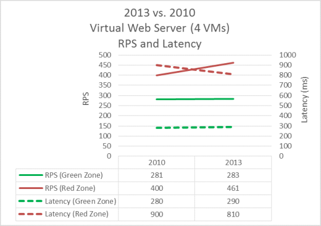
  
    The following graph shows the difference in database IOPs with four virtual web servers. SharePoint Server 2013 shows a significant improvement in database IOPs performance at both Green and Red Zone loads.
    
     
  
## See also

#### Concepts

[Performance planning in SharePoint Server 2013](performance-planning-in-sharepoint-server-2013.md)
  
[Performance and capacity test results and recommendations (SharePoint Server 2013)](performance-and-capacity-test-results-and-recommendations-for-sharepoint-2013.md)

