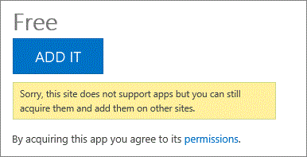
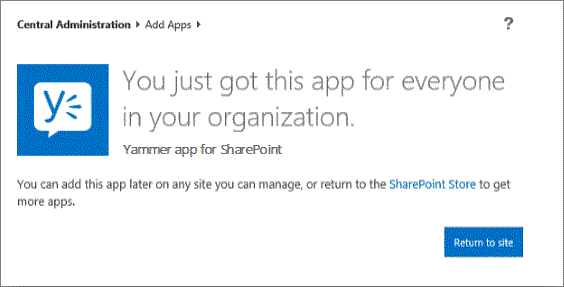
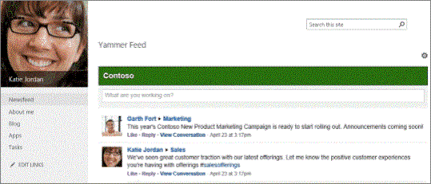

# Get and install the Yammer app onto SharePoint Server 2013 sites

 **Summary:** Learn how to add the Yammer app to the app catalog and make it available on My Sites and team sites. 
  
> [!CAUTION]
> The Yammer App for SharePoint 2013 will be discontinued and will stop working on September 15th, 2015. Yammer Embed will be our single solution to integrate Yammer feeds into SharePoint. Read the announcement on the [Office 365 Network](https://go.microsoft.com/fwlink/?LinkId=525543) (https://go.microsoft.com/fwlink/?LinkId=525543) or read the [migration guide to Yammer Embed for SharePoint 2013](https://go.microsoft.com/fwlink/?LinkID=524800) (https://go.microsoft.com/fwlink/?LinkID=524800). 
  
The Yammerapp for SharePoint lets you embed Yammer feeds into on-premises SharePoint Server 2013 sites to make them more social and engaging. Before you can do that, you have to both remove the Newsfeed Web Parts from My Sites and team sites and hide the user interface controls that provide the social features you'll replace with Yammer. Next, you add the Yammer app to the App Catalog and install and set up the Yammer feed on your sites. This article takes you through the steps that are required to do the second part: add the Yammer app to the App Catalog and install and set up the Yammer feed on your team sites. For information about how to remove the Newsfeed Web Parts from My Sites and team sites and hide the user interface controls, see [Hide SharePoint Server 2013 social features](hide-sharepoint-server-2013-social-features.md).
  
Before you get started, make sure you have configured one of the [Yammer social scenarios](social-scenarios-with-yammer-and-sharepoint-server-2013.md) in SharePoint Server 2013. 
  
  
## Get the Yammer app from the SharePoint Store

First, you have to get the Yammerapp for SharePoint from the SharePoint Store. If you have already installed the Yammerapp for SharePoint, make sure that you have the most current version. For more information, see [Update to the latest Yammer App for SharePoint](https://go.microsoft.com/fwlink/?LinkId=395077). Use an account that is a member of the farm admins group to follow these steps:
  
> [!IMPORTANT]
> Don't use the farm admin account that was used to install and set up SharePoint Server 2013. The farm admin account can't import app licenses because that can result in performance problems. For more information, see [Add apps for SharePoint to a SharePoint site](add-apps-for-sharepoint-to-a-sharepoint-site.md). When you're in the online Store, you need a Microsoft account to successfully add the app. 
  
1. On the SharePoint Central Administration website, choose **Apps**.
    
     
  
2. Choose **Purchase Apps**. The SharePoint Store opens.
    
     
  
3. In the **Find an app** box, enter Yammer, and then press Enter.
    
4. On the Search results page, choose **Yammer App for SharePoint**.
    
5. On the **Yammer App for SharePoint** page, choose **Add It**.
    
    > [!NOTE]
    > You'll see the message **Sorry, this site does not support apps but you can still acquire them and add them on other sites**. This is because you can't install apps to the Central Administration web application. You can continue and get the app for your organization. 
  
     
  
6. When the following confirmation message is shown, choose **Return to site**. The Yammerapp for SharePoint is now available in the App Catalog. You can use the app on a site where a Yammer feed is needed.
    
     
  
## Install the Yammer app on your site

Use a farm admin account to follow these steps:
  
1. Choose **Newsfeed** to go to the farm admin's My Site. 
    
2. Choose **Settings**, and then choose **Manage shared apps**.
    
3. On the **Site Contents** page, choose **add an app** > **From Your Organization** > **Yammer app for SharePoint** > **Trust It**. The Yammer app is now installed for your site.
    
## Add the Yammer home feed to the My Site Newsfeed page

Any user who has Contribute permissions can follow these steps:
  
1. Choose **Newsfeed** to view your My Site. 
    
2. Choose **Settings**, and then choose **Edit page**.
    
3. Choose **Add a Web Part**.
    
4. In the **Categories** section, choose **Apps**.
    
5. Choose **Yammer Feed**.
    
6. In the **About the part** section, choose a zone in which to add the Web Part, and then choose **Add**. The Yammerapp for SharePoint Web Part is now added to the page.
    
7. Choose **Login** to sign in to the app by using your Yammer account. 
    
8. Select the Yammer home feed as the feed type on the configuration page.
    
9. Select your network on the drop-down menu, and then save the configuration. Refresh the page to check that the Yammer home feed is successfully embedded on your My Site.
    
     
  
## Add the Yammer group feed to a team site

The following steps have to be done on every team site to which you want to add a Yammer group feed. Any user who has Contribute permissions can follow these steps:
  
1. Browse to the team site's home page.
    
2. On the ribbon, choose **Page**, and then choose **Edit**.
    
3. Choose **Insert**, and then choose **App Part**.
    
4. Choose **Yammer app for SharePoint**.
    
5. Choose **Add**. The Yammerapp for SharePoint Web Part is now added to the team site.
    
6. Choose **Save**.
    
7. Choose **Login** to sign in to the app by using your Yammer account. 
    
8. Choose the Yammer group feed as the feed type on the configuration page.
    
9. Enter the Group Feed ID, and then save the configuration. Refresh the page to verify that the Yammer group feed is now added to your team site.
    
     
  
## Acknowledgements

The SharePoint Server 2013 Content Publishing team thanks Vidya Srinivasan, Microsoft SharePoint Server Product Team, for her contribution to this article.
  
## See also

#### Concepts

[Integrate Yammer with on-premises SharePoint 2013 environments](integrate-yammer-with-on-premises-sharepoint-2013-environments.md)
  
[Hide SharePoint Server 2013 social features](hide-sharepoint-server-2013-social-features.md)

