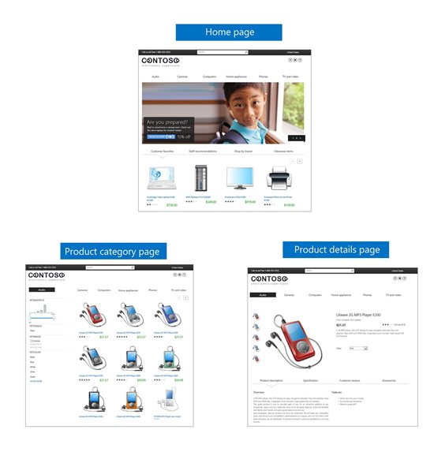

# How to set up a product-centric website in SharePoint Server

 **Summary:** Learn how set up a product-centric website in SharePoint Server. 
  
This series of TechNet articles explains how to use SharePoint Server to set up a website based on product catalog data. Throughout this series, we'll use data from a fictitious company called "Contoso" to show how it all comes together. Contoso is a manufacturer and retailer of technology products and home appliances, and they want to set up a product-centric website to present their catalog to potential customers.
  
To give you an idea of the goals for the Contoso website, here are some screen shots of what our Contoso website will be like when we're done.
  

  
> [!NOTE]
> Most of the features described in this series are available only for private site collections in SharePoint Online. 
  
## Articles in this series

- [An introduction to cross-site publishing in SharePoint Server](an-introduction-to-cross-site-publishing.md)
    
- [Stage 1: Create site collections for cross-site publishing in SharePoint Server](stage-1-create-site-collections-for-cross-site-publishing.md)
    
- [Stage 2: Import list content into the Product Catalog Site Collection in SharePoint Server](stage-2-import-list-content-into-the-product-catalog-site-collection.md)
    
- [Stage 3: How to enable a list as a catalog in SharePoint Server](stage-3-how-to-enable-a-list-as-a-catalog.md)
    
- [Stage 4: Set up search and enable the crawling of your catalog content in SharePoint Server](stage-4-set-up-search-and-enable-the-crawling-of-your-catalog-content.md)
    
- [From site column to managed property - What's up with that?](from-site-column-to-managed-propertywhat-s-up-with-that.md)
    
- [Stage 5: Connect your publishing site to a catalog in SharePoint Server](stage-5-connect-your-publishing-site-to-a-catalog.md)
    
- [Stage 6: Upload and apply a new master page to a publishing site in SharePoint Server](stage-6-upload-and-apply-a-new-master-page-to-a-publishing-site.md)
    
- [Stage 7: Upload page layouts and create new pages in a publishing site in SharePoint Server](stage-7-upload-page-layouts-and-create-new-pages-in-a-publishing-site.md)
    
- [Stage 8: Assign a category page and a catalog item page to a term in SharePoint Server](stage-8-assign-a-category-page-and-a-catalog-item-page-to-a-term.md)
    
- [Stage 9: Configure the query in a Content Search Web Part on a category page in SharePoint Server](stage-9-configure-the-query-in-a-content-search-web-part-on-a-category-page.md)
    
- [Stage 10: Configure the query in a Content Search Web Part on a catalog item page in SharePoint Server](stage-10-configure-the-query-in-a-content-search-web-part-on-a-catalog-item-page.md)
    
- [Stage 11: Upload and apply display templates to the Content Search Web Part in SharePoint Server](stage-11-upload-and-apply-display-templates-to-the-content-search-web-part.md)
    
- [Stage 12: Plan to use refiners for faceted navigation in SharePoint Server - Part I](stage-12-plan-to-use-refiners-for-faceted-navigation-inpart-i.md)
    
- [Stage 13: Plan to use refiners for faceted navigation in SharePoint Server - Part II](stage-13-plan-to-use-refiners-for-faceted-navigationpart-ii.md)
    
- [Stage 14: Configure refiners for faceted navigation in SharePoint Server](stage-14-configure-refiners-for-faceted-navigation.md)
    
- [Stage 15: Add refiners for faceted navigation to a publishing site in SharePoint Server](stage-15-add-refiners-for-faceted-navigation-to-a-publishing-site.md)
    
- [Stage 16: Add a Taxonomy Refinement Panel Web Part to a publishing site in SharePoint Server](stage-16-add-a-taxonomy-refinement-panel-web-part-to-a-publishing-site.md)
    

