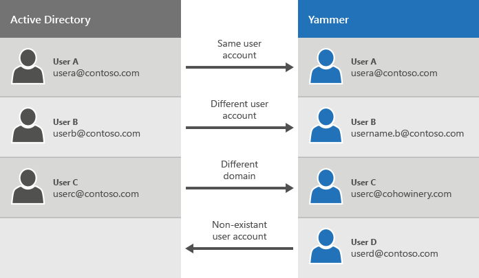

# Integrate a single Yammer network into SharePoint Server 2013

 **Summary:** Learn how to integrate a single, active Yammer network together with your SharePoint Server 2013 environment. 
  
This scenario describes the prerequisites and recommended steps to integrate a single, active Yammer network together with your SharePoint Server 2013 environment.
  
## Scenario prerequisites

For this scenario, we assume that:
  
- You have SharePoint Server 2013 SP1 or later installed.
    
- You don't use the SharePoint Server 2013 Newsfeed social feature.
    
- You use Active Directory Domain Services (AD DS) as your identity provider and Active Directory Federation Services (AD FS) 2.0 for identity federation.
    
- You have one single, established Yammer Basic or Enterprise network that has active users.
    
    For information about how users are managed in Yammer Enterprise, see [Manage Yammer users across their life cycle from Office 365](http://technet.microsoft.com/library/6c4c8fff-6444-404a-bffc-f9da0bcc3039%28Office.14%29.aspx).
    
## Scenario challenges

One of the top issues in this scenario is the inconsistency of users and their logon credentials between the user profile stores in Yammer and SharePoint Server 2013. The following diagram shows the possible credentials mismatch situations between your AD DS user repository and the Yammer network user repository.
  
**Yammer user credential mismatch cases**

  
**Table: Scenario 2 challenges: SharePoint Server 2013 and a single active Yammer network**

|**Challenge**|**Description**|
|:-----|:-----|
|Same user and email address in AD DS and Yammer    |The same user exists in both AD DS and Yammer with the same user name and email address. For this user, there is no change in the user name after you set up directory synchronization and Yammer Enterprise.    |
|Different user account    |User B used a different email address when they signed up for Yammer. For this user, there is a change after you set up Yammer Enterprise. For this scenario, you should let the affected users know about the changes to their logon credentials. The reason for the different logon credentials might be because the user joined the Basic network by using an alias, not their primary email address. It can also occur because the user changed their name. You can manage and make these email address changes by using the [Bulk Update Users](http://go.microsoft.com/fwlink/?LinkID=402146&amp;clcid=0x409) page.    |
|Different domain    |In a scenario where you have multiple Yammer networks, you have disconnected users. In this case, we recommend that you merge Yammer networks. By merging networks, everyone in your organization can use a single Yammer network. This scenario is covered in more detail in [Integrate multiple Yammer networks into SharePoint Server 2013](integrate-multiple-yammer-networks-into-sharepoint-server-2013.md).    |
|Non-existent users    |When a user is removed or disabled in Office 365, if you have set up Yammer to [Enforce Office 365 identity for Yammer users](http://technet.microsoft.com/library/008f940b-6bec-47fc-bcc6-9c6133467562%28Office.14%29.aspx), the user is removed from Yammer Enterprise.    |
   
## Step 1: Set up directory synchronization

Office 365 uses Azure Active Directory for identity management, and Yammer Enterprise can be set up to [Enforce Office 365 identity for Yammer users](http://technet.microsoft.com/library/008f940b-6bec-47fc-bcc6-9c6133467562%28Office.14%29.aspx). If you're using an on-premises directory, in order to manage users in one place, you need to sync your on-premises directory with Azure Active Directory by using Azure Active Directory Connect. 
  
For more information, see [Plan for directory synchronization for Office 365](http://technet.microsoft.com/library/d3577c90-dda5-45ca-afb0-370d2889b10f%28Office.14%29.aspx) and [Integrate your on-premises directories with Azure Active Directory](https://go.microsoft.com/fwlink/p/?LinkId=869669).
  
## Step 2: Disable default SharePoint Server 2013 social features

After you set up directory synchronization, [disable the default SharePoint Server 2013 social features](hide-sharepoint-server-2013-social-features.md).
  
## Step 3: Use Yammer Embed

After you disable the default SharePoint Server 2013 social features, you should [use the Yammer embed widget](add-the-yammer-embed-widget-to-a-sharepoint-page.md) to include Yammer feeds on SharePoint pages. 
  
## See also

#### Concepts

[Integrate Yammer with on-premises SharePoint 2013 environments](integrate-yammer-with-on-premises-sharepoint-2013-environments.md)
  
[Social scenarios with Yammer and SharePoint Server 2013](social-scenarios-with-yammer-and-sharepoint-server-2013.md)
#### Other Resources

[Manage Yammer users across their life cycle from Office 365](http://technet.microsoft.com/library/6c4c8fff-6444-404a-bffc-f9da0bcc3039%28Office.14%29.aspx)

