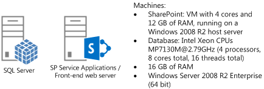
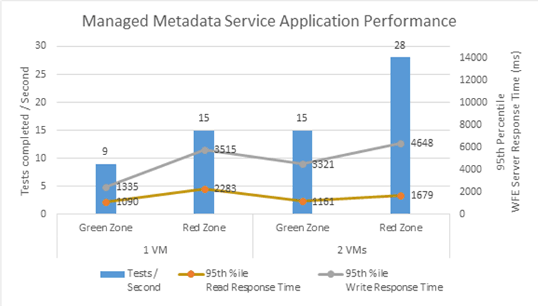

# Estimate capacity and performance for Managed Metadata Service (SharePoint Server 2013)

 **Summary:** Learn how to plan to deploy a Managed Metadata Service application for SharePoint Server 2013 by using tested capacity and performance data. 
  
This article contains information and recommendations that are related to sizing and performance optimization of the Managed Metadata Service in SharePoint Server 2013. We also provide some best practices about how to configure the service and structure the service application databases for maximum performance. Use this information to determine whether your planned deployment fits in the capacity and performance limits that our tests provide.
  
The following new features in SharePoint Server 2013 directly affect the Managed Metadata Service and are important for capacity planning. The load from these features is included in our test dataset and test scenarios.
  
- Hashtags in feeds (in My Sites or Team Sites)
    
- Sites using managed navigation
    
- New CSOM endpoints that clients can call
    
For a typical SharePoint Server 2013 deployment with similar characteristics as our test dataset, we recommend that the Managed Metadata Service application run on the computers that assume the front-end web server role. The database for the Managed Metadata Service application can be placed on a SQL Server instance that hosts other SharePoint service application databases.
  
For deployments that contain significantly more items than compared to the dataset we provide in our tests, we'll attempt to provide guidance through the results of tests where we change one of the variables and keep the other components of our test dataset constant. Users with larger deployments should consider these results and size their SharePoint Server 2013 farms accordingly.
  
    
For general information about capacity management and how to plan for SharePoint Server 2013, see [Capacity management and sizing for SharePoint Server 2013](capacity-management-and-sizing-for-sharepoint-server-2013.md).
  
## Introduction

We recommend that in a typical SharePoint Server 2013 deployment with similar characteristics as our test dataset, that the Managed Metadata Service application be enabled only on computers that run as a front-end web server. The database for the Managed Metadata Service application can be put on a SQL Server instance that hosts other SharePoint service application databases.
  
Note that for deployments that contain significantly more items than are in the dataset that we provide in our tests, we provide separate recommendations. In our tests we attempt to provide guidance using the test results where we change one of the variables and keep the other components constant. Users with larger deployments should consider these results and size their SharePoint farms accordingly.
  
## Test dataset

To provide capacity planning guidance, we created a test dataset that includes the features in SharePoint Server 2010 and new features in SharePoint Server 2013 and ran tests on a SharePoint deployment. The following table shows the test dataset that we used:
  
|**Variable**|**Number of items**|
|:-----|:-----|
|**Term set groups**   |500    |
|**Term sets**   |1,000 (2 per group)    |
|**Managed terms (does not include enterprise keywords)**   |20,000 (20 per term set)    |
|**Enterprise keywords**   |80,000    |
|**Hashtags**   |200,000    |
|**Total terms (includes managed terms, enterprise keywords, and hashtags)**   |300,000    |
|**Labels**   |300,000 (1 per item)    |
|**Term label length**   |30 characters per label    |
   
## Test scenarios

We used the tests in the following table for this dataset:
  
|**Test**|**Description**|**Percentage in test**|
|:-----|:-----|:-----|
|**GetSuggestions**   |A single call to the web service and a single character prefix string. The string will be chosen to match 20% of the terms in the term store, similar to how metadata column suggestions work in the SharePoint user interface.    |10%    |
|**GetMatches**   |Web service for a string that matches 1% of the terms in the term store.    |5%    |
|**ValidateTerms**   |Web service call to validate a single term.    |5%    |
|**CreateTaxonomyItem**   |Web service call to a call to create a keyword with a random name.    |5%    |
|**GetChildTermsInTermSetWithPaging**   |Web service call to multiple term sets. Similar to the call made by SharePoint Server 2013 to retrieve terms sets used by the managed navigation feature, the results of which are then cached in the front-end web server.    |5%    |
|**GetTermSets**   |Web service call to get term sets.    |5%    |
|**GetTermsByLabel**   |Web service call with a list of term GUIDs. Similar to the call made by SharePoint Server 2013 when a My Site home page is loaded.    |10%    |
|**HT GetSuggestions**   |Web service call to get suggestions for hashtags with a single character. Similar to the call made by SharePoint UI when you work with hashtags in the feeds.    |10%    |
|**HT NewHashTag**   |2 web service calls. One to get terms, then another to create the term.    |5%    |
|**HT GetTermsByLabel**   |Web service call to get existing terms. Used when a hashtag is used in a feed post.    |15%    |
|**HT AddAssociation**   |Web service call to add an association to an existing hashtag term.    |5%    |
|**CSOM GetTerms**   |Test to GetTerms a list of terms GUIDs. Has 2 individual CSOM calls.    |10%    |
|**CSOM SetProperty**   |Test to SetProperty for a single term. Has 4 individual CSOM calls.    |5%    |
|**CSOM CreateTerm**   |Test to add a term to the term store. Has 4 individual CSOM calls.    |5%    |
   
In our tests we put more weight on operations that are expected to be used more frequently.
  
## Test topology

We ran the tests in our lab environment that has the topology shown in the following diagram:
  
**Figure 1: Test lab server topology**

  
We started our tests with one computer that is running the Managed Metadata Service application and serving as the front-end web server. Later, we added another computer that has the same configuration.
  
## Test results

We used the dataset and the scenarios that were described in earlier sections to test the total number of Managed Metadata Service application operations that executed for a given configuration.
  
We ran our tests with the different load profiles in the following list:
  
- **Green Zone**
    
    Servers are under 60% utilization. This should be the target for most of the time when the servers are running.
    
- **Red Zone**
    
    Servers are close to full utilization. This can be considered a state where the SharePoint site is under more load than usual. In the Red Zone, server response time values start increasing as the server tries to meet the demand of incoming requests.
    
The following table shows the results of our measurements with a single computer:
  
||**Green Zone**|**Red Zone**|
|:-----|:-----|:-----|
|**Server Response Time 50th percentile for read operations:**   |32 ms.    |44 ms.    |
|**Server Response Time 95th percentile for read operations:**   |1090 ms.    |1335 ms.    |
|**Server Response Time 50th percentile for write operations:**   |1837 ms.    |2038 ms.    |
|**Server Response Time 95th percentile for write operations:**   |2283 ms.    |3515 ms.    |
|**Tests completed per second:**   |9    |15    |
|**Average CPU (application server or front-end web server)**   |56%    |92%    |
|**Average CPU (SQL Server)**   |7%    |12%    |
|**Peak memory usage (application Server or front-end web server)**   |6 GB    |6.2 GB    |
   
We then added a second application server or front-end web server virtual machines (VMs) to the deployment with the same configuration. The following table shows the results for a two VM farm with approximately two times (2x) the load as our earlier tests:
  
||**Green Zone**|**Red Zone**|
|:-----|:-----|:-----|
|**Server Response Time 50th percentile for read operations:**   |44 ms.    |110 ms.    |
|**Server Response Time 95th percentile for read operations:**   |1161 ms.    |1679 ms.    |
|**Server Response Time 50th percentile for write operations:**   |1828 ms.    |2253 ms.    |
|**Server Response Time 95th percentile for write operations:**   |3321 ms.    |4648 ms.    |
|**Tests completed per second:**   |15    |28    |
|**Average CPU (application server or front-end web server)**   |49%    |88%    |
|**Average CPU (SQL Server)**   |14%    |28%    |
|**Peak memory usage (application server or front-end web server)**   |6.1 GB    |6.3 GB    |
   
The following graph shows the data in the previous two tables:
  
**Figure 2: Managed Metadata Service application performance**

  
### Effect of friendly URLs on Search crawls for friendly URLs

SharePoint Server 2013 includes the Managed Navigation feature and two timer jobs that are triggered to make sure that the search crawl receives the latest versions of pages that use friendly URLs. Our tests found that running these timer jobs that communicated with the Managed Metadata Service application did not have a significant effect on read and write operations that target the same application.
  
### Effect of CSOM calls

Some tests increased the CSOM calls made in our test procedure compared to the baseline case. We increased these from 20 percent of tests to 66 percent. The test results show that the number of executed tests declined from 28 to 22 per second. The server response times are comparable to the baseline. The reduction in the number of executed tests is because of the increased overhead of multiple calls to the front-end web server for each action for the CSOM calls compared to fewer calls involved in the web service calls.
  
### Effect of having more hashtag operations

In another test case, we increased the percentage of the hashtag operations from 35 percent in our baseline to 71 percent in our tests. The results show that the number of executed tests declined from 28 to 19. The server response times are also about 30 percent greater than the baseline. The reduction in the number of executed tests is attributed to the fairly high number of terms in the hashtags term set and the much increased percentage of write operations in the changed procedure.
  
## See also

#### Concepts

[Plan for managed metadata in SharePoint Server](../governance/managed-metadata-planning.md)
#### Other Resources

[Overview of managed metadata service applications in SharePoint Server 2013](http://technet.microsoft.com/library/ecd9e1d1-3e56-4ab9-80e1-29972586c5a7%28Office.14%29.aspx)
  
[Plan terms and term sets in SharePoint Server 2013](http://technet.microsoft.com/library/7f8f6beb-aaa6-4277-b522-d28a5b746087%28Office.14%29.aspx)

