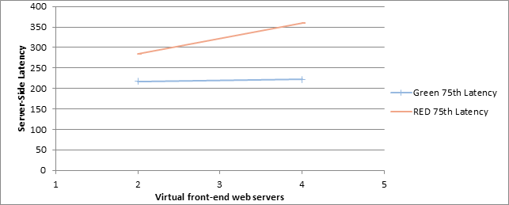
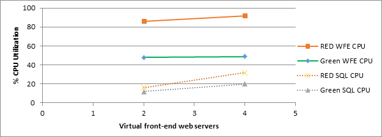
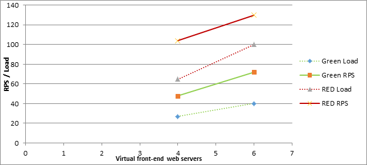
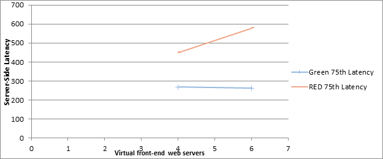
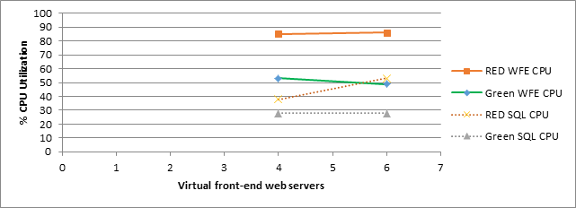
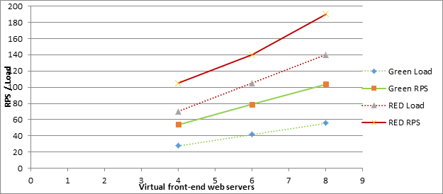
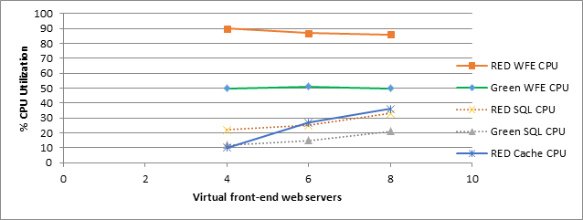

# Estimate performance and capacity requirements for social environments (SharePoint Server 2013)

 **Summary:** Learn how to determine the number and types of computers that you need for a capacity plan for a My Site and social computing portal based on SharePoint Server 2013. 
  
To create a performance and capacity plan for an enterprise intranet My Site and social computing portal solution, this article contains information about the following areas: 
  
- **Lab environment specifications**, such as hardware, farm topology, and farm configuration
    
- The **test farm workload and dataset** that was used to generate test load 
    
- **Test results and analysis** that demonstrate and explain trends in throughput, latency, and hardware demand under load at specific scale points. 
    
Use the information in this article to understand the following concepts: 
  
- Characteristics of the scenario under both normal and peak loads
    
- How performance trends change when farm servers are scaled out
    
- How to estimate an appropriate starting point for your planned architecture
    
- Important factors to consider when you plan for the resources your farm will need to maintain acceptable levels of performance under peak load
    
    
## Introduction to this environment

Enterprises often use SharePoint Server 2013 to publish My Site and social computing portals that authenticated users access on an intranet site. This article contains capacity and performance data to help plan the number of computers to use and the types of computers that are required to publish My Site and social computing portals in SharePoint Server 2013.
  
Additional guidance explains how to scale out servers in a SharePoint Server 2013 enterprise My Site and social computing portal solution. Capacity planning informs decisions about hardware to purchase and system configurations that optimize your solution.
  
Because individual SharePoint Server 2013 farms are unique, each farm has different requirements that depend on hardware, user behavior, the configuration of installed features, and many other factors. Therefore, supplement this guidance with additional testing on your own hardware in your own environment. If your planned design and workload resembles the environment described in this article, you can use this article to draw conclusions about how to scale your environment.
  
Test results in this article were produced in a test lab, using a workload, dataset, and architecture to simulate a production environment under highly controlled conditions. While great care was exercised in designing these tests, the performance characteristics of a test lab are never the same as the behavior of a production environment. These test results do not represent the performance and capacity characteristics of a production farm. Instead, the test results demonstrate observed trends in throughput, latency, and hardware demand. Use the analysis of the observed data to help you plan capacity and manage your own farm.
  
This article includes the following:
  
- **Specifications**, which include hardware, topology, and configuration
    
- The **workload**, which includes an analysis of the demand on the farm, the number of users, and usage characteristics
    
- The **dataset**, such as database sizes and content types
    
- Test results and analysis to **scale out web servers**
    
Before you read this article, read the following articles to make sure that you understand the key concepts behind capacity management in SharePoint Server 2013. 
  
- [Capacity management and sizing for SharePoint Server 2013](capacity-management-and-sizing-for-sharepoint-server-2013.md)
    
- [Software boundaries and limits for SharePoint 2013](../install/software-boundaries-and-limits.md)
    
These articles provide the following information:
  
- The recommended approach to capacity management
    
- How to make effective use of the information in this article
    
## Glossary

The following list contains definitions for key terms found in this article:
  
- **RPS:** Requests per second. RPS is the number of requests that a farm or server receives in one second. This is a common measurement of server and farm load. 
    
    > [!IMPORTANT]
    > Note that requests differ from page loads. Each page contains several components, each of which creates one or more requests when a browser loads a page. Therefore, one page load creates several requests. Authentication checks and events that use insignificant resources typically are not counted in RPS measurements. 
  
- **Green Zone:** Green Zone represents a defined set of load characteristics under normal operating conditions, up to expected daily peak loads. A farm that operates in this range should be able to sustain response times and latency that are within acceptable parameters. 
    
    This is the state at which the server can maintain the following set of criteria:
    
  - The server-side latency for at least 75 percent of the requests is less than 0.5 seconds. 
    
  - All servers maintain an average CPU utilization of less than 50 percent. 
    
  - Failure rate is less than 0.1 percent.
    
- **Red Zone (Max):** Red Zone represents a defined set of load characteristics under peak operation conditions. At Red Zone, the farm experiences very high transient resource demands that it can sustain only for limited periods before failures and other performance and reliability issues occur. 
    
    This is the state at which the server can maintain the following set of criteria for a limited duration:
    
  - Server-side latency for at least 75 percent of the requests is less than 1 second.
    
  - Average database server CPU utilization is less than 80 percent.
    
  - Failure rate is less than 0.1 percent.
    
## Overview

This section summarizes our scaling approach, the relationship between this lab environment and a similar case study environment, and our test methodology.
  
### Scaling approach

We recommend that you scale the computers in your environment in the specific order we followed for scaling our test lab environment. This approach will enable you to find the best configuration for your workload. 
  
We divided the performance test cycles into three workload categories. The primary parameter that determined the category boundary was number of user profiles, which was set at 10K, 100K and 500K user profile tests. Another parameter was the number of active users, who were carrying out actions related to the social set of features. With both the number of users with a profile and number of active users, we ran tests to simulate usage of the application that would be similar to actual deployments. The following table depicts the initial data set and the number of active users.
  
**Initial Data Set**

|**Entity**|**% of users with this feature**|**Small (10K users)**|**Medium (100K users)**|**Large (500K users)**|
|:-----|:-----|:-----|:-----|:-----|
|Number of user profiles for users    |100%    |10K    |100K    |500K    |
|Number of provisioned My Sites    |100%    |10K    |100K    |500K    |
|Number of user profiles that have user photos    |50%    |5K    |50K    |250K    |
|Number of user profiles that have posts    |10%    |1K    |10K    |50K    |
|Number of teams    ||1,860    |18,600    |93K    |
|Number of active users per day    |10%    |1K    |10K    |50K    |
|Number of active users per hour    |5%    |500    |5K    |25K    |
   
Testing focused on the following key scenarios:
  
- News Feed page access and other actions
    
- Profile page
    
- Site feed page access and other actions
    
- Outlook Social Connector Activity Feed Sync
    
- OneDrive for Business page access
    
- OneDrive for Business client usage
    
To simulate a realistic deployment scenario, all tests were run on a database that already had data. The dataset was a model of a tree organization with an average of 4-6 users per team, and 3-4 levels deep. To generate these numbers, we analyzed traffic from an internal social site. The following table describes the set of parameters that we used to build the initial data set.
  
**Data model for initial database**

|**Data entity description**|**Number**|
|:-----|:-----|
|Average number of users in on team    |5    |
|Average number of levels per organization    |4    |
|Number of teams per 1,000 users    |186    |
|Average number of colleagues a user follows    |50    |
|Number of User Profile properties    |93    |
   
The following table describes the set of parameters in terms of actions that would result in the data population:
  
**Usage characteristics**

|**Parameter**|**Number or percentage**|
|:-----|:-----|
|Percentage of users with 1-3 posts    |10%    |
|Average number of posts per user    |2    |
|Average number of replies per post    |2    |
|Percentage of posts that are Liked    |15%    |
|Percentage of posts with links    |5%    |
|Percentage of posts with tags    |12%    |
|Percentage of posts with user mentions    |8%    |
|Percentage of posts with image attached    |5%    |
   
To create each of our scale tests, we applied the following action mix to the preceding data set and the number of active users:
  
**User READ Actions**

|**User action**|**% of user taking this action**|**Scenario**|**Feature or URL**|
|:-----|:-----|:-----|:-----|
|Navigate to My Site home page    |12%    |Newsfeed    |Newsfeed page (http://my/default.aspx)    |
|Navigate to the user's public profile page    |8%    |Profile    |Profile page (http://my/person.aspx?accountname=\<alias\>)    |
|Navigate to the user's private profile page    |4%    |Profile    |Profile page (http://my/person.aspx)    |
|Automatic syncing of activity feed    |32%    |Outlook Social Connector    |none    |
|Navigate to the **People I'm following** page    |3%    |Follow People List    |http://my/MyPeople.aspx    |
|Navigate to the default document library    |6%    |OneDrive for Business    |https://msft-my.spoppe.com/personal/\<user\>/Documents    |
|Navigate to followed documents page    |3%    |OneDrive for Business    |https://msft-my.spoppe.com/personal/\<user\>/Social/FollowedContent.aspx    |
|Navigate to followed documents page    |3%    |OneDrive for Business    |https://msft-my.spoppe.com/personal/\<user\>/Social/FollowedContent.aspx    |
|Navigate to the site feed page    |8%    |Site Feed    |Site Feed page (https://\<domain\>/teams/\<site\>/newsfeed.aspx_    |
|View all replies on a thread    |1%    |Newsfeed    |Newsfeed page (http://my/default.aspx)    |
|View **Everyone** feed    |3%    |Newsfeed    |Newsfeed page (http://my/default.aspx)    |
|View more posts on the newsfeed    |2%    |Newsfeed    |Newsfeed page (http://my/default.aspx)    |
|View the @mentions page    |1%    |Newsfeed    |Newsfeed page (http://my/default.aspx)    |
|View newsfeed (Mobile)    |1%    |Mobile    |Mobile Representational State Transfer (REST) Call    |
|View categorized newsfeed    |3%    |Mobile    |Mobile REST Call    |
   
**User WRITE Actions**

|**User action**|**Percentage**|**Scenario**|**Feature or URL**|
|:-----|:-----|:-----|:-----|
|Create root post in the feed    |0.5%    |Newsfeed    |Newsfeed page (http://my/default.aspx)    |
|Like a post in the feed    |0.3%    |Newsfeed    |Newsfeed page (http://my/default.aspx)    |
|Reply to a post in the feed    |0.7%    |Newsfeed    |Newsfeed page (http://my/default.aspx)    |
|Create post in the feed with @mention    |0.1%    |Newsfeed    |Newsfeed page (http://my/default.aspx)    |
|Create root post in the site feed    |0.5%    |Site Feed    |Site feed page (https://\<domain\>/teams/\<site\>/newsfeed.aspx)    |
|Create post in the site feed with @mention    |0.5%    |Site Feed    |Site feed page (https://\<domain\>/teams/\<site\>/newsfeed.aspx)    |
|Reply to a post in the site feed    |0.15%    |Site Feed    |Site feed page (https://\<domain\>/teams/\<site\>/newsfeed.aspx)    |
|Create post in the site feed with a tag    |0.05%    |Site Feed    |Site feed page (https://\<domain\>/teams/\<site\>/newsfeed.aspx)    |
   
**OneDrive for Business client actions**

|**User action**|**Percentage**|**Scenario**|**Feature or URL**|
|:-----|:-----|:-----|:-----|
|OneDrive for Business initial sync    |0.2%    |OneDrive for Business    |Initial Sync    |
|OneDrive for Business incremental sync - download a file    |0.88%    |OneDrive for Business    |Incremental Sync    |
|OneDrive for Business incremental sync - no changes    |8.1%    |OneDrive for Business    |Incremental Sync    |
   
### Test Methodology

We started with a minimum SharePoint Server 2013 farm configuration for social features. We applied a characteristic social load to the test farm and increased the load until we observed levels of normal and maximum server capacity. We analyzed bottlenecks at each of these load levels and added machines of the overloaded role to scale out the farm configuration. This addition alleviated the bottlenecks in each case and provided a view of scalability characteristics of the server for a particular dataset. We repeated this scale-out process for three deployment sizes to provide representative summaries of a SharePoint Server 2013 farm's scalability characteristics and guidelines for capacity planning.
  
## Specifications

This section provides detailed information about the hardware, software, topology, and configuration of the lab environment.
  
> [!IMPORTANT]
> Al web servers and application servers in the test lab were virtualized by using Hyper-V hosts. Database servers were not virtualized. The physical host hardware and virtual machine virtual hardware are detailed separately in the following sections. 
  
### Hardware

The following table lists hardware specifications for the computers that were used in this test. Front-end web servers that were added to the server farm during multiple iterations of the test also complied with these specifications. 
  
#### Hyper-V Hosts

The farm includes a total of three identically configured Hyper-V hosts, and each host runs one to four virtual machines.
  
|****Host hardware****|**Value**|
|:-----|:-----|
|**Processor(s)**   |2 Quad-core 2.27 GHz processors    |
|**RAM**   |64 GB    |
|**Operating System**   |Windows Server 2008 R2 SP1    |
|**Number of network adapters**   |2    |
|**Network adapter speed**   |1 Gigabit    |
   
#### Virtual web servers and application servers

The farm has from one to eight virtual web servers. An additional dedicated virtual server runs the Distributed Cache Service.
  
> [!NOTE]
> In a production environment, dedicated servers that run the Distributed Cache Service are typically deployed in a highly available configuration. For test purposes, we used a single dedicated server for Distributed Cache because high availability was not a critical factor. 
  
|**VM hardware**|**Web servers**|
|:-----|:-----|
|**Processors**   |4 virtual processors    |
|**RAM**   |12 GB    |
|**Operating system**   |Windows Server 2008 R2 SP1    |
|**Size of the SharePoint drive**   |100 GB    |
|**Number of network adapters**   |2    |
|**Network adapter speed**   |1 Gigabit    |
|**Authentication**   |Windows NTLM    |
|**Load balancer type**   |F5 Big IP    |
|**Services running locally**   |Microsoft SharePoint Foundation Web Application, Microsoft SharePoint Foundation Incoming E-Mail, Microsoft SharePoint Foundation Workflow Timer Service, Managed Metadata Web Service, User Profile Service    |
   
|**VM hardware**|**Cache**|
|:-----|:-----|
|**Processors**   |4 virtual processors    |
|**RAM**   |12 GB    |
|**Operating system**   |Windows Server 2008 R2 SP1    |
|**Size of the SharePoint drive**   |100 GB    |
|**Number of network adapters**   |2    |
|**Network adapter speed**   |1 Gigabit    |
|**Authentication**   |Windows NTLM    |
|**Services running locally**   |Distributed Cache, Microsoft SharePoint Foundation Workflow Timer Service    |
   
|**VM hardware**|**Search query component**|
|:-----|:-----|
|**Processors**   |4 virtual processors    |
|**RAM**   |12 GB    |
|**Operating system**   |Windows Server 2008 R2 SP1    |
|**Number of network adapters**   |2    |
|**Network adapter speed**   |1 Gigabit    |
|**Authentication**   |Windows NTLM    |
|**Services running locally**   |Microsoft SharePoint Foundation Web Application, Microsoft SharePoint Foundation Incoming E-Mail, Microsoft SharePoint Foundation Workflow Timer Service, Search Query and Site Settings Service, SharePoint Server Search    |
   
|**VM Hardware**|**Search index component**|
|:-----|:-----|
|**Processors**   |4 virtual processors    |
|**RAM**   |12 GB    |
|**Operating system**   |Windows Server 2008 R2 SP1    |
|**Number of network adapters**   |2    |
|**Network adapter speed**   |1 Gigabit    |
|**Authentication**   |Windows NTLM    |
|**Services running locally**   |Microsoft SharePoint Foundation Web Application, Microsoft SharePoint Foundation Incoming E-Mail, Microsoft SharePoint Foundation Workflow Timer Service, SharePoint Server Search    |
   
#### Database servers

One physical database server runs the default SQL Server instance that has the SharePoint databases. This article does not track the logging database.
  
> [!NOTE]
> If you enable usage reporting, we recommend that you store the logging database on a separate Logical Unit Number (LUN). Large deployments and some medium deployments might require a dedicated logging database server to accommodate the demand on the processor that a high volume of logging events generates. > In this lab environment, logging was constrained, and the logging database was stored in a separate instance of SQL Server. 
  
**Database Server - Default Instance**

|||
|:-----|:-----|
|**Processors**   |2 Quad-core 3.3 GHz processors    |
|**RAM**   |32 GB    |
|**Operating system**   |Windows Server 2008 R2 SP1    |
|**Storage and geometry**   |Direct Attached Storage (DAS)    Internal array with 6 x 300 GB 15krpm disk    External array with 15 x 450 GB 15krpm disk    50 x content data (external RAID10, 2x3 spindles 300 GB each)    50 x content logs (internal RAID10, 2x2 spindle 300 GB each)    1 x temp data (internal RAID10, 2x2 spindles 300 GB each)    1 x temp log (internal RAID10, 2x2 spindles 300 GB each)    |
|**Number of network adapters**   |1    |
|**Network adapter speed**   |1 Gigabit    |
|**Authentication**   |Windows NTLM    |
|**Software version**   |SQL Server 2008 R2    |
   
### Topology

The following table shows the topology for this lab environment:
  
**Lab environment topology**

|**Role**|**Small deployment (10k users)**|**Medium deployment (100K users)**|**Large deployment (500K users)**|
|:-----|:-----|:-----|:-----|
|Web server    |2-4    |4-8    |8    |
|Cache    |1    |1-2    |3    |
|SQL Server    |1    |1-2    |2    |
   
### Test Process

> [!IMPORTANT]
>  The tests only model normal business-hour usage on a typical social computing portal. We did not consider the cyclical changes in user-generated traffic that day/night cycles produce. We tested Timer jobs such as Profile Synchronization and People Search Crawl, which require significant resources, independently with the same test workload to determine their effect. >  The tests focus on social operations, such as newsfeeds, social tagging, and reading people profiles. The test mix includes a small amount of typical collaboration traffic to better simulate a production environment. We expect these results will help to design a separate portal that is dedicated to My Sites and social features. >  The test mix does not include traffic from the Search Content Crawl. > 
  
We conducted tests against small, medium, and large deployments for the social features. To configure server hardware, we started at minimum configurations for the smallest size and populated the test database with the dataset as described in the [Scaling approach](#scaling) section. 
  
We used Visual Studio Team System (VSTS) to simulate a workload and apply a characteristic social load, driving a small load against the server at first. We uniformly increased this load slowly and recorded performance metrics on all server roles until we observed maximum RPS. This was recognizable as the state where an increase of the applied load on the farm resulted in no increase in delivered RPS output because of server bottleneck constraints.
  
From these recorded metrics, we defined green zone and red zone states, which represent the normal and fully loaded states of the VM server at a given computer configuration. We then applied a steady load at both green zone and red zone levels to analyze steady-state performance metrics at these loads. This provided a server health and performance representation of the VM server under these key load conditions for each topology configuration.
  
After we understood the green and red load characteristics and the scaling curve for each topology, we identified the scaling bottleneck that limited RPS. In the case of social workload, this was typically web server CPU for small datasets. For larger datasets, we also observed memory pressure on the Distributed Cache nodes. We added virtual servers of the overloaded role to the configuration to remove the bottlenecks in each case and continue the scale-out process. We then repeated the analysis of performance trends and their conformity to green and red zone definitions at each configuration size until we achieved requirements for a specific deployment size.
  
After we understood each deployment size, we reconfigured the test farm to the smallest configuration of the next larger size, populated the dataset as described in the [Scaling approach](#scaling) section, and repeated the analysis/scale-out process cycle, and measured scale-out characteristics of each dataset size. 
  
## Results and analysis

This section shows the measured results for the three deployment sizes. Specifically, it shows how scaling out the server farm by adding web servers affects green and red zone RPS, latency, and average CPU usage.
  
The following trends were consistent across all three deployment sizes:
  
- Both red and green zone RPS increases linearly with the number of virtual web servers.
    
- The primary bottleneck across all tested configurations was the web server CPU.
    
- At red zone, latency increases slightly as we add web servers and increase load. This is caused by added pressure on SQL Server and the Distributed Cache service (which is running on all web servers in the test farm).
    
- Additionally, average CPU usage on SQL Server and Distributed Cache computers increases as the number of web servers increases. This is caused by additional caching load on the on SQL Server and the Distributed Cache service. 
    
- Green zone latency remains fairly flat as the number of web servers increases. This is because the web servers are not overburdened at green zone load levels.
    
### Small Scale Results

The following graph shows how increasing the number of web servers affects RPS for both green and red zones.
  

  
The following graph shows how increasing the number of web servers affects latency for both green and red zone load levels.
  

  
The following graph shows how increasing the number of web servers affects average CPU usage for both green and red zone load levels.
  

  
### Medium Scale Results

The following graph shows how increasing the number of web servers affects RPS for both green and red zones.
  

  
The following graph shows how increasing the number of web servers affects latency for both green and red zone load levels.
  

  
The following graph shows how increasing the number of web servers affects average CPU usage for both green and red zone load levels.
  

  
### Large Scale Results

The following graph shows how increasing the number of web servers affects RPS for both green and red zones.
  

  
The following graph shows how increasing the number of web servers affects latency for both green and red zone load levels.
  

  
The following graph shows how increasing the number of web servers affects average CPU usage for both green and red zone load levels.
  

  
As the number of web servers increases, the following events occur:
  
- Average CPU usage increases for SQL Server and Distributed Cache nodes because of added burden on these shared resources.
    
- Average web server CPU usage at red zone slightly decreases because of bottleneck shifting slightly to SQL Server and Distributed Cache computers.
    
- Average web server CPU usage at green zone remains constant because servers are kept at recommended load levels.
    
### Recommendations

A successful SharePoint Server 2013 social deployment as measured by performance depends on the following factors: 
  
- The number of active users who you want to support
    
- The expected transaction mix of read and write operations
    
- How the load is distributed across the farm servers
    
The expected number of active users is one key factor to determine the number of servers that you should plan to have in the topology. The number of active users also determines the makeup of hosting of the various services that are required to be enabled for the social scenario across the servers.
  
Though our testing used a typical dataset and applied the load complexity that you might expect in a real-world customer deployment, every deployment is unique. Your capacity planning effort should consider expected usage characteristics, feature configuration, and hardware resource availability. Some factors that can have an affect or change the capacity numbers in a significant way are as follows:
  
- A pattern of increased email usage might increase the load that the Outlook Social Connector generates.
    
- A significant increase in the percentage of write actions (for example, an increase in tagging or @mention) in the transaction mix might increase the load on the database server.
    
- You can add or remove web servers to balance CPU load between web servers, SQL Server, and Distributed Cache nodes.
    
Carefully follow standard SharePoint Server 2013 configuration guidance for optimal performance. Considerations that matter specifically for social transactions are as follows:
  
- **Separate physical disks for Profile DB** - Because of the heavy disk usage that social transactions can have on Profile DB, we recommend that you keep Profile DB on its own set of physical disks on the server that runs SQL Server. 
    
- **Memory requirements for User Profile service application** - The User Profile service application is located on front-end web servers and relies heavily on its in-memory cache. Make sure that front-end web servers have enough RAM to cache many requests for data. Minimum recommended RAM is 12 GB per front-end web server. 
    
- **Memory requirements for Distributed Cache servers**- Social features, microblogging in particular, depend heavily on sufficient and robust Distributed Cache storage. Low memory situations on these computers can degrade the capacity of the SharePoint farm while this cache is being repopulated. Therefore we recommend that you configure servers that host the Distributed Cache to use at least 12 GB of RAM, and scaled out as needed based on total number of users in the deployment.
    
The SharePoint Server 2013 social deployment makes it mandatory to provision a personal site for every user who wants to use social features. Plan the growth of the creation of personal site collections at the level of the content database . For more information about how to scale personal site collections, see [Software boundaries and limits for SharePoint 2013](../install/software-boundaries-and-limits.md).
  
## See also

#### Concepts

[Performance planning in SharePoint Server 2013](performance-planning-in-sharepoint-server-2013.md)
#### Other Resources

[Software boundaries and limits for SharePoint 2013](../install/software-boundaries-and-limits.md)

