# Stage 14: Configure refiners for faceted navigation in SharePoint Server

[!INCLUDE[appliesto-2013-2016-2019-xxx-md](../includes/appliesto-2013-2016-2019-xxx-md.md)]
  
> [!NOTE]
> Most of the features described in this series are available only for private sites collections in SharePoint Online. 
  
## Quick overview

In previous stages of this series, we identified the refiners we wanted to use for faceted navigation. We also identified which refiner-enabled managed properties we wanted to use to display these refiners.
  
In this article, you'll learn:
  
1. [How to map a crawled property to a refiner-enabled managed property](stage-14-configure-refiners-for-faceted-navigation.md#BKMK_HowToMapACrawledPropertyToARefinerEnabledManagedProperty)
    
2. [How to initiate a reindexing of the catalog](stage-14-configure-refiners-for-faceted-navigation.md#BKMK_HowToInitiateAReindixingOfTheCatalog)
    
3. [How to verify that the term set can be used for faceted navigation](stage-14-configure-refiners-for-faceted-navigation.md#BKMK_HowToVerifyThatTheTermSetCanBeUsedForFacetedNavigation)
    
4. [How to add refiners to all terms in a term set](stage-14-configure-refiners-for-faceted-navigation.md#BKMK_HowToAddRefinersToAllTermsInATermSeT)
    
5. [How to add refiners to specific terms in a term set](stage-14-configure-refiners-for-faceted-navigation.md#BKMK_HowToAddRefinersToSpecificlTermsInATermSeT)
    
For a quick refresh on crawled properties, managed properties, and automatically created managed properties, see [From site column to managed property - What's up with that?](from-site-column-to-managed-propertywhat-s-up-with-that.md).
  
## Start stage 14

### How to map a crawled property to a refiner-enabled managed property

From the planning we did in [Stage 13: Plan to use refiners for faceted navigation in SharePoint Server - Part II](stage-13-plan-to-use-refiners-for-faceted-navigationpart-ii.md), we know we want to use the following refiner-enabled managed properties for the "Audio" and "Cameras" categories:
  
|**Refiner to use**|**Managed property name**|
|:-----|:-----|
|Price    |RefinableInt01    |
|Brand    |RefinableString01    |
|Color    |RefinableString02    |
|Zoom    |RefinableString03    |
|Screen size    |RefinableString04    |
|Mega pixels    |RefinableString05    |
|Max ISO    |RefinableString06    |
   
The procedure to map a crawled property to a refiner-enabled managed property is the same for all the refiners we want to use. The procedure below explains how to do this for the  *Price*  refiner. More specifically, it explains how to map the crawled property that represents  *Price*  to the  *RefinableInt01*  managed property. 
  
> [!IMPORTANT]
> Although refiners are displayed on the publishing site, you have to configure them  *on the authoring site* . 
  
Juggling between the different site collections can be a bit confusing. The fact that the UIs look almost identical on the publishing site and the authoring site doesn't help. Therefore, if you make a mistake the first time that you do this, you're in good company!
  
Here we go!
  
1. On your  *authoring site* , on the **Site Settings** page, click **Search Schema**. 
    
     
  
2. In the **Managed property** field, type the name of the refiner-enabled managed property to which you want to map a crawled property, and then click the arrow button. In our Contoso scenario, we'll type  *RefinableInt01*  . 
    
     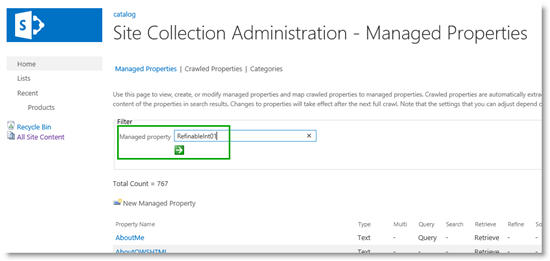
  
3. From the **Property Name** menu, select **Edit/Map Property**. 
    
     
  
4. On the **Edit Managed Property** page, click **Add a Mapping**. 
    
     
  
5. In the **Crawled property selection** dialog, use the **Search for a crawled property name** field to search for the crawled property that you want to map to this managed property. 
    
    In our Contoso catalog, the site column that contains the price information is called "RetBasePrice", so enter this in the **Search for a crawled property name** field, and then click **Find**. 
    
     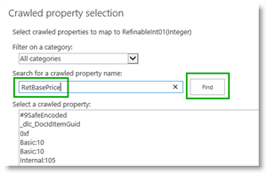
  
Two crawled properties are found:  *ows_q_NMBR_RetBasePrice*  and  *ows_RetBasePrice*  . 
    
     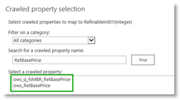
  
This part is really tricky. Not only are two crawled properties found (very strange, considering we only had one "RetBasePrice" site column), but which one should we map to the refinable managed property?
    
    Let's take a closer look at what's going on. [From site column to managed property - What's up with that?](from-site-column-to-managed-propertywhat-s-up-with-that.md) explained the naming convention for automatically created crawled properties. All automatically created crawled property names have the format  *ows_\<something\>_SiteColumnName*  . For the site column  *RetBasePrice*  , the  *\<something\>*  is "q_NMBR". Based on this information,  *ows_q_NMBR_RetBasePrice*  can be identified as an automatically created managed property. 
    
    To differentiate the two crawled properties found by our search, let's call the one whose name does not have the format of an automatically created managed property ( *ows_RetBasePrice*  in this example) a  *regular*  crawled property. 
    
    > [!IMPORTANT]
    > When mapping a crawled property to a refinable managed property, select the  *regular*  crawled property! 
  
6. Select the regular crawled property found by the search you performed in the previous step, and then click **OK**. In our Contoso scenario, we'll select  *ows_RetBasePrice*  . 
    
     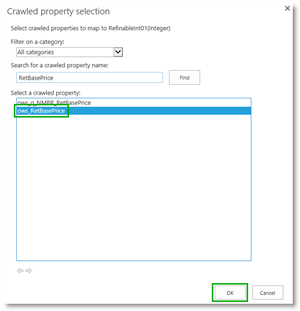
  
On the **Edit Managed Property** page, notice that the crawled property  *ows_RetBasePrice*  is added to the **Mappings to crawled properties** field. 
    
     
  
7. In the **Alias** field, type a name for the refiner. In our Contoso scenario, we'll type  *Price*  . 
    
     
  
    > [!IMPORTANT]
    > The alias that you enter here is  *not*  the refiner name that will be shown on our publishing site. This alias is intended to make our lives a bit easier while we are configuring refiners for faceted navigation (procedures that follow will explain how to do this). Remember, we can't change the name of the refinable managed property. Therefore, when doing the configuration, we must deal with many refinable managed properties that have similar names (  *RefinableString01*  ,  *RefinableString02*  , etc.). So this alias serves as a good reminder of what we mapped to the property. 
  
8. To finish the mapping, click **OK**. 
    
     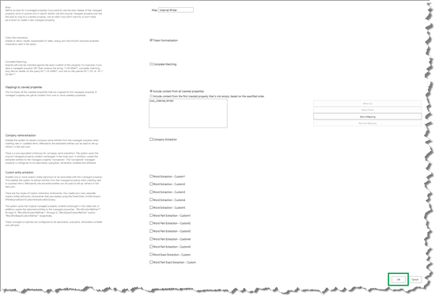
  
As stated at the beginning of this procedure, we have to do the mapping for all the refiners we want to use. So, for the "Audio" and "Cameras" categories we have mapped crawled properties to the  *RefinableStringXX*  refinable managed properties, as shown in the following screen shot. 
    
     
  
### How to initiate a reindexing of the catalog

Now that we've mapped all the refiner-enabled managed properties that we want to use, we have to initiate a reindexing of the catalog. We described how to do a reindexing of the catalog in [Stage 4: Set up search and enable the crawling of your catalog content in SharePoint Server](stage-4-set-up-search-and-enable-the-crawling-of-your-catalog-content.md).
  
> [!NOTE]
>  Search service application administrators with access to Central Administration can do the same thing by starting a full crawl, as explained in [How to initiate a reindexing of the catalog](stage-4-set-up-search-and-enable-the-crawling-of-your-catalog-content.md#BKMK_HowtoInitiateaReindexingoftheCatalog). 
  
### How to verify that the term set can be used for faceted navigation

After the catalog is reindexed, we can finally start to do some configuration. But before we start with the actual configuration, let's just verify that we can actually use the term set on the authoring site for faceted navigation.
  
1. On your  *authoring site*  , go to **Site settings --\> Term store management**. 
    
2. Click to mark the term set, in our scenario this is **Product Hierarchy**, and then click the tab **Intended Use**. 
    
3. Verify that the check box **Use this Term Set for Faceted Navigation** is selected. 
    
     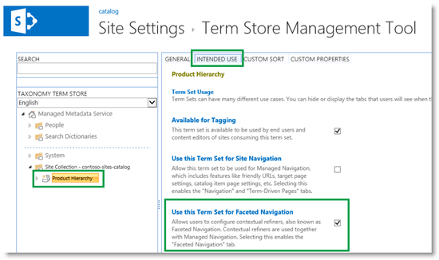
  
Because we used the Product Catalog template when we created our authoring site collection in [Stage 1: Create site collections for cross-site publishing in SharePoint Server](stage-1-create-site-collections-for-cross-site-publishing.md), our Product Hierarchy term set is enabled for faceted navigation by default.
    
    If you used a different template when you created your authoring site collection, you must first enable the term set for faceted navigation. For information about how to do this, see [Enable a term set for faceted navigation](configure-refiners-and-faceted-navigation.md#BKMK_EnableATermSetForFacetedNavigation).
    
    Now that we have verified that our term set can be used for faceted navigation, let's continue with the configuration.
    
    From [Stage 12: Plan to use refiners for faceted navigation in SharePoint Server - Part I](stage-12-plan-to-use-refiners-for-faceted-navigation-inpart-i.md), remember that we want to add some refiners to all categories, and other refiners to only a subset of categories. Let's start by adding the refiners that we want to use for all categories:  *Brand*  ,  *Color*  and  *Price*  . 
    
### How to add refiners to all terms in a term set

1. Click your term set name. In our Contoso scenario, this is **Electronics**. Then click the **FACETED NAVIGATION** tab and **Customize refiners**. This opens a dialog. 
    
     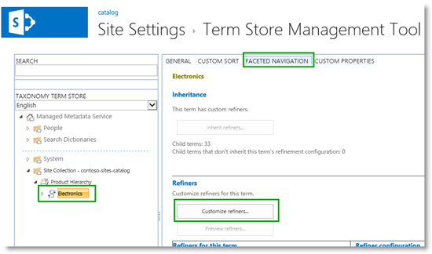
  
2. In the **Available refiners** section of the dialog, scroll down and select **RefinableString01**. This is the managed property we want to use for the  *Brand*  refiner. Notice that sample values are shown (a good sign that we're on the right path), together with the alias we gave this property when we mapped it to a crawled property. 
    
     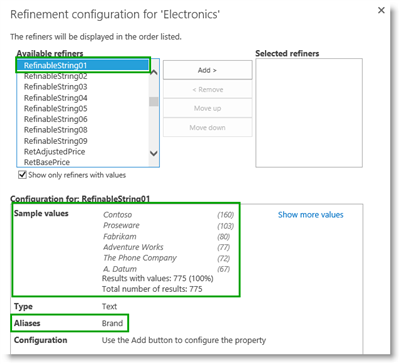
  
3. To add this refiner to the term set, click **Add**. 
    
     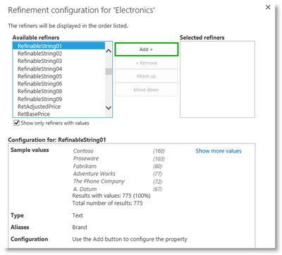
  
This moves the **RefinableString01** property over to the **Selected refiners** section. When a refiner is moved to the **Selected refiners** section, additional configuration options are shown. (We'll discuss them in step 7 and 8.) 
    
     
  
4. Repeat steps 1 - 3 to add **RefinableString02** (the  *Color*  refiner) and **RefinableInt01** (the  *Price*  refiner). 
    
     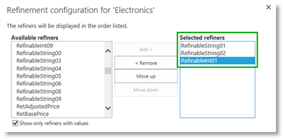
  
5. To preview our refiners, click **Preview Refiners**. 
    
     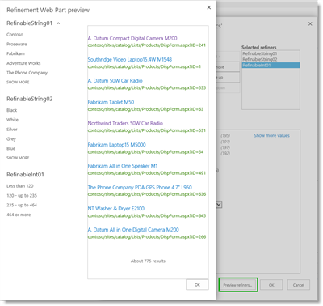
  
So this is starting to look fairly good. However we want to have the  *Price*  refiner displayed first, and we would also like to change the intervals for the price values. For the  *Color*  refiner, we want to allow visitors to select multiple refiner values. 
    
6. To move the Price refiner up, select **RefinableInt01** (notice the **Alias** name), and then click **Move up**. Move **RefinableInt01** up in the list until it is the first property in the **Selected refiners** section. 
    
     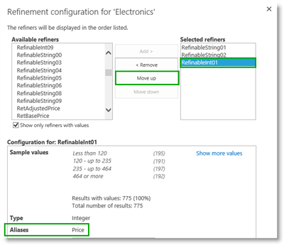
  
7. To change the price interval for the  *Price*  refiner, select **RefinableInt01**. From the **Display template** menu, select **Slider with bar graph**. For **Intervals**, select **Custom**, and enter the price intervals we want to display. Separate each value with a semi-colon. 
    
     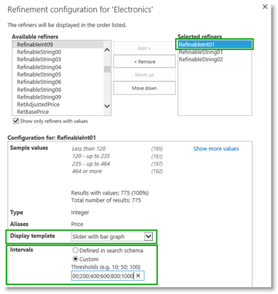
  
8. To enable visitors to select more than one refiner value for the  *Color*  refiner, select **RefinableString02**. From the **Display template** menu, select **Multi-value Refinement Item**. 
    
     
  
9. Click **Preview refiners** again. Notice that our  *Price*  refiner now shows our custom intervals, and is displayed with nice looking slider bars. Also our  *Color*  refiner now has check boxes that enable you to select multiple refiner values. 
    
     
  
10. To save the changes, click **OK** in the dialog  *and* **Save** in the Term Store Management Tool. 
    
     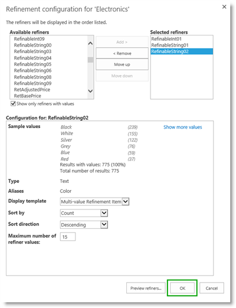
  
     
  
Now that we have added the refiners that should be applied to all categories, the next task is to add the refiners that should be applied only to a subset of categories.
  
### How to add refiners to specific terms in a term set

From [Stage 13: Plan to use refiners for faceted navigation in SharePoint Server - Part II](stage-13-plan-to-use-refiners-for-faceted-navigationpart-ii.md), remember that we want to add the refiners  *Zoom*  and  *Screen size*  to the  *Cameras*  category. We also want to add the refiners  *Mega pixels*  to the  *Digital cameras*  category, and  *Max ISO*  to the  *Digital SLR cameras*  category. 
  
When adding refiners to a specific term in a term set, the procedure is identical for all terms. So, to save space, we'll only show how to add the refiners  *Zoom*  and  *Screen size*  to the  *Cameras*  term. 
  
1. Click to select the term to which you want to add category specific refiners. In our scenario, this is **Cameras**. Click the **FACETED NAVIGATION** tab, **Stop inheriting**, and **OK** to verify. 
    
     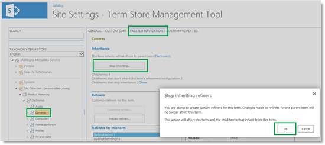
  
2. Click **Customize refiners**. This opens a dialog. 
    
     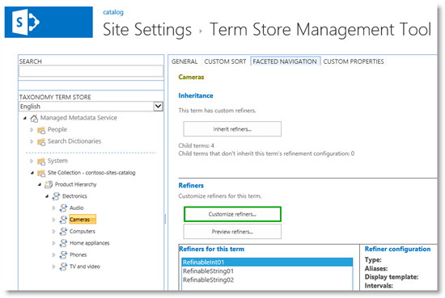
  
3. To add and customize term-specific refiners, repeat the steps from the previous procedure.
    
    In our scenario, we'll add the properties **RefinableString03** and **RefinableString04**. To verify that our refiners are added correctly, click **Preview refiners**. 
    
     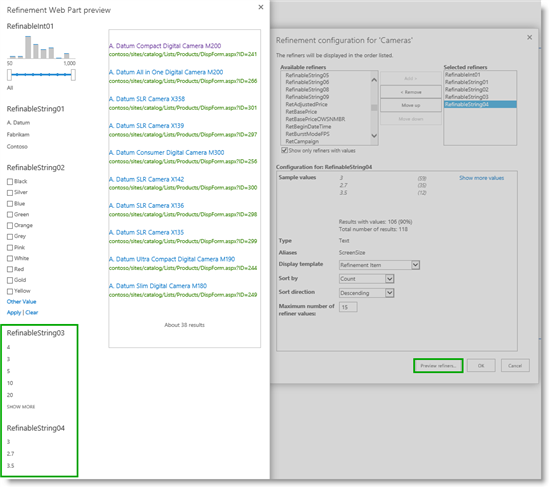
  
4. To save the changes, repeat step 10 from the previous procedure.
    
Adding and configuring all the refiners we identified during our planning phase can take some time. The good news is that when we have finished this, it won't take much work to get the refiners to display on our website.
  
#### Next article in this series

[Stage 15: Add refiners for faceted navigation to a publishing site in SharePoint Server](stage-15-add-refiners-for-faceted-navigation-to-a-publishing-site.md)
  
## See also

#### Other Resources

[Plan refiners and faceted navigation](plan-search-for-sharepoint-cross-site-publishing-sites.md#BKMK_PlanRefinersAndFacetedNavigation)

