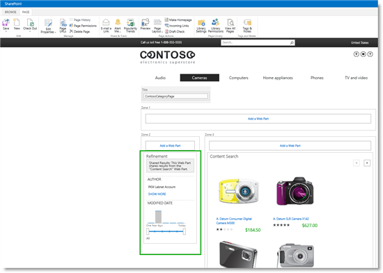
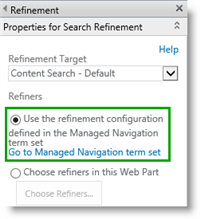
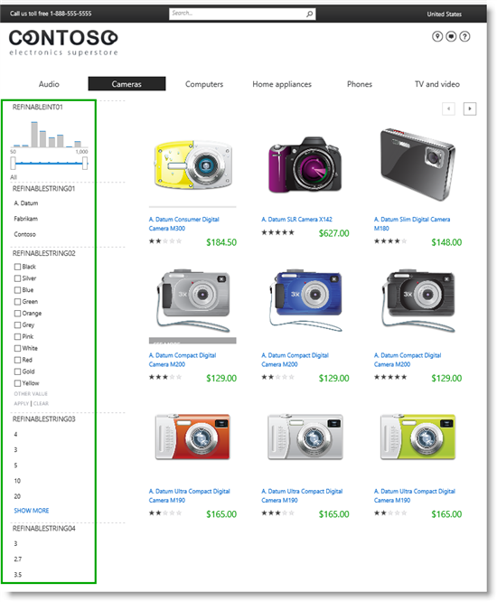
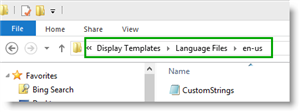
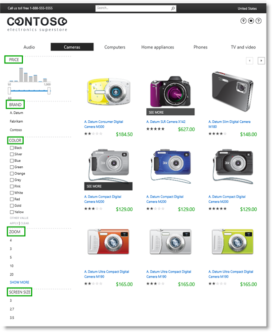
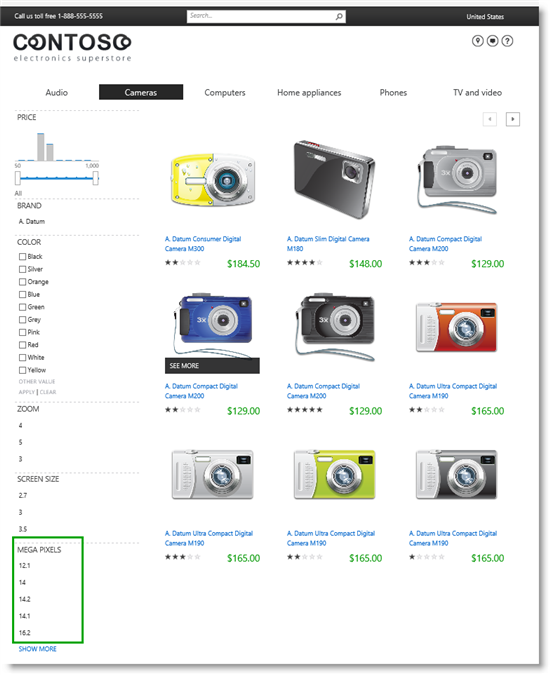
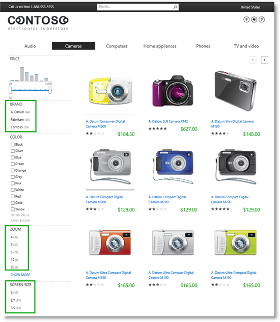
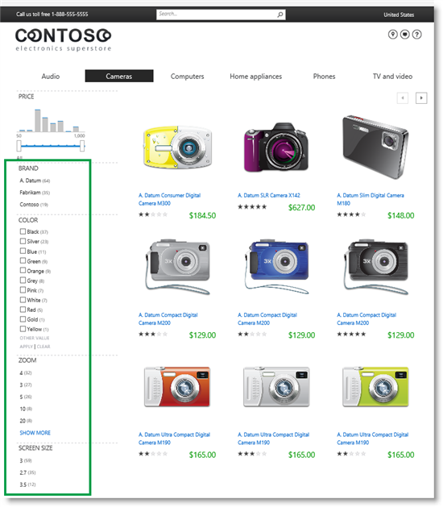

# Stage 15: Add refiners for faceted navigation to a publishing site in SharePoint Server

[!INCLUDE[appliesto-2013-2016-2019-xxx-md](../includes/appliesto-2013-2016-2019-xxx-md.md)] 
  
> [!NOTE]
> Most of the features described in this series are available only for private sites collections in SharePoint in Microsoft 365. 
  
## Quick overview

Previous stages of this series identified and configured the refiners we want to use for faceted navigation.
  
In this article, you'll learn:
  
- [How to add a Refinement Web Part to a page](stage-15-add-refiners-for-faceted-navigation-to-a-publishing-site.md#BKMK_HowToAddARefinementWebPartToAPage)
    
- [How to configure a Refinement Web Part to use refiners for faceted navigation](stage-15-add-refiners-for-faceted-navigation-to-a-publishing-site.md#BKMK_HowToconfigureRefinementWebParttouserefinersforfacetednavigation)
    
- [How to change a refiner display name](stage-15-add-refiners-for-faceted-navigation-to-a-publishing-site.md#BKMK_HowToChangeARefinerDisplayName)
    
- [How to add counts to refiner values](stage-15-add-refiners-for-faceted-navigation-to-a-publishing-site.md#BKMK_HowToAddCountsToRefinerValues)
    
## Start stage 15

### How to add a Refinement Web Part to a page

Browse to the page where you want to add the Refinement Web Part (RWP). In our scenario, let's browse to  *Cameras*  . 
  
1. Select the **Settings** menu, and then select **Edit Page**. 
    
2. In the Web Part Zone where you want to add the Web Part, select **Add a Web Part**. 
    
3. In the **Categories** list, select **Search**. 
    
4. In the **Parts** list, select **Refinement**, and then select **Add**. 
    
    In our scenario, we'll add a RWP to Zone 2.
    
     
  
When you add the RWP to a page, it will display several default properties such as "Author" and "Modified date." We don't want to use these refiners. We want to use the refiners we configured in [Stage 14: Configure refiners for faceted navigation in SharePoint Server](stage-14-configure-refiners-for-faceted-navigation.md). Therefore, we'll have to configure the Web Part accordingly.
    
### How to configure a Refinement Web Part to use refiners for faceted navigation

1. In the Web Part, select the **Web Part Menu**, and then select **Edit Web Part**. 
    
2. In the Web Part tool pane, in the **Refiners** section, select **Use the refinement configuration defined in the Managed navigation term set**. 
    
     
  
3. Select **OK** and save the page. 
    
    And just like that, we've added refiners to our page. Nice, don't you think?
    
     
  
To verify that our refiners actually work, select **Green** and **Orange** from the color refiner, and then click **APPLY**. In an instant, only green and orange cameras display on the page. 
    
     
  
So, we've verified that our refiners work. But, we're not completely there with user-friendliness. As things stand, the refiners are displayed as **REFINABLEINT01**, **REFINABLESTRING01**, **REFINABLESTRING03**. and so on Remember, these are the names of the refiner-enabled managed properties we used in in [Stage 14: Configure refiners for faceted navigation in SharePoint Server](stage-14-configure-refiners-for-faceted-navigation.md) when we configured the refiners. To visitors, these names make no sense at all. Therefore, we must fix them by changing their refiner display names. 
  
### How to change a refiner display name

To change a refiner display name, you have to change a JavaScript file in the master page gallery. Because we mapped our network drive in [Stage 6: Upload and apply a new master page to a publishing site in SharePoint Server](stage-6-upload-and-apply-a-new-master-page-to-a-publishing-site.md), this is a simple process.
  
1. In your mapped network drive, go to **Display Templates** > **Language Files**. 
    
2. Go to the folder that corresponds to the language of your site, which in our scenario is **en-us**. 
    
     
  
3. Open the **CustomStrings.js** file. 
    
4. For each refiner-enabled managed property that you want to change the display name of, use the following syntax:
    
     `"rf_RefinementTitle_ManagedPropertyName": "Sample Refinement Title for ManagedPropertyName",`
    
    For example, in our Contoso scenario, the refiner-enabled managed property *RefinableInt01* contains a *Price* refiner. To give this refiner a nice display name, we'll add the following line to the java script file: 
    
     `"rf_RefinementTitle_RefinableInt01": "Price",`
    
    In our Contoso scenario, for the refiners we have configured for the "Audio" and "Cameras" category, our CustomString.js file will be like this:
    
     
  
5. Save this file, and refresh the *Cameras* page to verify that our refiners now have nice, user-friendly display names. 
    
     
  
If we browse to the Digital cameras category, we can see that the category-specific refiner **MEGA PIXELS** appears. 
    
     
  
So, our category-specific refiners now display for the correct category, and they all have user-friendly names. But, there is another small detail that would make our refiners even better. Right now we can't see any numeric details for the refiner values. For example, we can't see how many cameras are of the color *Silver*, or how many cameras have *14* mega-pixels. To see this info, we have to add **counts** to the refiner values. 
  
### How to add counts to refiner values

1. In your mapped network drive, go to **Display Templates --\> Filters**. 
    
2. Open the HTML file **Filter_Default**. 
    
3. Change the value for **ShowCounts** to **true**. 
    
     
  
4. Save the file, and refresh the *Cameras* page to verify that refiner counts are displayed. You'll see that refiner counts only display for refiners where it's only possible to select one refiner at a time. 
    
     
  
5. To add refiner counts to refiners where it's possible to select multiple refiner values, open the HTML file **Filer_MultiValue**, and repeat Steps 3 and 4. 
    
    Now when we refresh the Cameras page, all of the refiner values have counts.
    
     
  
So, when visitors come to our Contoso site, they can use category-specific refiners to find the product they're looking for easily. But there's still one more thing missing: when visitors are on a top level category page, for example *Cameras*, they can't easily see which subcategories are under *Cameras*. Luckily, there is a Web Part that will fix this for us. We'll explore this in detail in the last article of this series. 
  
#### Next article in this series

[Stage 16: Add a Taxonomy Refinement Panel Web Part to a publishing site in SharePoint Server](stage-16-add-a-taxonomy-refinement-panel-web-part-to-a-publishing-site.md)
  
## See also

#### Concepts

[Configure Search Web Parts in SharePoint Server](configure-search-web-parts.md)

