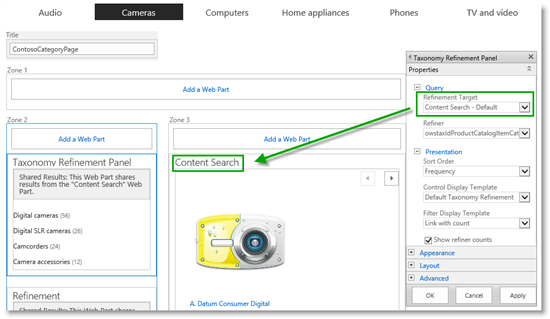
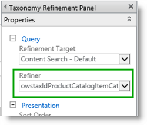
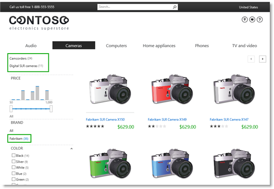

# Stage 16: Add a Taxonomy Refinement Panel Web Part to a publishing site in SharePoint Server

[!INCLUDE[appliesto-2013-2016-2019-xxx-md](../includes/appliesto-2013-2016-2019-xxx-md.md)]
  
> [!NOTE]
> Many of the features described in this series are also available for most sites in SharePoint in Microsoft 365. 
  
## Quick overview

[Stage 15: Add refiners for faceted navigation to a publishing site in SharePoint Server](stage-15-add-refiners-for-faceted-navigation-to-a-publishing-site.md) explained how to add refiners for faceted navigation to a publishing site. By using category-specific refiners, visitors can easily find the product they are looking for. But, visitors can't easily see the different subcategories inside a particular category. 
  
In this article, you'll learn:
  
- [How to add a Taxonomy Refinement Panel Web Part to a page](stage-16-add-a-taxonomy-refinement-panel-web-part-to-a-publishing-site.md#BKMK_HowToAddATaxonomyRefinementPanelWebPartToAPage)
    
- [About the Taxonomy Refinement Panel Web Part](stage-16-add-a-taxonomy-refinement-panel-web-part-to-a-publishing-site.md#BKMK_AboutTheTaxonomyRefinementPanelWebPart)
    
## Start stage 16

Throughout this series, when a new feature was introduced, we started by explaining the feature, and then went on to the procedures for using it. In this stage, we'll flip the sequence, because it will be easier to explain what's going on by using screen shots of the Web Part.
  
### How to add a Taxonomy Refinement Panel Web Part to a page

Browse to the page where you want to add the Web Part. In our scenario, let's browse to "Cameras."
  
1. Select the **Settings** menu, and then select **Edit Page**. 
    
2. In the Web Part Zone where you want to add the Web Part, select **Add a Web Part**. 
    
3. In the **Categories** list, select **Search**. 
    
4. In the **Parts** list, select **Taxonomy Refinement Panel**, and then select **Add**. 
    
5. Save the page.
    
That's all there is to it! Without having to do any configuration, the sub-categories under "Cameras" are displayed. Also notice that refiner counts are automatically displayed.
  

  
If we browse to "Audio," the Audio subcategories are displayed with counts.
  

  
Now let's look at how these sub-categories "magically" appear.
  
### About the Taxonomy Refinement Panel Web Part

Let's start with a definition of this Web Part: The Taxonomy Refinement Panel Web Part filters search results from an associated Search Web Part, which show refiners based on the current navigation term. For example, in our case the Web Part showed the sub-categories of "Audio" and sub-categories of "Computer".
  
For the Taxonomy Refinement Web Part to work correctly, there are two conditions that have to be considered:
  
1. The Taxonomy Refinement Web Part must be associated with another Search Web Part on the page that it is added to.
    
2. The Taxonomy Refinement Web Part must be associated with the managed property that represents the managed navigation of the site.
    
At this point in the series, you probably already knew this, but just in case that you didn't, we'll explain it within the context of our Contoso scenario.
  
Let's start with the first condition.
  
Unlike the Content Search Web Part, the Taxonomy Refinement Web Part doesn't contain a query. Because it doesn't query for content, it has to receive search results from elsewhere to display content.
  
In the following screen shot, the Taxonomy Refinement Panel Web Part is shown in the default edit mode. In the Web Part Tool Pane, in the **Query** section, **Refinement Target** is set to **Content Search - Default**. 
  

  
This configuration means that search results returned by the Content Search Web Part will be used as input by the Taxonomy Refinement Panel Web Part.
  
Check it out, first condition achieved!
  
Now for the second condition: The Taxonomy Refinement Web Part must be associated with the managed property that represents the managed navigation of the site.
  
Remember:
  
- Managed navigation is site navigation as defined by a term set.
    
- The term set is mapped to a site column.
    
- During crawl, the site column is represented as a managed property.
    
In the Taxonomy Refinement Panel Web Part tool pane, in the **Query** section, **Refiner** is set to **owstaxIdProductCatalogItemCategory**. 
  

  
To explain **owstaxIdProductCatalogItemCategory** requires a bit of back-tracking: 
  
- **owstaxIdProductCatalogItemCategory** is the managed property name of the **Item Category** site column, as explained in the "Naming convention for the default site columns in the Products list" section of [From site column to managed property - What's up with that?](from-site-column-to-managed-propertywhat-s-up-with-that.md).
    
- The **Item Category** site column is associated with the **Product Hierarchy**, as explained in [Stage 2: Import list content into the Product Catalog Site Collection in SharePoint Server](stage-2-import-list-content-into-the-product-catalog-site-collection.md).
    
- The **Product Hierarchy term** is integrated into the **Site Navigation** term set, as explained in [Stage 5: Connect your publishing site to a catalog in SharePoint Server](stage-5-connect-your-publishing-site-to-a-catalog.md).
    
- The **Site Navigation** term set is set to drive managed navigation on our Contoso site, as explained in [Stage 5: Connect your publishing site to a catalog in SharePoint Server](stage-5-connect-your-publishing-site-to-a-catalog.md).
    
Check it out, second condition achieved!
  
Let's summarize:
  
1. A visitor browses to "Cameras."
    
2. The CSWP on the category page automatically issues a query for catalog items that are tagged with "Cameras" or any children of "Cameras," and displays this in the Web Part.
    
3. The Taxonomy Refinement Panel Web Part uses the search result from the CSWP. Instead of displaying individual catalog items, it displays the categories to which the search results belong as refiner values, for example "Digital cameras" or "Camcorders."
    
That's very cool, but what makes the Taxonomy Refinement Panel Web Part even cooler is that it accounts for previous queries or refinements that a visitor might have made when showing its refiners. For example, on our Contoso site, if a visitor browses to "Cameras" and selects  *Fabrikam*  as the BRAND refiner, the Taxonomy Refinement Panel Web Part considers this refiner selection when displaying its refiner values. 
  

  
To visitors, this makes browsing for products really convenient, because they can immediately see which sub-categories have  *Fabrikam*  camera products, without having to click back and forth. 
  
So, that was all for this series. If you are setting up your own site, we hope you'll make good use of the features that are described in this series.
  

